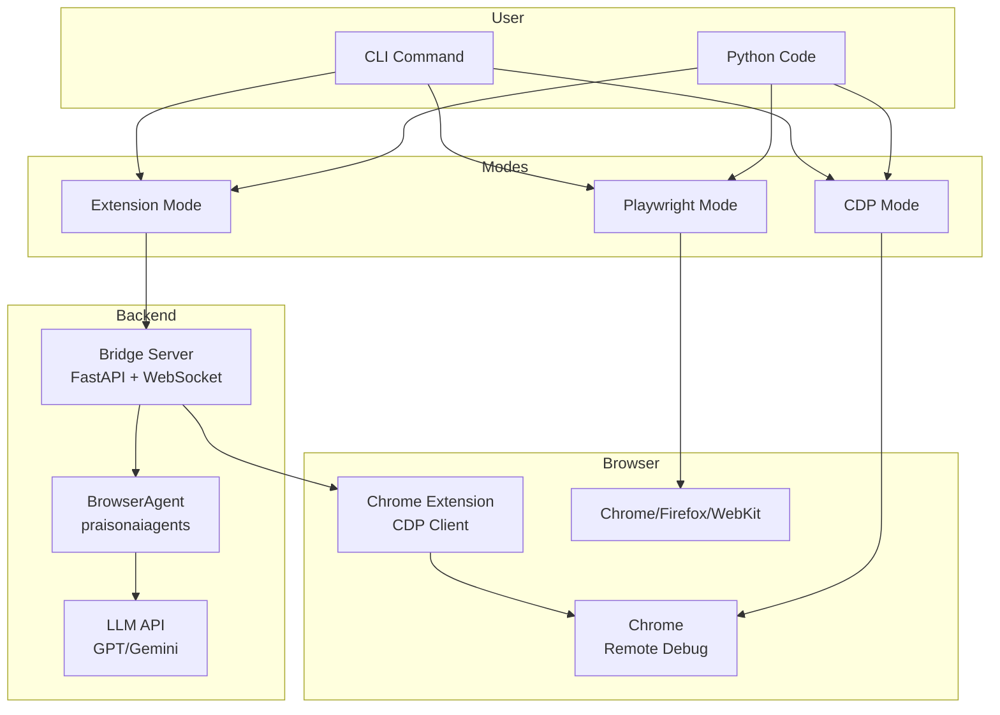
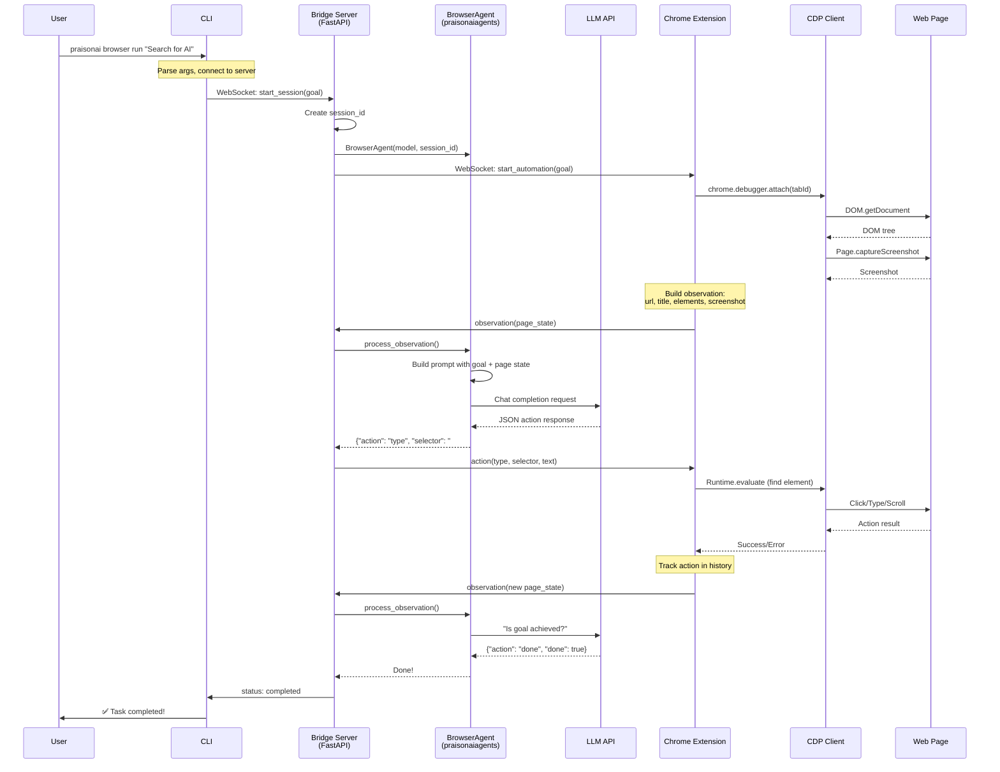
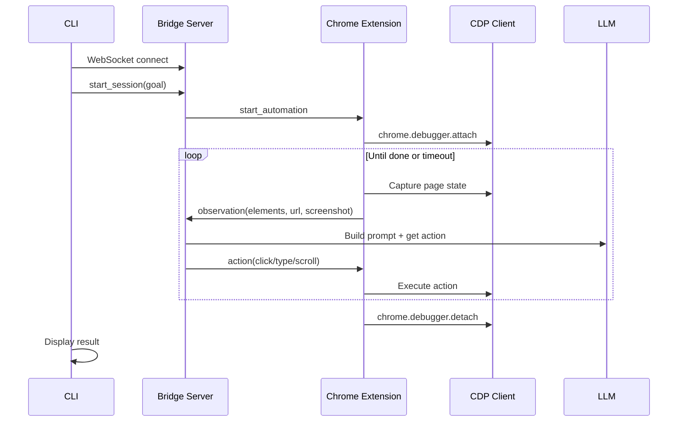
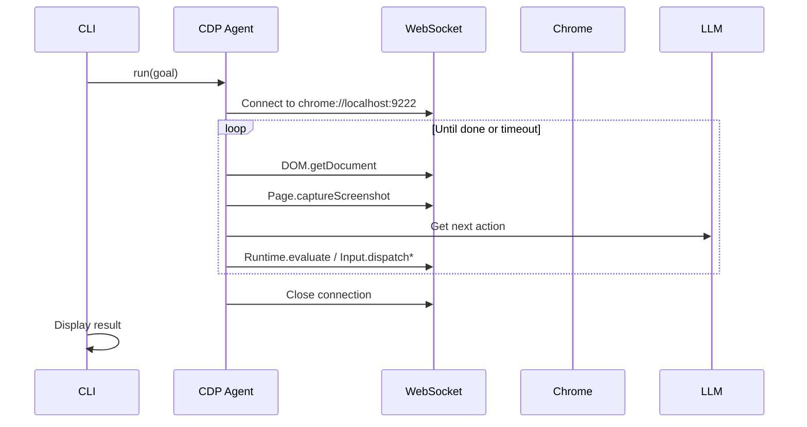
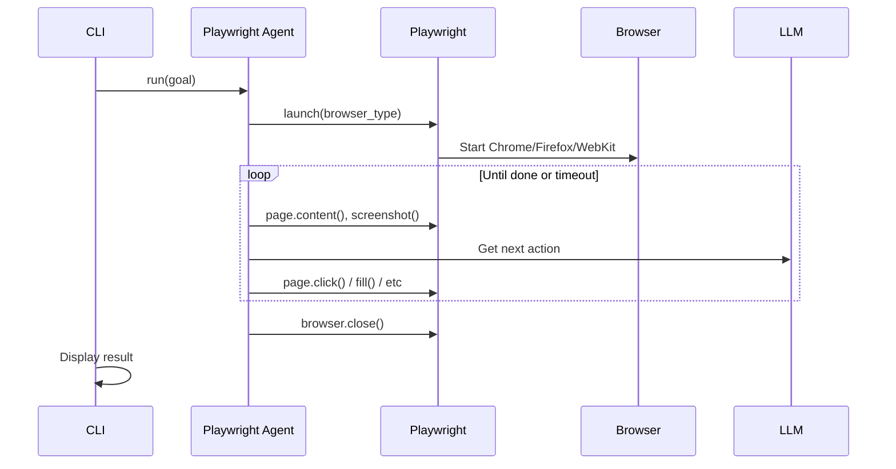
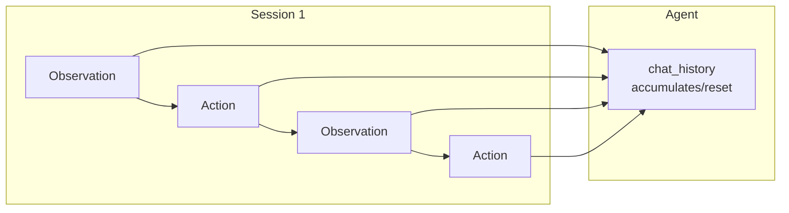

# Browser Agent Deep Dive

This guide explains how PraisonAI browser automation works under the hood, covering all execution modes, APIs, and integration patterns.

## Architecture Overview



---

## Instruction Flow (Extension Mode)

This diagram shows exactly how your instruction flows through the system:



### Key Points

1. **User → CLI**: User provides goal via `praisonai browser run "goal"`
2. **CLI → Server**: CLI connects over WebSocket, sends `start_session`
3. **Server → Extension**: Server forwards `start_automation` to Chrome extension
4. **Extension → Page**: Extension uses CDP to capture page state (DOM, screenshot)
5. **Extension → Server**: Sends observation with page details
6. **Server → Agent**: Passes observation to BrowserAgent
7. **Agent → LLM**: Agent builds prompt with goal + context, gets action from LLM
8. **Server → Extension**: Forwards action (click, type, scroll, etc.)
9. **Extension → Page**: Executes action via CDP
10. **Loop**: Repeats until agent returns `done: true` or timeout

---

## Execution Modes

### Comparison Table

| Feature | Extension Mode | CDP Mode | Playwright Mode |
|---------|---------------|----------|-----------------|
| **Requires Extension** | ✅ Yes | ❌ No | ❌ No |
| **Headless Support** | ❌ No | ✅ Yes | ✅ Yes |
| **Multi-Browser** | Chrome only | Chrome only | Chrome, Firefox, WebKit |
| **Session Limit** | 1 at a time | Unlimited | Unlimited |
| **API Used** | chrome.debugger | CDP WebSocket | Playwright API |
| **Best For** | Interactive use | Headless automation | Cross-browser testing |
| **Extra Dependencies** | None | `aiohttp`, `websockets` | `playwright` |

---

## Extension Mode (Default)

### How It Works



### Backend APIs

| API | Location | Purpose |
|-----|----------|---------|
| `chrome.debugger.attach()` | Extension | Attach to tab for control |
| `chrome.debugger.sendCommand()` | Extension | Execute CDP commands |
| `Runtime.evaluate` | CDP | Execute JavaScript |
| `Input.dispatchMouseEvent` | CDP | Simulate clicks |
| `Input.dispatchKeyEvent` | CDP | Simulate typing |
| `Page.captureScreenshot` | CDP | Take screenshots |

### CLI Usage

```bash
# Basic usage (extension mode is default)
praisonai browser run "Search for PraisonAI on Google"

# With options
praisonai browser run "task" \
    --url https://google.com \
    --model gpt-4o \
    --timeout 120 \
    --debug
```

### Programmatic Usage

```python
from praisonai.browser import BrowserServer, BrowserAgent

# Start server
server = BrowserServer(port=8765, model="gpt-4o-mini")
server.start_background()  # Runs in thread

# Create agent (requires extension to be connected)
agent = BrowserAgent(model="gpt-4o-mini", session_id="my-session")

# Agent is called via WebSocket, not directly
# Extension sends observations → Server calls agent → Extension executes actions
```

### Limitations

<Warning>
Extension mode supports **only one session at a time** because Chrome's 
`chrome.debugger` API only allows one debugger attachment per tab.
</Warning>

---

## CDP Mode

### How It Works



### Backend APIs

| API | Purpose | Example |
|-----|---------|---------|
| `GET /json` | List all pages | `http://localhost:9222/json` |
| `DOM.getDocument` | Get DOM tree | `{"depth": 4}` |
| `DOM.querySelector` | Find element | `{"selector": "#search"}` |
| `Runtime.evaluate` | Execute JS | `{"expression": "..."}` |
| `Input.dispatchMouseEvent` | Click | `{"type": "click", ...}` |
| `Input.dispatchKeyEvent` | Type | `{"type": "keyDown", ...}` |
| `Page.navigate` | Go to URL | `{"url": "..."}` |

### Prerequisites

```bash
# Start Chrome with remote debugging
/Applications/Google\ Chrome.app/Contents/MacOS/Google\ Chrome \
    --remote-debugging-port=9222 \
    --user-data-dir=/tmp/chrome-debug
```

### CLI Usage

```bash
# Use CDP mode explicitly
praisonai browser run "Search for AI" --engine cdp

# CDP-specific commands (no extension needed)
praisonai browser pages              # List all tabs
praisonai browser dom <PAGE_ID>      # Get DOM tree
praisonai browser content <PAGE_ID>  # Read page text
praisonai browser js <PAGE_ID> "document.title"  # Execute JS
praisonai browser console <PAGE_ID>  # Capture logs
```

### Programmatic Usage

```python
from praisonai.browser.cdp_agent import CDPBrowserAgent
from praisonai.browser.cdp_utils import get_pages, execute_js, get_dom

# Direct CDP control
async def example():
    # List pages
    pages = await get_pages(port=9222)
    for page in pages:
        print(f"{page.id}: {page.title}")
    
    # Execute JavaScript
    result = await execute_js(pages[0].id, "document.title")
    print(f"Title: {result}")
    
    # Get DOM
    dom = await get_dom(pages[0].id, depth=3)
    
    # Read page content
    from praisonai.browser.cdp_utils import read_page
    content = await read_page(pages[0].id)

# Run full automation
async def automate():
    agent = CDPBrowserAgent(
        port=9222,
        model="gpt-4o-mini",
        headless=False,
    )
    result = await agent.run("Search for PraisonAI on Google")
    print(result)
```

### Sync Wrappers

```python
from praisonai.browser.cdp_utils import (
    get_pages_sync,
    execute_js_sync,
    get_dom_sync,
    read_page_sync,
    get_console_sync,
)

# Synchronous usage
pages = get_pages_sync(port=9222)
title = execute_js_sync(pages[0].id, "document.title")
```

---

## Playwright Mode

### How It Works



### Backend APIs

| Playwright API | Purpose | CDP Equivalent |
|----------------|---------|----------------|
| `page.goto(url)` | Navigate | `Page.navigate` |
| `page.click(selector)` | Click element | `Input.dispatchMouseEvent` |
| `page.fill(selector, text)` | Type text | `Input.dispatchKeyEvent` |
| `page.screenshot()` | Capture screenshot | `Page.captureScreenshot` |
| `page.content()` | Get HTML | `DOM.getDocument` |
| `page.evaluate(fn)` | Execute JS | `Runtime.evaluate` |
| `page.wait_for_selector()` | Wait for element | Custom polling |

### Prerequisites

```bash
# Install Playwright
pip install playwright

# Install browsers
playwright install chromium
playwright install firefox  # Optional
playwright install webkit   # Optional
```

### CLI Usage

```bash
# Use Playwright mode
praisonai browser run "Search for AI" --engine playwright

# Headless mode
praisonai browser run "task" --engine playwright --headless
```

### Programmatic Usage

```python
from praisonai.browser.playwright_agent import PlaywrightBrowserAgent

async def example():
    agent = PlaywrightBrowserAgent(
        model="gpt-4o-mini",
        browser_type="chromium",  # or "firefox", "webkit"
        headless=True,
    )
    
    result = await agent.run(
        goal="Search for PraisonAI on Google",
        start_url="https://google.com",
    )
    print(result)
```

---

## Page Inspection Commands

These commands work via CDP (Chrome must be running with `--remote-debugging-port=9222`).

### CLI Reference

| Command | Description | Example |
|---------|-------------|---------|
| `praisonai browser pages` | List all browser tabs | Shows ID, title, URL |
| `praisonai browser dom <id>` | Get DOM tree | `--depth 4` |
| `praisonai browser content <id>` | Read page as text | `--limit 2000` |
| `praisonai browser console <id>` | Capture console logs | `--timeout 2` |
| `praisonai browser js <id> "code"` | Execute JavaScript | Returns result |

### Python API

```python
from praisonai.browser.cdp_utils import (
    get_pages,      # async: List[PageInfo]
    get_dom,        # async: Dict (DOM tree)
    read_page,      # async: str (page text)
    get_console,    # async: List[Dict] (log entries)
    execute_js,     # async: Any (JS result)
    wait_for_element,  # async: bool
)

# Synchronous versions also available:
# get_pages_sync, get_dom_sync, read_page_sync, etc.
```

---

## Agent Memory & Sessions

### Session Isolation

Each browser session now uses Agent's built-in session management:

```python
from praisonai.browser import BrowserAgent

# Session is auto-generated or can be provided
agent = BrowserAgent(
    model="gpt-4o-mini",
    session_id="my-unique-session",  # For memory isolation
)

# Reset for new session (clears chat_history)
agent.reset(new_session_id="new-session-id")
```

### Memory Flow



---

## Common Patterns

### Sequential Tasks (CDP Mode)

```python
import asyncio
from praisonai.browser.cdp_agent import CDPBrowserAgent

async def run_multiple_tasks():
    agent = CDPBrowserAgent(port=9222, model="gpt-4o-mini")
    
    tasks = [
        "Search for AI on Google",
        "Go to GitHub and search for praisonai",
        "Navigate to docs.praison.ai",
    ]
    
    for task in tasks:
        result = await agent.run(task)
        print(f"✅ {task}: {result['status']}")
        await asyncio.sleep(2)  # Pause between tasks

asyncio.run(run_multiple_tasks())
```

### Headless Screenshot

```python
from praisonai.browser.playwright_agent import PlaywrightBrowserAgent

async def take_screenshot():
    agent = PlaywrightBrowserAgent(
        headless=True,
        browser_type="chromium",
    )
    
    result = await agent.run(
        "Go to docs.praison.ai and take a screenshot",
        start_url="https://docs.praison.ai",
    )
```

### Page Scraping

```python
from praisonai.browser.cdp_utils import get_pages, read_page, execute_js

async def scrape_page():
    pages = await get_pages()
    
    # Find the right page
    target = next(p for p in pages if "google" in p.url.lower())
    
    # Get text content
    content = await read_page(target.id)
    
    # Or execute custom JS
    links = await execute_js(
        target.id,
        """
        Array.from(document.querySelectorAll('a'))
            .map(a => ({href: a.href, text: a.textContent.trim()}))
            .slice(0, 10)
        """
    )
    return links
```

---

## Troubleshooting

### Extension Mode Issues

| Issue | Cause | Solution |
|-------|-------|----------|
| "Another debugger attached" | Previous session not cleaned up | Reload extension or restart Chrome |
| Session timeout (0 steps) | Extension not connected | Check server health, reload extension |
| Actions not executing | CDP commands failing | Enable debug mode: `--debug` |

### CDP Mode Issues

| Issue | Cause | Solution |
|-------|-------|----------|
| Connection refused | Chrome not started with debug port | Start with `--remote-debugging-port=9222` |
| Page not found | Invalid page ID | Run `pages` command to get current IDs |
| Timeout | Page still loading | Use `wait_for_element()` |

### Playwright Mode Issues

| Issue | Cause | Solution |
|-------|-------|----------|
| Browser not installed | Missing Playwright browsers | Run `playwright install chromium` |
| Selector not found | Wrong selector or page not loaded | Add waits or use different selector |
