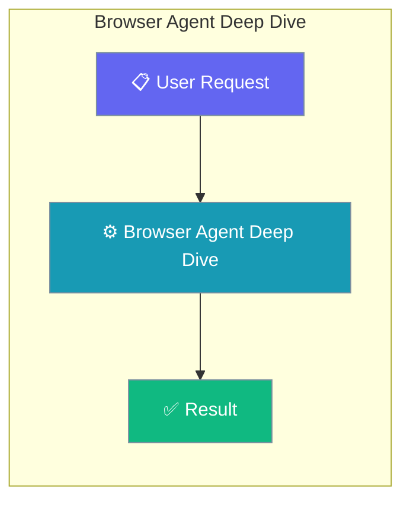
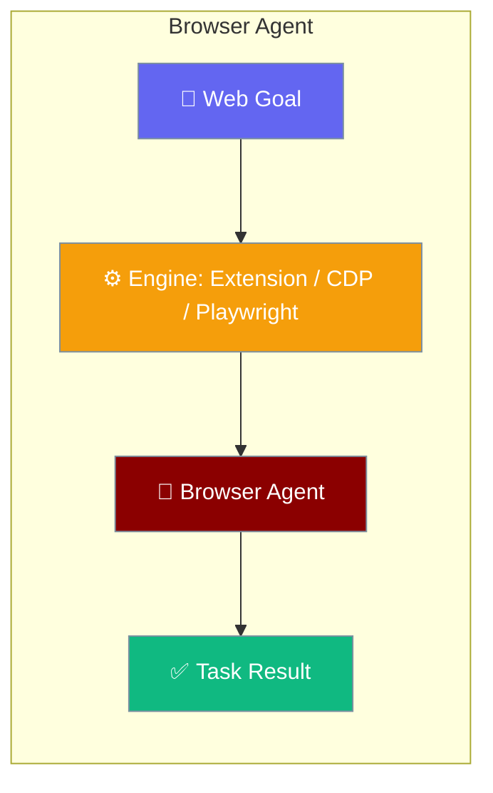
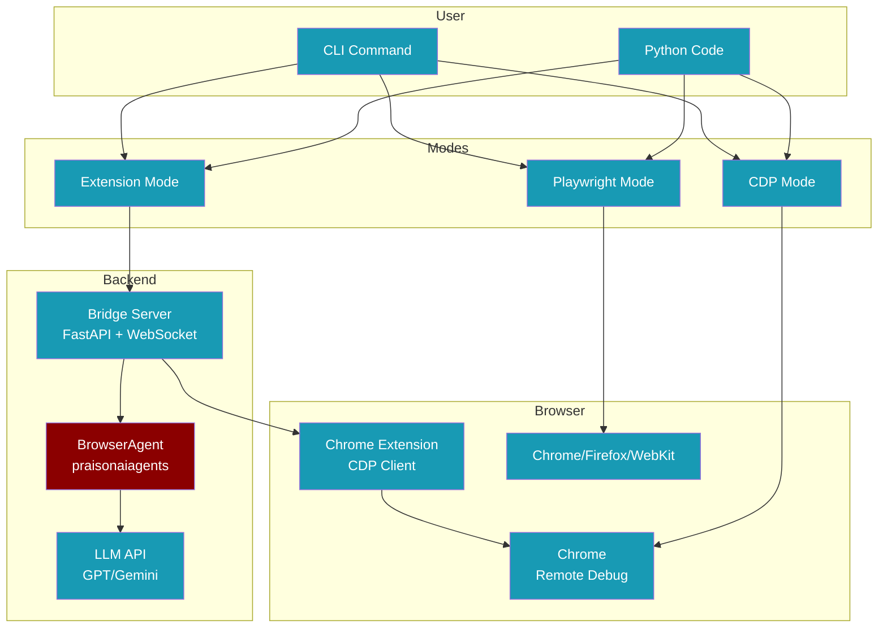
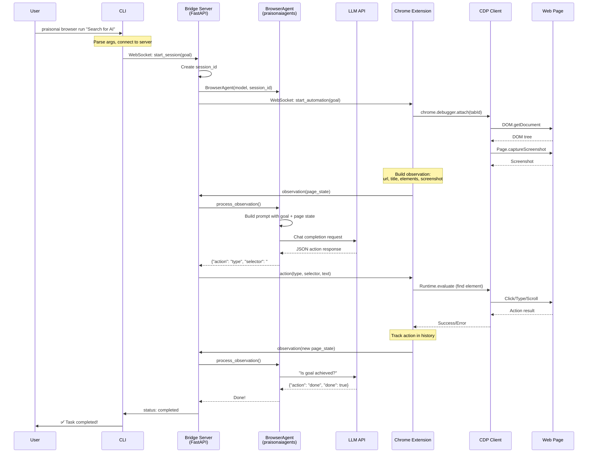
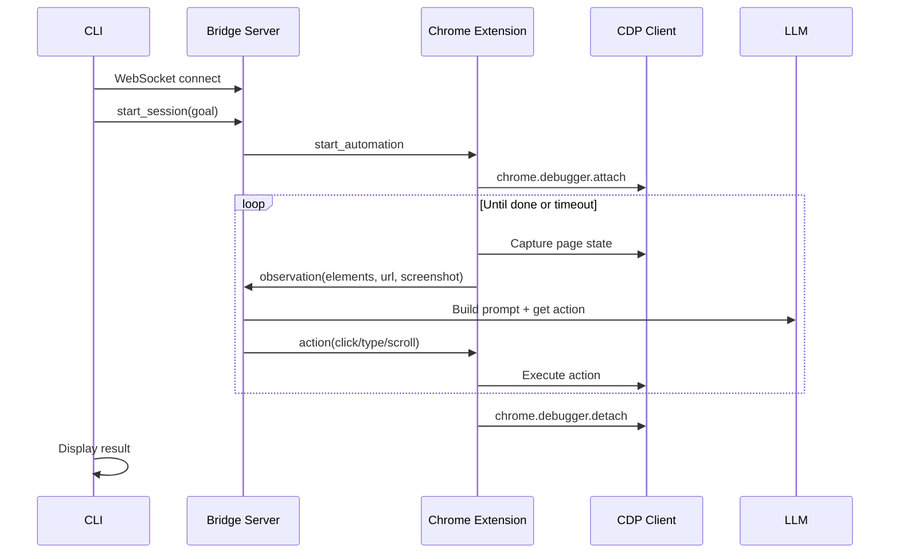
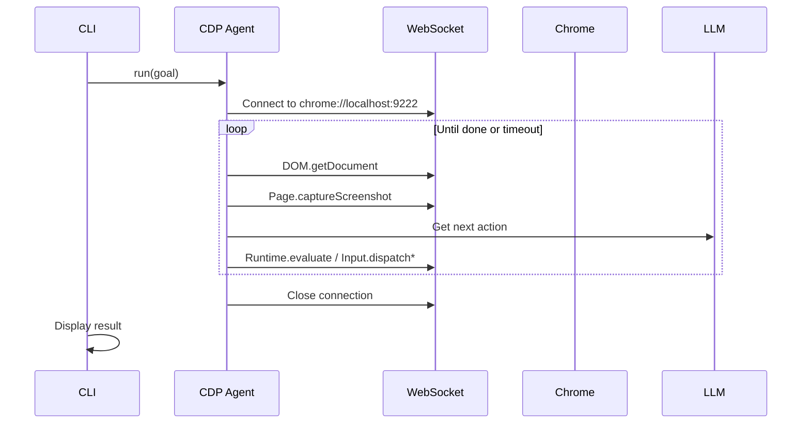
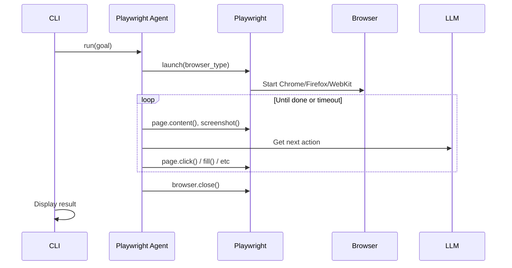
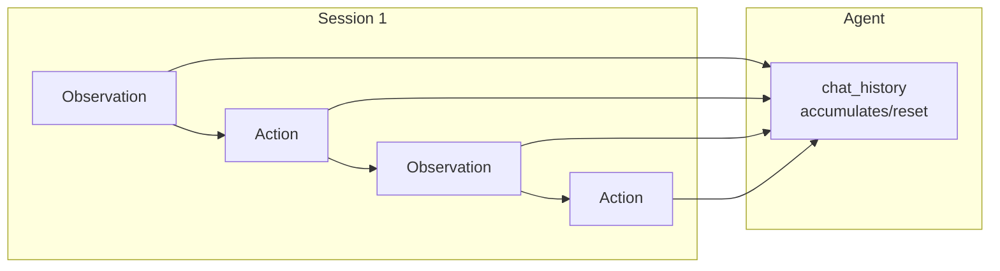
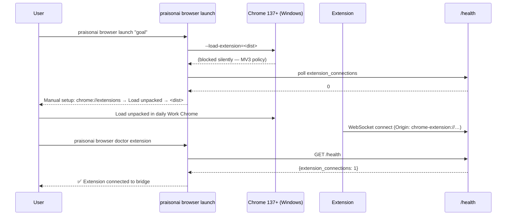

```mermaid
graph LR
    subgraph "Browser Agent Deep Dive"
        Request[📋 User Request] --> Process[⚙️ Browser Agent Deep Dive]
        Process --> Result[✅ Result]
    end

    classDef input fill:#6366F1,stroke:#7C90A0,color:#fff
    classDef process fill:#189AB4,stroke:#7C90A0,color:#fff
    classDef output fill:#10B981,stroke:#7C90A0,color:#fff

    class Request input
    class Process process
    class Result output
```


```python
from praisonaiagents import Agent

agent = Agent(name="browser-agent", instructions="Browse the web and complete tasks in Chrome.")
agent.start("Search for PraisonAI documentation and summarise the install steps.")
```

The user describes a web goal; the browser agent drives Chrome via extension, CDP, or Playwright.


```mermaid
graph LR
    subgraph "Browser Agent"
        In[📝 Web Goal] --> Engine[⚙️ Engine: Extension / CDP / Playwright]
        Engine --> Agent[🤖 Browser Agent]
        Agent --> Out[✅ Task Result]
    end

    classDef input fill:#6366F1,stroke:#7C90A0,color:#fff
    classDef process fill:#F59E0B,stroke:#7C90A0,color:#fff
    classDef agent fill:#8B0000,stroke:#7C90A0,color:#fff
    classDef output fill:#10B981,stroke:#7C90A0,color:#fff

    class In input
    class Engine process
    class Agent agent
    class Out output
```

# Browser Agent Deep Dive

This guide explains how PraisonAI browser automation works under the hood, covering all execution modes, APIs, and integration patterns.

## Package Layout

Heavy browser code lives in the standalone Tier-2 package `praisonai_browser`; the agents tier keeps only lightweight protocol types.

| Layer | Module | Holds |
|-------|--------|-------|
| Protocol (agents tier) | `praisonaiagents.tools.protocols.browser` | `BrowserAction`, `BrowserActionType`, `BrowserObservation`, `BrowserSession` |
| Implementation (Tier 2) | `praisonai_browser` | `agent.py`, `cdp_agent.py`, `playwright_agent.py`, `server.py`, `sessions.py`, `_protocol_bridge.py` |
| Wrapper (Tier 1) | `praisonai.browser` | Compatibility shim re-exporting `praisonai_browser` |

Install with `pip install praisonai-browser`. Import from `praisonai_browser`; `from praisonai.browser import …` still works via the shim.

## Quick Start

<Steps>
<Step title="Extension mode (default)">

```bash
praisonai browser run "Search for PraisonAI on Google"
```

</Step>
<Step title="CDP mode (headless)">

```bash
# Start Chrome with remote debugging, then:
praisonai browser run "Search for AI" --engine cdp
```

</Step>
<Step title="Playwright mode">

```bash
praisonai browser run "Search for AI" --engine playwright --headless
```

</Step>
</Steps>

## Architecture Overview


```mermaid
graph TB
    subgraph User
        CLI[CLI Command]
        Python[Python Code]
    end
    
    subgraph Modes
        EXT[Extension Mode]
        CDP[CDP Mode]
        PW[Playwright Mode]
    end
    
    subgraph Backend
        Server[Bridge Server<br/>FastAPI + WebSocket]
        Agent[BrowserAgent<br/>praisonaiagents]
        LLM[LLM API<br/>GPT/Gemini]
    end
    
    subgraph Browser
        Extension[Chrome Extension<br/>CDP Client]
        Chrome[Chrome<br/>Remote Debug]
        Browsers[Chrome/Firefox/WebKit]
    end
    
    CLI --> EXT & CDP & PW
    Python --> EXT & CDP & PW
    
    EXT --> Server --> Agent --> LLM
    Server --> Extension --> Chrome
    
    CDP --> Chrome
    PW --> Browsers
    
    classDef agent fill:#8B0000,color:#fff
    classDef tool fill:#189AB4,color:#fff
    
    class Agent agent
    class CLI,Python,EXT,CDP,PW,Server,LLM,Extension,Chrome,Browsers tool
```

---

## Instruction Flow (Extension Mode)

This diagram shows exactly how your instruction flows through the system:


```mermaid
sequenceDiagram
    participant User
    participant CLI
    participant Server as Bridge Server<br/>(FastAPI)
    participant Agent as BrowserAgent<br/>(praisonaiagents)
    participant LLM as LLM API
    participant Ext as Chrome Extension
    participant CDP as CDP Client
    participant Page as Web Page

    %% Step 1: User gives goal
    User->>CLI: praisonai browser run "Search for AI"
    Note over CLI: Parse args, connect to server
    
    %% Step 2: CLI starts session
    CLI->>Server: WebSocket: start_session(goal)
    Server->>Server: Create session_id
    Server->>Agent: BrowserAgent(model, session_id)
    Server->>Ext: WebSocket: start_automation(goal)
    
    %% Step 3: Extension captures page state
    Ext->>CDP: chrome.debugger.attach(tabId)
    CDP->>Page: DOM.getDocument
    Page-->>CDP: DOM tree
    CDP->>Page: Page.captureScreenshot
    Page-->>CDP: Screenshot
    
    %% Step 4: Extension sends observation
    Note over Ext: Build observation:<br/>url, title, elements, screenshot
    Ext->>Server: observation(page_state)
    
    %% Step 5: Agent decides action
    Server->>Agent: process_observation()
    Agent->>Agent: Build prompt with goal + page state
    Agent->>LLM: Chat completion request
    LLM-->>Agent: JSON action response
    Agent-->>Server: {"action": "type", "selector": "#search", "text": "AI"}
    
    %% Step 6: Server sends action to extension
    Server->>Ext: action(type, selector, text)
    
    %% Step 7: Extension executes action
    Ext->>CDP: Runtime.evaluate (find element)
    CDP->>Page: Click/Type/Scroll
    Page-->>CDP: Action result
    CDP-->>Ext: Success/Error
    
    %% Step 8: Loop continues
    Note over Ext: Track action in history
    Ext->>Server: observation(new page_state)
    
    %% Final: Goal complete
    Server->>Agent: process_observation()
    Agent->>LLM: "Is goal achieved?"
    LLM-->>Agent: {"action": "done", "done": true}
    Agent-->>Server: Done!
    Server->>CLI: status: completed
    CLI->>User: ✅ Task completed!
```

### Key Points

1. **User → CLI**: User provides goal via `praisonai browser run "goal"`
2. **CLI → Server**: CLI connects over WebSocket, sends `start_session`
3. **Server → Extension**: Server forwards `start_automation` to Chrome extension
4. **Extension → Page**: Extension uses CDP to capture page state (DOM, screenshot)
5. **Extension → Server**: Sends observation with page details
6. **Server → Agent**: Passes observation to BrowserAgent
7. **Agent → LLM**: Agent builds prompt with goal + context, gets action from LLM
8. **Server → Extension**: Forwards action (click, type, scroll, etc.)
9. **Extension → Page**: Executes action via CDP
10. **Loop**: Repeats until agent returns `done: true` or timeout

---

## Execution Modes

### Comparison Table

| Feature | Extension Mode | CDP Mode | Playwright Mode |
|---------|---------------|----------|-----------------|
| **Requires Extension** | ✅ Yes | ❌ No | ❌ No |
| **Headless Support** | ❌ No | ✅ Yes | ✅ Yes |
| **Multi-Browser** | Chrome only | Chrome only | Chrome, Firefox, WebKit |
| **Session Limit** | 1 at a time | Unlimited | Unlimited |
| **API Used** | chrome.debugger | CDP WebSocket | Playwright API |
| **Best For** | Interactive use | Headless automation | Cross-browser testing |
| **Extra Dependencies** | None | `aiohttp`, `websockets` | `playwright` |

---

## Extension Mode (Default)

### How It Works


```mermaid
sequenceDiagram
    participant CLI
    participant Server as Bridge Server
    participant Ext as Chrome Extension
    participant CDP as CDP Client
    participant LLM
    
    CLI->>Server: WebSocket connect
    CLI->>Server: start_session(goal)
    Server->>Ext: start_automation
    Ext->>CDP: chrome.debugger.attach
    
    loop Until done or timeout
        Ext->>CDP: Capture page state
        Ext->>Server: observation(elements, url, screenshot)
        Server->>LLM: Build prompt + get action
        Server->>Ext: action(click/type/scroll)
        Ext->>CDP: Execute action
    end
    
    Ext->>CDP: chrome.debugger.detach
    CLI->>CLI: Display result
```

### Backend APIs

| API | Location | Purpose |
|-----|----------|---------|
| `chrome.debugger.attach()` | Extension | Attach to tab for control |
| `chrome.debugger.sendCommand()` | Extension | Execute CDP commands |
| `Runtime.evaluate` | CDP | Execute JavaScript |
| `Input.dispatchMouseEvent` | CDP | Simulate clicks |
| `Input.dispatchKeyEvent` | CDP | Simulate typing |
| `Page.captureScreenshot` | CDP | Take screenshots |

### CLI Usage

```bash
# Basic usage (extension mode is default)
praisonai browser run "Search for PraisonAI on Google"

# With options
praisonai browser run "task" \
    --url https://google.com \
    --model gpt-4o \
    --timeout 120 \
    --debug
```

### Programmatic Usage

```python
from praisonai_browser import BrowserServer, BrowserAgent

# Start server
server = BrowserServer(port=8765, model="gpt-4o-mini")
server.start_background()  # Runs in thread

# Create agent (requires extension to be connected)
agent = BrowserAgent(model="gpt-4o-mini", session_id="my-session")

# Agent is called via WebSocket, not directly
# Extension sends observations → Server calls agent → Extension executes actions
```

<Note>
`server.start()` **blocks** for the lifetime of the server; use `server.start_background()` when you need the calling thread to continue. The pre-bind port check is a CLI concern, not a `BrowserServer` responsibility — probe it yourself if you need it:

```python
from praisonai_browser import BrowserServer
from praisonai_browser.server import _port_in_use

server = BrowserServer(port=8765, model="gpt-4o-mini")
if _port_in_use(server.host, server.port):
    print(f"Bridge already listening on {server.port}")
else:
    server.start()  # blocks until Ctrl+C / SIGTERM
```
</Note>

### Limitations

<Warning>
Extension mode supports **only one session at a time** because Chrome's 
`chrome.debugger` API only allows one debugger attachment per tab.
</Warning>

---

## CDP Mode

### How It Works


```mermaid
sequenceDiagram
    participant CLI
    participant Agent as CDP Agent
    participant WS as WebSocket
    participant Chrome
    participant LLM
    
    CLI->>Agent: run(goal)
    Agent->>WS: Connect to chrome://localhost:9222
    
    loop Until done or timeout
        Agent->>WS: DOM.getDocument
        Agent->>WS: Page.captureScreenshot
        Agent->>LLM: Get next action
        Agent->>WS: Runtime.evaluate / Input.dispatch*
    end
    
    Agent->>WS: Close connection
    CLI->>CLI: Display result
```

### Backend APIs

| API | Purpose | Example |
|-----|---------|---------|
| `GET /json` | List all pages | `http://localhost:9222/json` |
| `DOM.getDocument` | Get DOM tree | `{"depth": 4}` |
| `DOM.querySelector` | Find element | `{"selector": "#search"}` |
| `Runtime.evaluate` | Execute JS | `{"expression": "..."}` |
| `Input.dispatchMouseEvent` | Click | `{"type": "click", ...}` |
| `Input.dispatchKeyEvent` | Type | `{"type": "keyDown", ...}` |
| `Page.navigate` | Go to URL | `{"url": "..."}` |

### Prerequisites

```bash
# Start Chrome with remote debugging
/Applications/Google\ Chrome.app/Contents/MacOS/Google\ Chrome \
    --remote-debugging-port=9222 \
    --user-data-dir=/tmp/chrome-debug
```

### CLI Usage

```bash
# Use CDP mode explicitly
praisonai browser run "Search for AI" --engine cdp

# CDP-specific commands (no extension needed)
praisonai browser pages              # List all tabs
praisonai browser dom <PAGE_ID>      # Get DOM tree
praisonai browser content <PAGE_ID>  # Read page text
praisonai browser js <PAGE_ID> "document.title"  # Execute JS
praisonai browser console <PAGE_ID>  # Capture logs
```

### Programmatic Usage

```python
from praisonai_browser import CDPBrowserAgent
from praisonai_browser.cdp_utils import get_pages, execute_js, get_dom

# Direct CDP control
async def example():
    # List pages
    pages = await get_pages(port=9222)
    for page in pages:
        print(f"{page.id}: {page.title}")
    
    # Execute JavaScript
    result = await execute_js(pages[0].id, "document.title")
    print(f"Title: {result}")
    
    # Get DOM
    dom = await get_dom(pages[0].id, depth=3)
    
    # Read page content
    from praisonai_browser.cdp_utils import read_page
    content = await read_page(pages[0].id)

# Run full automation
async def automate():
    agent = CDPBrowserAgent(
        port=9222,
        model="gpt-4o-mini",
        headless=False,
    )
    result = await agent.run("Search for PraisonAI on Google")
    print(result)
```

### Sync Wrappers

```python
from praisonai_browser.cdp_utils import (
    get_pages_sync,
    execute_js_sync,
    get_dom_sync,
    read_page_sync,
    get_console_sync,
)

# Synchronous usage
pages = get_pages_sync(port=9222)
title = execute_js_sync(pages[0].id, "document.title")
```

---

## Playwright Mode

### How It Works


```mermaid
sequenceDiagram
    participant CLI
    participant Agent as Playwright Agent
    participant PW as Playwright
    participant Browser
    participant LLM
    
    CLI->>Agent: run(goal)
    Agent->>PW: launch(browser_type)
    PW->>Browser: Start Chrome/Firefox/WebKit
    
    loop Until done or timeout
        Agent->>PW: page.content(), screenshot()
        Agent->>LLM: Get next action
        Agent->>PW: page.click() / fill() / etc
    end
    
    Agent->>PW: browser.close()
    CLI->>CLI: Display result
```

### Backend APIs

| Playwright API | Purpose | CDP Equivalent |
|----------------|---------|----------------|
| `page.goto(url)` | Navigate | `Page.navigate` |
| `page.click(selector)` | Click element | `Input.dispatchMouseEvent` |
| `page.fill(selector, text)` | Type text | `Input.dispatchKeyEvent` |
| `page.screenshot()` | Capture screenshot | `Page.captureScreenshot` |
| `page.content()` | Get HTML | `DOM.getDocument` |
| `page.evaluate(fn)` | Execute JS | `Runtime.evaluate` |
| `page.wait_for_selector()` | Wait for element | Custom polling |

### Prerequisites

```bash
# Install Playwright
pip install playwright

# Install browsers
playwright install chromium
playwright install firefox  # Optional
playwright install webkit   # Optional
```

### CLI Usage

```bash
# Use Playwright mode
praisonai browser run "Search for AI" --engine playwright

# Headless mode
praisonai browser run "task" --engine playwright --headless
```

### Programmatic Usage

```python
from praisonai_browser.playwright_agent import PlaywrightBrowserAgent

async def example():
    agent = PlaywrightBrowserAgent(
        model="gpt-4o-mini",
        browser_type="chromium",  # or "firefox", "webkit"
        headless=True,
    )
    
    result = await agent.run(
        goal="Search for PraisonAI on Google",
        start_url="https://google.com",
    )
    print(result)
```

---

## Page Inspection Commands

These commands work via CDP (Chrome must be running with `--remote-debugging-port=9222`).

### CLI Reference

| Command | Description | Example |
|---------|-------------|---------|
| `praisonai browser pages` | List all browser tabs | Shows ID, title, URL |
| `praisonai browser dom <id>` | Get DOM tree | `--depth 4` |
| `praisonai browser content <id>` | Read page as text | `--limit 2000` |
| `praisonai browser console <id>` | Capture console logs | `--timeout 2` |
| `praisonai browser js <id> "code"` | Execute JavaScript | Returns result |

### Python API

```python
from praisonai_browser.cdp_utils import (
    get_pages,      # async: List[PageInfo]
    get_dom,        # async: Dict (DOM tree)
    read_page,      # async: str (page text)
    get_console,    # async: List[Dict] (log entries)
    execute_js,     # async: Any (JS result)
    wait_for_element,  # async: bool
)

# Synchronous versions also available:
# get_pages_sync, get_dom_sync, read_page_sync, etc.
```

---

## Agent Memory & Sessions

### Session Isolation

Each browser session now uses Agent's built-in session management:

```python
from praisonai_browser import BrowserAgent

# Session is auto-generated or can be provided
agent = BrowserAgent(
    model="gpt-4o-mini",
    session_id="my-unique-session",  # For memory isolation
)

# Reset for new session (clears chat_history)
agent.reset(new_session_id="new-session-id")
```

### Memory Flow


```mermaid
flowchart LR
    subgraph Session 1
        O1[Observation] --> A1[Action]
        A1 --> O2[Observation]
        O2 --> A2[Action]
    end
    
    subgraph Agent
        CH[chat_history<br/>accumulates/reset]
    end
    
    O1 --> CH
    A1 --> CH
    O2 --> CH
    A2 --> CH
```

---

## Common Patterns

### Sequential Tasks (CDP Mode)

```python
import asyncio
from praisonai_browser import CDPBrowserAgent

async def run_multiple_tasks():
    agent = CDPBrowserAgent(port=9222, model="gpt-4o-mini")
    
    tasks = [
        "Search for AI on Google",
        "Go to GitHub and search for praisonai",
        "Navigate to praison.ai/docs",
    ]
    
    for task in tasks:
        result = await agent.run(task)
        print(f"✅ {task}: {result['status']}")
        await asyncio.sleep(2)  # Pause between tasks

asyncio.run(run_multiple_tasks())
```

### Headless Screenshot

```python
from praisonai_browser.playwright_agent import PlaywrightBrowserAgent

async def take_screenshot():
    agent = PlaywrightBrowserAgent(
        headless=True,
        browser_type="chromium",
    )
    
    result = await agent.run(
        "Go to praison.ai/docs and take a screenshot",
        start_url="https://praison.ai/docs",
    )
```

### Page Scraping

```python
from praisonai_browser.cdp_utils import get_pages, read_page, execute_js

async def scrape_page():
    pages = await get_pages()
    
    # Find the right page
    target = next(p for p in pages if "google" in p.url.lower())
    
    # Get text content
    content = await read_page(target.id)
    
    # Or execute custom JS
    links = await execute_js(
        target.id,
        """
        Array.from(document.querySelectorAll('a'))
            .map(a => ({href: a.href, text: a.textContent.trim()}))
            .slice(0, 10)
        """
    )
    return links
```

---

## Troubleshooting

### Debug CLI Commands

```bash
# Check server health
praisonai browser doctor

# List all sessions with step counts
praisonai browser sessions --limit 10

# View session history (step-by-step)
praisonai browser history <session_id>

# Reload extension after code changes
praisonai browser reload

# Run with debug mode
praisonai browser run "goal" --debug
```

### Session Tracking

Both agent-side and server-side sessions are tracked in the same SQLite database:

```bash
# Database location
~/.praisonai/browser_sessions.db

# Tables:
#   sessions: session_id, goal, status, started_at, current_url
#   steps: session_id, step_number, observation, action, thought, created_at
```

### Extension Mode Issues

| Issue | Cause | Solution |
|-------|-------|----------|
| "Another debugger attached" | Previous session not cleaned up | `praisonai browser reload` or restart Chrome |
| Session timeout (0 steps) | Extension not connected | Run `praisonai browser doctor extension`; if the bridge shows 0 connections, load the extension manually (see [Manual Extension Load](#manual-extension-load-chrome-137-windows) below) |
| Actions not executing | CDP commands failing | Enable `--debug` mode, check console logs |
| Back-to-back sessions fail | Extension mode limitation | Use CDP mode: `--engine cdp` |
| Side panel not loading | Invalid Chrome version | Check `minimum_chrome_version` in manifest.json |
| Cryptic connection error on `run` | Bridge server not started | Follow the two-terminal setup in the friendly message: start it with `praisonai browser start --port 8765`, then rerun. See [Browser Agent → If the bridge server is not running](/docs/features/browser-agent#if-the-bridge-server-is-not-running). |

### CDP Mode Issues

| Issue | Cause | Solution |
|-------|-------|----------|
| Connection refused | Chrome not started with debug port | Start with `--remote-debugging-port=9222` |
| Page not found | Invalid page ID | Run `praisonai browser pages` |
| Timeout | Page still loading | Use `wait_for_element()` |
| No pages returned | Chrome not running | Start Chrome with debug flag |

### Playwright Mode Issues

| Issue | Cause | Solution |
|-------|-------|----------|
| Browser not installed | Missing Playwright browsers | `playwright install chromium` |
| Selector not found | Wrong selector or slow page | Add delays or use `wait_for_selector()` |

### Chrome Extension Console Logs

1. Go to `chrome://extensions`
2. Find "PraisonAI Browser Agent"
3. Click "Service worker" link to open DevTools
4. Check Console for `[PraisonAI]` and `[Bridge]` logs

### Manual Extension Load (Chrome 137+ / Windows)

Chrome 137+ on Windows blocks the automated `--load-extension` flag `praisonai browser launch` uses, so the debug profile opens empty. Load the extension into your daily Chrome once and it just works.

```bash
# Try the automated launch first — it may still work depending on Chrome build
praisonai browser launch
```

When auto-load fails, `launch` prints the exact `Load unpacked` path plus a `curl` verification step instead of a generic error. Follow the recipe below.


```mermaid
sequenceDiagram
    participant User
    participant CLI as praisonai browser launch
    participant Chrome as Chrome 137+ (Windows)
    participant Ext as Extension
    participant Bridge as /health

    User->>CLI: praisonai browser launch "goal"
    CLI->>Chrome: --load-extension=<dist>
    Chrome-->>CLI: (blocked silently — MV3 policy)
    CLI->>Bridge: poll extension_connections
    Bridge-->>CLI: 0
    CLI-->>User: Manual setup: chrome://extensions → Load unpacked → <dist>
    User->>Chrome: Load unpacked in daily Work Chrome
    Ext->>Bridge: WebSocket connect (Origin: chrome-extension://…)
    User->>CLI: praisonai browser doctor extension
    CLI->>Bridge: GET /health
    Bridge-->>CLI: {extension_connections: 1}
    CLI-->>User: ✅ Extension connected to bridge
```

<Steps>
<Step title="Open your daily Chrome">
Use your normal Chrome (Work profile) — not a fresh debug profile.

```
chrome://extensions
```
</Step>
<Step title="Enable Developer mode">
Toggle **Developer mode** on (top-right).
</Step>
<Step title="Load the dist folder">
Click **Load unpacked** and select the dist path printed by `praisonai browser launch` (typically `~/.praisonai/browser/extension/dist`).
</Step>
<Step title="Confirm the bridge connection">
Open the PraisonAI side panel and confirm it connects to `ws://127.0.0.1:8765/ws`.

If you launched with `--no-server`, start the bridge first:
```bash
praisonai browser start
```

Check `/health` directly (expect `extension_connections >= 1`):
```bash
curl http://127.0.0.1:8765/health
```

A connected extension returns:
```json
{
  "status": "ok",
  "connections": 1,
  "extension_connections": 1,
  "sessions": 0
}
```
</Step>
<Step title="Verify">
```bash
praisonai browser doctor extension
# expect: ✅ Extension connected to bridge (1 connection(s))
```
</Step>
</Steps>

<Info>
If your organisation forbids Developer mode, run `praisonai browser run "task" --engine cdp` — the CDP engine drives Chrome via `--remote-debugging-port=9222` and does not need the extension at all. See [CDP Mode](#cdp-mode).
</Info>

<Warning>
Chrome 137+ on Windows blocks the automated `--load-extension` argument for MV3 extensions. If `praisonai browser launch` opens a debug Chrome window without the PraisonAI extension icon, this is why. The manual **Load unpacked** step above is the fix.
</Warning>

<Note>
`praisonai browser reload` remains available for picking up extension code changes, but it is **not** the fix for the Chrome 137+ auto-load block — use the Load unpacked flow above.
</Note>

### Common Log Patterns

```
# Successful click:
[Bridge] Clicking element: #submit

# Failed click:
[Bridge] Click failed: All click methods failed for: #submit

# Session cleanup:
[PraisonAI] Cleaning up previous session (tab 12345)...

# Observation sent:
[PraisonAI] Step 0: https://google.com
```

### Action Verification

All actions return `{ success, error }`:
- **success=true**: CDP operation completed
- **success=false**: Error message indicates what failed

The error is sent in the next observation, allowing the LLM to retry or try alternative actions.

## Best Practices

<AccordionGroup>
  <Accordion title="Pick the engine for your use case">
    Use extension mode for interactive debugging, CDP for headless Chrome automation, and Playwright when you need Firefox or WebKit or reliable multi-session runs.

    ```mermaid
    graph TB
        Q[Need to drive a browser?] -->|Interactive, on your own Chrome| E1[Extension mode<br/>manual Load unpacked once]
        Q -->|Headless / server / Chrome 137+ Windows locked down| E2[CDP mode<br/>--engine cdp --remote-debugging-port=9222]
        Q -->|Cross-browser, multi-session, or CI| E3[Playwright mode<br/>--engine playwright]

        classDef q fill:#F59E0B,stroke:#7C90A0,color:#fff
        classDef opt fill:#189AB4,stroke:#7C90A0,color:#fff
        class Q q
        class E1,E2,E3 opt
    ```
  </Accordion>
  <Accordion title="Isolate sessions with session_id">
    Pass a unique `session_id` per task so `chat_history` does not leak between parallel or sequential automations. Call `agent.reset()` between unrelated goals.
  </Accordion>
  <Accordion title="Start Chrome with remote debugging for CDP">
    CDP mode requires Chrome on `--remote-debugging-port=9222`. Run `praisonai browser pages` to confirm tabs before starting an agent run.
  </Accordion>
  <Accordion title="Diagnose failures with doctor and --debug">
    Run `praisonai browser doctor` when extension sessions stall, and add `--debug` to surface CDP and bridge logs. Check `~/.praisonai/browser_sessions.db` for step history.

    `praisonai browser doctor extension` decides success by reading the **bridge `/health` `extension_connections` count** (source of truth — works even when the extension is loaded into your daily Chrome instead of the debug profile). CDP `:9222` is reported as informational. A doctor failure now means "the extension is genuinely not connected to the bridge" — follow the [manual-load steps](#manual-extension-load-chrome-137-windows) above.
  </Accordion>
</AccordionGroup>

---

## Related

<CardGroup cols={2}>
  <Card title="Browser Agent" icon="globe" href="/docs/features/browser-agent">
    Extension mode setup and CLI reference
  </Card>
  <Card title="praisonai-browser Package" icon="box" href="/docs/features/praisonai-browser-package">
    Install, CLI, imports, and backward compatibility for the Tier-2 package
  </Card>
</CardGroup>
