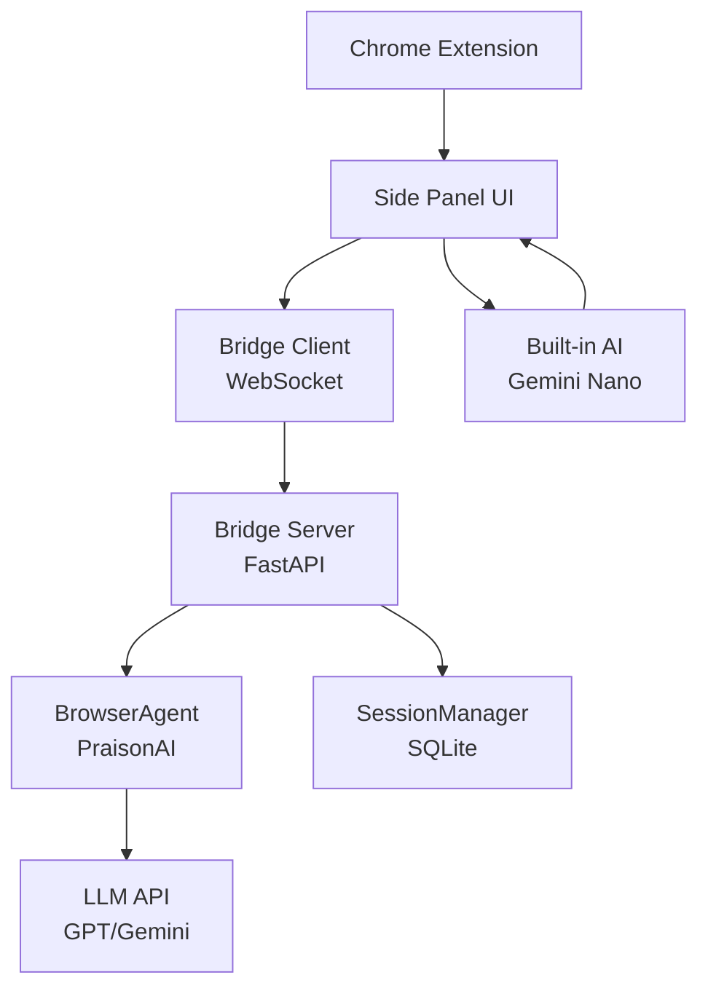

# Browser Agent

Control web browsers using AI agents through a Chrome Extension connected to PraisonAI.

## Quick Start

### 1. Start the Bridge Server

```bash
praisonai browser start --port 8765 --model gpt-4o
```

### 2. Load the Chrome Extension

1. Open `chrome://extensions`
2. Enable "Developer mode"
3. Load unpacked extension from `praisonai-chrome-extension/dist`

### 3. Use the Side Panel

Click the extension icon or press `Ctrl+Shift+P` to open the side panel. Enter your goal and the AI will control the browser.

## Architecture

**Flow:** Chrome Extension ↔ WebSocket ↔ Bridge Server ↔ PraisonAI Agent



The system consists of:
- **Chrome Extension**: Captures page state and executes actions via CDP
- **Bridge Server**: FastAPI WebSocket server that routes messages to agents
- **BrowserAgent**: PraisonAI agent that decides actions based on observations
- **SessionManager**: SQLite-based persistence for session history
- **Hybrid Mode**: Falls back to on-device Gemini Nano if server unavailable

## CLI Commands

### Start Server

```bash
praisonai browser start [OPTIONS]
```

Options:
- `--port, -p`: Port to listen on (default: 8765)
- `--host, -H`: Host to bind to (default: 0.0.0.0)
- `--model, -m`: LLM model (default: gpt-4o-mini)
- `--max-steps`: Maximum steps per session (default: 20)
- `--verbose, -v`: Enable verbose logging

### List Sessions

```bash
praisonai browser sessions [OPTIONS]
```

Options:
- `--status, -s`: Filter by status (running, completed, failed)
- `--limit, -l`: Maximum sessions to show

### View History

```bash
praisonai browser history <SESSION_ID>
```

### Clear Sessions

```bash
praisonai browser clear --status completed --yes
```

## Python API

```python
from praisonai.browser import BrowserServer, BrowserAgent

# Start server
server = BrowserServer(port=8765, model="gpt-4o")
server.start()  # Blocks

# Or create agent directly
agent = BrowserAgent(model="gpt-4o")
action = agent.process_observation({
    "task": "Search for AI frameworks",
    "url": "https://google.com",
    "title": "Google",
    "elements": [{"selector": "#search", "tag": "input", "text": ""}]
})
```

## Session Management

```python
from praisonai.browser.sessions import SessionManager

manager = SessionManager()

# Create session
session = manager.create_session("Find best restaurants")
print(session["session_id"])

# List sessions
sessions = manager.list_sessions(status="running")

# Get session details with steps
details = manager.get_session(session_id)
for step in details["steps"]:
    print(f"Step {step['step_number']}: {step['action']}")
```

## Hybrid Mode (Extension)

The Chrome Extension supports hybrid mode:

1. **Bridge Mode**: Connect to PraisonAI server for cloud LLMs
2. **Built-in Mode**: Use Chrome's Gemini Nano on-device

If the bridge server is unavailable, it automatically falls back to built-in AI.

## Keyboard Shortcuts

| Shortcut | Action |
|----------|--------|
| `Ctrl+Shift+P` | Toggle side panel |
| `Alt+A` | Start agent |
| `Alt+S` | Capture screenshot |

## Supported Actions

| Action | Description |
|--------|-------------|
| `click` | Click on element |
| `type` | Enter text |
| `scroll` | Scroll page |
| `navigate` | Go to URL |
| `wait` | Wait for page |
| `screenshot` | Capture screen |
| `done` | Task complete |

## WebSocket Protocol

Connect to `ws://localhost:8765/ws` and send/receive JSON messages:

```json
// Start session
{"type": "start_session", "goal": "Find flights to Paris", "model": "gpt-4o"}

// Send observation
{"type": "observation", "session_id": "...", "task": "...", 
 "url": "...", "elements": [...]}

// Receive action
{"type": "action", "action": "click", "selector": "#search", 
 "thought": "Clicking search button"}
```

## Environment Variables

| Variable | Description |
|----------|-------------|
| `OPENAI_API_KEY` | OpenAI API key for GPT models |
| `ANTHROPIC_API_KEY` | Anthropic API key for Claude |
| `GOOGLE_API_KEY` | Google API key for Gemini |
