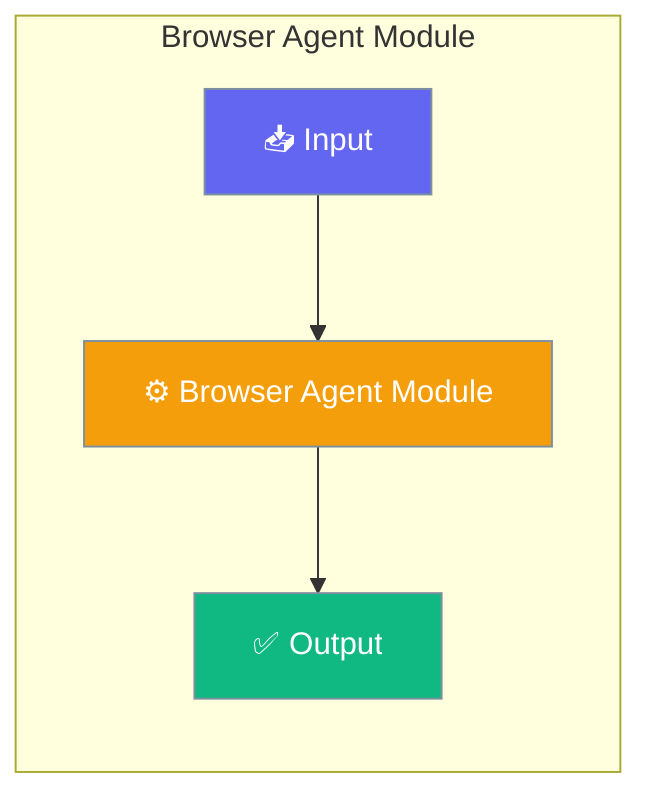

# Browser Agent

Control web browsers using AI agents through a Chrome Extension connected to PraisonAI.


```mermaid
graph LR
    subgraph "Browser Agent Module"
        A[📥 Input] --> B[⚙️ Browser Agent Module]
        B --> C[✅ Output]
    end

    classDef input fill:#6366F1,stroke:#7C90A0,color:#fff
    classDef process fill:#F59E0B,stroke:#7C90A0,color:#fff
    classDef output fill:#10B981,stroke:#7C90A0,color:#fff

    class A input
    class B process
    class C output
```


## Quick Start


<Steps>
<Step title="Quick Start">
### 1. Start the Bridge Server

```bash
praisonai browser start --port 8765 --model gpt-4o
```

### 2. Load the Chrome Extension

1. Open `chrome://extensions`
2. Enable "Developer mode"
3. Load unpacked extension from `praisonai-chrome-extension/dist`

### 3. Use the Side Panel

Click the extension icon or press `Ctrl+Shift+P` to open the side panel. Enter your goal and the AI will control the browser.
</Step>
</Steps>


## Best Practices

<AccordionGroup>
  <Accordion title="Start simple">
    Enable the feature with a single parameter before adding configuration. Verify it works, then layer in options.
  </Accordion>
  <Accordion title="Use environment variables for secrets">
    Never hardcode API keys or tokens. Use `os.getenv("KEY_NAME")` to read from environment variables.
  </Accordion>
  <Accordion title="Test with minimal examples first">
    Copy the Quick Start example, run it, then extend it. This confirms your environment is set up correctly.
  </Accordion>
  <Accordion title="Check the logs">
    Set `verbose=True` on your agent to see detailed execution logs when debugging unexpected behavior.
  </Accordion>
</AccordionGroup>

## Related

<CardGroup cols={2}>
  <Card title="Features Overview" icon="grid-2" href="/docs/features">
    Browse all PraisonAI features
  </Card>
  <Card title="Quick Start" icon="rocket" href="/docs/introduction">
    Get started with PraisonAI agents
  </Card>
</CardGroup>
