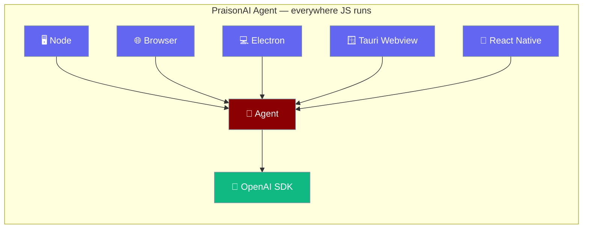
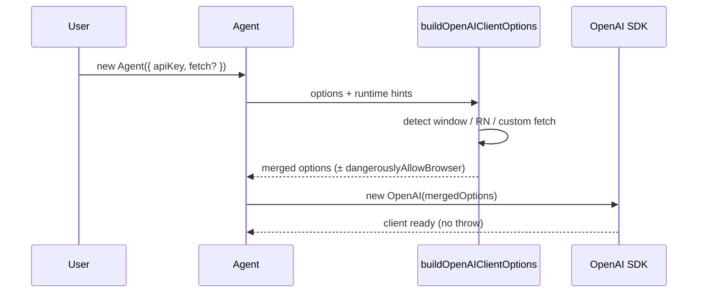
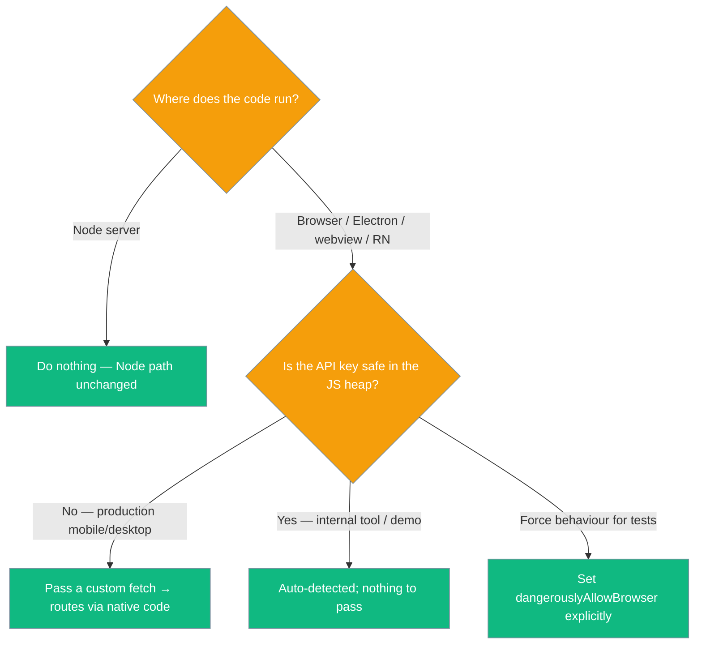

PraisonAI Agents run anywhere JavaScript runs — browsers, Electron, Tauri webviews, and React Native — with zero extra setup.



## Quick Start

The runtime is detected automatically — pass credentials directly on the Agent.

<Steps>

<Step title="Browser / Electron renderer (auto-detected)">
The browser guard is enabled for you — no config needed.

```typescript
import { Agent } from 'praisonai';

const agent = new Agent({
  instructions: "You are a helpful assistant",
  apiKey: import.meta.env.VITE_OPENAI_KEY,
});

await agent.chat("Hello from the browser!");
```
</Step>

<Step title="Tauri / native fetch bridge">
Pass a custom `fetch` to route requests through native code — the key stays out of the JS heap.

```typescript
import { Agent } from 'praisonai';
import { invoke } from '@tauri-apps/api/core';

const nativeFetch: typeof fetch = async (input, init) => {
  const body = await invoke<string>('openai_proxy', {
    url: String(input),
    init,
  });
  return new Response(body, { status: 200 });
};

const agent = new Agent({
  instructions: "You are the desktop assistant",
  fetch: nativeFetch,   // implies dangerouslyAllowBrowser
  // no apiKey here — the key lives in Rust
});
```
</Step>

<Step title="Explicit override">
Force the browser guard on or off — useful in tests.

```typescript
import { Agent } from 'praisonai';

const agent = new Agent({
  instructions: "You are helpful",
  apiKey: process.env.OPENAI_API_KEY,
  dangerouslyAllowBrowser: true,
});
```
</Step>

</Steps>

---

## How It Works

The Agent detects the runtime and merges the right options before constructing the OpenAI SDK.



| Runtime | Detected as | Flag added |
|---------|-------------|------------|
| Node | `process` present, no `window` | none — behaviour unchanged |
| Browser / Electron renderer | `window` + `window.document` | `dangerouslyAllowBrowser: true` |
| Embedded webview (Tauri) | `window` + `window.document` | `dangerouslyAllowBrowser: true` |
| React Native | `navigator.product === 'ReactNative'` | `dangerouslyAllowBrowser: true` |
| Custom `fetch` supplied | any runtime | `dangerouslyAllowBrowser: true` + injected `fetch` |

---

## When to use which option

Pick the option that matches where your code runs and how sensitive the key is.



---

## Configuration

Four knobs control credentials and transport across every runtime.

| Option | Type | Default | Description |
|--------|------|---------|-------------|
| `apiKey` | `string` | `undefined` (falls back to `OPENAI_API_KEY`) | Per-agent OpenAI key. |
| `baseURL` | `string` | `undefined` | Per-agent base URL for OpenAI-compatible endpoints. |
| `fetch` | `typeof fetch` | `undefined` | Custom transport. Implies `dangerouslyAllowBrowser`. |
| `dangerouslyAllowBrowser` | `boolean` | auto-detected | Force-enable the SDK's browser guard. Auto-`true` in browser-like runtimes. |

Precedence: an explicit `dangerouslyAllowBrowser` always wins — `false` even strips a pre-set flag. A custom `fetch` implies `dangerouslyAllowBrowser: true`, so a native bridge works even outside a webview.

<Card title="buildOpenAIClientOptions Reference" icon="code" href="/docs/sdk/reference/typescript/functions/buildOpenAIClientOptions">
  TypeScript helper that merges runtime-aware options
</Card>

---

## Common Patterns

### Tauri desktop app

Route every OpenAI request through a Rust command that owns the key.

```typescript
import { Agent } from 'praisonai';
import { invoke } from '@tauri-apps/api/core';

const nativeFetch: typeof fetch = async (input, init) => {
  const body = await invoke<string>('openai_proxy', {
    url: String(input),
    init,
  });
  return new Response(body, { status: 200 });
};

const agent = new Agent({
  instructions: "You are the desktop assistant",
  fetch: nativeFetch,
});

await agent.chat("Summarize today's notes");
```

### Electron renderer

Talk directly to OpenAI from the renderer — the guard is auto-added.

```typescript
import { Agent } from 'praisonai';

const agent = new Agent({
  instructions: "You are the in-app assistant",
  apiKey: import.meta.env.VITE_OPENAI_KEY,
});

await agent.chat("Draft a release note");
```

### React Native mobile app

`navigator.product === 'ReactNative'` is auto-detected.

```typescript
import { Agent } from 'praisonai';

const agent = new Agent({
  instructions: "You are the mobile assistant",
  apiKey: MY_APP_CONFIG.openaiKey,
});

await agent.chat("What's on my agenda?");
```

---

## Best Practices

<AccordionGroup>

<Accordion title="Prefer injectable fetch over dangerouslyAllowBrowser in production">
A custom `fetch` routes requests through native code, keeping the API key out of the JS heap. Reserve `dangerouslyAllowBrowser` for internal tools and demos.
</Accordion>

<Accordion title="Never bundle the API key into a shipped webview build">
Anything in the JS bundle is readable. In production Tauri / Electron / mobile apps, keep the key in native code and expose only a proxy command.
</Accordion>

<Accordion title="Use a per-agent apiKey for multi-tenant apps">
When multiple agents talk to different tenants or endpoints, set `apiKey` and `baseURL` per agent instead of relying on a single shared environment variable.
</Accordion>

<Accordion title="Guard process.env access in shared code">
Reading `process.env` throws in webviews and React Native where `process` is absent. The SDK guards its own access; do the same in code you share across runtimes.
</Accordion>

</AccordionGroup>

---

## Related

<CardGroup cols={2}>
  <Card title="Agent" icon="robot" href="/js/agent">
    Per-agent apiKey, baseURL, and fetch
  </Card>
  <Card title="Providers" icon="plug" href="/js/providers">
    fetch and dangerouslyAllowBrowser on ProviderConfig
  </Card>
  <Card title="Desktop Engine Origin Gate" icon="shield" href="/features/desktop/api#browser-origin-gate">
    Why an embedded Tauri / Electron webview's origin must be on the engine's allowed list
  </Card>
</CardGroup>
