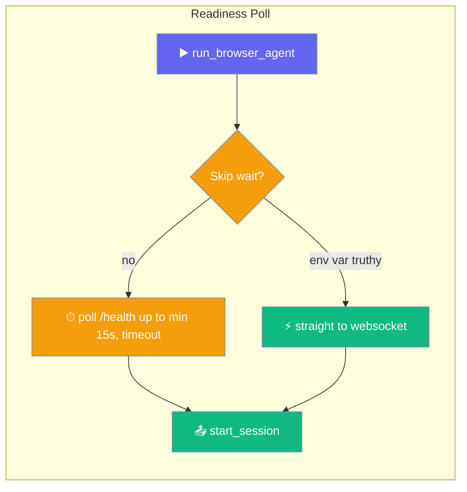

# Browser Extension Architecture

The PraisonAI browser automation uses a 3-layer architecture for AI-powered browser control.

<Note>
The bridge server and extension support ship in the standalone `praisonai-browser` package. Install them with `pip install "praisonai-browser[server]"` (or `pip install "praisonai[all]"`). The `praisonai browser …` commands keep working unchanged.
</Note>

## Communication Flow

```
Python CLI ──► Bridge Server ◄──► Chrome Extension
     │              │                    │
     │              │                    │
 start_session  observation/action      CDP
```

1. **CLI** sends `start_session` with goal
2. **Bridge Server** routes to **Extension**
3. **Extension** captures page state (screenshot, elements)
4. **Extension** sends `observation` to **Bridge**
5. **Bridge** processes with BrowserAgent (LLM decision)
6. **Bridge** returns `action` to **Extension**
7. **Extension** executes action via CDP
8. Loop continues until goal complete

## Architecture Diagram

```
┌─────────────────────────────────────────────────────────────┐
│                     Python CLI                               │
│  praisonai browser launch "goal"                            │
└─────────────────────┬───────────────────────────────────────┘
                      │ WebSocket
                      ▼
┌─────────────────────────────────────────────────────────────┐
│                  Bridge Server (FastAPI)                     │
│  - Routes messages CLI ↔ Extension                          │
│  - Hosts BrowserAgent for LLM decisions                     │
│  - WebSocket endpoint: ws://localhost:8765/ws               │
└─────────────────────┬───────────────────────────────────────┘
                      │ WebSocket
                      ▼
┌─────────────────────────────────────────────────────────────┐
│                Chrome Extension                              │
│  - Background service worker                                │
│  - CDP debugger for page control                            │
│  - Captures screenshots, clickable elements                 │
│  - Executes click/type/scroll actions                       │
└─────────────────────────────────────────────────────────────┘
```

## Running the Browser Agent

```bash
# Simple usage (auto-selects engine)
praisonai browser launch "go to google and search for AI"

# Force extension mode
praisonai browser launch "go to google" --engine extension

# Force CDP mode (no extension required)
praisonai browser launch "go to google" --engine cdp

# Debug mode
praisonai browser launch "test" --debug
```

## Message Types

| Type | Direction | Description |
|------|-----------|-------------|
| `start_session` | CLI → Server | Start new automation |
| `observation` | Ext → Server | Page state snapshot |
| `action` | Server → Ext | Next action to execute |
| `status` | Server → Both | Session status updates |
| `stop_session` | Any → Server | End session |
| `cancel_session` | Any → Server | Cancel an in-flight session (routes through the same handler as `stop_session`). |

## Extension Readiness Wait

Before sending `start_session`, `run_browser_agent_with_progress` polls the bridge `/health` endpoint until an extension connects.



The poll caps at `min(15.0, timeout)` seconds — a caller passing `timeout=2.0` waits at most 2 seconds. Set `PRAISONAI_BROWSER_SKIP_EXTENSION_WAIT=1` to skip the poll entirely (for unit tests / mocked bridges). See [Environment Variables](/docs/features/browser-agent-deep-dive#environment-variables).

<Warning>
Skip the readiness poll only for tests or mocked bridges — never for live runs, where it exists to catch a disconnected extension before `start_session`.
</Warning>

## Troubleshooting

### Extension Not Connecting

If you see "Extension did not connect after 15s":

1. **Check extension console**:
   - Go to `chrome://extensions/`
   - Find "PraisonAI Browser Agent"
   - Click "service worker" link
   - Look for errors

2. **Kill stale Chrome processes**:
   ```bash
   pkill -f "Google Chrome"
   ```

3. **Rebuild extension**:
   ```bash
   cd /path/to/praisonai-chrome-extension
   npm run build
   ```

4. **Check bridge server**:
   ```bash
   curl http://localhost:8765/health
   ```

   Expected output:
   ```json
   {
     "status": "ok",
     "connections": 2,
     "extension_connections": 1,
     "sessions": 0,
     "extension_busy": false,
     "active_session_id": null
   }
   ```

   `connections` counts **all** WebSocket clients (extension, CLI, curl'd probes). Check `extension_connections >= 1` instead — it counts only clients whose `Origin` starts with `chrome-extension://`, so a stray CLI probe won't make it look connected. `connections >= 1` alone is no longer sufficient.

   `extension_busy` and `active_session_id` (added in PraisonAI #3095 hardening) tell you whether the extension is currently owned by a session — a healthy-and-idle bridge shows `extension_busy: false`. `praisonai browser run` fails fast with an "Extension already running a session" error rather than hanging when this is `true`. Servers older than that commit omit both fields; treat missing as `false` / `null`.

   <Note>
   Servers older than PraisonAI #3115 don't return `extension_connections`. The CLI helpers (`doctor extension`, the `launch` poller) fall back to `connections` in that case.
   </Note>

### No Observations Sent

If session starts but times out:
- Check extension console for `[PraisonAI] onStartAutomation FATAL ERROR`
- CDP debugger may fail to attach
- Page may be a chrome:// URL (unsupported)

### Debug Mode

```bash
praisonai browser launch "test" --debug
```

This enables verbose logging and saves screenshots to `~/.praisonai/browser_screenshots/`.

## Performance Profiling

Track timing breakdown for each automation step:

```bash
# Basic profiling with timing summary
praisonai browser launch "search for AI" --engine cdp --profile

# Deep profiling with cProfile trace
praisonai browser launch "search for AI" --engine cdp --deep-profile
```

### Sample Output

```
📊 Performance Profile
──────────────────────────────────────────────────────────────────────
Total Time: 24.2s | Steps: 3 | Avg: 8.1s/step

Step |    LLM | Screen | Action | Verify | Stable |  Total
   0 |   2.4s |   0.0s |   1.0s |   0.0s |   0.0s |   3.5s
   1 |   2.2s |   0.0s |   0.2s |   0.0s |   0.0s |   2.5s

Bottlenecks: LLM 51% | Verify 0% | Stable 0%
```

### Timing Breakdown

| Metric | Description |
|--------|-------------|
| LLM | Time spent waiting for LLM decision |
| Screen | Screenshot capture time |
| Action | CDP action execution time |
| Verify | Action verification time |
| Stable | Page stability wait time |
