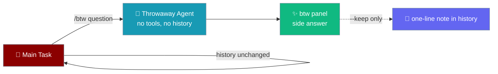
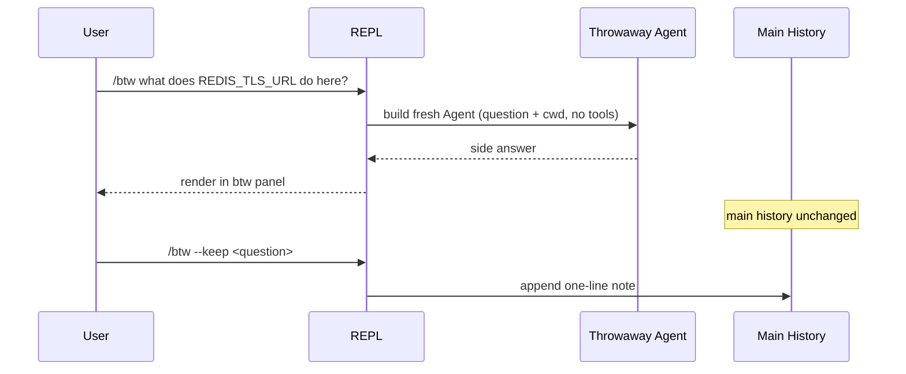

In the `praisonai code` interactive REPL, `/btw <question>` answers a side question from a parallel, throwaway context — the main task's history, place, and momentum stay untouched.

```python
from praisonaiagents import Agent

agent = Agent(
    name="Coder",
    instructions="You are a coding assistant.",
)

# Launch an interactive session, then ask a side question mid-task:
#   $ praisonai code
#   > refactor the auth module to use the new token store
#   > /btw what does REDIS_TLS_URL do here?     # answered in a side panel
#   > (continue refactoring — history is unchanged)
```



## Quick Start

<Steps>
<Step title="Launch a coding session">

```bash
praisonai code
```

Start working on your main task as usual:

```bash
> refactor the auth module to use the new token store
```

</Step>

<Step title="Ask a side question with /btw">

Type `/btw` followed by your question:

```bash
> /btw what does REDIS_TLS_URL do here?
```

The answer renders in a distinct `btw` panel:

```
╭─ btw ────────────────────────────────────────────────╮
│ REDIS_TLS_URL points the client at a TLS-secured      │
│ Redis endpoint (rediss://). When set, the connection  │
│ negotiates TLS instead of plain TCP.                  │
╰───────────────────────────────────────────────────────╯
```

Nothing is appended to the main conversation — your refactor context is untouched.

</Step>

<Step title="Keep a one-line note (optional)">

Add `--keep` to record a single one-line note in the main history:

```bash
> /btw --keep what does REDIS_TLS_URL do here?
```

</Step>
</Steps>

---

## How It Works

`/btw` builds a fresh, read-only `Agent` with minimal context — just your question plus the current working directory — and **no tools**, then runs it in isolation and renders the answer in a `btw` panel.



The main agent is never invoked for a side question. An empty question (`/btw` with no text) prints a usage hint instead of running anything.

---

## Options

The only flag is `--keep`.

| Form | Records in main history | Side answer panel |
|------|-------------------------|-------------------|
| `/btw <question>` | No — throwaway context | Yes |
| `/btw --keep <question>` | Yes — one-line note | Yes |
| `/btw` (empty) | No | No — prints a usage hint |

---

## /btw vs /queue

Both defer work, but they touch the main task differently — `/btw` is a throwaway parallel context, `/queue` costs the main context.

| | `/btw` | `/queue` |
|---|--------|----------|
| Context used | A fresh, throwaway side agent | The main conversation |
| Touches main history | No (unless `--keep`) | Yes — the prompt lands in the main history |
| Tools | None — read-only side agent | Full main-task tools on dequeue |
| Use it when | You need a quick lookup without losing your spot | The answer should influence the main task |

Reach for `/btw` when the answer is just for you; reach for [`/queue`](/features/bot-commands#queue) when the answer should feed the main task.

---

## Common Patterns

Look up an environment variable mid-refactor without derailing:

```bash
> /btw what format does DATABASE_URL expect?
```

Confirm a library's behaviour while staying in the main task:

```bash
> /btw does httpx retry on connection errors by default?
```

Keep a breadcrumb in history when the answer matters later:

```bash
> /btw --keep which port does the gateway bind to?
```

---

## Best Practices

<AccordionGroup>
<Accordion title="Use /btw for context lookups, not follow-up work">
`/btw` answers from a throwaway context with no tools — perfect for "what does this mean?" lookups. For work that changes files or should build on the main task, ask in the main conversation instead.
</Accordion>

<Accordion title="Prefer /queue when the answer should influence the main task">
If the side answer needs to feed back into the task, `/queue` keeps it in the main history where the main agent can act on it. `/btw` intentionally discards its context.
</Accordion>

<Accordion title="Add --keep only when you want a breadcrumb">
Default `/btw` leaves zero trace. Reach for `--keep` when you want a one-line reminder in the transcript that you looked something up — without pulling the full answer into context.
</Accordion>

<Accordion title="Keep questions self-contained">
The side agent sees only your question and the current working directory — not the main conversation. Phrase the question so it stands on its own.
</Accordion>
</AccordionGroup>

---

## Related

<CardGroup cols={2}>
<Card title="/queue" icon="list-check" href="/features/bot-commands#queue">
  Defer a prompt into the main history for the main task to act on.
</Card>
<Card title="/recap" icon="clock-rotate-left" href="/features/bot-commands#recap">
  Render a read-only "where were we" summary of the session.
</Card>
<Card title="Shell Escape" icon="terminal" href="/features/interactive-shell-escape">
  Run a shell command inline with `!cmd` without spending a model turn.
</Card>
<Card title="Slash Commands" icon="terminal" href="/cli/slash-commands">
  The full interactive `/command` reference.
</Card>
</CardGroup>
