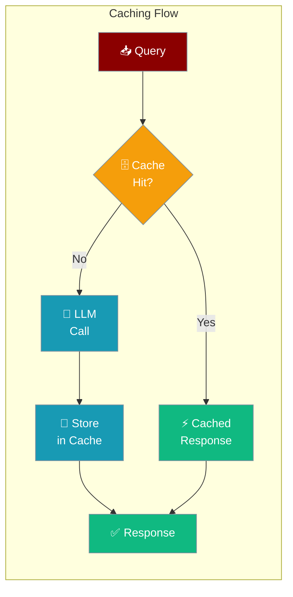
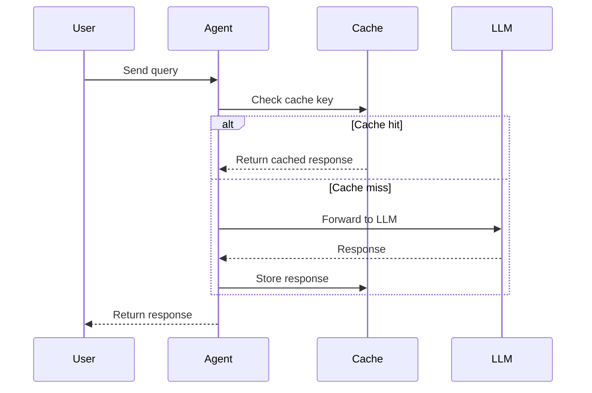

Cache responses so your agent skips redundant LLM calls — same input, instant output.

```python
from praisonaiagents import Agent

agent = Agent(
    name="CachedAgent",
    instructions="You are a helpful assistant.",
    caching=True
)

result = agent.start("What is the capital of France?")
print(result)
```



## Quick Start

<Steps>
<Step title="Simple Usage">
Enable caching with a single boolean — uses safe defaults:

```python
from praisonaiagents import Agent

agent = Agent(
    name="Assistant",
    instructions="You are a helpful assistant.",
    caching=True
)

agent.start("Summarize the benefits of caching")
```
</Step>

<Step title="With CachingConfig">
Control exactly what gets cached:

```python
from praisonaiagents import Agent, CachingConfig

agent = Agent(
    name="Assistant",
    instructions="You are a helpful assistant.",
    caching=CachingConfig(
        enabled=True,
        prompt_caching=True,  # Enable provider-level prompt caching (Anthropic, etc.)
    )
)

agent.start("Explain neural networks")
```
</Step>
</Steps>

---

## How It Works



Two types of caching work together:

| Type | What it does | When to use |
|------|-------------|------------|
| **Response caching** (`enabled`) | Stores full LLM responses locally | Repeated identical queries |
| **Prompt caching** (`prompt_caching`) | Sends cache-control headers to provider | Long system prompts with Anthropic/compatible providers |

---

## Configuration Options

<Card title="CachingConfig SDK Reference" icon="code" href="/docs/sdk/reference/python/classes/CachingConfig">
  Full parameter reference for CachingConfig
</Card>

**Precedence ladder** — choose the level you need:

```python
# Level 1: Bool (simplest — enable with defaults)
agent = Agent(caching=True)

# Level 2: CachingConfig (full control)
agent = Agent(caching=CachingConfig(
    enabled=True,
    prompt_caching=True,
))
```

| Option | Type | Default | Description |
|--------|------|---------|-------------|
| `enabled` | `bool` | `True` | Enable response caching |
| `prompt_caching` | `bool \| None` | `None` | Enable provider-level prompt caching (Anthropic, etc.) |

---

## Common Patterns

**Always-on caching for a research agent:**

```python
from praisonaiagents import Agent, CachingConfig

agent = Agent(
    name="ResearchAgent",
    instructions="Research topics thoroughly and provide detailed summaries.",
    caching=CachingConfig(enabled=True)
)

# First call hits LLM
result1 = agent.start("What are the main types of machine learning?")

# Identical second call returns from cache instantly
result2 = agent.start("What are the main types of machine learning?")
```

**Prompt caching for Anthropic models:**

```python
from praisonaiagents import Agent, CachingConfig

agent = Agent(
    name="DocumentAnalyzer",
    instructions="Analyze documents in detail.",
    llm="claude-3-5-sonnet-20241022",
    caching=CachingConfig(
        enabled=True,
        prompt_caching=True,  # Caches the system prompt at the provider level
    )
)

agent.start("Summarize this document: [long document text...]")
```

**Disable caching for real-time data:**

```python
from praisonaiagents import Agent

agent = Agent(
    name="LiveDataAgent",
    instructions="Fetch and report current stock prices.",
    caching=False  # Always get fresh data
)
```

---

## Best Practices

<AccordionGroup>
<Accordion title="Use caching for stable, repeated queries">
Caching works best for queries that return the same answer — like document summaries, FAQs, or educational content. Avoid it for time-sensitive data like live prices or weather.
</Accordion>

<Accordion title="Enable prompt_caching for long system prompts">
If your agent has a long `instructions` string, set `prompt_caching=True` with Anthropic models. This caches the prompt tokens at the provider level, reducing cost significantly on repeated calls.
</Accordion>

<Accordion title="Disable caching in development">
Set `caching=False` during development to always see fresh LLM responses and avoid debugging stale cache issues.
</Accordion>

<Accordion title="Cache keys are based on the full prompt">
Any change to the query, system prompt, or conversation history creates a new cache entry. Only exact matches hit the cache.
</Accordion>
</AccordionGroup>

---

## Related

<CardGroup cols={2}>
<Card title="Prompt Caching" icon="bolt" href="/docs/features/prompt-caching">
  Provider-level caching with Anthropic and compatible models
</Card>
<Card title="Prompt Cache Optimization" icon="sparkles" href="/docs/features/prompt-cache-optimization">
  Optimize prompts for maximum cache hit rate
</Card>
<Card title="Execution Systems" icon="play" href="/docs/features/execution-systems">
  Configure max iterations and token budgets
</Card>
<Card title="Output Styles" icon="display" href="/docs/features/output-styles">
  Control what your agent displays and saves
</Card>
</CardGroup>
