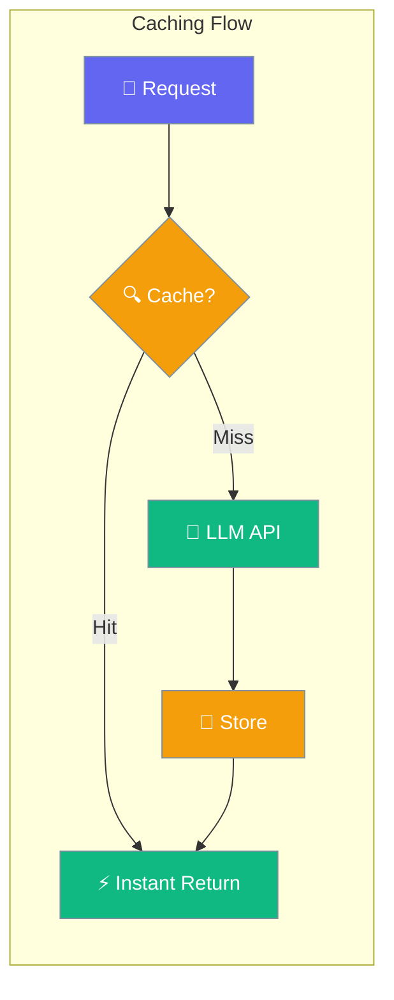
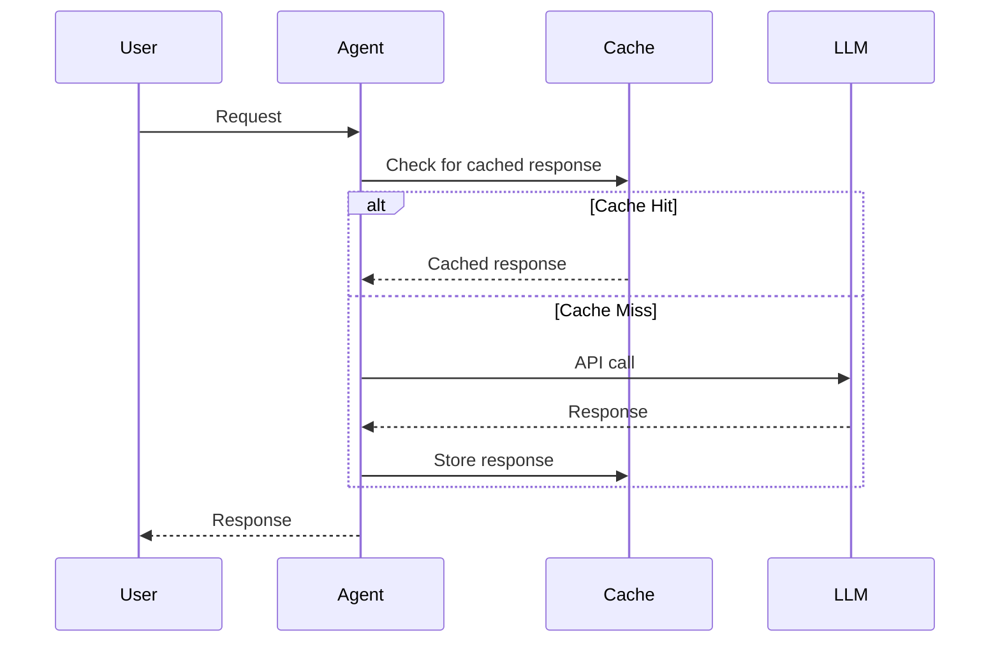

Caching stores LLM responses so identical requests return instantly without calling the API again.

```python
from praisonaiagents import Agent

agent = Agent(
    name="Assistant",
    instructions="You are a helpful assistant.",
    caching=True,
)

agent.start("What is the capital of France?")
```



## Quick Start

<Steps>
<Step title="Simple Usage">
```python
from praisonaiagents import Agent

agent = Agent(instructions="You are a helpful assistant.", caching=True)
agent.start("Summarize the history of Rome.")
```
</Step>

<Step title="With Configuration">
```python
from praisonaiagents import Agent, CachingConfig

agent = Agent(
    instructions="You are a helpful assistant.",
    caching=CachingConfig(
        enabled=True,
        prompt_caching=True,
    ),
)
agent.start("Summarize the history of Rome.")
```
</Step>
</Steps>

---

## How It Works



| Phase | What happens |
|---|---|
| 1. Check | Agent checks if this exact request was cached |
| 2. Hit | Returns stored response instantly — no API cost |
| 3. Miss | Calls LLM, stores response for next time |

---

## Configuration Options

<Card icon="code" href="/docs/sdk/reference/python/CachingConfig">
  Full list of options, types, and defaults — `CachingConfig`
</Card>

| Option | Type | Default | Description |
|---|---|---|---|
| `enabled` | `bool` | `True` | Enable response caching |
| `prompt_caching` | `bool \| None` | `None` | Provider-specific prompt caching (Anthropic, etc.) |

---

## Common Patterns

### Pattern 1 — Enable for cost savings
```python
from praisonaiagents import Agent

agent = Agent(instructions="Answer questions about geography.", caching=True)
response = agent.start("What is the capital of France?")
print(response)
```

### Pattern 2 — Prompt caching for Anthropic models
```python
from praisonaiagents import Agent, CachingConfig

agent = Agent(
    instructions="You are an expert legal analyst with deep knowledge of contract law.",
    llm="claude-3-5-sonnet-20241022",
    caching=CachingConfig(enabled=True, prompt_caching=True),
)
agent.start("Analyze this contract clause for potential risks.")
```

---

## Best Practices

<AccordionGroup>
<Accordion title="When to enable caching">
Enable caching when the same questions are asked repeatedly, such as in FAQ bots, product assistants, or any agent handling predictable queries. Caching has the most impact on high-traffic, repetitive workloads.
</Accordion>

<Accordion title="Prompt caching for long contexts">
Set `prompt_caching=True` when using Anthropic models with long system prompts or large context documents. This can reduce costs by up to 90% on prompt tokens for repeated calls with the same prefix.
</Accordion>

<Accordion title="Cache invalidation">
The cache is keyed on the full request content. Changing instructions, tools, or any parameter automatically invalidates existing cache entries — you don't need to manage this manually.
</Accordion>
</AccordionGroup>

---

## Related

<CardGroup cols={2}>
<Card icon="play" href="/docs/features/execution">
  Execution — control iteration limits and performance
</Card>
<Card icon="display" href="/docs/features/output">
  Output — configure response verbosity and streaming
</Card>
</CardGroup>
