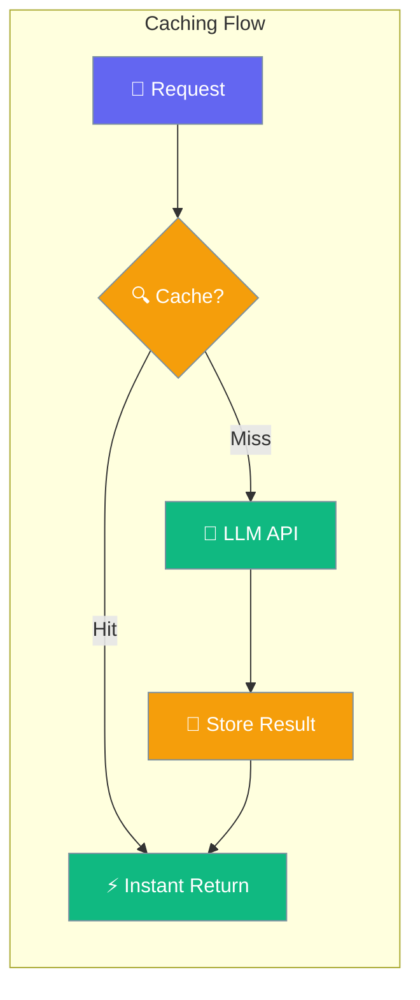
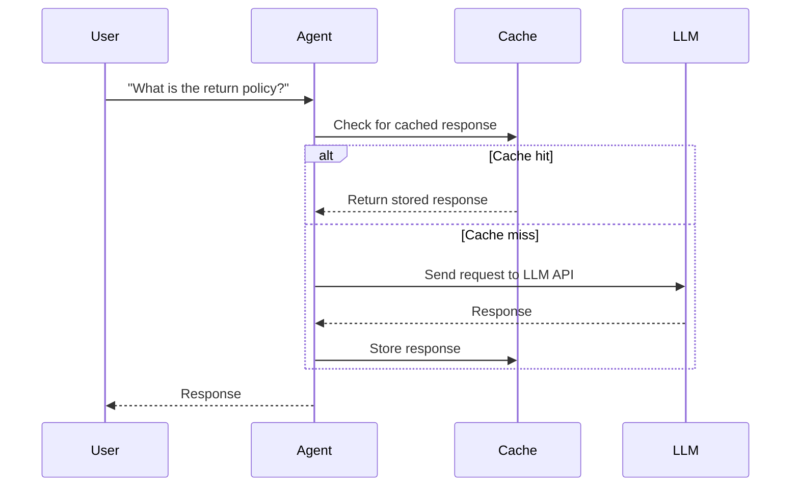
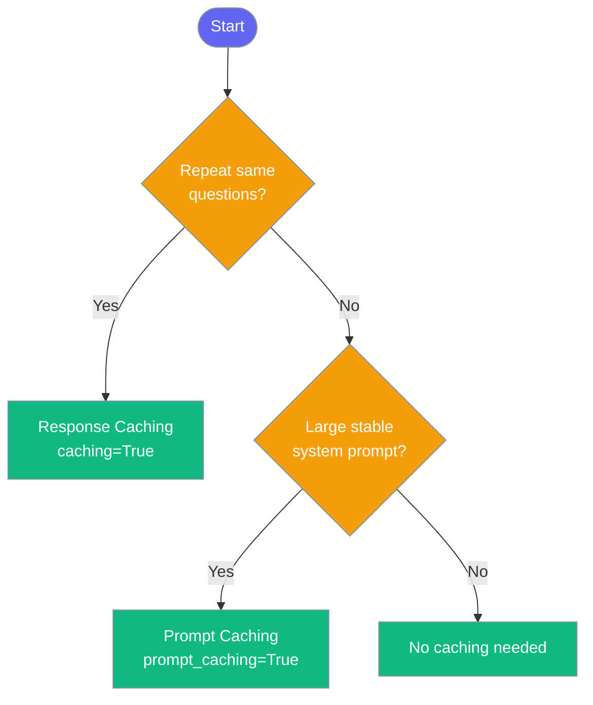

Caching stores LLM responses to avoid redundant API calls, cutting costs and speeding up repeat queries.

```python
from praisonaiagents import Agent

agent = Agent(
    name="Assistant",
    instructions="Answer customer support questions.",
    caching=True,
)

agent.start("What is your return policy?")
```



## Quick Start

<Steps>
<Step title="Simple Usage">
Enable caching with a single parameter — identical requests return instantly from cache.

```python
from praisonaiagents import Agent

agent = Agent(
    instructions="You are a helpful assistant.",
    caching=True,
)

agent.start("Summarise the benefits of caching.")
```
</Step>

<Step title="With Configuration">
Use `CachingConfig` to control response caching and provider-level prompt caching separately.

```python
from praisonaiagents import Agent, CachingConfig

agent = Agent(
    name="Researcher",
    instructions="Answer research questions using memory.",
    llm="anthropic/claude-3-5-sonnet",
    caching=CachingConfig(
        enabled=True,
        prompt_caching=True,
    ),
)

agent.start("What are the cost savings from prompt caching?")
```
</Step>
</Steps>

---

## How It Works



| Phase | What happens |
|---|---|
| 1. Request received | Agent checks the cache using the request as key |
| 2. Cache hit | Stored response returned instantly — no API cost |
| 3. Cache miss | LLM processes the request, result stored for next time |
| 4. Prompt caching | Provider caches stable prefix (system prompt, tools) across turns |

---

## Choosing Your Caching Level



---

## Configuration Options

<Card icon="code" href="/docs/sdk/reference/python/CachingConfig">
  Full list of options, types, and defaults — `CachingConfig`
</Card>

| Option | Type | Default | Description |
|---|---|---|---|
| `enabled` | `bool` | `True` | Enable or disable response caching |
| `prompt_caching` | `bool \| None` | `None` | Enable provider-level prompt caching (Anthropic, Google) |

---

## Common Patterns

### Pattern 1 — FAQ Bot with response caching

Identical user questions are answered from cache, saving API calls.

```python
from praisonaiagents import Agent

agent = Agent(
    name="FAQ Bot",
    instructions="Answer frequently asked questions about our product.",
    caching=True,
)

response1 = agent.start("What are your business hours?")
response2 = agent.start("What are your business hours?")  # cache hit
```

### Pattern 2 — Research agent with prompt caching

Large system prompts and tool definitions are cached at the provider level, reducing token costs on every turn.

```python
from praisonaiagents import Agent, CachingConfig

agent = Agent(
    name="Research Assistant",
    instructions="You are an expert research assistant with access to a large knowledge base.",
    llm="anthropic/claude-3-5-sonnet",
    memory=True,
    caching=CachingConfig(
        enabled=True,
        prompt_caching=True,
    ),
)

agent.start("Summarise last month's findings on climate data.")
agent.start("What trends stand out?")  # stable prefix cached
```

### Pattern 3 — Disable caching for real-time data

Turn off caching when responses must always be fresh.

```python
from praisonaiagents import Agent, CachingConfig

agent = Agent(
    name="Live Prices",
    instructions="Report real-time stock prices.",
    caching=CachingConfig(enabled=False),
)

agent.start("What is the current price of AAPL?")
```

---

## Best Practices

<AccordionGroup>
<Accordion title="Enable caching for predictable queries">
Caching delivers the most value when users ask similar questions repeatedly — support bots, FAQ systems, and document Q&A are ideal candidates. Start with `caching=True` and measure cache-hit rates before adding configuration.
</Accordion>

<Accordion title="Use prompt caching for large system prompts">
If your `instructions` string is long (policies, personas, tool lists), setting `prompt_caching=True` caches the stable prefix at the provider level. This reduces per-turn token cost significantly on Anthropic and Google models.
</Accordion>

<Accordion title="Disable caching for real-time or personalised responses">
Pricing feeds, live dashboards, and highly personalised answers change on every request. Set `CachingConfig(enabled=False)` to bypass the cache entirely and always call the LLM.
</Accordion>

<Accordion title="Combine with memory for cross-session savings">
Pairing `caching=True` with `memory=True` lets the agent recall past sessions while still serving cached responses for repeated questions — fewer API calls and consistent answers.
</Accordion>
</AccordionGroup>

---

## Related

<CardGroup cols={2}>
  <Card icon="database" href="/docs/features/prompt-caching">
    Prompt Caching — provider-level caching for stable context
  </Card>
  <Card icon="database" href="/docs/features/prompt-cache-optimization">
    Prompt Cache Optimization — tips to maximise cache hit rates
  </Card>
</CardGroup>
