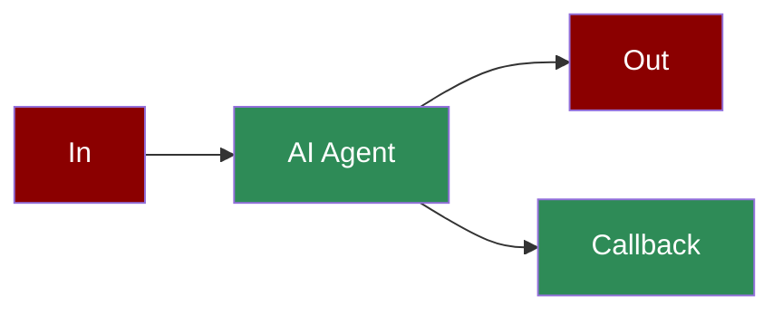
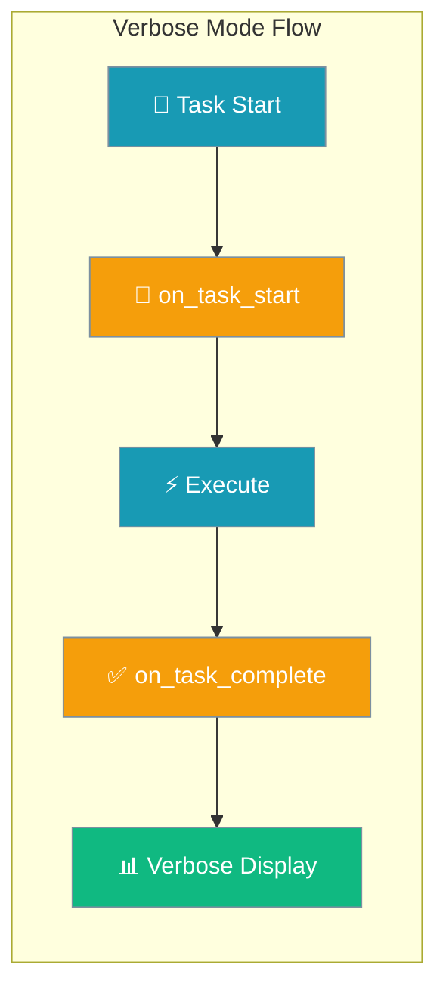

Learn how to implement callbacks to monitor and log AI agent interactions, errors, and task completions.

## Quick Start

<Tabs>
  <Tab title="Code">
    <Steps>
        <Step title="Install Package">
            First, install the PraisonAI Agents package:
            ```bash
            pip install praisonaiagents
            ```
        </Step>

        <Step title="Set API Key">
            Set your OpenAI API key as an environment variable in your terminal:
            ```bash
            export OPENAI_API_KEY=your_api_key_here
            ```
        </Step>

        <Step title="Create a file">
            Create a new file `app.py` with the basic setup:
            ```python
            from praisonaiagents import (
                register_display_callback,
                Agent, 
                Task, 
                Agents
            )

            def simple_callback(message=None, response=None, **kwargs):
                print(f"Received message: {message}")
                print(f"Got response: {response}")
            
            # Register as synchronous callback
            register_display_callback('interaction', simple_callback, is_async=False)

            # For async callbacks
            async def async_simple_callback(message=None, response=None, **kwargs):
                await asyncio.sleep(0)  # Non-blocking pause
                print(f"Received message: {message}")
                print(f"Got response: {response}")
            
            # Register as async callback
            register_display_callback('interaction', async_simple_callback, is_async=True)

            # Create an agent
            agent = Agent(
                name="MyAgent",
                role="Assistant",
                goal="Help with tasks",
                backstory="I am a helpful assistant"
            )

            # Create a task
            task = Task(
                name="simple_task",
                description="Say hello",
                agent=agent,
                expected_output="A greeting"
            )

            # Run the agent
            agents = AgentTeam(
                agents=[agent],
                tasks=[task]
            )
            agents.start()
            ```
        </Step>

        <Step title="Start Agents">
            Type this in your terminal to run your agents:
            ```bash
            python app.py
            ```
        </Step>
    </Steps>
  </Tab>
  <Tab title="No Code">
    <Steps>
        <Step title="Install Package">
            Install the PraisonAI package:
            ```bash
            pip install praisonai
            ```
        </Step>
        <Step title="Set API Key">
            Set your OpenAI API key as an environment variable in your terminal:
            ```bash
            export OPENAI_API_KEY=your_api_key_here
            ```
        </Step>
        <Step title="Create a file">
            Create a new file `agents.yaml` with the basic setup:
```yaml
framework: praisonai
process: sequential
topic: demonstrate basic callbacks
agents:  # Canonical: use 'agents' instead of 'roles'
  assistant:
    instructions:  # Canonical: use 'instructions' instead of 'backstory' I am a helpful assistant focused on demonstrating callback functionality
    goal: Help demonstrate callback functionality
    role: Assistant
    tasks:
      simple_task:
        description: Say hello and demonstrate basic callbacks
        expected_output: A greeting with callback logs
    tools:
    - basic_tool
callbacks:
  interaction:
    type: sync
    enabled: true
    log_file: interactions.log
```
        </Step>
        <Step title="Start Agents">
            Type this in your terminal to run your agents:
```bash
praisonai agents.yaml
```
        </Step>
    </Steps>
  </Tab>
</Tabs>

<Note>
  **Requirements**
  - Python 3.10 or higher
  - OpenAI API key. Generate OpenAI API key [here](https://platform.openai.com/api-keys). Use Other models using [this guide](/models).   
  - Basic understanding of Python functions
</Note>

## Understanding Callbacks

<Card title="What are Callbacks?" icon="question">
  Callbacks are functions that get called automatically when specific events occur in your AI agents:
  - Interactions between user and agent
  - Error messages
  - Tool calls
  - Self-reflection moments
  - Task completion
  - Generation progress
</Card>

## Features

<CardGroup cols={2}>
  <Card title="Interaction Callback" icon="comments">
    Triggered when the agent interacts with users
  </Card>
  <Card title="Error Callback" icon="triangle-exclamation">
    Called when errors occur
  </Card>
  <Card title="Tool Call Callback" icon="wrench">
    Activated when tools are used
  </Card>
  <Card title="LLM Start Callback" icon="brain">
    Triggered when AI model call begins (thinking/responding)
  </Card>
  <Card title="Self Reflection Callback" icon="rotate">
    Triggered during agent self-reflection
  </Card>
  <Card title="Instruction Callback" icon="list-check">
    Called when instructions are processed
  </Card>
  <Card title="Generating Callback" icon="spinner">
    Activated during content generation
  </Card>
</CardGroup>

## Basic Implementation

### 1. Simple Logging Callback

<Tabs>
  <Tab title="Code">
    <CodeGroup>
    ```python Basic
    import logging

    # Setup logging
    logging.basicConfig(level=logging.INFO)

    def log_callback(message=None, **kwargs):
        logging.info(f"Agent message: {message}")

    # Register synchronous callback
    register_display_callback('interaction', log_callback, is_async=False)

    # Register asynchronous callback
    async def async_log_callback(message=None, **kwargs):
        await asyncio.sleep(0)
        logging.info(f"Agent message: {message}")

    # Register as async callback
    register_display_callback('interaction', async_log_callback, is_async=True)
    ```

    ```python Advanced
    import logging
    from datetime import datetime

    # Setup logging with file output
    logging.basicConfig(
        filename='ai_interactions.log',
        level=logging.INFO,
        format='%(asctime)s - %(levelname)s - %(message)s'
    )

    def detailed_callback(message=None, response=None, **kwargs):
        logging.info(f"""
        Time: {datetime.now()}
        Message: {message}
        Response: {response}
        Additional Info: {kwargs}
        """)

    register_display_callback('interaction', detailed_callback)
    ```
    </CodeGroup>
  </Tab>
  <Tab title="No Code">
```yaml
framework: praisonai
process: sequential
topic: demonstrate logging callbacks
agents:  # Canonical: use 'agents' instead of 'roles'
  logger:
    instructions:  # Canonical: use 'instructions' instead of 'backstory' Expert in logging and monitoring system interactions
    goal: Demonstrate comprehensive logging capabilities
    role: Logging Specialist
    tasks:
      logging_task:
        description: Perform actions that trigger various log events
        expected_output: Comprehensive log entries for different events
    tools:
    - logging_tool
callbacks:
  logging:
    type: sync
    enabled: true
    log_file: ai_interactions.log
    format: "%(asctime)s - %(levelname)s - %(message)s"
    level: INFO
    handlers:
      - type: file
        filename: ai_interactions.log
      - type: console
    events:
      - interaction
      - error
      - tool_call
```
  </Tab>
</Tabs>

### 2. Multiple Callback Types

<Tabs>
  <Tab title="Code">
    ```python
    # Error callback
    def error_callback(message=None):
        logging.error(f"Error occurred: {message}")

    # Tool call callback
    def tool_callback(message=None):
        logging.info(f"Tool called: {message}")

    # Register multiple callbacks
    register_display_callback('error', error_callback)
    register_display_callback('tool_call', tool_callback)
    ```
  </Tab>
  <Tab title="No Code">
```yaml
framework: praisonai
process: sequential
topic: demonstrate multiple callback types
agents:  # Canonical: use 'agents' instead of 'roles'
  multi_agent:
    instructions:  # Canonical: use 'instructions' instead of 'backstory' Specialized in demonstrating various callback functionalities
    goal: Show different types of callbacks in action
    role: Callback Specialist
    tasks:
      multi_callback_task:
        description: Trigger different types of callbacks
        expected_output: Logs showing various callback types in action
    tools:
    - error_tool
    - callback_tool
callbacks:
  error:
    type: sync
    enabled: true
    log_file: ai_interactions.log
    level: ERROR
  tool_call:
    type: sync
    enabled: true
    log_file: ai_interactions.log
    level: INFO
```
  </Tab>
</Tabs>

## Complete Example

Here's a full implementation showing all callback types and proper logging:

<Tabs>
  <Tab title="Code">
    ```python
    from praisonaiagents import Agent, Task, AgentTeam, register_display_callback
    import logging
    from datetime import datetime

    # Setup logging
    logging.basicConfig(
        filename='ai_interactions.log',
        level=logging.INFO,
        format='%(asctime)s - %(name)s - %(levelname)s - %(message)s'
    )

    # Interaction callback
    def interaction_callback(message=None, response=None, markdown=None, generation_time=None):
        logging.info(f"""
        === INTERACTION ===
        Time: {datetime.now()}
        Generation Time: {generation_time}s
        Message: {message}
        Response: {response}
        Markdown: {markdown}
        """)

    # Error callback
    def error_callback(message=None):
        logging.error(f"""
        === ERROR ===
        Time: {datetime.now()}
        Message: {message}
        """)

    # Tool call callback
    def tool_call_callback(message=None):
        logging.info(f"""
        === TOOL CALL ===
        Time: {datetime.now()}
        Message: {message}
        """)

    # Register callbacks
    register_display_callback('interaction', interaction_callback)
    register_display_callback('error', error_callback)
    register_display_callback('tool_call', tool_call_callback)

    agent = Agent(
        name="CallbackAgent",
        role="Assistant",
        goal="Demonstrate callbacks",
        backstory="I am a helpful assistant",
        
    )

    task = Task(
        name="callback_task",
        description="Show how callbacks work",
        agent=agent,
        expected_output="Demonstration complete"
    )

    agents = AgentTeam(
        agents=[agent],
        tasks=[task],
        
    )

    agents.start()
    ```
  </Tab>
  <Tab title="No Code">
```yaml
framework: praisonai
process: sequential
topic: demonstrate complete callback system
agents:  # Canonical: use 'agents' instead of 'roles'
  callback_agent:
    instructions:  # Canonical: use 'instructions' instead of 'backstory' Expert in comprehensive callback implementation
    goal: Demonstrate a complete callback system
    role: Callback Expert
    tasks:
      callback_demo:
        description: Show how callbacks work in a complete system
        expected_output: Demonstration of all callback types
    tools:
    - callback_tool
callbacks:
  interaction:
    type: sync
    enabled: true
    log_file: ai_interactions.log
    format: "%(asctime)s - %(name)s - %(levelname)s - %(message)s"
    level: INFO
  error:
    type: sync
    enabled: true
    log_file: ai_interactions.log
    level: ERROR
  tool_call:
    type: sync
    enabled: true
    log_file: ai_interactions.log
    level: INFO
```
  </Tab>
</Tabs>

## Advanced Examples

- All callback types
- Comprehensive logging
- Task callbacks
- Tool integration
- Multiple agents

<Tabs>
  <Tab title="Code">
    ```python
    from praisonaiagents import Agent, Task, AgentTeam, error_logs, register_display_callback
    from duckduckgo_search import DDGS
    from rich.console import Console
    import json
    from datetime import datetime
    import logging

    # Setup logging
    logging.basicConfig(
        filename='ai_interactions.log',
        level=logging.INFO,
        format='%(asctime)s - %(name)s - %(levelname)s - %(message)s'
    )

    # Callback functions for different display types
    def interaction_callback(message=None, response=None, markdown=None, generation_time=None):
        """Callback for display_interaction"""
        logging.info(f"""
        === INTERACTION ===
        Time: {datetime.now()}
        Generation Time: {generation_time}s
        Message: {message}
        Response: {response}
        Markdown: {markdown}
        """)

    def error_callback(message=None):
        """Callback for display_error"""
        logging.error(f"""
        === ERROR ===
        Time: {datetime.now()}
        Message: {message}
        """)

    def tool_call_callback(message=None):
        """Callback for display_tool_call"""
        logging.info(f"""
        === TOOL CALL ===
        Time: {datetime.now()}
        Message: {message}
        """)

    def instruction_callback(message=None):
        """Callback for display_instruction"""
        logging.info(f"""
        === INSTRUCTION ===
        Time: {datetime.now()}
        Message: {message}
        """)

    def self_reflection_callback(message=None):
        """Callback for display_self_reflection"""
        logging.info(f"""
        === SELF REFLECTION ===
        Time: {datetime.now()}
        Message: {message}
        """)

    def generating_callback(content=None, elapsed_time=None):
        """Callback for display_generating"""
        logging.info(f"""
        === GENERATING ===
        Time: {datetime.now()}
        Content: {content}
        Elapsed Time: {elapsed_time}
        """)

    # Register all callbacks
    register_display_callback('interaction', interaction_callback)
    register_display_callback('error', error_callback)
    register_display_callback('tool_call', tool_call_callback)
    register_display_callback('instruction', instruction_callback)
    register_display_callback('self_reflection', self_reflection_callback)
    # register_display_callback('generating', generating_callback)

    def task_callback(output):
        """Callback for task completion - called when task finishes"""
        logging.info(f"""
        === TASK COMPLETED ===
        Time: {datetime.now()}
        Description: {output.description}
        Agent: {output.agent}
        Output: {output.raw[:200]}...
        """)
    
    # Note: Use on_task_complete parameter (callback is deprecated)

    def internet_search_tool(query) -> list:
        """
        Perform a search using DuckDuckGo.

        Args:
            query (str): The search query.

        Returns:
            list: A list of search result titles and URLs.
        """
        try:
            results = []
            ddgs = DDGS()
            for result in ddgs.text(keywords=query, max_results=10):
                results.append({
                    "title": result.get("title", ""),
                    "url": result.get("href", ""),
                    "snippet": result.get("body", "")
                })
            return results

        except Exception as e:
            print(f"Error during DuckDuckGo search: {e}")
            return []

    def main():
        # Create agents
        researcher = Agent(
            name="Researcher",
            role="Senior Research Analyst",
            goal="Uncover cutting-edge developments in AI and data science",
            backstory="""You are an expert at a technology research group, 
            skilled in identifying trends and analyzing complex data.""",
            tools=[internet_search_tool],
            llm="gpt-4o",
            reflection=True
        )
        
        writer = Agent(
            name="Writer",
            role="Tech Content Strategist",
            goal="Craft compelling content on tech advancements",
            backstory="""You are a content strategist known for 
            making complex tech topics interesting and easy to understand.""",
            llm="gpt-4o",
            tools=[]
        )

        # Create tasks with on_task_complete callbacks
        task1 = Task(
            name="research_task",
            description="""Analyze 2024's AI advancements. 
            Find major trends, new technologies, and their effects.""",
            expected_output="""A detailed report on 2024 AI advancements""",
            agent=researcher,
            tools=[internet_search_tool],
            on_task_complete=task_callback
        )

        task2 = Task(
            name="writing_task",
            description="""Create a blog post about major AI advancements using the insights you have.
            Make it interesting, clear, and suited for tech enthusiasts. 
            It should be at least 4 paragraphs long.""",
            expected_output="A blog post of at least 4 paragraphs",
            agent=writer,
            context=[task1],
            on_task_complete=task_callback,
            tools=[]
        )

        task3 = Task(
            name="json_task",
            description="""Create a json object with a title of "My Task" and content of "My content".""",
            expected_output="""JSON output with title and content""",
            agent=researcher,
            on_task_complete=task_callback
        )

        task4 = Task(
            name="save_output_task",
            description="""Save the AI blog post to a file""",
            expected_output="""File saved successfully""",
            agent=writer,
            context=[task2],
            output_file='test.txt',
            create_directory=True,
            on_task_complete=task_callback
        )

        # Create and run agents manager
        agents = AgentTeam(
            agents=[researcher, writer],
            tasks=[task1, task2, task3, task4],
            process="sequential",
            manager_llm="gpt-4o"
        )

        agents.start()

    if __name__ == "__main__":
        main()
    ```
  </Tab>
  <Tab title="No Code">
```yaml
framework: praisonai
process: sequential
topic: demonstrate advanced callback features
agents:  # Canonical: use 'agents' instead of 'roles'
  researcher:
    instructions:  # Canonical: use 'instructions' instead of 'backstory' Expert at a technology research group specializing in AI trends
    goal: Uncover cutting-edge developments in AI and data science
    role: Senior Research Analyst
    tasks:
      research_task:
        description: Analyze 2024's AI advancements
        expected_output: A detailed report on 2024 AI advancements
    tools:
    - internet_search_tool
  writer:
    instructions:  # Canonical: use 'instructions' instead of 'backstory' Content strategist skilled in technical communication
    goal: Craft compelling content on tech advancements
    role: Tech Content Strategist
    tasks:
      writing_task:
        description: Create a blog post about major AI advancements
        expected_output: A blog post of at least 4 paragraphs
      save_output_task:
        description: Save the AI blog post to a file
        expected_output: File saved successfully
    tools:
    - file_tool
callbacks:
  interaction:
    type: sync
    enabled: true
    log_file: advanced_interactions.log
  error:
    type: sync
    enabled: true
    log_file: advanced_errors.log
  tool_call:
    type: sync
    enabled: true
    log_file: advanced_tools.log
  instruction:
    type: sync
    enabled: true
    log_file: advanced_instructions.log
  self_reflection:
    type: sync
    enabled: true
    log_file: advanced_reflections.log
  generating:
    type: sync
    enabled: true
    log_file: advanced_generating.log
```
  </Tab>
</Tabs>

## Async Callbacks

Async callbacks allow you to handle events asynchronously, which is particularly useful for long-running operations or when dealing with multiple agents simultaneously.

### Basic Async Callback Implementation

<Tabs>
  <Tab title="Code">
    ```python
    import asyncio
    from praisonaiagents import register_display_callback

    async def async_interaction_callback(message=None, response=None, **kwargs):
        """Async callback for handling interactions"""
        await asyncio.sleep(0)  # Non-blocking pause
        print(f"Async processing - Message: {message}")
        print(f"Response: {response}")

    # Register the async callback
    register_display_callback('interaction', async_interaction_callback)
    ```

Async callbacks are safe to use from inside a running event loop (e.g. FastAPI handlers, Jupyter); the SDK detects the running loop and schedules the coroutine without calling `asyncio.run()`.
  </Tab>
  <Tab title="No Code">
```yaml
framework: praisonai
process: sequential
topic: demonstrate basic async callbacks
agents:  # Canonical: use 'agents' instead of 'roles'
  async_handler:
    instructions:  # Canonical: use 'instructions' instead of 'backstory' Specialized in asynchronous operations and callbacks
    goal: Demonstrate basic async callback functionality
    role: Async Specialist
    tasks:
      async_demo:
        description: Show basic async callback functionality
        expected_output: Demonstration of async callbacks
    tools:
    - async_tool
callbacks:
  interaction:
    type: async
    enabled: true
    log_file: async_interactions.log
    format: "%(asctime)s - %(levelname)s - %(message)s"
    level: INFO
    non_blocking: true
```
  </Tab>
</Tabs>

### Complete Async Example

<Tabs>
  <Tab title="Code">
    ```python
    import asyncio
    from praisonaiagents import Agent, Task, AgentTeam, register_display_callback
    import logging
    from datetime import datetime

    # Setup async logging
    async def setup_async_logging():
        logging.basicConfig(
            filename='async_ai_interactions.log',
            level=logging.INFO,
            format='%(asctime)s - %(name)s - %(levelname)s - %(message)s'
        )

    # Async callbacks
    async def async_interaction_callback(message=None, response=None, markdown=None, generation_time=None):
        await asyncio.sleep(0)
        logging.info(f"""
        === ASYNC INTERACTION ===
        Time: {datetime.now()}
        Generation Time: {generation_time}s
        Message: {message}
        Response: {response}
        """)

    async def async_error_callback(message=None):
        await asyncio.sleep(0)
        logging.error(f"""
        === ASYNC ERROR ===
        Time: {datetime.now()}
        Message: {message}
        """)

    # Register async callbacks
    register_display_callback('interaction', async_interaction_callback, is_async=True)
    register_display_callback('error', async_error_callback, is_async=True)

    # Create async task callback
    async def async_task_callback(output):
        await asyncio.sleep(0)
        logging.info(f"""
        === ASYNC TASK COMPLETED ===
        Time: {datetime.now()}
        Description: {output.description}
        Agent: {output.agent}
        Output: {output.raw[:200]}...
        """)

    async def main():
        await setup_async_logging()
        
        # Create agent with async capabilities
        agent = Agent(
            name="AsyncAgent",
            role="Assistant",
            goal="Demonstrate async callbacks",
            backstory="I am an async-capable assistant"
        )

        # Create task with async callback
        task = Task(
            name="async_task",
            description="Demonstrate async callbacks",
            agent=agent,
            expected_output="Async demonstration complete",
            callback=async_task_callback
        )

        # Create and run agents with async support
        agents = AgentTeam(
            agents=[agent],
            tasks=[task]
        )

        await agents.start_async()

    if __name__ == "__main__":
        asyncio.run(main())
    ```
  </Tab>
  <Tab title="No Code">
```yaml
framework: praisonai
process: sequential
topic: demonstrate complete async system
agents:  # Canonical: use 'agents' instead of 'roles'
  async_agent:
    instructions:  # Canonical: use 'instructions' instead of 'backstory' Expert in asynchronous operations and comprehensive logging
    goal: Demonstrate complete async callback system
    role: Async Expert
    tasks:
      async_task:
        description: Demonstrate comprehensive async callbacks
        expected_output: Complete async callback demonstration
    tools:
    - async_tool
callbacks:
  interaction:
    type: async
    enabled: true
    log_file: async_interactions.log
    format: "%(asctime)s - %(name)s - %(levelname)s - %(message)s"
    level: INFO
    non_blocking: true
  error:
    type: async
    enabled: true
    log_file: async_errors.log
    level: ERROR
    non_blocking: true
  task:
    type: async
    enabled: true
    log_file: async_tasks.log
    level: INFO
    non_blocking: true
```
  </Tab>
</Tabs>

## Async Display Functions

PraisonAI Agents provides several async versions of display functions, prefixed with 'a'. Here's the complete list:

<CardGroup cols={2}>
  <Card title="adisplay_instruction" icon="list-check">
    ```python
    async def adisplay_instruction(
        message: str, 
        console=None
    )
    ```
    Async version for showing instructions.
  </Card>

  <Card title="adisplay_tool_call" icon="wrench">
    ```python
    async def adisplay_tool_call(
        message: str, 
        console=None
    )
    ```
    Async version for displaying tool calls.
  </Card>

  <Card title="adisplay_error" icon="triangle-exclamation">
    ```python
    async def adisplay_error(
        message: str, 
        console=None
    )
    ```
    Async version for error messages.
  </Card>

  <Card title="adisplay_generating" icon="spinner">
    ```python
    async def adisplay_generating(
        content: str = "", 
        start_time: Optional[float] = None
    )
    ```
    Async version for showing generation progress.
  </Card>
</CardGroup>

#### Example Usage

```python
import asyncio
from praisonaiagents import (
    adisplay_interaction,
    adisplay_error,
    adisplay_tool_call
)

async def main():
    # Display an interaction
    await adisplay_interaction(
        message="What's the weather?",
        response="Let me check that for you.",
        generation_time=0.5
    )

    # Display a tool call
    await adisplay_tool_call(
        "Calling weather API for location data..."
    )

    # Handle an error
    try:
        raise Exception("API connection failed")
    except Exception as e:
        await adisplay_error(str(e))

if __name__ == "__main__":
    asyncio.run(main())
```

## Verbose Mode and Process Orchestration

Verbose UI is now driven by composing `on_task_start` and `on_task_complete` callbacks, ensuring workflow processes work correctly with `verbose=True`:

### How It Works



### Integration with Process Orchestration

Previously, verbose mode bypassed workflow and hierarchical processes. Now the execution goes through `run_all_tasks()` so `process="workflow"` and `process="hierarchical"` work correctly with verbose display:

```python
# ── Multi-agent verbose mode: callbacks composed at PraisonAIAgents level ──
from praisonaiagents import Agent, Task, PraisonAIAgents, MultiAgentHooksConfig

def on_task_start(task, task_id):
    print(f"[{task_id}] Starting: {task.description}")

def on_task_complete(task, task_output):
    print(f"Completed: {task.description}")
    print(f"Output: {task_output.raw[:100]}...")

agent = Agent(name="Workflow Agent", instructions="Execute tasks in workflow")

task1 = Task(description="First task", agent=agent)
task2 = Task(description="Second task", agent=agent, context=[task1])

agents = PraisonAIAgents(
    agents=[agent],
    tasks=[task1, task2],
    process="workflow",
    hooks=MultiAgentHooksConfig(
        on_task_start=on_task_start,
        on_task_complete=on_task_complete,
    ),
    verbose=True,  # composes user callbacks with verbose UI callbacks
)
agents.start()
```

```python
# ── Task-level on_task_complete: still receives a single TaskOutput ──
def on_complete(task_output):
    print(f"Task done: {task_output.raw}")

task = Task(
    description="Important task",
    agent=agent,
    on_task_complete=on_complete,  # Task-level: 1 arg (task_output)
)
```

### Callback Composition

The composition happens at the `PraisonAIAgents` / `AgentTeam` level when user hooks are supplied via `MultiAgentHooksConfig` with `verbose=True`:

- **User hooks** execute first with correct signatures: `(task, task_id)` and `(task, task_output)`
- **Verbose callbacks** execute second for UI display
- Errors in either user or verbose callback are logged at debug level and do not interrupt the task
- This callback signature mismatch was fixed in PR #1740 for proper verbose mode composition

```python
def user_on_task_complete(task, task_output):
    # User's custom logic - note the 2-argument signature for multi-agent level
    save_to_database(task_output)
    send_notification(task.description)

# Both user callback and verbose display will run
agents = PraisonAIAgents(
    agents=[agent],
    tasks=[task],
    hooks=MultiAgentHooksConfig(
        on_task_complete=user_on_task_complete,  # Multi-agent level: 2 args
    ),
    verbose=True  # Composes user hooks with verbose display
)
```

### Process Types Support

Verbose mode now supports all process orchestration types:

| Process Type | Verbose Support | Behavior |
|--------------|-----------------|----------|
| `sequential` | ✅ | Shows tasks executing in order |
| `workflow` | ✅ | Shows dependency-based execution |
| `hierarchical` | ✅ | Shows manager-agent interactions |

```python
# All process types work with verbose display
configs = [
    {"process": "sequential", "description": "One after another"},
    {"process": "workflow", "description": "Dependency-based"},
    {"process": "hierarchical", "description": "Manager-coordinated"}
]

for config in configs:
    agents = PraisonAIAgents(
        agents=[agent],
        tasks=tasks,
        process=config["process"],
        verbose=True  # Works with all process types
    )
    print(f"Running {config['description']} process...")
    agents.start()
```

### Troubleshooting: TypeError with Hook Signatures

<Note>
**Error: `TypeError: ... takes N positional arguments but M were given`**

If you see this when calling `PraisonAIAgents.start()` with `verbose=True` and a custom `on_task_start` / `on_task_complete` hook, your hook signature does not match the multi-agent contract. Use:

- `on_task_start(task, task_id)`
- `on_task_complete(task, task_output)`

Per-`Task` callbacks (set on the `Task(...)` constructor) keep their original 1-argument signature: `on_task_complete(task_output)`.
</Note>

## Best Practices

<AccordionGroup>
  <Accordion title="Keep callbacks lightweight">
    Avoid blocking I/O or heavy computation in sync handlers — they run on the agent hot path. Offload work to async callbacks or background tasks.
  </Accordion>
  <Accordion title="Use async handlers in event loops">
    Register with `is_async=True` inside FastAPI, Jupyter, or other running loops. The SDK schedules coroutines without nesting `asyncio.run()`.
  </Accordion>
  <Accordion title="Match multi-agent hook signatures">
    `on_task_start(task, task_id)` and `on_task_complete(task, task_output)` at the `PraisonAIAgents` level; single-argument `on_task_complete(task_output)` on individual `Task` objects only.
  </Accordion>
  <Accordion title="Handle errors without breaking runs">
    Wrap callback logic in try/except and log failures. Callback exceptions are swallowed at debug level and must not interrupt agent execution.
  </Accordion>
</AccordionGroup>

## Next Steps

<CardGroup cols={2}>
  <Card title="AutoAgents" icon="robot" href="./autoagents">
    Learn about automatically created and managed AI agents
  </Card>
  <Card title="Mini Agents" icon="microchip" href="./mini">
    Explore lightweight, focused AI agents
  </Card>
</CardGroup>

<Note>
  Remember to handle callbacks efficiently and implement proper error handling to ensure smooth agent operations.
</Note>
