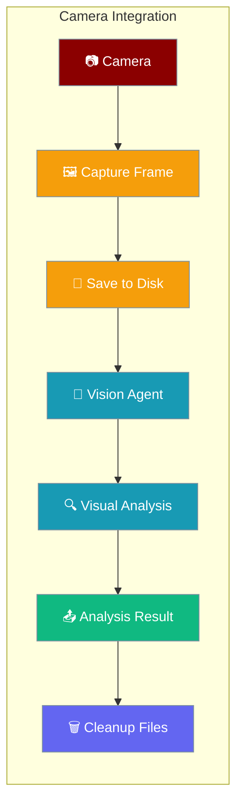
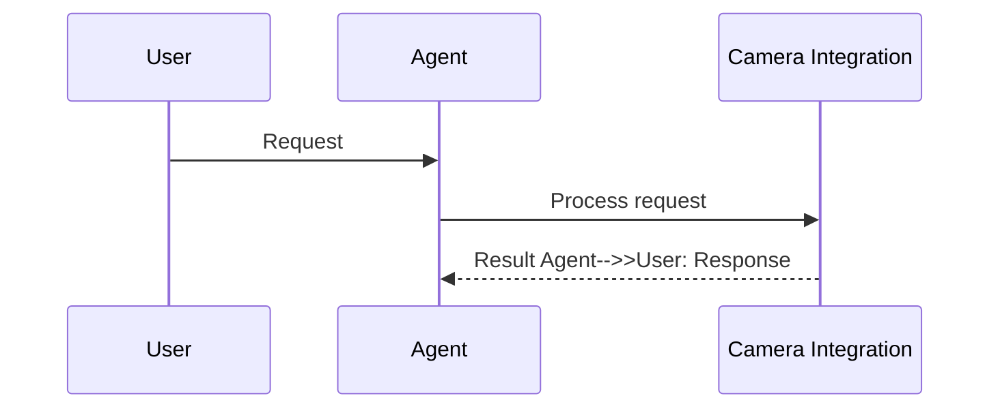

PraisonAI supports camera integration for real-time visual analysis through multimodal agents. While there's no built-in camera capture, you can easily integrate camera feeds by capturing frames or videos and passing them to vision agents.


```python
from praisonaiagents import Agent

agent = Agent(
    name="vision",
    instructions="Analyse images captured from a camera feed.",
)
agent.start("Describe what you see in this frame.")
```

The user captures a camera frame; the vision agent analyses it and returns a description.



## How It Works




## Overview

Camera integration works by:
1. **Capturing frames/videos** from camera using OpenCV
2. **Saving temporarily** to disk
3. **Passing file paths** to agents via the `images` parameter
4. **Cleaning up** temporary files after analysis

## Quick Start

<Steps>
<Step title="Install prerequisites">

```bash
pip install praisonaiagents opencv-python
export OPENAI_API_KEY=$OPENAI_API_KEY
```

</Step>
<Step title="Capture and analyse">

```python
import cv2
from praisonaiagents import Agent, Task, AgentTeam

def capture_and_analyse():
    # Create vision agent
    vision_agent = Agent(
        name="CameraAnalyst",
        role="Camera Feed Analyzer",
        goal="Analyze camera captures in real-time",
        backstory="Expert in real-time visual analysis",
        llm="gpt-4o-mini"
    )
    
    # Capture from camera
    cap = cv2.VideoCapture(0)  # 0 for default camera
    ret, frame = cap.read()
    
    if ret:
        # Save frame temporarily
        cv2.imwrite("temp_capture.jpg", frame)
        cap.release()
        
        # Create analysis task
        task = Task(
            description="Analyze what you see in this camera feed",
            expected_output="Detailed analysis of camera content",
            agent=vision_agent,
            images=["temp_capture.jpg"]
        )
        
        # Run analysis
        agents = AgentTeam(
            agents=[vision_agent],
            tasks=[task]
        )
        
        return agents.start()

# Run analysis
result = capture_and_analyse()
```

</Step>
</Steps>

## Integration Patterns

### 1. Single Frame Analysis

Perfect for quick snapshots and one-time analysis:

```python
def single_frame_analysis():
    cap = cv2.VideoCapture(0)
    ret, frame = cap.read()
    
    if ret:
        image_path = "snapshot.jpg"
        cv2.imwrite(image_path, frame)
        
        # Analyze with your agent
        # ... (agent setup and task creation)
        
    cap.release()
```

### 2. Continuous Monitoring

Ideal for security systems and real-time monitoring:

```python
def continuous_monitoring(interval=10):
    vision_agent = Agent(
        name="SecurityMonitor",
        role="Security Camera Analyst",
        goal="Monitor for security events",
        backstory="Expert security analyst",
        llm="gpt-4o-mini"
    )
    
    cap = cv2.VideoCapture(0)
    
    while True:
        ret, frame = cap.read()
        if ret:
            timestamp = int(time.time())
            filename = f"capture_{timestamp}.jpg"
            cv2.imwrite(filename, frame)
            
            # Analyze frame
            task = Task(
                description="Monitor for unusual activities",
                agent=vision_agent,
                images=[filename]
            )
            
            agents = AgentTeam(
                agents=[vision_agent],
                tasks=[task]
            )
            
            result = agents.start()
            print(f"Analysis: {result}")
            
        time.sleep(interval)
```

### 3. Multi-Agent Analysis

Use multiple specialized agents for comprehensive analysis:

```python
def multi_agent_camera_analysis():
    # Create specialized agents
    security_agent = Agent(
        name="SecurityExpert",
        role="Security Specialist",
        goal="Identify security threats",
        backstory="Expert in surveillance and threat detection",
        llm="gpt-4o-mini"
    )
    
    object_detector = Agent(
        name="ObjectDetector",
        role="Object Recognition Specialist",
        goal="Identify and catalog objects",
        backstory="Computer vision expert",
        llm="gpt-4o-mini"
    )
    
    scene_analyst = Agent(
        name="SceneAnalyst",
        role="Scene Understanding Expert",
        goal="Provide comprehensive scene analysis",
        backstory="Environmental analysis expert",
        llm="gpt-4o-mini"
    )
    
    # Capture frame
    cap = cv2.VideoCapture(0)
    ret, frame = cap.read()
    cap.release()
    
    if ret:
        cv2.imwrite("analysis_frame.jpg", frame)
        
        # Create specialized tasks
        security_task = Task(
            description="Analyze for security threats",
            agent=security_agent,
            images=["analysis_frame.jpg"],
            async_execution=True
        )
        
        object_task = Task(
            description="Identify all objects in scene",
            agent=object_detector,
            images=["analysis_frame.jpg"],
            async_execution=True
        )
        
        scene_task = Task(
            description="Provide comprehensive scene analysis",
            agent=scene_analyst,
            images=["analysis_frame.jpg"],
            async_execution=True
        )
        
        # Run parallel analysis (async_execution fans the tasks out concurrently)
        agents = AgentTeam(
            agents=[security_agent, object_detector, scene_analyst],
            tasks=[security_task, object_task, scene_task],
            process="workflow"
        )
        
        return agents.start()
```

### 4. Video Recording & Analysis

Analyze temporal events and activities:

```python
def record_and_analyze_video(duration=10):
    cap = cv2.VideoCapture(0)
    
    # Setup video writer
    fps = int(cap.get(cv2.CAP_PROP_FPS)) or 30
    width = int(cap.get(cv2.CAP_PROP_FRAME_WIDTH))
    height = int(cap.get(cv2.CAP_PROP_FRAME_HEIGHT))
    
    fourcc = cv2.VideoWriter_fourcc(*'mp4v')
    out = cv2.VideoWriter('recording.mp4', fourcc, fps, (width, height))
    
    # Record video
    start_time = time.time()
    while (time.time() - start_time) < duration:
        ret, frame = cap.read()
        if ret:
            out.write(frame)
    
    cap.release()
    out.release()
    
    # Analyze video
    video_agent = Agent(
        name="VideoAnalyst",
        role="Video Content Analyzer",
        goal="Analyze video content for activities",
        backstory="Expert in video analysis",
        llm="gpt-4o-mini"
    )
    
    task = Task(
        description="Analyze this video for activities and events",
        agent=video_agent,
        images=["recording.mp4"]  # Video files work too!
    )
    
    agents = AgentTeam(
        agents=[video_agent],
        tasks=[task]
    )
    
    return agents.start()
```

## Supported Input Types

PraisonAI accepts various visual input formats:

- ✅ **Local Images**: `"camera_shot.jpg"`, `"webcam_capture.png"`
- ✅ **Local Videos**: `"security_feed.mp4"`, `"recording.avi"`
- ✅ **Image URLs**: `"https://example.com/live_feed.jpg"`
- ✅ **Multiple Sources**: `["cam1.jpg", "cam2.jpg", "video.mp4"]`

## Configuration Options

### Camera Selection

```python
# Different camera sources
camera_id = 0    # Default camera
camera_id = 1    # External USB camera
camera_id = "rtsp://camera-ip/stream"  # IP camera
```

### Analysis Intervals

```python
# For continuous monitoring
analysis_interval = 5   # Every 5 seconds (high frequency)
analysis_interval = 30  # Every 30 seconds (moderate)
analysis_interval = 300 # Every 5 minutes (low frequency)
```

### Video Recording

```python
# Recording duration
duration = 10    # 10 seconds
duration = 60    # 1 minute
duration = 300   # 5 minutes
```

## Use Cases

### Security Monitoring
- Real-time threat detection
- Unauthorized access alerts
- Suspicious activity identification
- Perimeter monitoring

### Retail Analytics
- Customer behavior analysis
- Inventory monitoring
- Queue management
- Theft prevention

### Industrial Automation
- Quality control inspection
- Safety compliance monitoring
- Equipment status verification
- Process optimization

### Smart Home
- Activity recognition
- Elderly care monitoring
- Pet monitoring
- Energy usage optimization

## Performance and Security

### Performance Optimization

1. **Frame Rate Management**
   ```python
   # Reduce analysis frequency for better performance
   time.sleep(5)  # Analyze every 5 seconds instead of continuously
   ```

2. **Image Size Optimization**
   ```python
   # Resize frames for faster processing
   frame = cv2.resize(frame, (640, 480))
   ```

3. **Parallel Processing**
   ```python
   # Fan tasks out in parallel with async_execution=True inside a workflow
   Task(description="...", agent=agent, async_execution=True)
   process="workflow"
   ```

### Memory Management

1. **Clean Up Temporary Files**
   ```python
   import os
   if os.path.exists(image_path):
       os.remove(image_path)
   ```

2. **Limit Video Duration**
   ```python
   # Keep recordings short to avoid large files
   max_duration = 30  # seconds
   ```

### Security Considerations

1. **Camera Permissions**
   - Ensure application has camera access
   - Handle permission errors gracefully

2. **Privacy Protection**
   - Implement data retention policies
   - Secure transmission of camera data
   - User consent for recording

3. **Access Control**
   - Authenticate camera access
   - Implement role-based permissions

## Troubleshooting

### Camera Not Found

```python
# Check available cameras
for i in range(4):
    cap = cv2.VideoCapture(i)
    if cap.isOpened():
        print(f"Camera {i} is available")
        cap.release()
    else:
        print(f"Camera {i} not available")
```

### Permission Issues

**Linux:**
```bash
# Add user to video group
sudo usermod -a -G video $USER
```

**macOS:**
- Grant camera permissions in System Preferences > Security & Privacy

**Windows:**
- Check camera privacy settings in Windows Settings

### Performance Issues

```python
# Reduce frame size
frame = cv2.resize(frame, (320, 240))

# Lower analysis frequency
time.sleep(10)  # Analyze every 10 seconds

# Use threading for non-blocking capture
import threading
```

## Examples

Complete working examples are available in the repository:

- [`camera-basic.py`](../../examples/python/camera/camera-basic.py) - Basic single frame capture
- [`camera-continuous.py`](../../examples/python/camera/camera-continuous.py) - Continuous monitoring
- [`camera-multi-agent.py`](../../examples/python/camera/camera-multi-agent.py) - Multi-agent analysis
- [`camera-video-analysis.py`](../../examples/python/camera/camera-video-analysis.py) - Video recording & analysis

## Best Practices

<AccordionGroup>
  <Accordion title="Clean Up Temporary Files">
    Always delete temporary image files after analysis using `os.unlink()` or a context manager. Accumulating frames consumes disk space rapidly in continuous monitoring scenarios.
  </Accordion>
  <Accordion title="Resize Frames Before Analysis">
    Resize large frames to 640×480 or smaller before passing to the vision agent. Smaller images reduce API costs and response times with minimal quality loss for most analysis tasks.
  </Accordion>
  <Accordion title="Use Threading for Non-Blocking Capture">
    Run camera capture in a separate thread to avoid blocking the main agent loop, especially for continuous monitoring applications.
  </Accordion>
  <Accordion title="Choose the Right Model">
    Use `gpt-4o-mini` for fast, cost-effective analysis of simple scenes. Switch to `gpt-4o` when detailed description or OCR accuracy is required.
  </Accordion>
</AccordionGroup>

## Related

<CardGroup cols={2}>
  <Card title="Multimodal Agents" icon="image" href="/docs/features/multimodal">
    Core multimodal capabilities for vision agents
  </Card>
  <Card title="Image Generation" icon="wand-magic-sparkles" href="/docs/features/image-generation">
    Generate images with AI agents
  </Card>
</CardGroup>