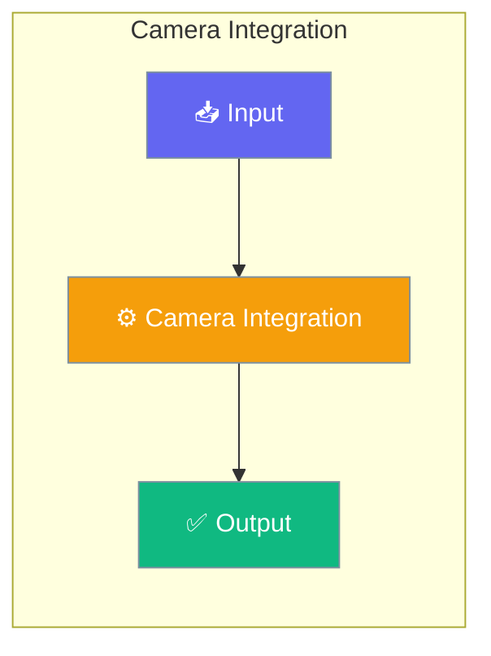

# Camera Integration

PraisonAI supports camera integration for real-time visual analysis through multimodal agents. While there's no built-in camera capture, you can easily integrate camera feeds by capturing frames or videos and passing them to vision agents.




## Overview

Camera integration works by:
1. **Capturing frames/videos** from camera using OpenCV
2. **Saving temporarily** to disk
3. **Passing file paths** to agents via the `images` parameter
4. **Cleaning up** temporary files after analysis

## Quick Start


<Steps>
<Step title="Simple Usage">
### Prerequisites

```bash
pip install praisonaiagents opencv-python
export OPENAI_API_KEY=your_openai_api_key
```
</Step>

<Step title="With Configuration">
### Basic Camera Capture

```python
import cv2
from praisonaiagents import Agent, Task, AgentTeam

def capture_and_analyze():
    # Create vision agent
    vision_agent = Agent(
        name="CameraAnalyst",
        role="Camera Feed Analyzer",
        goal="Analyze camera captures in real-time",
        backstory="Expert in real-time visual analysis",
        llm="gpt-4o-mini"
    )
    
    # Capture from camera
    cap = cv2.VideoCapture(0)  # 0 for default camera
    ret, frame = cap.read()
    
    if ret:
        # Save frame temporarily
        cv2.imwrite("temp_capture.jpg", frame)
        cap.release()
        
        # Create analysis task
        task = Task(
            description="Analyze what you see in this camera feed",
            expected_output="Detailed analysis of camera content",
            agent=vision_agent,
            images=["temp_capture.jpg"]
        )
        
        # Run analysis
        agents = AgentTeam(
            agents=[vision_agent],
            tasks=[task]
        )
        
        return agents.start()

# Run analysis
result = capture_and_analyze()
```
</Step>
</Steps>


## Best Practices

<AccordionGroup>
  <Accordion title="Start simple">
    Enable the feature with a single parameter before adding configuration. Verify it works, then layer in options.
  </Accordion>
  <Accordion title="Use environment variables for secrets">
    Never hardcode API keys or tokens. Use `os.getenv("KEY_NAME")` to read from environment variables.
  </Accordion>
  <Accordion title="Test with minimal examples first">
    Copy the Quick Start example, run it, then extend it. This confirms your environment is set up correctly.
  </Accordion>
  <Accordion title="Check the logs">
    Set `verbose=True` on your agent to see detailed execution logs when debugging unexpected behavior.
  </Accordion>
</AccordionGroup>

## Related

<CardGroup cols={2}>
  <Card title="Features Overview" icon="grid-2" href="/docs/features">
    Browse all PraisonAI features
  </Card>
  <Card title="Quick Start" icon="rocket" href="/docs/introduction">
    Get started with PraisonAI agents
  </Card>
</CardGroup>
