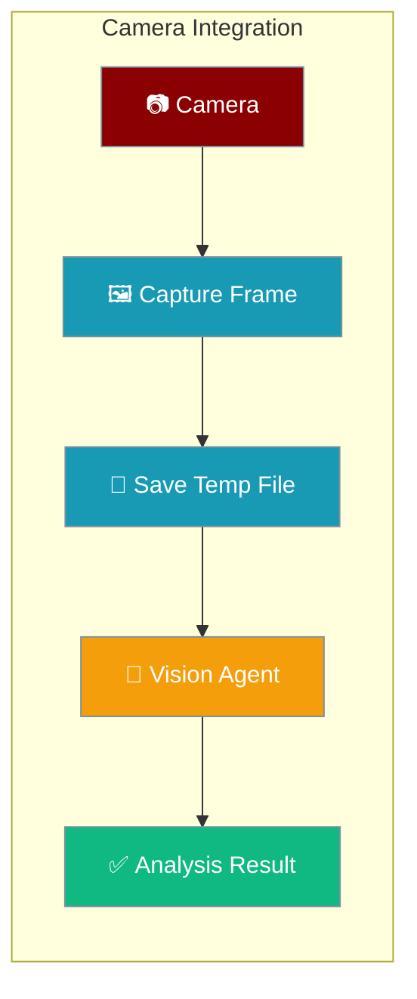
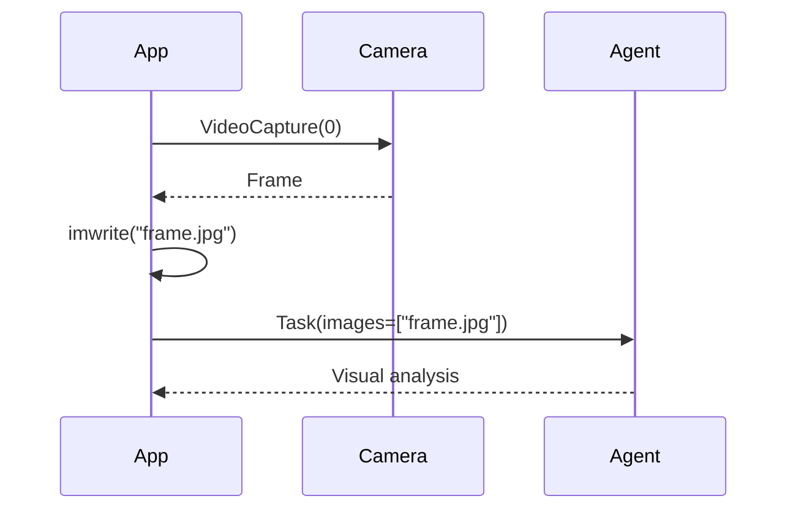

Connect camera feeds to PraisonAI vision agents for real-time visual analysis with just a few lines of code.



## Quick Start

<Steps>
<Step title="Install dependencies">
```bash
pip install praisonaiagents opencv-python
export OPENAI_API_KEY=your_openai_api_key
```
</Step>

<Step title="Capture and analyze a frame">
```python
import cv2
from praisonaiagents import Agent, Task, PraisonAIAgents

vision_agent = Agent(
    name="CameraAnalyst",
    role="Camera Feed Analyzer",
    goal="Analyze camera captures in real-time",
    backstory="Expert in real-time visual analysis",
    llm="gpt-4o-mini"
)

cap = cv2.VideoCapture(0)
ret, frame = cap.read()
cap.release()

if ret:
    cv2.imwrite("temp_capture.jpg", frame)

    task = Task(
        description="Analyze what you see in this camera feed",
        expected_output="Detailed analysis of camera content",
        agent=vision_agent,
        images=["temp_capture.jpg"]
    )

    agents = PraisonAIAgents(agents=[vision_agent], tasks=[task])
    result = agents.start()
    print(result)
```
</Step>
</Steps>

---

## How It Works



---

## Integration Patterns

### Continuous Monitoring

```python
import cv2
import time
from praisonaiagents import Agent, Task, PraisonAIAgents

vision_agent = Agent(
    name="SecurityMonitor",
    role="Security Camera Analyst",
    goal="Monitor for security events",
    backstory="Expert security analyst",
    llm="gpt-4o-mini"
)

cap = cv2.VideoCapture(0)

while True:
    ret, frame = cap.read()
    if ret:
        filename = f"capture_{int(time.time())}.jpg"
        cv2.imwrite(filename, frame)

        task = Task(
            description="Monitor for unusual activities",
            agent=vision_agent,
            images=[filename]
        )

        agents = PraisonAIAgents(agents=[vision_agent], tasks=[task])
        result = agents.start()
        print(f"Analysis: {result}")

    time.sleep(10)
```

### Multi-Agent Analysis

```python
import cv2
from praisonaiagents import Agent, Task, PraisonAIAgents

security_agent = Agent(
    name="SecurityExpert",
    role="Security Specialist",
    goal="Identify security threats",
    backstory="Expert in surveillance and threat detection",
    llm="gpt-4o-mini"
)

object_detector = Agent(
    name="ObjectDetector",
    role="Object Recognition Specialist",
    goal="Identify and catalog objects",
    backstory="Computer vision expert",
    llm="gpt-4o-mini"
)

cap = cv2.VideoCapture(0)
ret, frame = cap.read()
cap.release()

if ret:
    cv2.imwrite("analysis_frame.jpg", frame)

    security_task = Task(
        description="Analyze for security threats",
        agent=security_agent,
        images=["analysis_frame.jpg"]
    )

    object_task = Task(
        description="Identify all objects in scene",
        agent=object_detector,
        images=["analysis_frame.jpg"]
    )

    agents = PraisonAIAgents(
        agents=[security_agent, object_detector],
        tasks=[security_task, object_task],
        process="parallel"
    )

    result = agents.start()
```

---

## Supported Input Types

- Local images: `"camera_shot.jpg"`, `"webcam_capture.png"`
- Local videos: `"security_feed.mp4"`, `"recording.avi"`
- Image URLs: `"https://example.com/live_feed.jpg"`
- Multiple sources: `["cam1.jpg", "cam2.jpg", "video.mp4"]`

---

## Camera Configuration

```python
camera_id = 0
camera_id = 1
camera_id = "rtsp://camera-ip/stream"
```

---

## Best Practices

<AccordionGroup>
<Accordion title="Resize frames before analysis">
Smaller frames process faster and cost fewer tokens. Resize to 640x480 for most use cases.

```python
frame = cv2.resize(frame, (640, 480))
cv2.imwrite("capture.jpg", frame)
```
</Accordion>

<Accordion title="Clean up temporary files">
Delete captured frames after analysis to avoid filling disk space.

```python
import os
if os.path.exists("capture.jpg"):
    os.remove("capture.jpg")
```
</Accordion>

<Accordion title="Throttle analysis frequency">
For continuous monitoring, analyze every 5–30 seconds rather than every frame to reduce API costs.

```python
time.sleep(10)
```
</Accordion>

<Accordion title="Use parallel process for multi-agent analysis">
Run multiple specialized agents in parallel for faster comprehensive analysis.

```python
agents = PraisonAIAgents(
    agents=[security_agent, object_detector],
    tasks=[security_task, object_task],
    process="parallel"
)
```
</Accordion>
</AccordionGroup>

---

## Related

<CardGroup cols={2}>
<Card title="Multimodal Agents" icon="image" href="/features/multimodal">
  Core multimodal agent capabilities
</Card>
<Card title="Image Generation" icon="wand-magic-sparkles" href="/features/image-generation">
  Creating images with AI agents
</Card>
</CardGroup>
