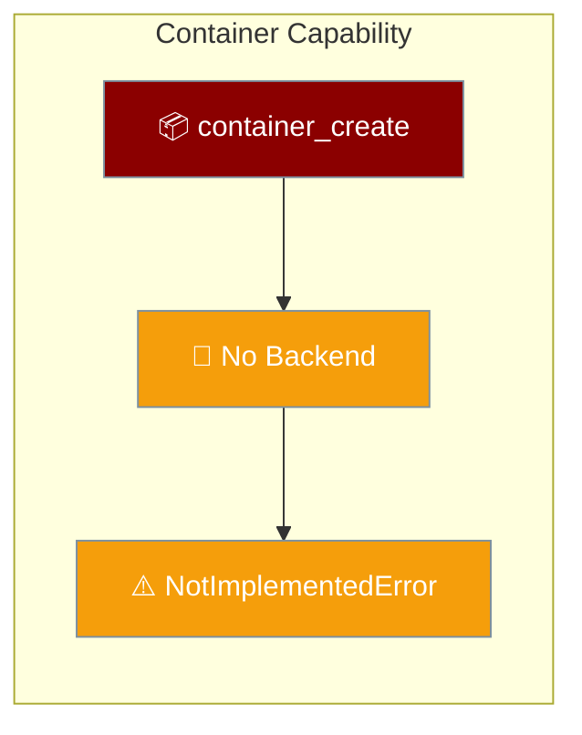
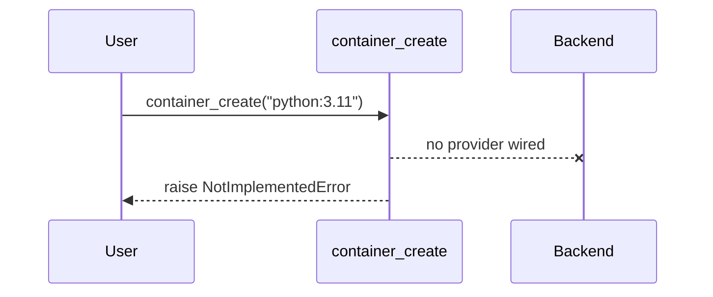

Container capabilities are declared in the API but have **no backend** today, so every call raises `NotImplementedError`.



<Warning>
No provider is wired to container management. `container_create`, `container_file_read`, `container_file_write`, `container_file_list`, and their async `a`-prefixed variants all raise `NotImplementedError`. Do not build on these until a backend lands.
</Warning>

## Quick Start

<Steps>
<Step title="What happens when you call it">
Every container function raises immediately — no container is created.

```python
from praisonai.capabilities import container_create

try:
    result = container_create("python:3.11")
except NotImplementedError as e:
    print(e)
    # container_create has no backend implementation yet. Container
    # management is not wired to a provider, so no container is actually
    # created. Track/implement this before relying on it.
```
</Step>

<Step title="Run code in a container instead">
To actually run code in an isolated container today, use Docker with an agent.

```python
from praisonaiagents import Agent

agent = Agent(
    name="Docker Runner",
    instructions="Run tasks inside a Docker sandbox"
)

agent.start("Summarise the latest AI research")
```

See [Run on Docker](/features/run-on-docker) for the supported path.
</Step>
</Steps>

---

## How It Works



| Function | Behaviour today |
|----------|-----------------|
| `container_create` / `acontainer_create` | Raises `NotImplementedError` |
| `container_file_read` / `acontainer_file_read` | Raises `NotImplementedError` |
| `container_file_write` / `acontainer_file_write` | Raises `NotImplementedError` |
| `container_file_list` / `acontainer_file_list` | Raises `NotImplementedError` |

The CLI and MCP adapters wrap these calls and surface an honest error: the CLI exits non-zero, and MCP returns an error instead of a fake container ID.

---

## Configuration Options

No options apply while there is no backend. The signature is retained for a future provider.

<Card title="Capabilities SDK Reference" icon="code" href="/sdk/reference/praisonai/modules/capabilities">
  Auto-generated reference for the capabilities module
</Card>

---

## Common Patterns

Isolated execution is available through supported paths instead:

- **Docker sandbox** — run agent tasks inside a container with [Run on Docker](/features/run-on-docker).
- **Sandboxed tools** — restrict tool execution with the sandbox configuration.

---

## Best Practices

<AccordionGroup>
<Accordion title="Do not rely on container_create yet">
There is no backend. Calls raise `NotImplementedError` — treat this capability as unavailable until a provider is wired.
</Accordion>

<Accordion title="Handle the error explicitly if you probe for it">
If your code checks for container support at runtime, catch `NotImplementedError` and fall back to a supported path rather than assuming success.
</Accordion>

<Accordion title="Use Docker for real isolation">
For genuine isolated execution today, use the Docker path with an `Agent`. It is supported and tested.
</Accordion>
</AccordionGroup>

---

## Related

<CardGroup cols={2}>
<Card title="Run on Docker" icon="docker" href="/features/run-on-docker">
  Run agents inside a Docker container today
</Card>
<Card title="Capabilities Overview" icon="bolt" href="/capabilities/index">
  All LiteLLM parity capabilities
</Card>
</CardGroup>
