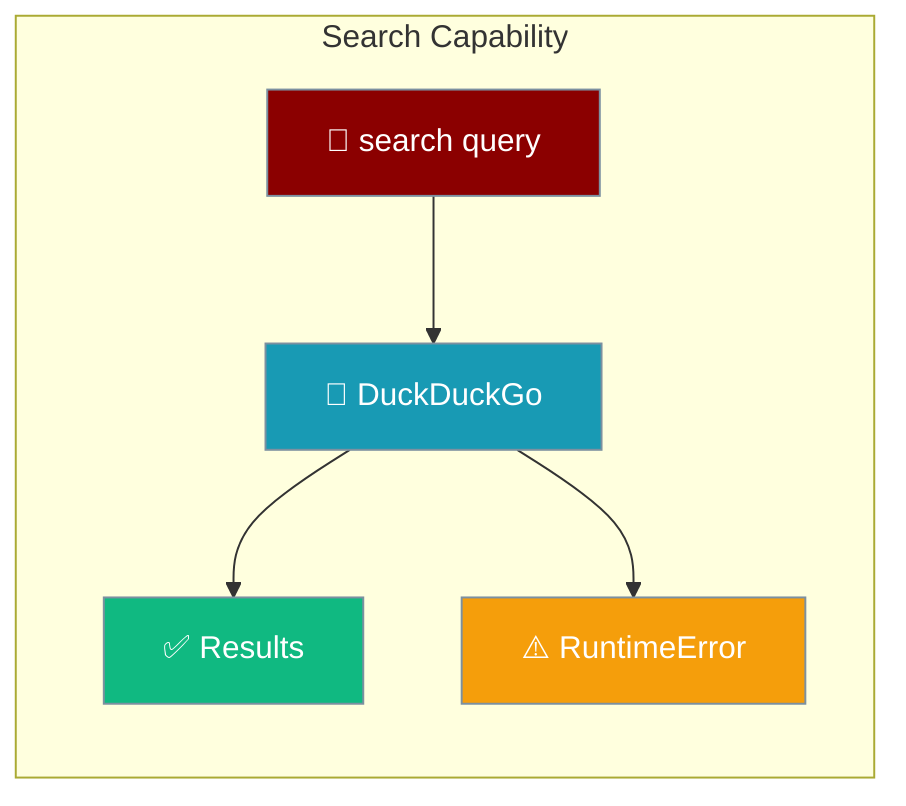
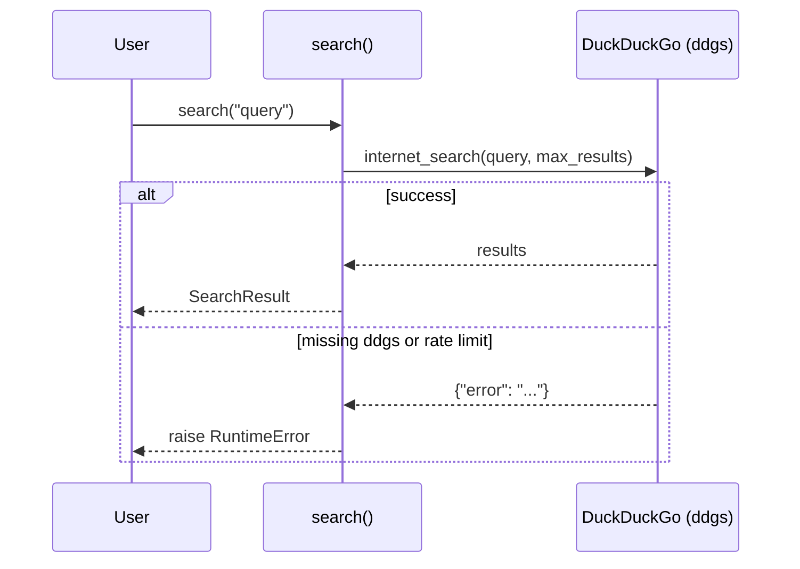

`search` runs a real DuckDuckGo query and raises when the backend fails, so missing dependencies and rate limits are visible instead of silent.



<Note>
`search` needs the `ddgs` package at runtime. Install it with `pip install ddgs`.
</Note>

## Quick Start

<Steps>
<Step title="Search from an Agent">
Give an agent the web search tool for research tasks.

```python
from praisonaiagents import Agent
from praisonaiagents.tools import internet_search

agent = Agent(
    name="Researcher",
    instructions="Search the web and summarise findings",
    tools=[internet_search]
)

agent.start("Find the latest news on the PraisonAI framework")
```
</Step>

<Step title="Direct capability call">
Call `search` directly when you just need raw results.

```python
from praisonai.capabilities import search

result = search("PraisonAI framework")

for r in result.results:
    print(r["title"], r["url"])
```
</Step>
</Steps>

<Warning>
If `ddgs` is missing or the provider rate-limits, `search` raises `RuntimeError` instead of returning an empty result. Earlier releases silently returned `total=0` — that behaviour is gone.
</Warning>

---

## How It Works



`search` calls `internet_search` under the hood. Each result is a dict with `title`, `url`, and `snippet` keys.

---

## Configuration Options

| Parameter | Type | Default | Description |
|-----------|------|---------|-------------|
| `query` | `str` | Required | Search query |
| `sources` | `List[str]` | `None` | Optional list of sources to search |
| `max_results` | `int` | `10` | Maximum number of results |
| `timeout` | `float` | `600.0` | Request timeout in seconds |
| `metadata` | `Dict` | `None` | Optional metadata for tracing |

`SearchResult` fields: `results` (list of dicts), `query`, `total`, `metadata`.

<Card title="Capabilities SDK Reference" icon="code" href="/sdk/reference/praisonai/modules/capabilities">
  Auto-generated reference for the capabilities module
</Card>

---

## Common Patterns

Handle a missing dependency gracefully:

```python
from praisonai.capabilities import search

try:
    result = search("open source LLM agents")
    print(f"{result.total} results")
except RuntimeError as e:
    print(f"Search unavailable: {e}")
    # e.g. install ddgs: pip install ddgs
```

Async search delegates to the sync path:

```python
import asyncio
from praisonai.capabilities import asearch

async def main():
    result = await asearch("vector databases")
    for r in result.results:
        print(r["title"])

asyncio.run(main())
```

---

## Best Practices

<AccordionGroup>
<Accordion title="Install ddgs before using search">
Run `pip install ddgs`. Without it, `search` raises `RuntimeError`.
</Accordion>

<Accordion title="Catch RuntimeError">
Rate limits and missing dependencies surface as `RuntimeError`. Wrap calls so your app degrades gracefully instead of crashing.
</Accordion>

<Accordion title="Tune max_results">
Lower `max_results` for faster, cheaper queries; raise it when you need broader coverage.
</Accordion>
</AccordionGroup>

---

## Related

<CardGroup cols={2}>
<Card title="Web Search Tools" icon="globe" href="/tools/web-search">
  Search tools for agents
</Card>
<Card title="Capabilities Overview" icon="bolt" href="/capabilities/index">
  All LiteLLM parity capabilities
</Card>
</CardGroup>
