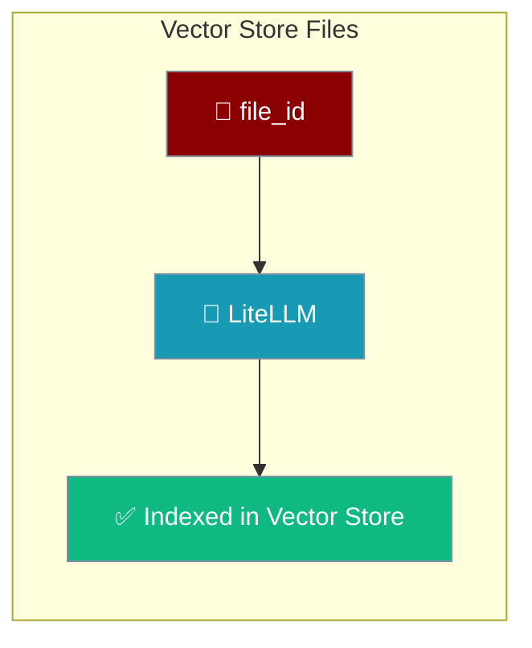
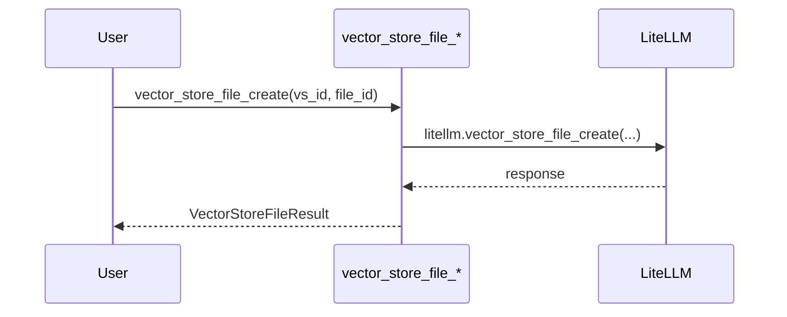

Vector store file capabilities index a file into a vector store, list its files, and delete files — calling the real LiteLLM API and surfacing backend errors.



<Note>
These functions call the real LiteLLM API (`vector_store_file_create`, `vector_store_file_list`, `vector_store_file_delete`). Backend errors now surface instead of being swallowed.
</Note>

## Quick Start

<Steps>
<Step title="Index a file with an Agent">
Use knowledge sources to let an agent index and search files automatically.

```python
from praisonaiagents import Agent

agent = Agent(
    name="Docs Assistant",
    instructions="Answer questions from the indexed documents",
    knowledge=["report.pdf"]
)

agent.start("Summarise the key findings")
```
</Step>

<Step title="Direct capability call">
Add an already-uploaded file to a vector store.

```python
from praisonai.capabilities import vector_store_file_create

result = vector_store_file_create(
    vector_store_id="vs_abc123",
    file_id="file_xyz789"
)

print(result.id, result.status)
```
</Step>
</Steps>

---

## How It Works



| Function | LiteLLM call | Returns |
|----------|--------------|---------|
| `vector_store_file_create` | `litellm.vector_store_file_create` | `VectorStoreFileResult` |
| `avector_store_file_create` | `litellm.avector_store_file_create` | `VectorStoreFileResult` |
| `vector_store_file_list` | `litellm.vector_store_file_list` | `List[VectorStoreFileResult]` |
| `avector_store_file_list` | `litellm.avector_store_file_list` | `List[VectorStoreFileResult]` |
| `vector_store_file_delete` | `litellm.vector_store_file_delete` | `bool` |
| `avector_store_file_delete` | `litellm.avector_store_file_delete` | `bool` |

<Warning>
`vector_store_file_delete` returns the real `deleted` flag. When the backend response has no `deleted` attribute, it defaults to `False` (previously `True`). Backend errors are no longer swallowed.
</Warning>

---

## Configuration Options

**`vector_store_file_create`**

| Parameter | Type | Default | Description |
|-----------|------|---------|-------------|
| `vector_store_id` | `str` | Required | ID of the vector store |
| `file_id` | `str` | Required | ID of the file to add |
| `chunking_strategy` | `Dict` | `None` | Chunking configuration |
| `custom_llm_provider` | `str` | `"openai"` | Provider |
| `timeout` | `float` | `600.0` | Request timeout |
| `api_key` | `str` | `None` | Optional API key override |
| `api_base` | `str` | `None` | Optional API base URL override |

**`vector_store_file_list`**

| Parameter | Type | Default | Description |
|-----------|------|---------|-------------|
| `vector_store_id` | `str` | Required | ID of the vector store |
| `custom_llm_provider` | `str` | `"openai"` | Provider |
| `limit` | `int` | `20` | Max files to return |
| `after` | `str` | `None` | Cursor for pagination |

**`vector_store_file_delete`**

| Parameter | Type | Default | Description |
|-----------|------|---------|-------------|
| `vector_store_id` | `str` | Required | ID of the vector store |
| `file_id` | `str` | Required | ID of the file to delete |
| `custom_llm_provider` | `str` | `"openai"` | Provider |

<Card title="Capabilities SDK Reference" icon="code" href="/sdk/reference/praisonai/modules/capabilities">
  Auto-generated reference for the capabilities module
</Card>

---

## Common Patterns

List then delete files:

```python
from praisonai.capabilities import vector_store_file_list, vector_store_file_delete

files = vector_store_file_list("vs_abc123")
for f in files:
    print(f.id, f.status)

deleted = vector_store_file_delete("vs_abc123", "file_xyz789")
print(f"Deleted: {deleted}")  # False if the backend omits the flag
```

Async indexing:

```python
import asyncio
from praisonai.capabilities import avector_store_file_create

async def main():
    result = await avector_store_file_create("vs_abc123", "file_xyz789")
    print(result.id)

asyncio.run(main())
```

---

## Best Practices

<AccordionGroup>
<Accordion title="Check the deleted flag">
`vector_store_file_delete` returns `False` when the backend does not confirm deletion. Verify the return value rather than assuming success.
</Accordion>

<Accordion title="Handle backend errors">
Real LiteLLM errors now propagate. Wrap calls in try/except to handle provider or auth failures.
</Accordion>

<Accordion title="Prefer knowledge sources for agents">
For most workflows, pass files via an agent's `knowledge` parameter — indexing and retrieval are handled for you.
</Accordion>
</AccordionGroup>

---

## Related

<CardGroup cols={2}>
<Card title="Knowledge" icon="book" href="/features/knowledge">
  Index and search documents from an agent
</Card>
<Card title="Capabilities Overview" icon="bolt" href="/capabilities/index">
  All LiteLLM parity capabilities
</Card>
</CardGroup>
