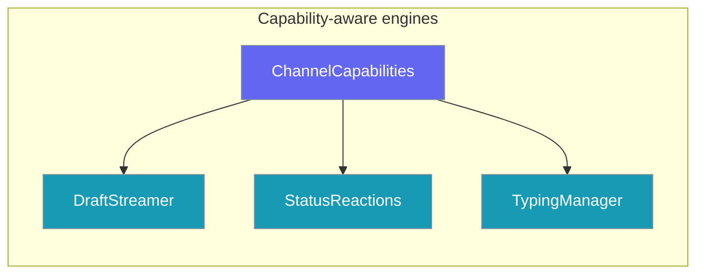

Each channel declares what it supports — live message edits, reactions, typing indicators, and text limits — so engines adapt automatically without platform-specific agent code.



## Quick Start

<Steps>
<Step title="Create your agent">

```python
from praisonaiagents import Agent

agent = Agent(name="assistant", instructions="Helpful assistant")
```

</Step>
<Step title="Start bots on each channel">

```python
from praisonai.bots import TelegramBot, SlackBot, DiscordBot

# Same agent — each channel streams/reacts to whatever it supports
TelegramBot(token="...", agent=agent, streaming=True, status_reactions=True).start()
SlackBot(token="...", agent=agent, streaming=True, status_reactions=True).start()
DiscordBot(token="...", agent=agent, streaming=True, status_reactions=True).start()
```

</Step>
</Steps>

## Capability Reference

| Capability | Type | Meaning |
|------------|------|---------|
| `live_edit` | `bool` | Channel can edit a previously sent message in place |
| `reactions` | `bool` | Channel supports adding/removing emoji reactions |
| `typing` | `bool` | Channel supports a typing/working indicator |
| `text_limit` | `int` | Max characters per message (0 = unlimited) |
| `edit_rate_limit` | `float` | Min seconds between edits (auto-applied) |
| `reaction_rate_limit` | `float` | Min seconds between reactions (auto-applied) |

## Per-Channel Matrix

| Channel | live_edit | reactions | typing | text_limit | edit_rate_limit |
|---------|-----------|-----------|--------|------------|-----------------|
| Telegram | Yes | Yes | Yes | 4096 | default |
| Slack | Yes | Yes | No | 40000 | 1.0 |
| Discord | Yes | Yes | Yes | 2000 | default |
| WhatsApp | No | No | No | 4096 | — |
| Email | No | No | No | unlimited | — |

## Graceful Degradation

`DraftStreamer`, `StatusReactions`, and `TypingManager` inspect `bot.capabilities` and silently no-op when a feature is unsupported — WhatsApp still delivers a single final message; Email skips reactions entirely.

## Custom Adapters

```python
@property
def capabilities(self):
    return {
        "live_edit": True,
        "reactions": False,
        "typing": True,
        "text_limit": 2000,
        "edit_rate_limit": 1.0,
        "reaction_rate_limit": 0.5,
    }
```

## Related

<CardGroup cols={2}>
  <Card title="Streaming Replies" icon="message-pen" href="/docs/features/bot-streaming-replies">
    Live draft message edits
  </Card>
  <Card title="Status Reactions" icon="face-smile" href="/docs/features/bot-status-reactions">
    Run-state emoji reactions
  </Card>
  <Card title="Typing Indicators" icon="keyboard" href="/docs/features/bot-typing-indicators">
    Keepalive typing indicators
  </Card>
  <Card title="Messaging Bots" icon="message-circle" href="/docs/features/messaging-bots">
    Full bot setup guide
  </Card>
</CardGroup>
