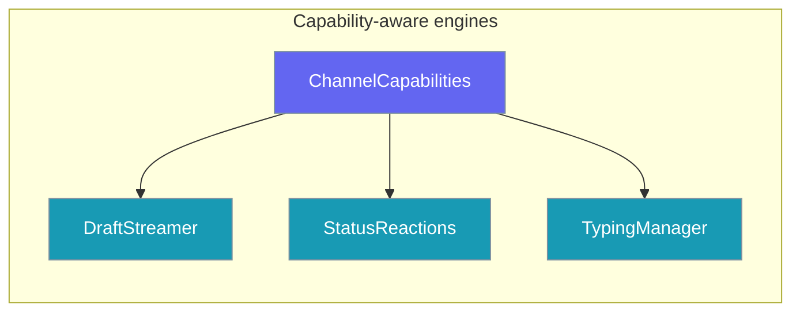
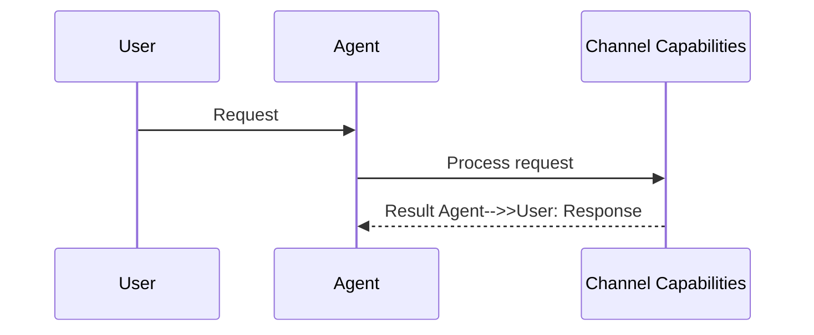

Each channel declares what it supports — live message edits, reactions, typing indicators, and text limits — so engines adapt automatically without platform-specific agent code.


```python
from praisonaiagents import Agent

agent = Agent(name="bot", instructions="Reply on Telegram with streaming when the channel supports it.")
agent.start("Send a long answer with progressive updates.")
```

The user receives a reply; channel capabilities tell PraisonAI how to stream, react, and chunk on that platform.


```mermaid
graph LR
    subgraph "Capability-aware engines"
        C[ChannelCapabilities] --> S[DraftStreamer]
        C --> R[StatusReactions]
        C --> T[TypingManager]
    end

    classDef config fill:#6366F1,stroke:#7C90A0,color:#fff
    classDef engine fill:#189AB4,stroke:#7C90A0,color:#fff

    classDef agent fill:#8B0000,color:#fff
    classDef tool fill:#189AB4,color:#fff
    class C config
    class S,R,T engine
```

## How It Works


```mermaid
sequenceDiagram
    participant User
    participant Agent
    participant Feature as Channel Capabilities

    User->>Agent: Request
    Agent->>Feature: Process request
    Feature-->>Agent: Result    Agent-->>User: Response
```


## Quick Start

<Steps>
<Step title="Create your agent">

```python
from praisonaiagents import Agent

agent = Agent(name="assistant", instructions="Helpful assistant")
```

</Step>
<Step title="Start bots on each channel">

```python
from praisonai.bots import TelegramBot, SlackBot, DiscordBot

# Same agent — each channel streams/reacts to whatever it supports
TelegramBot(token="...", agent=agent, streaming=True, status_reactions=True).start()
SlackBot(token="...", agent=agent, streaming=True, status_reactions=True).start()
DiscordBot(token="...", agent=agent, streaming=True, status_reactions=True).start()
```

</Step>
</Steps>

## Capability Reference

| Capability | Type | Meaning |
|------------|------|---------|
| `live_edit` | `bool` | Channel can edit a previously sent message in place |
| `reactions` | `bool` | Channel supports adding/removing emoji reactions — agents drive these via [`send_message(action="react")`](/features/send-message-tool#reactions) |
| `typing` | `bool` | Channel supports a typing/working indicator |
| `supports_threads` | `bool` | Channel supports opening a native thread/topic under a channel — agents drive these via [`send_message`](/features/send-message-tool) and the [Gateway Threads](/features/gateway-threads) API |
| `text_limit` | `int` | Max characters per message (0 = unlimited) |
| `edit_rate_limit` | `float` | Min seconds between edits (auto-applied) |
| `reaction_rate_limit` | `float` | Min seconds between reactions (auto-applied) |

## Per-Channel Matrix

<Note>
Interactive widget capabilities (buttons, selects, native rendering shape) are governed separately by `PresentationLimits` — see [Bot Presentations](/features/bot-presentations) and [Message Presentation](/features/message-presentation).
</Note>

| Channel | live_edit | reactions | threads | typing | text_limit | edit_rate_limit |
|---------|-----------|-----------|---------|--------|------------|-----------------|
| Telegram | Yes | Yes | Yes | Yes | 4096 | default |
| Slack | Yes | Yes | Yes | No | 40000 | 1.0 |
| Discord | Yes | Yes | Yes | Yes | 2000 | default |
| WhatsApp | No | No | No | No | 4096 | — |
| Email | No | No | No | No | unlimited | — |

### Table & Chart Support

Native table and chart rendering is governed by `PresentationLimits` and defaults to off on every channel — see [Table & Chart Blocks](/features/table-chart-blocks).

| Capability | Telegram | Slack | Discord | WhatsApp |
|--------------------|:--------:|:-----:|:-------:|:--------:|
| `supports_tables` | `False` | `False` | `False` | `False` |
| `supports_charts` | `False` | `False` | `False` | `False` |

A channel author opts in by returning an updated `PresentationLimits` (e.g. `supports_tables=True`) from its capability method. The `max_table_rows` and `max_table_cols` clamps bound the size a native renderer receives; when a flag is `False`, blocks degrade deterministically to a markdown table or text summary.

## Graceful Degradation

`DraftStreamer`, `StatusReactions`, and `TypingManager` inspect `bot.capabilities` and silently no-op when a feature is unsupported — WhatsApp still delivers a single final message; Email skips reactions entirely.

## Custom Adapters

```python
@property
def capabilities(self):
    return {
        "live_edit": True,
        "reactions": False,
        "threads": True,
        "typing": True,
        "text_limit": 2000,
        "edit_rate_limit": 1.0,
        "reaction_rate_limit": 0.5,
    }
```

## Best Practices

<AccordionGroup>
  <Accordion title="Enable features once — engines adapt">
    Turn on `streaming=True` and `status_reactions=True` on every bot; `DraftStreamer`, `StatusReactions`, and `TypingManager` no-op automatically when a channel lacks support.
  </Accordion>
  <Accordion title="Respect per-channel text limits">
    Discord caps at 2000 characters, Telegram at 4096. Long replies are split or truncated — design agent output accordingly rather than assuming unlimited length.
  </Accordion>
  <Accordion title="Declare capabilities on custom adapters">
    Implement the `capabilities` property on new platform bots so rate limits (`edit_rate_limit`, `reaction_rate_limit`) and feature flags propagate correctly.
  </Accordion>
  <Accordion title="Test degradation on limited channels">
    Verify WhatsApp and Email bots still deliver a final message when live edits and reactions are unavailable — users should never see a silent failure.
  </Accordion>
</AccordionGroup>

## Related

<CardGroup cols={2}>
  <Card title="Streaming Replies" icon="message-pen" href="/features/bot-streaming-replies">
    Live draft message edits
  </Card>
  <Card title="Status Reactions" icon="face-smile" href="/features/bot-status-reactions">
    Run-state emoji reactions
  </Card>
  <Card title="Agent Reactions" icon="thumbs-up" href="/features/send-message-tool#reactions">
    Agent-driven emoji reactions via send_message
  </Card>
  <Card title="Gateway Threads" icon="comments" href="/features/gateway-threads">
    Open native platform threads under a channel
  </Card>
  <Card title="Typing Indicators" icon="keyboard" href="/features/bot-typing-indicators">
    Keepalive typing indicators
  </Card>
  <Card title="Messaging Bots" icon="message-circle" href="/features/messaging-bots">
    Full bot setup guide
  </Card>
</CardGroup>
