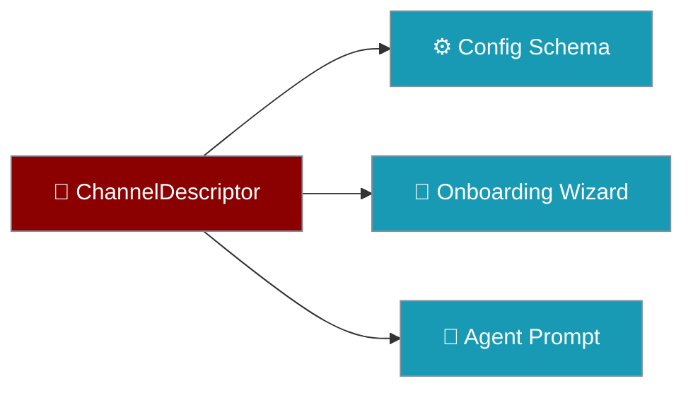
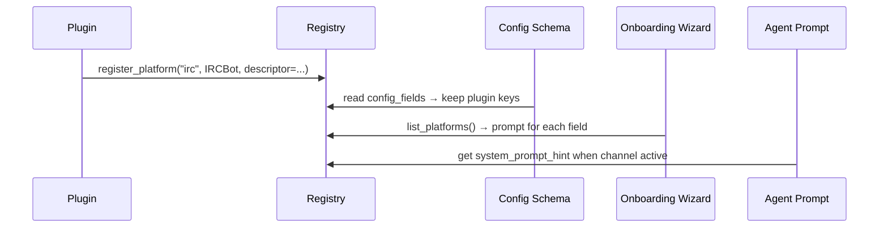

A channel plugin declares — in one place — everything the gateway needs to treat it as first-class: its own config keys, a system-prompt hint, and an optional setup wizard.



## Quick Start

<Steps>
<Step title="Declare a descriptor">
List your channel's config fields and a prompt hint on a small descriptor class:

```python
from praisonaiagents.bots import ChannelField

class IRCDescriptor:
    config_fields = [
        ChannelField("server", required=True, prompt="IRC server host"),
        ChannelField("nickserv_password", secret=True, env="IRC_NICKSERV_PASSWORD"),
    ]
    system_prompt_hint = (
        "You are replying on IRC: plain text only, one short line."
    )
```
</Step>

<Step title="Register the platform">
Pass the descriptor when you register the adapter — the gateway wires config, onboarding, and prompt for you:

```python
from praisonai.bots._registry import register_platform

register_platform("irc", IRCBot, descriptor=IRCDescriptor())
```
</Step>
</Steps>

<Note>
Without a descriptor, a plugin channel's own keys (like IRC's `server`) are silently dropped by the fixed `ChannelConfigSchema`. The descriptor keeps them.
</Note>

---

## How It Works

One declaration feeds three consumers when the channel is active.



| Consumer | Reads | Effect |
|----------|-------|--------|
| Config schema | `config_fields` | Plugin keys validate instead of being dropped |
| Onboarding wizard | `config_fields` (+ optional `setup`) | Prompts for each field, using `env` as fallback |
| Agent prompt | `system_prompt_hint` | Injects the hint whenever the channel is active |

---

## ChannelField Options

Each `ChannelField` describes one config key the channel needs.

| Field | Type | Default | Description |
|-------|------|---------|-------------|
| `name` | `str` | — | Config key name (as it appears under `channels.<platform>`) |
| `required` | `bool` | `False` | Whether the field must be provided |
| `secret` | `bool` | `False` | Whether the value is sensitive (masked in prompts/logs) |
| `prompt` | `str` | `""` | Human-friendly prompt shown by the onboarding wizard |
| `env` | `Optional[str]` | `None` | Environment-variable name used as a fallback source |

---

## Interactive Setup

Add an optional `setup(io)` hook for multi-step flows that a flat field list can't express — the wizard calls it when present and merges the returned values.

```python
from praisonaiagents.bots import ChannelField
from praisonai.bots._registry import register_platform

class IRCDescriptor:
    config_fields = [
        ChannelField("server", required=True, prompt="IRC server host"),
    ]
    system_prompt_hint = "You are replying on IRC: plain text only, one short line."

    def setup(self, io) -> dict:
        channels = io.prompt("Which channels to join? (comma-separated)")
        return {"channels": [c.strip() for c in channels.split(",") if c.strip()]}

register_platform("irc", IRCBot, descriptor=IRCDescriptor())
```

<Note>
`setup` is optional. A descriptor that only needs declarative `config_fields` omits it entirely.
</Note>

---

## Best Practices

<AccordionGroup>
<Accordion title="Mark secrets with secret=True">
Set `secret=True` on tokens and passwords so the wizard masks them and logs never print the value.
</Accordion>
<Accordion title="Provide an env fallback for secrets">
Add `env="IRC_NICKSERV_PASSWORD"` so operators can supply credentials via environment variables instead of prompts.
</Accordion>
<Accordion title="Keep the prompt hint short and concrete">
State the platform and its constraints in one line — for example plain text only, one short line — so the agent adapts its replies.
</Accordion>
<Accordion title="Use setup only when fields aren't enough">
Reach for `setup(io)` for bespoke, multi-step flows. Declarative `config_fields` cover the common case with no code.
</Accordion>
</AccordionGroup>

---

## Related

<CardGroup cols={2}>
<Card title="Messaging Bots" icon="robot" href="/docs/features/messaging-bots">
  Connect agents to Telegram, Slack, Discord, and more
</Card>
<Card title="Bot Platform Capabilities" icon="sliders" href="/docs/features/bot-platform-capabilities">
  How platform capabilities drive channel behaviour
</Card>
<Card title="Gateway" icon="tower-broadcast" href="/docs/features/gateway">
  Multi-agent coordination across channels
</Card>
<Card title="Plugins" icon="puzzle-piece" href="/docs/features/plugins">
  Ship channels and tools as pip packages
</Card>
<Card title="Channel Directory" icon="list" href="/docs/features/gateway-channel-directory">
  How an adapter enumerates the channels it can see
</Card>
</CardGroup>
