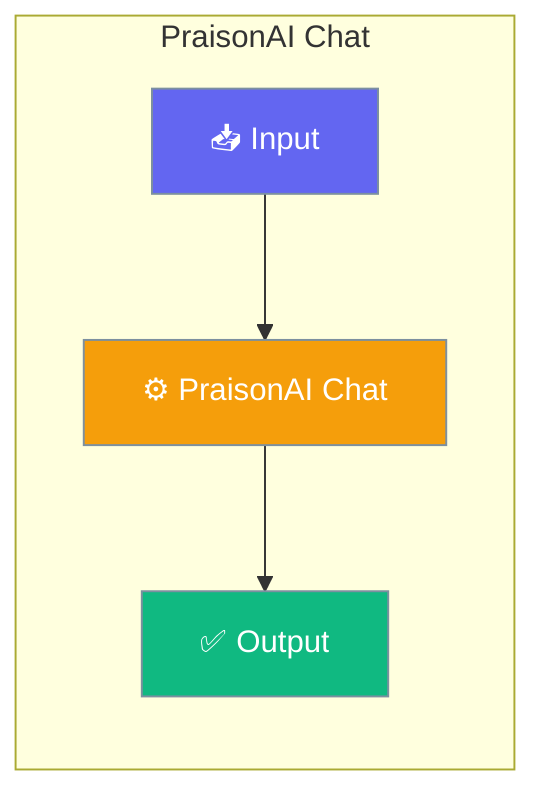

# PraisonAI Chat

PraisonAI Chat is a powerful, modern chat interface designed for AI agent interactions. It provides a beautiful UI for interacting with PraisonAI agents with features like streaming responses, tool call visualization, and session management.




## Installation

```bash
pip install praisonai[chat]
```

## Quick Start


<Steps>
<Step title="Simple Usage">
### CLI Usage

Start the chat interface with a single command:

```bash
praisonai chat
```
</Step>

<Step title="With Configuration">
This starts the chat server at `http://localhost:8000`.

### With Custom Port

```bash
praisonai chat --port 3000
```

### Programmatic Usage

```python
from praisonaiagents import Agent
from praisonai.chat import start_chat_server

# Create your agent
agent = Agent(
    name="Assistant",
    instructions="You are a helpful AI assistant."
)

# Start the chat UI with your agent
start_chat_server(agent=agent, port=8000)
```
</Step>
</Steps>


## Best Practices

<AccordionGroup>
  <Accordion title="Start simple">
    Enable the feature with a single parameter before adding configuration. Verify it works, then layer in options.
  </Accordion>
  <Accordion title="Use environment variables for secrets">
    Never hardcode API keys or tokens. Use `os.getenv("KEY_NAME")` to read from environment variables.
  </Accordion>
  <Accordion title="Test with minimal examples first">
    Copy the Quick Start example, run it, then extend it. This confirms your environment is set up correctly.
  </Accordion>
  <Accordion title="Check the logs">
    Set `verbose=True` on your agent to see detailed execution logs when debugging unexpected behavior.
  </Accordion>
</AccordionGroup>

## Related

<CardGroup cols={2}>
  <Card title="Features Overview" icon="grid-2" href="/docs/features">
    Browse all PraisonAI features
  </Card>
  <Card title="Quick Start" icon="rocket" href="/docs/introduction">
    Get started with PraisonAI agents
  </Card>
</CardGroup>
