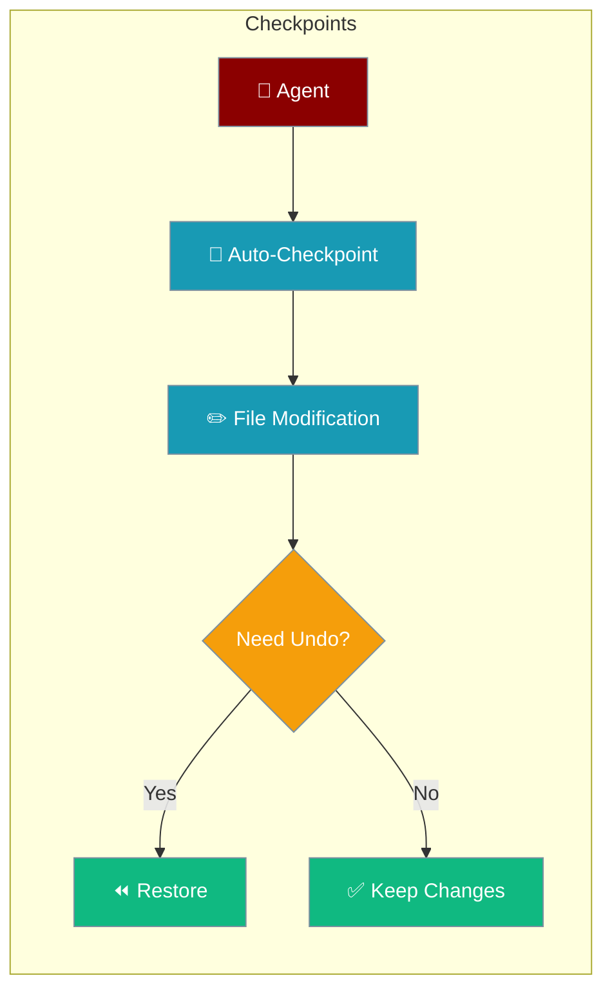
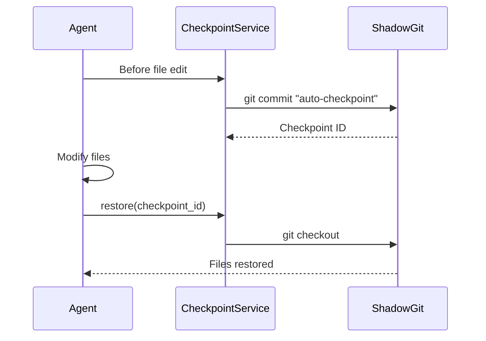

Checkpoints automatically save workspace snapshots before agent file modifications, so you can undo any change instantly.



## Quick Start

<Steps>
<Step title="Enable checkpoints on an agent">
```python
from praisonaiagents import Agent
from praisonaiagents.checkpoints import CheckpointService

checkpoints = CheckpointService(workspace_dir="./my_project")

agent = Agent(
    name="RefactorBot",
    instructions="You are a code refactoring assistant.",
    checkpoints=checkpoints
)

agent.start("Refactor the codebase to improve readability")
```
</Step>

<Step title="Restore if needed">
```python
import asyncio
from praisonaiagents.checkpoints import CheckpointService

service = CheckpointService(workspace_dir="./my_project")
asyncio.run(service.initialize())

checkpoints = asyncio.run(service.list_checkpoints())
for cp in checkpoints:
    print(f"{cp.short_id} - {cp.message}")

asyncio.run(service.restore(checkpoints[0].id))
```
</Step>
</Steps>

---

## How It Works



---

## CLI Commands

```bash
praisonai checkpoint save "Before major changes"
praisonai checkpoint list
praisonai checkpoint diff
praisonai checkpoint diff abc123 def456
praisonai checkpoint restore abc123
praisonai checkpoint delete
```

---

## Configuration

```python
from praisonaiagents.checkpoints import CheckpointService

service = CheckpointService(
    workspace_dir="/path/to/project",
    storage_dir="~/.praisonai/checkpoints",
    enabled=True,
    auto_checkpoint=True,
    max_checkpoints=100
)
```

| Option | Type | Default | Description |
|--------|------|---------|-------------|
| `workspace_dir` | `str` | required | Directory to track |
| `storage_dir` | `str` | `~/.praisonai/checkpoints` | Checkpoint storage |
| `enabled` | `bool` | `True` | Enable/disable |
| `auto_checkpoint` | `bool` | `True` | Auto-save before edits |
| `max_checkpoints` | `int` | `100` | Max checkpoints to keep |

---

## Common Patterns

### Save and restore

```python
import asyncio
from praisonaiagents.checkpoints import CheckpointService

async def main():
    service = CheckpointService(workspace_dir="./project")
    await service.initialize()

    result = await service.save("Before refactoring")
    print(f"Saved: {result.checkpoint.short_id}")

    diff = await service.diff()
    for file in diff.files:
        print(f"{file.status}: {file.path}")

    await service.restore(result.checkpoint.id)

asyncio.run(main())
```

### Subscribe to events

```python
from praisonaiagents.checkpoints import CheckpointService, CheckpointEvent

service = CheckpointService(workspace_dir="./project")

service.on(CheckpointEvent.CHECKPOINT_CREATED, lambda cp: print(f"Created: {cp.short_id}"))
service.on(CheckpointEvent.CHECKPOINT_RESTORED, lambda cp: print(f"Restored: {cp.short_id}"))
```

---

## Best Practices

<AccordionGroup>
<Accordion title="Use descriptive checkpoint messages">
Messages like "Before authentication refactor" make it much easier to find the right restore point than timestamps alone.

```python
await service.save("Before authentication refactor")
```
</Accordion>

<Accordion title="Check diff before restore">
Always view the diff to confirm you're restoring to the right state before committing to a restore.

```python
diff = await service.diff("abc123", "def456")
for file in diff.files:
    print(f"{file.status}: {file.path} (+{file.additions}/-{file.deletions})")
```
</Accordion>

<Accordion title="Set max_checkpoints to manage storage">
For long-running agents, limit checkpoints to avoid unbounded disk usage.

```python
service = CheckpointService(workspace_dir=".", max_checkpoints=50)
```
</Accordion>

<Accordion title="Zero performance impact by design">
Checkpoints use lazy loading and async git operations — no impact on agent execution speed.
</Accordion>
</AccordionGroup>

---

## Related

<CardGroup cols={2}>
<Card title="File Snapshot" icon="camera" href="/features/file-snapshot">
  Point-in-time file system snapshots
</Card>
<Card title="Replay" icon="play" href="/features/replay">
  Record and replay agent execution sessions
</Card>
</CardGroup>
