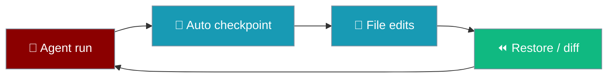

Save and rewind workspace snapshots before agents change files — powered by a shadow git repository.



## Quick Start

<Steps>
  <Step title="Attach checkpoints to an agent">
    ```python
    from praisonaiagents import Agent
    from praisonaiagents.checkpoints import CheckpointService

    checkpoints = CheckpointService(workspace_dir="./my_project")
    agent = Agent(
        name="RefactorBot",
        instructions="You are a code refactoring assistant.",
        checkpoints=checkpoints,
    )
    agent.start("Refactor the codebase to improve readability")
    ```
  </Step>
  <Step title="Save and restore from CLI">
    ```bash
    praisonai checkpoint save "Before major changes"
    praisonai checkpoint list
    praisonai checkpoint restore last
    ```
  </Step>
  <Step title="One-liner undo after a run">
    ```bash
    praisonai run agents.yaml
    praisonai run --restore last
    ```
  </Step>
</Steps>

## Overview

Checkpoints allow you to:

- **Save** snapshots of your workspace before changes
- **Restore** files to any previous checkpoint
- **Diff** between checkpoints to see what changed
- **Track** all file modifications made by agents

## In-session `/undo` and `/revert`

When `praisonai code --checkpoints` is active, the coding REPL gains turn-aware undo and revert commands.

```mermaid
sequenceDiagram
    participant User
    participant REPL as code REPL
    participant CP as Checkpoint Manager

    User->>REPL: [starts session with --checkpoints]
    REPL->>CP: baseline checkpoint
    User->>REPL: prompt → edits files
    REPL->>CP: checkpoint_turn() before edits
    User->>REPL: /undo
    REPL->>CP: preview(1)
    CP-->>REPL: diff preview
    REPL->>CP: revert(1)
    CP-->>REPL: workspace restored

    classDef user fill:#8B0000,stroke:#7C90A0,color:#fff
    classDef repl fill:#189AB4,stroke:#7C90A0,color:#fff
    classDef cp fill:#F59E0B,stroke:#7C90A0,color:#fff

    class User user
    class REPL repl
    class CP cp
```

**`/undo` mode comparison:**

| Mode | What `/undo` does |
|------|------------------|
| Checkpointing **off** (default) | Removes the last assistant+user message from history only |
| Checkpointing **on** | Removes the last turn from history **and** restores workspace files (diff preview shown first) |

**`/revert [n]`** rolls back `n` turns (default 1). After revert, the timeline drops the restored turns so the next `/undo` walks further back.

**Project config:**

```yaml
# agents.yaml
checkpoints:
  auto: true
  storage_dir: ./.praisonai/checkpoints   # optional
```

**Env override:** `PRAISONAI_CHECKPOINTS=on` (or `off`).

**Precedence:** `PRAISONAI_CHECKPOINTS` (env) > `checkpoints.auto` (config) > default (off).

---

## CLI Commands

```bash
# Save a checkpoint (--allow-empty to snapshot even with no changes)
praisonai checkpoint save "Before major changes"
praisonai checkpoint save "Before major changes" --allow-empty

# List checkpoints (newest first; -n to limit)
praisonai checkpoint list
praisonai checkpoint list -n 10

# Show diff — accepts last/latest, full id, short id, or unique prefix
praisonai checkpoint diff
praisonai checkpoint diff last
praisonai checkpoint diff abc12345 def67890

# Restore to a checkpoint
praisonai checkpoint restore last
praisonai checkpoint restore abc12345

# Delete all checkpoints (-y to skip confirm prompt)
praisonai checkpoint delete
praisonai checkpoint delete --yes

# All subcommands accept -w to target a specific workspace directory
praisonai checkpoint list -w /path/to/project
praisonai checkpoint restore last -w /path/to/project
```

<Note>
One-liner undo after a bad `praisonai run`: `praisonai run --restore last`. See [Run — Checkpoint & Rewind](/docs/cli/run) for details.
</Note>

## Automatic Checkpoints with `praisonai run`

`praisonai run` snapshots your workspace automatically before every YAML-file run.

```yaml
# Project config — opt out per project
checkpoints:
  auto: false
```

- **Default:** `true` — automatic checkpoints are on for all YAML-file runs.
- **Scoped to YAML runs:** plain-prompt runs (`praisonai run "…"`) are skipped.
- **Workspace:** the directory of the target YAML file, not the cwd.
- **Label:** `run:<run_id>` (or `"auto checkpoint before run"` as a fallback).
- **Best-effort:** failures are swallowed and never block the run.
- **Per-run override:** `praisonai run agents.yaml --no-checkpoint`.

```bash
praisonai run agents.yaml            # auto-checkpoint, then run
praisonai run --restore last         # rewind workspace, exit
praisonai run agents.yaml --no-checkpoint   # skip auto-checkpoint
```

## Configuration

```python
from praisonaiagents.checkpoints import CheckpointService

service = CheckpointService(
    workspace_dir="/path/to/project",
    storage_dir="~/.praisonai/checkpoints",
    enabled=True,
    auto_checkpoint=True,
    max_checkpoints=100
)
```

**Parameters:**
- `workspace_dir`: Directory to track
- `storage_dir`: Where to store checkpoint data (default: `~/.praisonai/checkpoints`)
- `enabled`: Enable/disable checkpoints
- `auto_checkpoint`: Auto-checkpoint before file modifications
- `max_checkpoints`: Maximum checkpoints to keep

## Data Types

### Checkpoint

```python
@dataclass
class Checkpoint:
    id: str           # Full commit hash
    short_id: str     # Short hash (8 chars)
    message: str      # Checkpoint message
    timestamp: datetime
    files_changed: int
    insertions: int
    deletions: int
```

### CheckpointDiff

```python
@dataclass
class CheckpointDiff:
    from_checkpoint: str
    to_checkpoint: Optional[str]  # None = working directory
    files: List[FileDiff]
    total_additions: int
    total_deletions: int
```

## Best Practices

<AccordionGroup>
  <Accordion title="Checkpoint before major refactors">
    Save with a descriptive message before large edits so restore targets are obvious in `checkpoint list`.
  </Accordion>
  <Accordion title="Diff before restore">
    Run `praisonai checkpoint diff last` to confirm you are rewinding to the right snapshot.
  </Accordion>
  <Accordion title="Cap stored checkpoints">
    Set `max_checkpoints` on `CheckpointService` to avoid unbounded shadow-git growth.
  </Accordion>
  <Accordion title="Use --no-checkpoint for throwaway runs">
    Skip auto-checkpoints on YAML runs when you know the workspace is disposable.
  </Accordion>
</AccordionGroup>

---

## Low-level API Reference

### CheckpointService Direct Usage

```python
from praisonaiagents.checkpoints import CheckpointService

# Create checkpoint service
service = CheckpointService(
    workspace_dir="/path/to/project",
    storage_dir="~/.praisonai/checkpoints"
)

# Initialize
await service.initialize()

# Save a checkpoint
result = await service.save("Before refactoring")
print(f"Saved: {result.checkpoint.short_id}")

# Make changes...

# Restore if needed
await service.restore(result.checkpoint.id)

# View diff
diff = await service.diff()
```

### Methods

#### initialize()

Initialize the checkpoint service:

```python
success = await service.initialize()
```

#### save(message, allow_empty=False, quiet=False)

Save a checkpoint:

```python
result = await service.save("Checkpoint message")

if result.success:
    print(f"Saved: {result.checkpoint.short_id}")
else:
    print(f"Error: {result.error}")
```

| Parameter | Type | Default | Description |
|-----------|------|---------|-------------|
| `message` | `str` | — | Checkpoint message |
| `allow_empty` | `bool` | `False` | Allow saving even when no files changed |
| `quiet` | `bool` | `False` | Suppress output (used by machine-readable run modes) |

#### restore(checkpoint_id)

Restore to a checkpoint:

```python
result = await service.restore("abc123")

if result.success:
    print("Restored successfully")
```

#### diff(from_id=None, to_id=None)

Get diff between checkpoints:

```python
# Diff from last checkpoint to current
diff = await service.diff()

# Diff between specific checkpoints
diff = await service.diff("abc123", "def456")

for file in diff.files:
    print(f"{file.status}: {file.path} (+{file.additions}/-{file.deletions})")
```

#### list_checkpoints(limit=50)

List all checkpoints:

```python
checkpoints = await service.list_checkpoints(limit=20)

for cp in checkpoints:
    print(f"{cp.short_id} - {cp.message} ({cp.timestamp})")
```

### Event Handlers

Subscribe to checkpoint events:

```python
from praisonaiagents.checkpoints import CheckpointEvent

def on_checkpoint(checkpoint):
    print(f"Checkpoint created: {checkpoint.short_id}")

service.on(CheckpointEvent.CHECKPOINT_CREATED, on_checkpoint)
service.on(CheckpointEvent.CHECKPOINT_RESTORED, lambda cp: print(f"Restored: {cp.short_id}"))
service.on(CheckpointEvent.ERROR, lambda e: print(f"Error: {e['error']}"))
```

## Zero Performance Impact

The checkpoint system is designed for minimal overhead:

- **Lazy loading**: All imports via `__getattr__`
- **Async operations**: Non-blocking git operations
- **Incremental commits**: Only changed files are tracked
- **Configurable limits**: Control max checkpoints to manage storage

---

## Related

<CardGroup cols={2}>
  <Card icon="terminal" href="/features/cli" title="CLI">
    `praisonai checkpoint` and `praisonai run --restore` commands.
  </Card>
  <Card icon="play" href="/features/code" title="Code Execution">
    Agents that edit files benefit most from automatic checkpoints.
  </Card>
  <Card icon="folder" href="/features/context-files" title="Context Files">
    Pair workspace snapshots with project context files.
  </Card>
  <Card icon="rotate" href="/features/selfreflection" title="Self-Reflection">
    Rewind bad reflection loops with a saved checkpoint.
  </Card>
</CardGroup>
