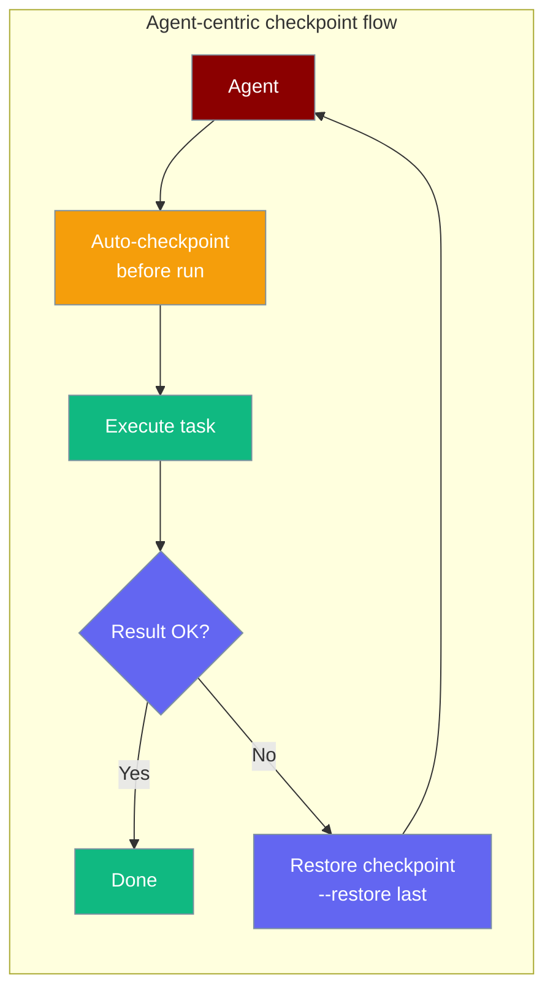

# Shadow Git Checkpointing

The Checkpoints feature provides file-level undo/restore capabilities using a shadow git repository. Every `praisonai run` auto-checkpoints the workspace before execution — giving you a free undo point without any setup.



## Quick Start

### Agent-Centric Usage

```python
from praisonaiagents import Agent
from praisonaiagents.checkpoints import CheckpointService

checkpoints = CheckpointService(workspace_dir="./my_project")

agent = Agent(
    name="RefactorBot",
    instructions="You are a code refactoring assistant.",
    checkpoints=checkpoints
)

agent.start("Refactor the codebase to improve readability")
```

## Overview

Checkpoints allow you to:

- **Save** snapshots of your workspace before changes
- **Restore** files to any previous checkpoint
- **Diff** between checkpoints to see what changed
- **Track** all file modifications made by agents

## CLI Commands

### Auto-checkpoint on every run

`praisonai run` checkpoints the workspace before every run automatically, tagged `run:` in the message:

```bash
# This run saves a checkpoint first, then executes
praisonai run "Refactor all Python files"

# Skip the auto-checkpoint for this one run
praisonai run --no-checkpoint "Quick read-only task"

# Rewind workspace to the most recent checkpoint and exit (no agent run)
praisonai run --restore last
praisonai run --restore latest
praisonai run --restore abc12345
```

### Manual checkpoint commands

```bash
# Save a checkpoint
praisonai checkpoint save "Before major changes"

# List all checkpoints
praisonai checkpoint list

# Show diff from last checkpoint
praisonai checkpoint diff

# Show diff between specific checkpoints
praisonai checkpoint diff abc123 def456

# Restore to a checkpoint (also accepts 'last' / 'latest')
praisonai checkpoint restore abc123

# Delete all checkpoints
praisonai checkpoint delete
```

## Project config

```yaml
# .praisonai/config.yaml
checkpoints:
  auto: false   # disable auto-checkpoint project-wide (default: true)
```

## Configuration

```python
from praisonaiagents.checkpoints import CheckpointService

service = CheckpointService(
    workspace_dir="/path/to/project",
    storage_dir="~/.praisonai/checkpoints",
    enabled=True,
    auto_checkpoint=True,
    max_checkpoints=100
)
```

**Parameters:**
- `workspace_dir`: Directory to track
- `storage_dir`: Where to store checkpoint data (default: `~/.praisonai/checkpoints`)
- `enabled`: Enable/disable checkpoints
- `auto_checkpoint`: Auto-checkpoint before file modifications
- `max_checkpoints`: Maximum checkpoints to keep

## Data Types

### Checkpoint

```python
@dataclass
class Checkpoint:
    id: str           # Full commit hash
    short_id: str     # Short hash (8 chars)
    message: str      # Checkpoint message
    timestamp: datetime
    files_changed: int
    insertions: int
    deletions: int
```

### CheckpointDiff

```python
@dataclass
class CheckpointDiff:
    from_checkpoint: str
    to_checkpoint: Optional[str]  # None = working directory
    files: List[FileDiff]
    total_additions: int
    total_deletions: int
```

## Best Practices

1. **Rely on the auto-checkpoint** — every `praisonai run` saves one automatically
2. **Use `--restore last` to undo** — fastest way to rewind after a bad run
3. **Use descriptive messages for manual saves** — makes it easier to find the right checkpoint
4. **Check diff before restore** — verify you're restoring to the right state
5. **Clean up old checkpoints** — use `delete` when no longer needed

---

## Low-level API Reference

### CheckpointService Direct Usage

```python
from praisonaiagents.checkpoints import CheckpointService

service = CheckpointService(
    workspace_dir="/path/to/project",
    storage_dir="~/.praisonai/checkpoints"
)

await service.initialize()

result = await service.save("Before refactoring")
print(f"Saved: {result.checkpoint.short_id}")

await service.restore(result.checkpoint.id)

diff = await service.diff()
```

### Methods

#### initialize()

Initialize the checkpoint service:

```python
success = await service.initialize()
```

#### save(message, allow_empty=False)

Save a checkpoint:

```python
result = await service.save("Checkpoint message")

if result.success:
    print(f"Saved: {result.checkpoint.short_id}")
else:
    print(f"Error: {result.error}")
```

#### restore(checkpoint_id)

Restore to a checkpoint:

```python
result = await service.restore("abc123")

if result.success:
    print("Restored successfully")
```

#### diff(from_id=None, to_id=None)

Get diff between checkpoints:

```python
diff = await service.diff()

diff = await service.diff("abc123", "def456")

for file in diff.files:
    print(f"{file.status}: {file.path} (+{file.additions}/-{file.deletions})")
```

#### list_checkpoints(limit=50)

List all checkpoints:

```python
checkpoints = await service.list_checkpoints(limit=20)

for cp in checkpoints:
    print(f"{cp.short_id} - {cp.message} ({cp.timestamp})")
```

### Event Handlers

Subscribe to checkpoint events:

```python
from praisonaiagents.checkpoints import CheckpointEvent

def on_checkpoint(checkpoint):
    print(f"Checkpoint created: {checkpoint.short_id}")

service.on(CheckpointEvent.CHECKPOINT_CREATED, on_checkpoint)
service.on(CheckpointEvent.CHECKPOINT_RESTORED, lambda cp: print(f"Restored: {cp.short_id}"))
service.on(CheckpointEvent.ERROR, lambda e: print(f"Error: {e['error']}"))
```

## Zero Performance Impact

The checkpoint system is designed for minimal overhead:

- **Lazy loading**: All imports via `__getattr__`
- **Async operations**: Non-blocking git operations
- **Incremental commits**: Only changed files are tracked
- **Best-effort auto-checkpoint**: Auto-checkpoint failures are swallowed so they never block a run
- **Configurable limits**: Control max checkpoints to manage storage
