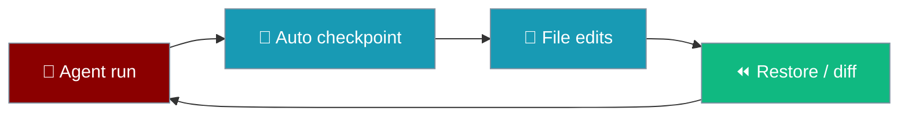
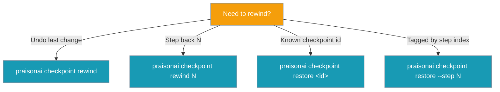

Save and rewind workspace snapshots before agents change files — powered by a shadow git repository.


```python
from praisonaiagents import Agent

agent = Agent(name="coder", instructions="Edit project files safely.")
agent.start("Refactor the auth module.")
```

The user runs an agent that edits files; checkpoints snapshot the workspace so you can diff or restore before bad changes land.



<Tip>
**Fastest undo:** `praisonai checkpoint rewind` — steps back one checkpoint without needing an id.
</Tip>

## Quick Start

<Steps>
  <Step title="Attach checkpoints to an agent">
    ```python
    from praisonaiagents import Agent
    from praisonaiagents.checkpoints import CheckpointService

    checkpoints = CheckpointService(workspace_dir="./my_project")
    agent = Agent(
        name="RefactorBot",
        instructions="You are a code refactoring assistant.",
        checkpoints=checkpoints,
    )
    agent.start("Refactor the codebase to improve readability")
    ```
  </Step>
  <Step title="Undo the last turn in one line">
    ```python
    from praisonaiagents import Agent
    from praisonaiagents.checkpoints import CheckpointService

    checkpoints = CheckpointService(workspace_dir="./my_project")
    agent = Agent(name="RefactorBot", instructions="Refactor code.", checkpoints=checkpoints)
    agent.start("Refactor the auth module")

    # Something went wrong — undo the last turn's file edits in one line
    await checkpoints.rewind()
    ```
  </Step>
  <Step title="Save and restore from CLI">
    ```bash
    praisonai checkpoint save "Before major changes"
    praisonai checkpoint list
    praisonai checkpoint restore last
    praisonai checkpoint rewind        # undo the most recent checkpoint in one command
    ```
  </Step>
  <Step title="One-liner undo after a run">
    ```bash
    praisonai run agents.yaml
    praisonai run --restore last
    ```
  </Step>
</Steps>

## Overview

Checkpoints allow you to:

- **Save** snapshots of your workspace before changes
- **Restore** files to any previous checkpoint
- **Rewind** N checkpoints back from the latest
- **Diff** between checkpoints to see what changed
- **Track** all file modifications made by agents

## Rewind vs Restore

Both rewind the workspace, but they target checkpoints differently.

| You want to… | Use | Example |
|--------------|-----|---------|
| Undo the *very last* set of changes | `rewind` (default 1) | `praisonai checkpoint rewind` |
| Step back N checkpoints from now | `rewind N` | `praisonai checkpoint rewind 3` |
| Go to a specific checkpoint you remember | `restore <id\|last>` | `praisonai checkpoint restore abc1234` |
| Go to a checkpoint tagged with a step index | `restore --step N` | `praisonai checkpoint restore --step 3` |



## How It Works

A user rewinds the workspace to a pre-turn state after a bad edit.

```mermaid
sequenceDiagram
    participant User
    participant Agent
    participant Checkpoints as CheckpointService

    User->>Agent: "Refactor auth"
    Agent->>Checkpoints: save("before turn 1")
    Agent->>Agent: edit files
    User->>Agent: "This broke tests"
    User->>Checkpoints: rewind()
    Checkpoints-->>User: workspace restored to pre-turn-1 state

    classDef user fill:#8B0000,stroke:#7C90A0,color:#fff
    classDef agent fill:#189AB4,stroke:#7C90A0,color:#fff
    classDef cp fill:#F59E0B,stroke:#7C90A0,color:#fff
    class User user
    class Agent agent
    class Checkpoints cp
```

<Note>
A checkpoint is not guaranteed to map 1:1 with an agent turn — manual saves and auto-checkpoints both create checkpoints — so `rewind` counts checkpoints, the closest turn-addressable primitive without a stored turn↔checkpoint map.
</Note>

## In-session `/undo` and `/revert`

When `praisonai code --checkpoints` is active, the coding REPL gains turn-aware undo and revert commands.

```mermaid
sequenceDiagram
    participant User
    participant REPL as code REPL
    participant CP as Checkpoint Manager
    participant Store as Session Store

    User->>REPL: [starts session with --checkpoints]
    REPL->>CP: baseline checkpoint
    User->>REPL: prompt → edits files
    REPL->>CP: checkpoint_turn(message_count=N)
    User->>REPL: /undo
    REPL->>CP: preview(1)
    CP-->>REPL: diff + dropped_message_count
    REPL->>CP: revert(1)
    CP-->>REPL: workspace restored
    CP->>Store: revert_to_message(N)
    Store-->>CP: chat_history truncated
    CP-->>REPL: ready

    classDef user fill:#8B0000,stroke:#7C90A0,color:#fff
    classDef repl fill:#189AB4,stroke:#7C90A0,color:#fff
    classDef cp fill:#F59E0B,stroke:#7C90A0,color:#fff
    classDef store fill:#6366F1,stroke:#7C90A0,color:#fff

    class User user
    class REPL repl
    class CP cp
    class Store store
```

**`/undo` mode comparison:**

| Mode | What `/undo` does |
|------|------------------|
| Checkpointing **off** (default) | Removes the last assistant + user message pair from history only. Workspace files are untouched. |
| Checkpointing **on**, session store **not wired** | Restores workspace files to the previous turn's snapshot. Conversation history is left intact. (Legacy / file-only fallback.) |
| Checkpointing **on**, session store **wired** (default in `praisonai code`) | Restores workspace files **and** rewinds `chat_history` to the message count captured at `checkpoint_turn()`, so the agent's memory matches the workspace. Diff preview shown first. |

<Note>
Revert is best-effort. A file restore failure skips the conversation rewind. A conversation-revert failure leaves the already-restored files intact — you can retry from a clean workspace state.
</Note>

**Preview reports dropped-message count.** `preview(n)` now returns `dropped_message_count` alongside the file diff, so the CLI can show how many chat turns would be discarded before you confirm. If the session store is not wired in, `dropped_message_count` is `None`.

```python
preview = manager.preview(1)
print(preview.dropped_message_count)   # 3 → messages that would be truncated
```

**`/revert [n]`** rolls back `n` turns (default 1). After revert, the timeline drops the restored turns so the next `/undo` walks further back.

**Project config:**

```yaml
# agents.yaml
checkpoints:
  auto: true
  storage_dir: ./.praisonai/checkpoints   # optional
```

**Env override:** `PRAISONAI_CHECKPOINTS=on` (or `off`).

**Precedence:** `PRAISONAI_CHECKPOINTS` (env) > `checkpoints.auto` (config) > default (off).

---

## CLI Commands

```bash
# Save a checkpoint (--allow-empty to snapshot even with no changes)
praisonai checkpoint save "Before major changes"
praisonai checkpoint save "Before major changes" --allow-empty

# List checkpoints (newest first; -n to limit)
praisonai checkpoint list
praisonai checkpoint list -n 10

# Show diff — accepts last/latest, full id, short id, or unique prefix
praisonai checkpoint diff
praisonai checkpoint diff last
praisonai checkpoint diff abc12345 def67890

# Restore to a checkpoint
praisonai checkpoint restore last
praisonai checkpoint restore abc12345

# Restore by per-step index (checkpoints saved with save(step=N))
praisonai checkpoint restore --step 3

# Rewind N checkpoints back from the latest (default: 1 = undo last checkpoint)
praisonai checkpoint rewind
praisonai checkpoint rewind 3

# Delete all checkpoints (-y to skip confirm prompt)
praisonai checkpoint delete
praisonai checkpoint delete --yes

# All subcommands accept -w to target a specific workspace directory
praisonai checkpoint list -w /path/to/project
praisonai checkpoint restore last -w /path/to/project
```

<Note>
One-liner undo after a bad `praisonai run`: `praisonai run --restore last`. See [Run — Checkpoint & Rewind](/docs/cli/run) for details.
</Note>

## Automatic Checkpoints with `praisonai run`

`praisonai run` snapshots your workspace automatically before every YAML-file run.

```yaml
# Project config — opt out per project
checkpoints:
  auto: false
```

- **Default:** `true` — automatic checkpoints are on for all YAML-file runs.
- **Scoped to YAML runs:** plain-prompt runs (`praisonai run "…"`) are skipped.
- **Workspace:** the directory of the target YAML file, not the cwd.
- **Label:** `run:<run_id>` (or `"auto checkpoint before run"` as a fallback).
- **Best-effort:** failures are swallowed and never block the run.
- **Per-run override:** `praisonai run agents.yaml --no-checkpoint`.

```bash
praisonai run agents.yaml            # auto-checkpoint, then run
praisonai run --restore last         # rewind workspace, exit
praisonai run agents.yaml --no-checkpoint   # skip auto-checkpoint
```

## Configuration

```python
from praisonaiagents.checkpoints import CheckpointService

service = CheckpointService(
    workspace_dir="/path/to/project",
    storage_dir="~/.praisonai/checkpoints",
    enabled=True,
    auto_checkpoint=True,
    max_checkpoints=100
)
```

**Parameters:**
- `workspace_dir`: Directory to track
- `storage_dir`: Where to store checkpoint data (default: `~/.praisonai/checkpoints`)
- `enabled`: Enable/disable checkpoints
- `auto_checkpoint`: Auto-checkpoint before file modifications
- `max_checkpoints`: Maximum checkpoints to keep

## Step-Indexed Checkpoints

Tag checkpoints with an agent step index so you can rewind back to a specific step by number instead of remembering a hash.

```python
from praisonaiagents.checkpoints import CheckpointService

service = CheckpointService(workspace_dir="./my_project")
await service.initialize()

# Save one checkpoint per step
for step in range(5):
    await service.save(f"After step {step}", step=step)

# Later — jump straight back to step 2
await service.restore(step=2)
```

The step index is stored in the shadow-git commit message as `[step-N]`; no extra storage. `Checkpoint.step` is surfaced by `list_checkpoints()` for filtering.

## Data Types

### Checkpoint

```python
@dataclass
class Checkpoint:
    id: str                   # Full commit hash
    short_id: str             # Short hash (8 chars)
    message: str              # Checkpoint message
    timestamp: datetime
    step: Optional[int]       # Populated when save(step=N) was used
    files_changed: int
    insertions: int
    deletions: int
```

### CheckpointDiff

```python
@dataclass
class CheckpointDiff:
    from_checkpoint: str
    to_checkpoint: Optional[str]  # None = working directory
    files: List[FileDiff]
    total_additions: int
    total_deletions: int
```

## Best Practices

<AccordionGroup>
  <Accordion title="Checkpoint before major refactors">
    Save with a descriptive message before large edits so restore targets are obvious in `checkpoint list`.
  </Accordion>
  <Accordion title="Diff before restore">
    Run `praisonai checkpoint diff last` to confirm you are rewinding to the right snapshot.
  </Accordion>
  <Accordion title="Cap stored checkpoints">
    Set `max_checkpoints` on `CheckpointService` to avoid unbounded shadow-git growth.
  </Accordion>
  <Accordion title="Use --no-checkpoint for throwaway runs">
    Skip auto-checkpoints on YAML runs when you know the workspace is disposable.
  </Accordion>
  <Accordion title="Prefer /undo over /clear after a bad edit">
    With the session store wired in, `/undo` rewinds files **and** chat history to the same turn boundary, so the agent's memory stays consistent with the workspace. `/clear` only truncates history and leaves reverted edits invisible to the agent.
  </Accordion>
  <Accordion title="Reach for rewind first, tag steps for precise jumps">
    `rewind` is the shortest path to undo the last change. When an agent loop wants to jump back to a specific point (e.g. "back to step 2"), tag checkpoints with `save(step=N)` and use `restore(step=N)`.
  </Accordion>
</AccordionGroup>

---

## Low-level API Reference

### CheckpointService Direct Usage

```python
from praisonaiagents.checkpoints import CheckpointService

# Create checkpoint service
service = CheckpointService(
    workspace_dir="/path/to/project",
    storage_dir="~/.praisonai/checkpoints"
)

# Initialize
await service.initialize()

# Save a checkpoint
result = await service.save("Before refactoring")
print(f"Saved: {result.checkpoint.short_id}")

# Make changes...

# Restore if needed
await service.restore(result.checkpoint.id)

# View diff
diff = await service.diff()
```

### Methods

#### initialize()

Initialize the checkpoint service:

```python
success = await service.initialize()
```

#### save(message, allow_empty=False, step=None)

Save a checkpoint:

```python
result = await service.save("Checkpoint message")

if result.success:
    print(f"Saved: {result.checkpoint.short_id}")
else:
    print(f"Error: {result.error}")
```

| Parameter | Type | Default | Description |
|-----------|------|---------|-------------|
| `message` | `str` | — | Checkpoint message |
| `allow_empty` | `bool` | `False` | Allow saving even when no files changed |
| `step` | `Optional[int]` | `None` | Tag this checkpoint with an agent step index (must be `>= 0`) |

#### restore(checkpoint_id=None, step=None)

Restore the workspace to a checkpoint by id or step index. Providing both is an error.

```python
result = await service.restore("abc123")
result = await service.restore(step=2)   # restore the checkpoint tagged step 2

if result.success:
    print("Restored successfully")
```

| Parameter | Type | Default | Description |
|-----------|------|---------|-------------|
| `checkpoint_id` | `Optional[str]` | `None` | Commit hash / short id |
| `step` | `Optional[int]` | `None` | Restore the checkpoint tagged with this step index |

#### rewind(steps=1)

Rewind the workspace back `steps` checkpoints from the latest. This is a
convenience over `list_checkpoints()` + `restore()` — you don't need the id.

```python
# Undo the last checkpoint
result = await service.rewind(1)

# Step back three checkpoints
result = await service.rewind(3)

if result.success:
    print(f"Rewound to: {result.checkpoint.short_id}")
else:
    print(f"Error: {result.error}")
```

| Parameter | Type | Default | Description |
|-----------|------|---------|-------------|
| `steps` | `int` | `1` | Number of checkpoints to step back. Must be `>= 1`. |

**Returns:** `CheckpointResult` with the checkpoint the workspace was restored to.

**Failure modes:**

| Error | Cause |
|-------|-------|
| `"Service not initialized"` | `initialize()` was not awaited |
| `"steps must be >= 1"` | `steps=0` or negative |
| `"Cannot rewind N step(s): only M checkpoint(s) available"` | Not enough checkpoints |

<Note>
`rewind` is not capped by `max_checkpoints` — pruning only trims the in-memory
listing, and shadow-git retains every commit, so older commits stay reachable.
</Note>

#### get_checkpoint_by_step(step)

Return the most recent checkpoint tagged with the given step index, or `None`.

```python
cp = await service.get_checkpoint_by_step(2)
```

| Parameter | Type | Default | Description |
|-----------|------|---------|-------------|
| `step` | `int` | — | Step index to look up |

#### diff(from_id=None, to_id=None)

Get diff between checkpoints:

```python
# Diff from last checkpoint to current
diff = await service.diff()

# Diff between specific checkpoints
diff = await service.diff("abc123", "def456")

for file in diff.files:
    print(f"{file.status}: {file.path} (+{file.additions}/-{file.deletions})")
```

#### list_checkpoints(limit=50)

List all checkpoints:

```python
checkpoints = await service.list_checkpoints(limit=20)

for cp in checkpoints:
    print(f"{cp.short_id} - {cp.message} ({cp.timestamp})")
```

### Event Handlers

Subscribe to checkpoint events:

```python
from praisonaiagents.checkpoints import CheckpointEvent

def on_checkpoint(checkpoint):
    print(f"Checkpoint created: {checkpoint.short_id}")

service.on(CheckpointEvent.CHECKPOINT_CREATED, on_checkpoint)
service.on(CheckpointEvent.CHECKPOINT_RESTORED, lambda cp: print(f"Restored: {cp.short_id}"))
service.on(CheckpointEvent.ERROR, lambda e: print(f"Error: {e['error']}"))
```

## Zero Performance Impact

The checkpoint system is designed for minimal overhead:

- **Lazy loading**: All imports via `__getattr__`
- **Async operations**: Non-blocking git operations
- **Incremental commits**: Only changed files are tracked
- **Configurable limits**: Control max checkpoints to manage storage

---

## Using checkpoints with resumable runs

When a checkpoint is bound to a [Run-State Journal](/docs/features/run-state-journal) entry via `set_checkpoint(run_id, checkpoint_id)`, a resume can restore the workspace to that checkpoint before replaying journalled steps — the prerequisite for safe replay of file-touching tool loops.

---

## Related

<CardGroup cols={2}>
  <Card icon="terminal" href="/features/cli" title="CLI">
    `praisonai checkpoint` and `praisonai run --restore` commands.
  </Card>
  <Card icon="play" href="/features/code" title="Code Execution">
    Agents that edit files benefit most from automatic checkpoints.
  </Card>
  <Card icon="folder" href="/features/context-files" title="Context Files">
    Pair workspace snapshots with project context files.
  </Card>
  <Card icon="rotate" href="/features/selfreflection" title="Self-Reflection">
    Rewind bad reflection loops with a saved checkpoint.
  </Card>
</CardGroup>
