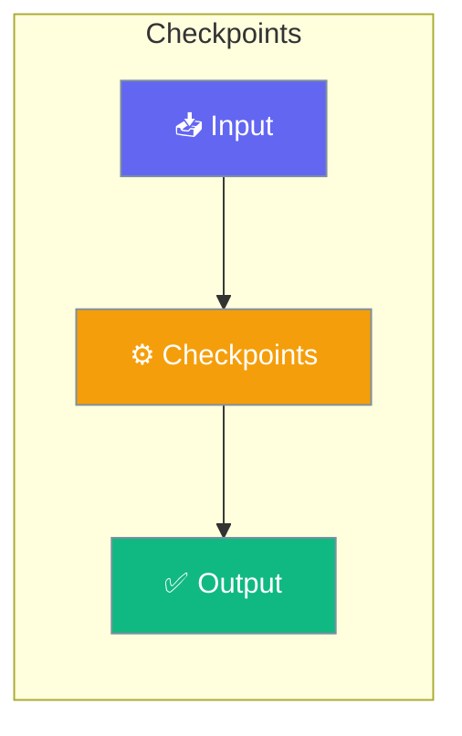

# Shadow Git Checkpointing

The Checkpoints feature provides file-level undo/restore capabilities using a shadow git repository. This enables automatic checkpointing before file modifications, allowing you to rewind to any previous state.




## Quick Start


<Steps>
<Step title="Quick Start">
### Agent-Centric Usage

```python
from praisonaiagents import Agent
from praisonaiagents.checkpoints import CheckpointService

# Create checkpoint service
checkpoints = CheckpointService(workspace_dir="./my_project")

# Agent with checkpoints - auto-saves before file modifications
agent = Agent(
    name="RefactorBot",
    instructions="You are a code refactoring assistant.",
    checkpoints=checkpoints
)

# Checkpoints are saved automatically during agent operations
agent.start("Refactor the codebase to improve readability")

# Access checkpoints via agent
# await agent.checkpoints.restore(checkpoint_id)
# diff = await agent.checkpoints.diff()
```
</Step>
</Steps>


## Best Practices

<AccordionGroup>
  <Accordion title="Start simple">
    Enable the feature with a single parameter before adding configuration. Verify it works, then layer in options.
  </Accordion>
  <Accordion title="Use environment variables for secrets">
    Never hardcode API keys or tokens. Use `os.getenv("KEY_NAME")` to read from environment variables.
  </Accordion>
  <Accordion title="Test with minimal examples first">
    Copy the Quick Start example, run it, then extend it. This confirms your environment is set up correctly.
  </Accordion>
  <Accordion title="Check the logs">
    Set `verbose=True` on your agent to see detailed execution logs when debugging unexpected behavior.
  </Accordion>
</AccordionGroup>

## Related

<CardGroup cols={2}>
  <Card title="Features Overview" icon="grid-2" href="/docs/features">
    Browse all PraisonAI features
  </Card>
  <Card title="Quick Start" icon="rocket" href="/docs/introduction">
    Get started with PraisonAI agents
  </Card>
</CardGroup>
