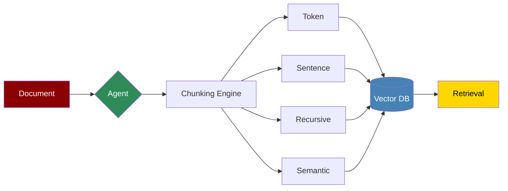
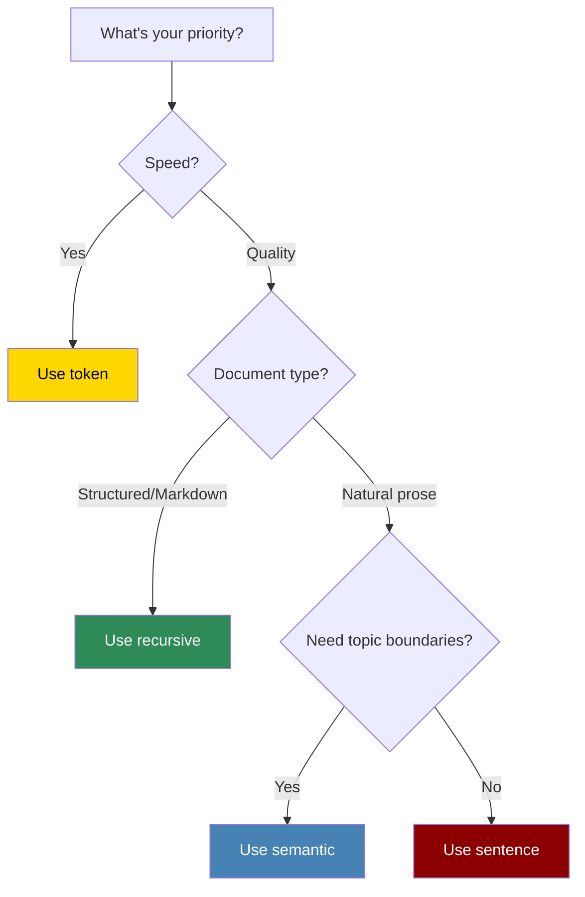

PraisonAI integrates [chonkie](https://github.com/chonkie-inc/chonkie) for high-performance document chunking.

## Quick Start

<CodeGroup>
```python Agent with Chunking (Simplest)
from praisonaiagents import Agent

# Default chunking (token-based)
agent = Agent(
    instructions="Answer questions from documents.",
    knowledge=["research.pdf", "docs/"]
)

response = agent.start("What are the key findings?")
```

```python Agent with Custom Chunking
from praisonaiagents import Agent

agent = Agent(
    instructions="Answer questions from documents.",
    knowledge={
        "sources": ["research.pdf"],
        "chunker": {
            "type": "semantic",       # token, sentence, recursive, semantic, sdpm, late
            "chunk_size": 512,
            "chunk_overlap": 128
        }
    }
)

response = agent.start("What methodology was used?")
```

```python Direct Chunking API
from praisonaiagents.knowledge.chunking import Chunking

# Create chunker
chunker = Chunking(
    chunker_type="recursive",
    chunk_size=512,
    chunk_overlap=128
)

# Chunk text
chunks = chunker.chunk("Your document content here...")
for chunk in chunks:
    print(f"Tokens: {chunk.token_count}")
    print(chunk.text[:100])
```
</CodeGroup>

## Available Strategies

| Strategy | Best For | Speed |
|----------|----------|-------|
| `token` | Fixed-size chunks | ⚡ Fastest |
| `sentence` | Natural boundaries | ⚡ Fast |
| `recursive` | Structured docs (markdown) | ⚡ Fast |
| `semantic` | Topic segmentation | 🔄 Medium |
| `sdpm` | Research papers | 🔄 Medium |
| `late` | Best embeddings | 🔄 Medium |

<CardGroup cols={2}>
  <Card title="Token Chunking" icon="hashtag" href="/features/rag/strategies/token">
    Fixed-size token chunks. Fast and predictable.
  </Card>
  <Card title="Sentence Chunking" icon="paragraph" href="/features/rag/strategies/sentence">
    Split at sentence boundaries. Natural flow.
  </Card>
  <Card title="Recursive Chunking" icon="sitemap" href="/features/rag/strategies/recursive">
    Hierarchical splitting. Great for markdown.
  </Card>
  <Card title="Semantic Chunking" icon="brain" href="/features/rag/strategies/semantic">
    Similarity-based splits. Topic coherence.
  </Card>
</CardGroup>

## Chunker Configuration

### All Parameters

| Parameter | Type | Default | Applies To |
|-----------|------|---------|------------|
| `type` | str | `"token"` | All |
| `chunk_size` | int | 512 | All |
| `chunk_overlap` | int | 128 | token, sentence |
| `tokenizer_or_token_counter` | str | `"gpt2"` | token, sentence, recursive |
| `embedding_model` | str | auto | semantic, sdpm, late |

### Strategy Examples

<Tabs>
  <Tab title="Token">
```python
agent = Agent(
    instructions="Process documents.",
    knowledge={
        "sources": ["docs/"],
        "chunker": {
            "type": "token",
            "chunk_size": 256,
            "chunk_overlap": 50
        }
    }
)
```
  </Tab>
  <Tab title="Sentence">
```python
agent = Agent(
    instructions="Process articles.",
    knowledge={
        "sources": ["articles/"],
        "chunker": {
            "type": "sentence",
            "chunk_size": 512
        }
    }
)
```
  </Tab>
  <Tab title="Recursive">
```python
agent = Agent(
    instructions="Process markdown docs.",
    knowledge={
        "sources": ["README.md", "docs/"],
        "chunker": {
            "type": "recursive",
            "chunk_size": 512
        }
    }
)
```
  </Tab>
  <Tab title="Semantic">
```python
agent = Agent(
    instructions="Process research papers.",
    knowledge={
        "sources": ["papers/"],
        "chunker": {
            "type": "semantic",
            "chunk_size": 512,
            "embedding_model": "all-MiniLM-L6-v2"
        }
    }
)
```
  </Tab>
</Tabs>

## Choosing a Strategy



## Installation

```bash
pip install "praisonaiagents[knowledge]"
```

This installs the chonkie library automatically.

## Related

<CardGroup cols={2}>
  <Card title="Knowledge Base" icon="book" href="/features/knowledge">
    Configure knowledge sources and retrieval
  </Card>
  <Card title="RAG Agents" icon="robot" href="/features/rag">
    Build retrieval-augmented agents
  </Card>
</CardGroup>