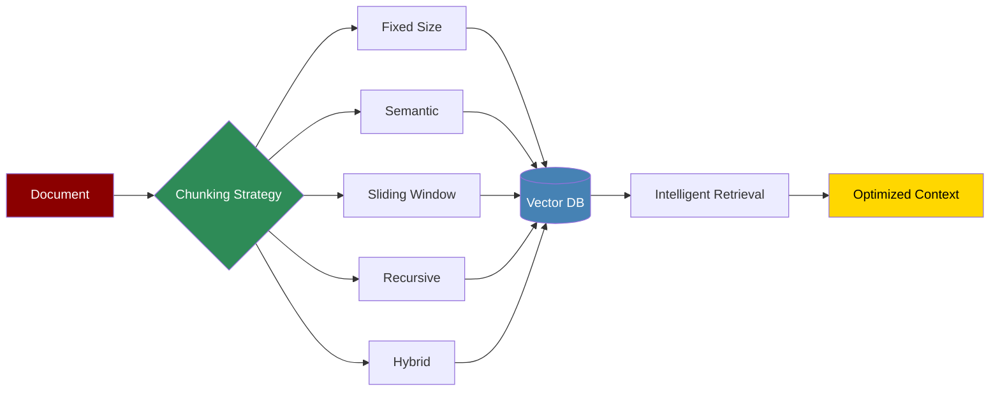

Chunking strategies determine how documents are split for storage and retrieval, directly impacting the quality and efficiency of RAG (Retrieval Augmented Generation) systems.

## Quick Start

<Steps>
    <Step title="Install Package">
        Install with chunking support:
        ```bash
        pip install "praisonaiagents[knowledge]"
        ```
    </Step>

    <Step title="Import Chunking">
        Import chunking utilities:
        ```python
        from praisonaiagents.knowledge import (
            ChunkingStrategy,
            DocumentChunker,
            SemanticChunker,
            RecursiveChunker
        )
        ```
    </Step>

    <Step title="Create Example">
        Create `chunking_example.py`:
        ```python
        from praisonaiagents.knowledge import DocumentChunker, ChunkingStrategy
        from praisonaiagents import Agent, Task, PraisonAIAgents

        # Initialize document chunker
        chunker = DocumentChunker(
            strategy=ChunkingStrategy.SEMANTIC,
            chunk_size=512,
            chunk_overlap=50,
            preserve_context=True
        )

        # Process a document
        document = """
        Your long document content here...
        This could be a research paper, article, or any text document.
        """

        chunks = chunker.chunk_document(
            document,
            metadata={
                "source": "research_paper.pdf",
                "author": "John Doe",
                "date": "2024-01-15"
            }
        )

        print(f"Created {len(chunks)} chunks")
        for i, chunk in enumerate(chunks[:3]):
            print(f"\nChunk {i}:")
            print(f"Content: {chunk.content[:100]}...")
            print(f"Tokens: {chunk.token_count}")
            print(f"Metadata: {chunk.metadata}")

        # Create agent with chunking-aware knowledge base
        research_agent = Agent(
            name="Research Assistant",
            role="Document Analyst",
            goal="Analyze documents efficiently using optimal chunking",
            knowledge_config={
                "chunking_strategy": "semantic",
                "chunk_size": 512,
                "retrieval_method": "hybrid"
            }
        )

        # Create task for document analysis
        analysis_task = Task(
            description="Analyze the research paper and extract key insights",
            expected_output="Summary of main findings",
            agent=research_agent,
            context={"document": document}
        )

        # Run workflow
        workflow = PraisonAIAgents(
            agents=[research_agent],
            tasks=[analysis_task]
        )

        results = workflow.start()
        ```
    </Step>

    <Step title="Run Example">
        Execute the chunking example:
        ```bash
        python chunking_example.py
        ```
    </Step>
</Steps>

## Chunking Strategies

### Fixed-Size Chunking

Simple, fast chunking with fixed character or token counts.

```python
from praisonaiagents.knowledge import FixedSizeChunker

# Character-based chunking
char_chunker = FixedSizeChunker(
    chunk_size=1000,  # 1000 characters
    chunk_overlap=100,  # 100 character overlap
    unit="characters"
)

# Token-based chunking
token_chunker = FixedSizeChunker(
    chunk_size=256,  # 256 tokens
    chunk_overlap=25,  # 25 token overlap
    unit="tokens",
    tokenizer="cl100k_base"  # OpenAI tokenizer
)

chunks = char_chunker.chunk_text(document)
```

### Semantic Chunking

Intelligently splits text based on meaning and context.

```python
from praisonaiagents.knowledge import SemanticChunker

# Initialize semantic chunker
semantic_chunker = SemanticChunker(
    embedding_model="text-embedding-ada-002",
    similarity_threshold=0.8,
    min_chunk_size=100,
    max_chunk_size=1000
)

# Chunk with semantic boundaries
chunks = semantic_chunker.chunk_document(
    document,
    preserve_sentences=True,
    preserve_paragraphs=True
)

# Each chunk maintains semantic coherence
for chunk in chunks:
    print(f"Semantic score: {chunk.coherence_score}")
    print(f"Boundary type: {chunk.boundary_type}")
```

### Sliding Window Chunking

Creates overlapping chunks for better context preservation.

```python
from praisonaiagents.knowledge import SlidingWindowChunker

# Configure sliding window
sliding_chunker = SlidingWindowChunker(
    window_size=512,
    step_size=256,  # 50% overlap
    context_window=50  # Additional context tokens
)

# Create overlapping chunks
chunks = sliding_chunker.chunk_with_context(
    document,
    include_previous=True,
    include_next=True
)

# Useful for maintaining context continuity
for chunk in chunks:
    print(f"Previous context: {chunk.previous_context}")
    print(f"Main content: {chunk.content}")
    print(f"Next context: {chunk.next_context}")
```

### Recursive Chunking

Hierarchically splits documents maintaining structure.

```python
from praisonaiagents.knowledge import RecursiveChunker

# Initialize recursive chunker
recursive_chunker = RecursiveChunker(
    separators=["\n\n", "\n", ". ", " "],  # Hierarchical separators
    chunk_size=1000,
    chunk_overlap=100,
    preserve_structure=True
)

# Chunk maintaining document structure
chunks = recursive_chunker.chunk_hierarchically(
    document,
    maintain_headers=True,
    maintain_lists=True
)

# Access chunk hierarchy
for chunk in chunks:
    print(f"Level: {chunk.hierarchy_level}")
    print(f"Parent: {chunk.parent_id}")
    print(f"Children: {chunk.child_ids}")
```

### Hybrid Chunking

Combines multiple strategies for optimal results.

```python
from praisonaiagents.knowledge import HybridChunker

# Configure hybrid strategy
hybrid_chunker = HybridChunker(
    primary_strategy="semantic",
    fallback_strategy="recursive",
    optimization_goal="retrieval_quality"  # or "speed" or "balance"
)

# Apply hybrid chunking
chunks = hybrid_chunker.smart_chunk(
    document,
    document_type="research_paper",  # Adapts strategy to document type
    quality_threshold=0.85
)

# Get chunking analytics
analytics = hybrid_chunker.get_analytics()
print(f"Strategy distribution: {analytics['strategy_usage']}")
print(f"Average chunk quality: {analytics['avg_quality']}")
```

## Advanced Chunking Features

### Document-Type Specific Chunking

```python
from praisonaiagents.knowledge import DocumentTypeChunker

# Initialize with document type awareness
doc_chunker = DocumentTypeChunker()

# Chunk different document types optimally
# For code files
code_chunks = doc_chunker.chunk_code(
    code_content,
    language="python",
    preserve_functions=True,
    preserve_classes=True,
    include_comments=True
)

# For markdown documents
md_chunks = doc_chunker.chunk_markdown(
    markdown_content,
    preserve_headers=True,
    preserve_code_blocks=True,
    max_header_depth=3
)

# For structured documents (JSON, XML)
structured_chunks = doc_chunker.chunk_structured(
    json_content,
    preserve_objects=True,
    max_nesting_depth=5
)

# For tables and CSVs
table_chunks = doc_chunker.chunk_tabular(
    csv_content,
    preserve_rows=True,
    group_by_column=None,
    max_rows_per_chunk=100
)
```

### Context-Aware Chunking

```python
# Chunking with context preservation
context_chunker = ContextAwareChunker(
    context_window_size=100,
    context_overlap=20
)

# Process with context
contextual_chunks = context_chunker.chunk_with_context(
    document,
    metadata={
        "document_title": "AI Research Paper",
        "section": "Introduction"
    }
)

# Each chunk includes:
for chunk in contextual_chunks:
    print(f"Content: {chunk.content}")
    print(f"Context before: {chunk.context_before}")
    print(f"Context after: {chunk.context_after}")
    print(f"Document context: {chunk.document_metadata}")
```

### Multi-Modal Chunking

```python
from praisonaiagents.knowledge import MultiModalChunker

# Initialize multi-modal chunker
mm_chunker = MultiModalChunker(
    text_strategy="semantic",
    preserve_media_references=True
)

# Process documents with images, tables, etc.
multimodal_chunks = mm_chunker.chunk_multimodal(
    document_path="research_paper.pdf",
    extract_images=True,
    extract_tables=True,
    extract_equations=True
)

for chunk in multimodal_chunks:
    print(f"Type: {chunk.content_type}")
    if chunk.content_type == "text":
        print(f"Text: {chunk.text_content}")
    elif chunk.content_type == "image":
        print(f"Image: {chunk.image_path}")
        print(f"Caption: {chunk.image_caption}")
    elif chunk.content_type == "table":
        print(f"Table: {chunk.table_data}")
```

## Chunking Optimization

### Performance Optimization

```python
# Optimize for speed vs quality
optimization_config = {
    "speed": {
        "strategy": "fixed_size",
        "parallel_processing": True,
        "batch_size": 100
    },
    "quality": {
        "strategy": "semantic",
        "embedding_cache": True,
        "quality_checks": True
    },
    "balanced": {
        "strategy": "hybrid",
        "adaptive_sizing": True,
        "smart_caching": True
    }
}

# Create optimized chunker
optimized_chunker = create_optimized_chunker(
    optimization_goal="balanced",
    **optimization_config["balanced"]
)

# Benchmark different strategies
benchmark_results = benchmark_chunking_strategies(
    document=large_document,
    strategies=["fixed", "semantic", "recursive", "hybrid"],
    metrics=["speed", "quality", "retrieval_accuracy"]
)
```

### Chunk Quality Assessment

```python
from praisonaiagents.knowledge import ChunkQualityAnalyzer

# Initialize quality analyzer
analyzer = ChunkQualityAnalyzer(
    embedding_model="text-embedding-ada-002"
)

# Analyze chunk quality
quality_report = analyzer.analyze_chunks(chunks)

print(f"Average coherence: {quality_report['avg_coherence']}")
print(f"Information density: {quality_report['info_density']}")
print(f"Boundary quality: {quality_report['boundary_quality']}")
print(f"Retrieval score: {quality_report['retrieval_score']}")

# Get recommendations
recommendations = analyzer.get_improvement_recommendations()
for rec in recommendations:
    print(f"Issue: {rec['issue']}")
    print(f"Solution: {rec['solution']}")
```

## Integration with RAG

### Chunking for Retrieval

```python
from praisonaiagents.knowledge import RAGOptimizedChunker

# Create RAG-optimized chunker
rag_chunker = RAGOptimizedChunker(
    embedding_model="text-embedding-ada-002",
    retrieval_model="gpt-3.5-turbo",
    optimization_metric="retrieval_precision"
)

# Chunk and prepare for RAG
rag_chunks = rag_chunker.prepare_for_rag(
    documents=document_list,
    index_name="research_papers",
    create_summaries=True,
    create_questions=True  # Generate questions each chunk can answer
)

# Each chunk includes:
for chunk in rag_chunks:
    print(f"Content: {chunk.content}")
    print(f"Summary: {chunk.summary}")
    print(f"Questions: {chunk.answerable_questions}")
    print(f"Keywords: {chunk.keywords}")
    print(f"Embedding: {chunk.embedding}")
```

### Adaptive Chunking Based on Queries

```python
# Adapt chunking based on query patterns
adaptive_chunker = QueryAdaptiveChunker(
    query_history=previous_queries,
    performance_metrics=retrieval_metrics
)

# Re-chunk based on usage patterns
adaptive_chunks = adaptive_chunker.adapt_chunking(
    document=document,
    frequent_query_types=["definition", "comparison", "example"],
    optimize_for="query_relevance"
)

# Monitor and improve
performance = adaptive_chunker.measure_performance(
    test_queries=test_query_set,
    ground_truth=ground_truth_answers
)
```

## Best Practices

<AccordionGroup>
  <Accordion title="Choose the Right Strategy">
    Select chunking strategy based on content:
    ```python
    strategy_selector = {
        "technical_docs": "recursive",
        "narratives": "semantic", 
        "code": "syntax_aware",
        "mixed_content": "hybrid",
        "structured_data": "structural"
    }
    ```
  </Accordion>

  <Accordion title="Optimize Chunk Size">
    Balance between context and precision:
    ```python
    optimal_sizes = {
        "short_answers": 200-400,  # tokens
        "detailed_explanations": 500-800,
        "code_understanding": 300-600,
        "document_summary": 800-1200
    }
    ```
  </Accordion>

  <Accordion title="Preserve Context">
    Maintain document coherence:
    ```python
    context_config = {
        "overlap_ratio": 0.1-0.2,  # 10-20% overlap
        "boundary_detection": True,
        "sentence_completion": True,
        "paragraph_preservation": True
    }
    ```
  </Accordion>
</AccordionGroup>

## Troubleshooting

<CardGroup cols={2}>
  <Card title="Poor Retrieval Quality" icon="magnifying-glass">
    If retrieval quality is low:
    - Adjust chunk size
    - Increase overlap
    - Try semantic chunking
    - Analyze query-chunk alignment
  </Card>

  <Card title="Performance Issues" icon="gauge">
    If chunking is slow:
    - Use fixed-size for speed
    - Enable parallel processing
    - Cache embeddings
    - Batch operations
  </Card>
</CardGroup>

## Next Steps

<CardGroup cols={2}>
  <Card title="Knowledge Management" icon="book" href="../concepts/knowledge">
    Learn about knowledge bases and retrieval systems
  </Card>
  <Card title="RAG Implementation" icon="magnifying-glass" href="./rag">
    Implement Retrieval Augmented Generation
  </Card>
</CardGroup>

<Note>
  Effective chunking is crucial for RAG system performance. The right strategy can significantly improve retrieval accuracy and response quality while optimizing storage and processing costs.
</Note>