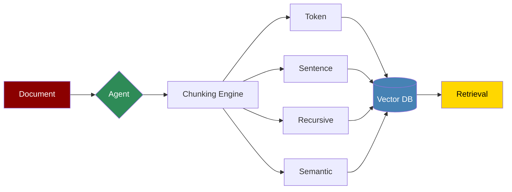

```mermaid
flowchart LR
    Document[Document] --> Agent{Agent}
    Agent --> Chunker[Chunking Engine]
    Chunker --> Token[Token]
    Chunker --> Sentence[Sentence]
    Chunker --> Recursive[Recursive]
    Chunker --> Semantic[Semantic]
    
    Token --> VectorDB[(Vector DB)]
    Sentence --> VectorDB
    Recursive --> VectorDB
    Semantic --> VectorDB
    
    VectorDB --> Retrieval[Retrieval]

    style Document fill:#8B0000,color:#fff
    style Agent fill:#2E8B57,color:#fff
    style VectorDB fill:#4682B4,color:#fff
    style Retrieval fill:#FFD700,color:#000
```

PraisonAI integrates [chonkie](https://github.com/chonkie-inc/chonkie) for high-performance document chunking.

## Quick Start


<Steps>
<Step title="Simple Usage">
<CodeGroup>
```python Agent with Chunking (Simplest)
from praisonaiagents import Agent

# Default chunking (token-based)
agent = Agent(
    instructions="Answer questions from documents.",
    knowledge=["research.pdf", "docs/"]
)

response = agent.start("What are the key findings?")
```
</Step>

<Step title="With Configuration">
```python Agent with Custom Chunking
from praisonaiagents import Agent

agent = Agent(
    instructions="Answer questions from documents.",
    knowledge={
        "sources": ["research.pdf"],
        "chunker": {
            "type": "semantic",       # token, sentence, recursive, semantic, sdpm, late
            "chunk_size": 512,
            "chunk_overlap": 128
        }
    }
)

response = agent.start("What methodology was used?")
```

```python Direct Chunking API
from praisonaiagents import Chunking

# Create chunker
chunker = Chunking(
    chunker_type="recursive",
    chunk_size=512,
    chunk_overlap=128
)

# Chunk text
chunks = chunker.chunk("Your document content here...")
for chunk in chunks:
    print(f"Tokens: {chunk.token_count}")
    print(chunk.text[:100])
```
</CodeGroup>
</Step>
</Steps>


## Best Practices

<AccordionGroup>
  <Accordion title="Start simple">
    Enable the feature with a single parameter before adding configuration. Verify it works, then layer in options.
  </Accordion>
  <Accordion title="Use environment variables for secrets">
    Never hardcode API keys or tokens. Use `os.getenv("KEY_NAME")` to read from environment variables.
  </Accordion>
  <Accordion title="Test with minimal examples first">
    Copy the Quick Start example, run it, then extend it. This confirms your environment is set up correctly.
  </Accordion>
  <Accordion title="Check the logs">
    Set `verbose=True` on your agent to see detailed execution logs when debugging unexpected behavior.
  </Accordion>
</AccordionGroup>

## Related

<CardGroup cols={2}>
  <Card title="Features Overview" icon="grid-2" href="/docs/features">
    Browse all PraisonAI features
  </Card>
  <Card title="Quick Start" icon="rocket" href="/docs/introduction">
    Get started with PraisonAI agents
  </Card>
</CardGroup>
