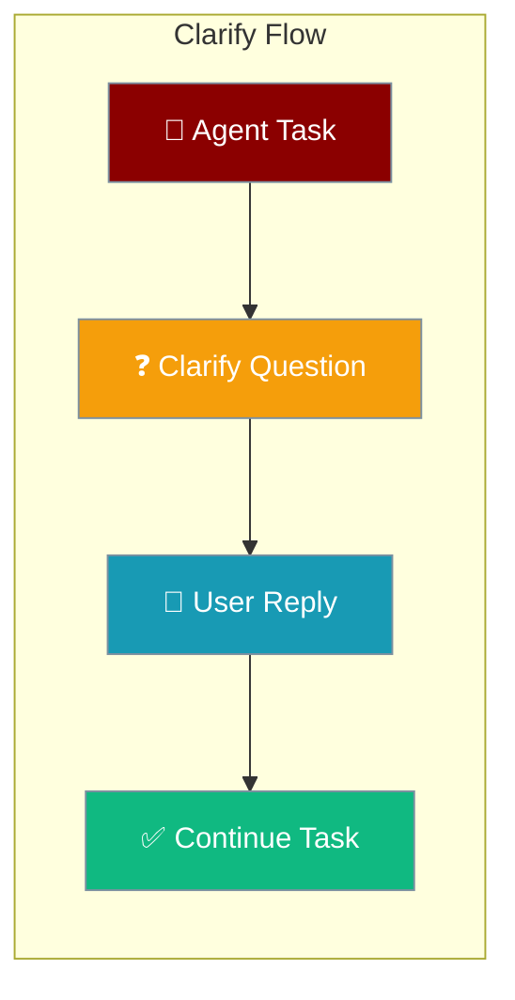
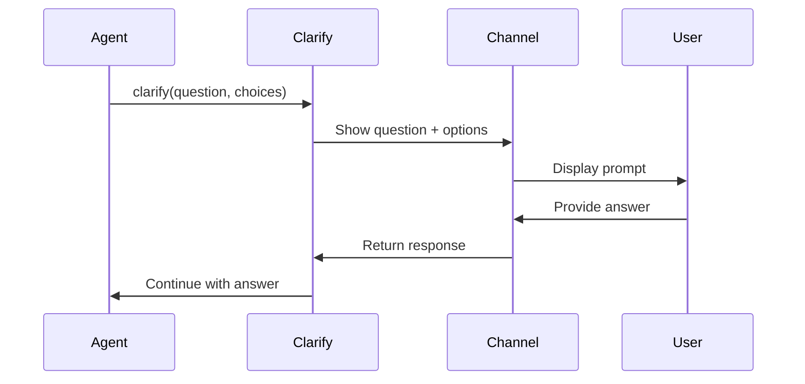

Clarify enables agents to pause mid-task and ask focused questions instead of guessing, improving decision accuracy and user control.



## Quick Start

<Steps>
<Step title="Enable Clarify">

```python
from praisonaiagents import Agent
from praisonaiagents.tools.clarify import clarify

agent = Agent(
    name="Writer",
    instructions="Write code. If requirements are ambiguous, ask clarifying questions.",
    tools=[clarify],
)

agent.start("Build me a web scraper")
# Agent may call: clarify(question="Which language?", choices=["python", "rust"])
```

</Step>

<Step title="With Custom Handler">

```python
from praisonaiagents import Agent
from praisonaiagents.tools.clarify import clarify, create_cli_clarify_handler

# Setup CLI handler for interactive questions
handler = create_cli_clarify_handler()

agent = Agent(
    name="Researcher",
    instructions="Research topics. Ask for clarification when needed.",
    tools=[clarify],
    ctx={"clarify_handler": handler}
)
```

</Step>
</Steps>

---

## How It Works



| Component | Purpose | Behavior |
|-----------|---------|----------|
| **ClarifyTool** | Core tool implementation | Pauses execution for user input |
| **ClarifyHandler** | Channel-specific behavior | Routes questions to CLI/bot/UI |
| **Context Integration** | Runtime handler resolution | Uses ctx['clarify_handler'] if available |

---

## Channel Integration

### CLI Usage

```python
from praisonaiagents.tools.clarify import create_cli_clarify_handler

handler = create_cli_clarify_handler()
# Shows: 🤔 Which language?
# Choices:
#   1. python
#   2. rust
# Your choice (number or text): 1
# Returns: "python"
```

### Bot Usage

```python
from praisonaiagents.tools.clarify import create_bot_clarify_handler

async def send_message(channel_id, text):
    # Send to Telegram/Discord/Slack
    pass

async def wait_for_reply():
    # Wait for user response
    return "python"

handler = create_bot_clarify_handler(send_message, wait_for_reply)
```

### Custom Context Handler

```python
from praisonaiagents import Agent
from praisonaiagents.tools.clarify import clarify

async def my_clarify_handler(question, choices):
    # Custom UI/web interface
    return await show_dialog(question, choices)

agent = Agent(
    name="Assistant",
    tools=[clarify],
    ctx={"clarify_handler": my_clarify_handler}
)
```

---

## Handler Resolution

The tool uses this priority order for handling questions:

```mermaid
graph TD
    A[Clarify Called] --> B{ctx['clarify_handler']?}
    B -->|Yes| C[Use Context Handler]
    B -->|No| D{tool.handler exists?}
    D -->|Yes| E[Use Tool Handler]
    D -->|No| F[Fallback Message]
    
    C --> G[Execute Handler]
    E --> G
    F --> H["No interactive channel available"]
    G --> I[Return Response]
    
    classDef process fill:#189AB4,stroke:#7C90A0,color:#fff
    classDef fallback fill:#F59E0B,stroke:#7C90A0,color:#fff
    classDef result fill:#10B981,stroke:#7C90A0,color:#fff
    
    class A,B,D,G process
    class F,H fallback
    class C,E,I result
```

1. **Context Handler**: `kwargs["ctx"]["clarify_handler"]` (highest priority)
2. **Tool Handler**: `self.handler` (default `ClarifyHandler()`)
3. **Fallback**: Returns guidance message when no interactive channel available

---

## Configuration Options

### Tool Schema

```python
# LLM sees this tool signature:
{
    "name": "clarify",
    "description": "Ask the user a focused clarifying question when genuinely ambiguous. Use sparingly - only when you cannot proceed without their input.",
    "parameters": {
        "type": "object",
        "properties": {
            "question": {
                "type": "string",
                "description": "The clarifying question to ask"
            },
            "choices": {
                "type": "array", 
                "items": {"type": "string"},
                "description": "Optional list of predefined answer choices"
            }
        },
        "required": ["question"]
    }
}
```

### Bot Auto-Approval

```python
from praisonaiagents.bots import BotConfig

config = BotConfig(
    default_tools=["clarify"],  # Included by default
    auto_approve_tools=True     # No approval prompt for clarify
)
```

The `clarify` tool is included in the bot's default auto-approve list, so it won't require manual approval in bot environments.

---

## Common Patterns

### Progressive Clarification

```python
from praisonaiagents import Agent
from praisonaiagents.tools.clarify import clarify

agent = Agent(
    name="CodeWriter",
    instructions="""
    Write code based on user requests. Use clarify for:
    1. Language/framework choice when unspecified
    2. Feature priorities when scope is broad
    3. Architecture decisions when requirements are complex
    """,
    tools=[clarify]
)

# Example interaction:
# User: "Build a REST API"
# Agent: clarify("Which language?", ["python", "node.js", "go"])
# User: "python"  
# Agent: clarify("Which framework?", ["fastapi", "flask", "django"])
```

### Context-Aware Questions

```python
async def smart_clarify_handler(question, choices):
    """Handler that considers conversation context"""
    # Check previous messages for hints
    context = get_conversation_context()
    
    if "python" in context and "web" in question.lower():
        # Auto-suggest based on context
        return "fastapi"
    
    return await show_user_dialog(question, choices)
```

### Fallback Behavior

```python
# When no interactive channel available:
result = await clarify("Which database?", ["postgres", "mysql"])
# Returns: "No interactive channel available. Please proceed with your best judgment for: Which database?"

# Agent can handle this gracefully:
if "no interactive channel" in result.lower():
    # Use reasonable defaults
    database = "postgres"  # Pick sensible default
```

---

## Best Practices

<AccordionGroup>
<Accordion title="Use Sparingly" icon="clock">
Only call clarify when you genuinely cannot proceed without user input. Don't ask for preferences that have reasonable defaults.

**Good**: "Which API endpoint format?" when building an API
**Bad**: "Should I use descriptive variable names?" (obvious default)
</Accordion>

<Accordion title="Provide Clear Choices" icon="list-check">
When possible, offer specific choices rather than open-ended questions.

**Good**: `choices=["fastapi", "flask", "django"]`
**Bad**: `"What Python web framework should I use?"` (no choices)
</Accordion>

<Accordion title="Handle Fallbacks Gracefully" icon="shield-check">
Always check if the response indicates no interactive channel and proceed with sensible defaults.

```python
response = await clarify("Pick a color", ["blue", "red"])
if "no interactive channel" in response.lower():
    color = "blue"  # Use default
else:
    color = response
```
</Accordion>

<Accordion title="Context-Aware Questions" icon="brain">
Frame questions with enough context for users to make informed decisions.

**Good**: "Which authentication method for your user API?"
**Bad**: "Which auth?" (unclear context)
</Accordion>
</AccordionGroup>

---

## Related

<CardGroup cols={2}>
<Card title="Tools Overview" icon="wrench" href="/docs/concepts/tools">
Core tool system and custom tools
</Card>

<Card title="Agent Configuration" icon="cog" href="/docs/concepts/agents">
Agent setup and tool integration
</Card>
</CardGroup>