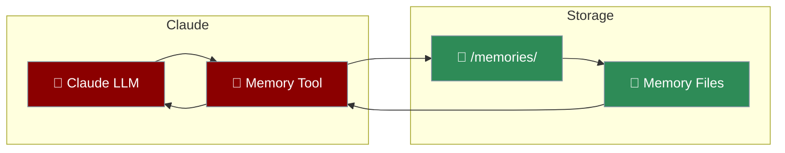

# Claude Memory Tool (Beta)

Enable Claude to autonomously store and retrieve information across conversations using Anthropic's native Memory Tool API. Claude decides what to remember and when to recall information.

<Note>
This feature requires Anthropic Claude models and uses the beta header `context-management-2025-06-27`.
</Note>


```mermaid
graph LR
    subgraph Claude
        LLM[🤖 Claude LLM]
        TOOL[🔧 Memory Tool]
    end
    
    subgraph Storage
        DIR[📁 /memories/]
        FILES[📄 Memory Files]
    end
    
    LLM --> TOOL
    TOOL --> DIR
    DIR --> FILES
    FILES --> TOOL
    TOOL --> LLM
    
    classDef claude fill:#8B0000,stroke:#7C90A0,color:#fff
    classDef storage fill:#2E8B57,stroke:#7C90A0,color:#fff
    
    class LLM,TOOL claude
    class DIR,FILES storage
```

## Quick Start


<Steps>
<Step title="Quick Start">
```python
from praisonaiagents import Agent

# Enable Claude memory (Anthropic models only)
agent = Agent(
    name="Research Assistant",
    llm="anthropic/claude-sonnet-4-20250514",
    memory={"claude_memory": True}
)

# Claude will automatically:
# 1. Check /memories directory before tasks
# 2. Store progress/learnings in files
# 3. Reference memories in future conversations
result = agent.start("Research AI trends and remember key findings")
```
</Step>
</Steps>


## Best Practices

<AccordionGroup>
  <Accordion title="Start simple">
    Enable the feature with a single parameter before adding configuration. Verify it works, then layer in options.
  </Accordion>
  <Accordion title="Use environment variables for secrets">
    Never hardcode API keys or tokens. Use `os.getenv("KEY_NAME")` to read from environment variables.
  </Accordion>
  <Accordion title="Test with minimal examples first">
    Copy the Quick Start example, run it, then extend it. This confirms your environment is set up correctly.
  </Accordion>
  <Accordion title="Check the logs">
    Set `verbose=True` on your agent to see detailed execution logs when debugging unexpected behavior.
  </Accordion>
</AccordionGroup>

## Related

<CardGroup cols={2}>
  <Card title="Features Overview" icon="grid-2" href="/docs/features">
    Browse all PraisonAI features
  </Card>
  <Card title="Quick Start" icon="rocket" href="/docs/introduction">
    Get started with PraisonAI agents
  </Card>
</CardGroup>
