# Claude Memory Tool (Beta)

Enable Claude to autonomously store and retrieve information across conversations using Anthropic's native Memory Tool API. Claude decides what to remember and when to recall information.

<Note>
This feature requires Anthropic Claude models and uses the beta header `context-management-2025-06-27`.

```mermaid
graph LR
    subgraph Claude
        LLM[🤖 Claude LLM]
        TOOL[🔧 Memory Tool]
    end
    
    subgraph Storage
        DIR[📁 /memories/]
        FILES[📄 Memory Files]
    end
    
    LLM --> TOOL
    TOOL --> DIR
    DIR --> FILES
    FILES --> TOOL
    TOOL --> LLM
    
    classDef claude fill:#8B0000,stroke:#7C90A0,color:#fff
    classDef storage fill:#2E8B57,stroke:#7C90A0,color:#fff
    
    class LLM,TOOL claude
    class DIR,FILES storage
```

</Note>



## Quick Start

```python
from praisonaiagents import Agent

# Enable Claude memory (Anthropic models only)
agent = Agent(
    name="Research Assistant",
    llm="anthropic/claude-sonnet-4-20250514",
    claude_memory=True
)

# Claude will automatically:
# 1. Check /memories directory before tasks
# 2. Store progress/learnings in files
# 3. Reference memories in future conversations
result = agent.start("Research AI trends and remember key findings")
```

## Supported Models

| Model | Model ID |
|-------|----------|
| Claude Sonnet 4 | `anthropic/claude-sonnet-4-20250514` |
| Claude Opus 4 | `anthropic/claude-opus-4-20250514` |
| Claude Haiku 4.5 | `anthropic/claude-haiku-4-5-20251001` |
| Claude Sonnet 4.5 | `anthropic/claude-sonnet-4-5-20250929` |
| Claude Opus 4.5 | `anthropic/claude-opus-4-5-20251101` |

## How It Works

The Claude Memory Tool operates client-side with file-based storage:

1. **Tool Definition**: Memory tool is added to Claude's available tools with type `memory_20250818`
2. **Beta Header**: Requests include `anthropic-beta: context-management-2025-06-27`
3. **Autonomous Usage**: Claude decides when to read/write memories
4. **File Storage**: Memories stored in `.praison/claude_memory/{user_id}/memories/`

## Memory Commands

Claude can use these commands through the memory tool:

| Command | Description |
|---------|-------------|
| `view` | List directory contents or read file |
| `create` | Create or overwrite a file |
| `str_replace` | Replace text in a file |
| `insert` | Insert text at a specific line |
| `delete` | Delete a file or directory |
| `rename` | Rename/move a file |

## Storage Structure

```
.praison/claude_memory/{user_id}/
└── memories/
    ├── preferences.md      # User preferences
    ├── projects/           # Project-specific memories
    │   └── ai_research.md
    └── learnings.md        # Key learnings
```

## Configuration

```python
from praisonaiagents import Agent
from praisonaiagents.tools import ClaudeMemoryTool

# Default configuration
agent = Agent(
    name="Assistant",
    llm="anthropic/claude-sonnet-4-20250514",
    claude_memory=True  # Uses default settings
)

# Custom configuration
memory_tool = ClaudeMemoryTool(
    user_id="custom_user",
    base_path=".custom/memory",
    max_file_size=1024 * 1024,  # 1MB
    max_files=100
)

agent = Agent(
    name="Assistant",
    llm="anthropic/claude-sonnet-4-20250514",
    claude_memory=memory_tool
)
```

## Security Features

- **Path Validation**: Prevents directory traversal attacks
- **Size Limits**: Configurable max file size and file count
- **User Isolation**: Separate storage per user_id
- **Sandboxed**: Operations restricted to memory directory

## Example: Research Assistant

```python
from praisonaiagents import Agent

agent = Agent(
    name="Research Assistant",
    role="AI Researcher",
    goal="Research topics and build knowledge over time",
    llm="anthropic/claude-sonnet-4-20250514",
    claude_memory=True,
    user_id="researcher_001"
)

# First session - research and store findings
result1 = agent.start("""
Research the latest developments in AI agents.
Store key findings in your memory for future reference.
""")

# Later session - recall and build upon previous research
result2 = agent.start("""
What did we learn about AI agents previously?
Now research how memory systems are implemented.
""")
```

## Difference from FileMemory

| Feature | Claude Memory Tool | FileMemory |
|---------|-------------------|------------|
| **Control** | Claude decides what to store | Developer controls storage |
| **Format** | Free-form files (md, txt) | Structured JSON |
| **Models** | Anthropic Claude only | All models |
| **Dependencies** | None | None |
| **Use Case** | Autonomous learning | Explicit memory management |

## API Reference

### ClaudeMemoryTool

```python
from praisonaiagents.tools import ClaudeMemoryTool

tool = ClaudeMemoryTool(
    user_id="default",           # User identifier
    base_path=".praison/claude_memory",  # Storage location
    max_file_size=512 * 1024,    # Max file size (512KB)
    max_files=50                 # Max files per user
)

# Get tool definition for API
definition = tool.get_tool_definition()
# Returns: {"type": "memory_20250818", "name": "memory"}

# Get beta header
header = tool.get_beta_header()
# Returns: "context-management-2025-06-27"

# Process tool call from Claude
result = tool.process_tool_call({
    "command": "view",
    "path": "/memories"
})
```

## See Also

<CardGroup cols={2}>
  <Card title="Agent Memory" icon="memory" href="/docs/features/memory">
    Zero-dependency file-based memory for all models
  </Card>
  <Card title="Advanced Memory" icon="brain" href="/docs/features/advanced-memory">
    Multi-tiered memory with quality scoring and graph support
  </Card>
</CardGroup>
