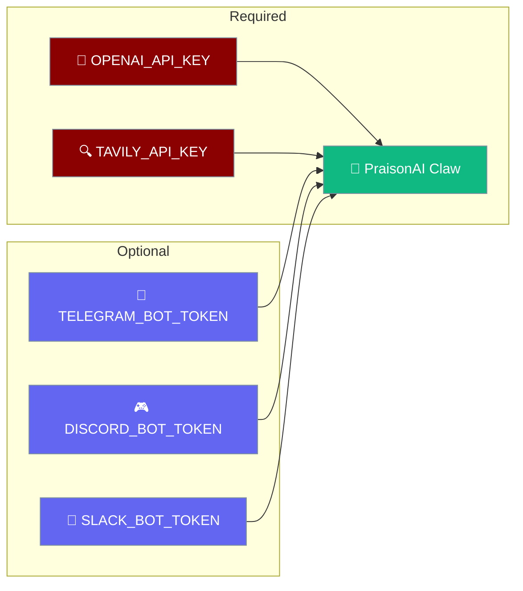
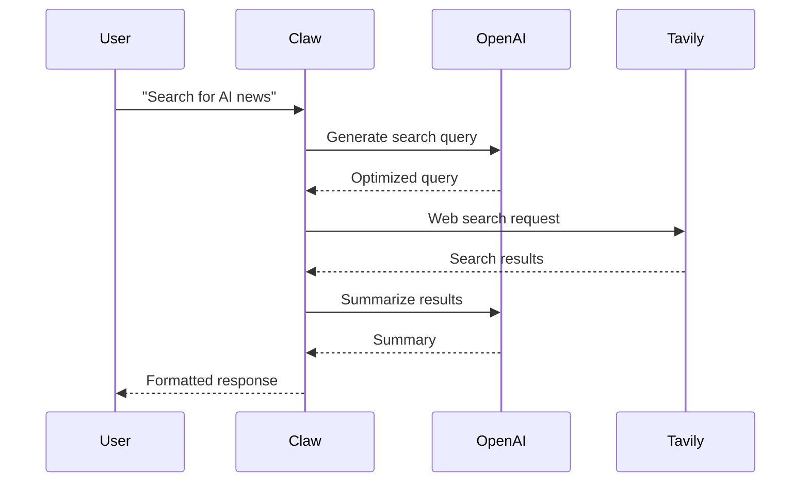

PraisonAI Claw requires specific environment variables to connect to LLM providers and enable features like web search. Copy `.env.example` to `.env` and configure the required variables.



## Quick Start

<Steps>
<Step title="Copy environment template">

If available, copy the environment template:

```bash
cp .env.example .env
```

</Step>

<Step title="Set required API keys">

Configure the two required environment variables:

```bash
export OPENAI_API_KEY="sk-..."
export TAVILY_API_KEY="tvly-..."
```

`TAVILY_API_KEY` powers the built-in web-search tool. Get a free key at [app.tavily.com](https://app.tavily.com).

</Step>

<Step title="Add optional platform tokens">

Add messaging platform tokens as needed:

```bash
export TELEGRAM_BOT_TOKEN="your-telegram-token"
export DISCORD_BOT_TOKEN="your-discord-token"
export SLACK_BOT_TOKEN="your-slack-token"
```

</Step>

</Steps>

---

## Required Variables

These environment variables are required for basic Claw functionality:

| Variable | Used by | Description |
|---|---|---|
| `OPENAI_API_KEY` | All LLM calls | Get one at [platform.openai.com](https://platform.openai.com) |
| `TAVILY_API_KEY` | Built-in web-search tool | Get a free key at [app.tavily.com](https://app.tavily.com) |

<Note>
Without `TAVILY_API_KEY`, the web search functionality will silently fail. Tavily is the primary web search provider with priority fallback to DuckDuckGo.
</Note>

---

## Optional Variables

### Dashboard Security

| Variable | Default | Description |
|---|---|---|
| `PRAISONAI_ALLOW_LOCAL_TOOLS` | `0` | Set to `1` to enable local shell tools (security risk on shared machines) |

### Alternative LLM Providers

Replace or supplement OpenAI with these providers:

| Variable | Provider |
|---|---|
| `ANTHROPIC_API_KEY` | Anthropic Claude |
| `GOOGLE_API_KEY` | Google Gemini |
| `GROQ_API_KEY` | Groq |
| `COHERE_API_KEY` | Cohere |
| `AZURE_OPENAI_API_KEY` + `AZURE_OPENAI_ENDPOINT` | Azure OpenAI |

### Messaging Platform Tokens

Connect Claw to messaging platforms:

| Variable | Platform |
|---|---|
| `TELEGRAM_BOT_TOKEN` | Telegram |
| `DISCORD_BOT_TOKEN` | Discord |
| `SLACK_BOT_TOKEN` + `SLACK_APP_TOKEN` | Slack |
| `WHATSAPP_ACCESS_TOKEN` + `WHATSAPP_PHONE_NUMBER_ID` | WhatsApp |

### Memory, Observability, Database

| Variable | Used for |
|---|---|
| `MEM0_API_KEY` | Mem0 memory backend |
| `REDIS_URL` | Redis state management |
| `LANGFUSE_SECRET_KEY` + `LANGFUSE_PUBLIC_KEY` | Langfuse tracing |
| `DATABASE_URL` | Database connection (defaults to `sqlite:///~/.praison/database.sqlite`) |
| `LOGLEVEL` | Logging level (`DEBUG`, `INFO`, `WARNING`, `ERROR`) |
| `CHAINLIT_AUTH_SECRET` | Chainlit auth secret |

<Tip>
The complete template with all variables is available at [`.env.example`](https://github.com/MervinPraison/PraisonAI/blob/main/.env.example) in the PraisonAI repository.
</Tip>

---

## How It Works



Environment variables control each step:
- `OPENAI_API_KEY` enables LLM processing
- `TAVILY_API_KEY` enables web search capabilities
- Platform tokens enable messaging integrations

---

## Docker Configuration

When using Docker, pass environment variables using `-e` flags:

```bash
# Dashboard with web search
docker run -p 8082:8082 \
  -e OPENAI_API_KEY=sk-xxx \
  -e TAVILY_API_KEY=tvly-xxx \
  praisonai:claw

# Telegram bot
docker run \
  -e OPENAI_API_KEY=sk-xxx \
  -e TAVILY_API_KEY=tvly-xxx \
  -e TELEGRAM_BOT_TOKEN=your-token \
  praisonai:claw praisonai bot telegram
```

<Warning>
Always secure your API keys. Never commit them to version control or share them publicly.
</Warning>

---

## Common Patterns

<AccordionGroup>

<Accordion title="Multiple LLM providers">
Configure backup providers for better reliability:

```bash
export OPENAI_API_KEY="sk-primary-key"
export ANTHROPIC_API_KEY="sk-backup-key"
export GROQ_API_KEY="gsk-fallback-key"
```

Claw will automatically fall back to available providers if the primary fails.
</Accordion>

<Accordion title="Development vs Production">
Use different keys for development and production environments:

```bash
# Development
export OPENAI_API_KEY="sk-dev-key"
export TAVILY_API_KEY="tvly-dev-key"

# Production
export OPENAI_API_KEY="sk-prod-key"
export TAVILY_API_KEY="tvly-prod-key"
export PRAISONAI_ALLOW_LOCAL_TOOLS=0  # Security
```
</Accordion>

<Accordion title="Platform-specific deployments">
Configure only the platforms you need:

```bash
# Telegram-only deployment
export OPENAI_API_KEY="sk-xxx"
export TAVILY_API_KEY="tvly-xxx"
export TELEGRAM_BOT_TOKEN="telegram-token"

# Multi-platform deployment
export TELEGRAM_BOT_TOKEN="telegram-token"
export DISCORD_BOT_TOKEN="discord-token"
export SLACK_BOT_TOKEN="slack-token"
export SLACK_APP_TOKEN="slack-app-token"
```
</Accordion>

</AccordionGroup>

---

## Best Practices

<AccordionGroup>

<Accordion title="API Key Security">
- Store keys in environment files, never in code
- Use different keys for development and production
- Rotate keys regularly for security
- Use `.env` files for local development, secure vaults for production
</Accordion>

<Accordion title="Cost Management">
- Set usage limits in provider dashboards
- Monitor API usage with `LANGFUSE_*` variables for observability
- Use free tiers (Tavily, Groq) where possible
- Configure backup providers to avoid single-point failures
</Accordion>

<Accordion title="Environment Organization">
- Group related variables in your `.env` file
- Comment variables with their purpose
- Use consistent naming conventions
- Validate critical keys at startup
</Accordion>

<Accordion title="Platform Token Management">
- Only configure platforms you actually use
- Test tokens before deploying to production
- Use webhook tokens for better security where supported
- Monitor bot permissions in platform dashboards
</Accordion>

</AccordionGroup>

---

## Related

<CardGroup cols={2}>
<Card title="PraisonAI Claw" icon="lobster" href="/docs/concepts/claw">
  Main Claw documentation and setup guide
</Card>
<Card title="API Keys" icon="key" href="/docs/tools/api-keys">
  Comprehensive API key management guide
</Card>
</CardGroup>