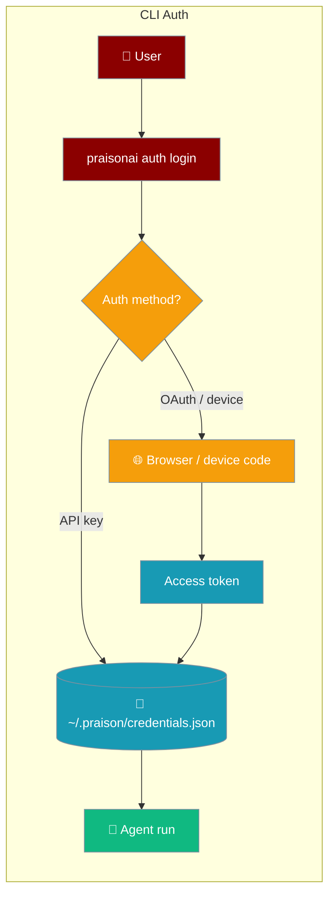
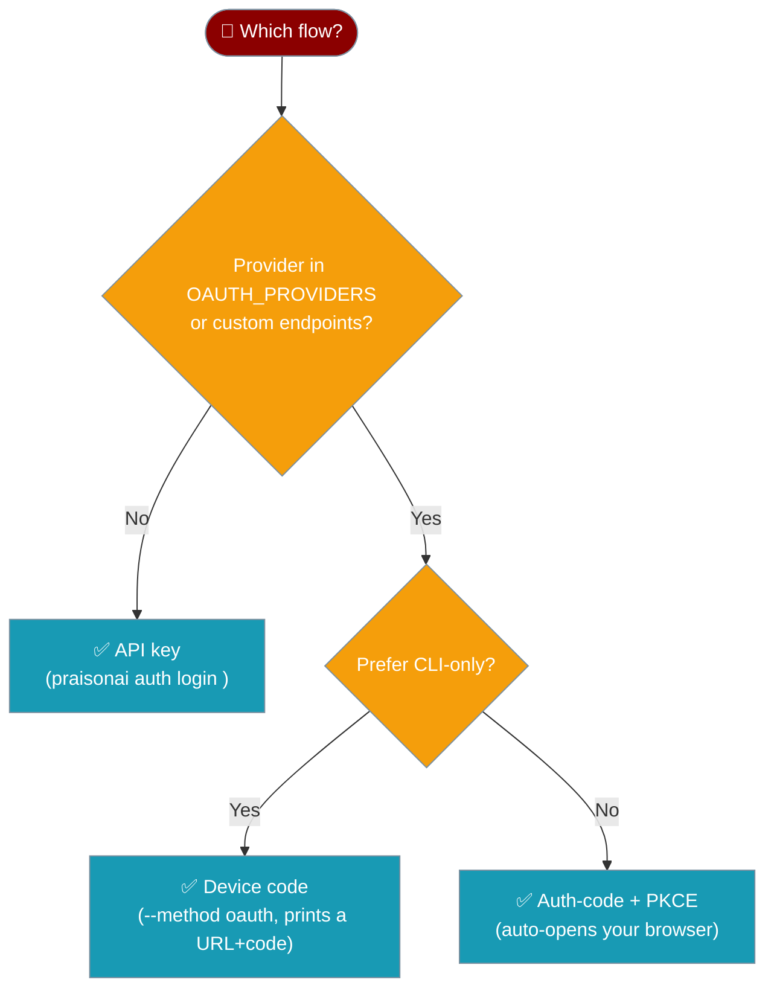
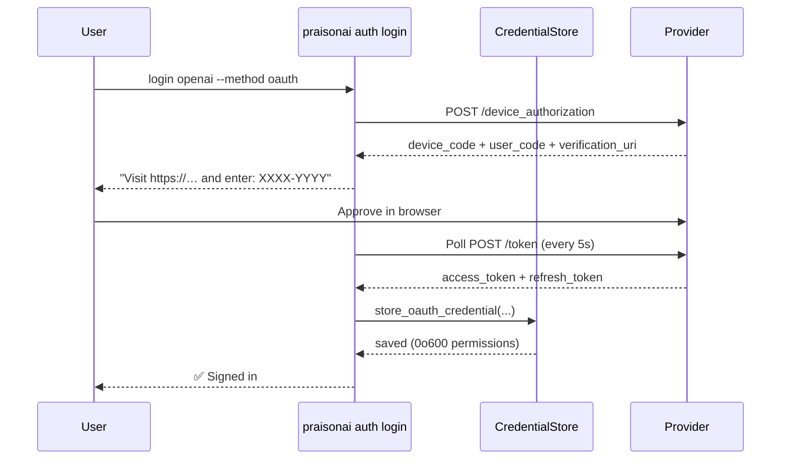

Sign in to any LLM provider once and PraisonAI remembers the credentials for every future run.

```bash
praisonai auth login openai
```



## Quick Start

<Steps>
<Step title="Log in with an API key">
```bash
praisonai auth login openai
```
You will be prompted to paste your API key. It is stored in `~/.praison/credentials.json` with `0o600` permissions (owner read/write only).
</Step>

<Step title="Log in via browser (OAuth)">
```bash
praisonai auth login mygateway --method oauth
```
PraisonAI opens your browser. After you approve access, the short-lived token (plus refresh token) is stored automatically and renewed when it expires.
</Step>

<Step title="Pass a key non-interactively">
```bash
echo "sk-..." | praisonai auth login openai --key-stdin
```
Useful for CI pipelines. The key is read from stdin so it never appears in shell history.
</Step>
</Steps>

---

## Which Flow Should I Use?



---

## How It Works



---

## Commands

### `auth login`

```bash
praisonai auth login <provider> [OPTIONS]
```

| Option | Default | Description |
|--------|---------|-------------|
| `--method` | `auto` | `auto`, `apikey`, or `oauth` |
| `--key` | — | Pass API key directly (avoid for security) |
| `--key-stdin` | `false` | Read key from stdin (CI-safe) |
| `--base-url` | — | Custom endpoint (e.g. self-hosted gateway) |
| `--model` | — | Default model stored alongside the key |
| `--skip-validation` | `false` | Skip format + live API key check |
| `--no-browser` | `false` | Print auth URL instead of opening browser |

### `auth logout`

```bash
praisonai auth logout openai        # remove one provider
praisonai auth logout --all         # remove everything
```

### `auth list`

```bash
praisonai auth list
```

Shows stored providers; API keys are redacted (e.g. `sk-12***34`).

### `auth status`

```bash
praisonai auth status openai
praisonai auth status openai --validate   # live API call to verify key
```

---

## Common Patterns

### Headless CI with API key

```bash
# In your CI environment (key from secret manager):
echo "$OPENAI_API_KEY" | praisonai auth login openai --key-stdin --skip-validation
```

### Register a custom OAuth provider

```python
from praisonai.cli.configuration.oauth import OAuthProviderConfig, OAUTH_PROVIDERS

OAUTH_PROVIDERS["mygateway"] = OAuthProviderConfig(
    flow="device",
    client_id="my-client-id",
    token_url="https://mygateway.example.com/token",
    device_authorization_url="https://mygateway.example.com/device/authorize",
    scope="agents:read agents:write",
)
```

Then log in normally:

```bash
praisonai auth login mygateway --method oauth
```

### Auth-code + PKCE (browser redirect)

PraisonAI starts a short-lived HTTP server on `127.0.0.1` to receive the browser redirect:

```bash
praisonai auth login mygateway --method oauth
# Opens: https://mygateway.example.com/authorize?response_type=code&...
# Browser redirects to http://127.0.0.1:<port>/callback?code=...
# Token exchanged automatically; server shuts down
```

---

## Best Practices

<AccordionGroup>
<Accordion title="Never pass keys via --key in shared environments">
Keys passed with `--key` appear in shell history and process lists. Use `--key-stdin` in scripts and CI, or let the CLI prompt you interactively (input is hidden).
</Accordion>

<Accordion title="Use OAuth for short-lived or rotatable credentials">
OAuth tokens expire (typically in minutes to hours) and are automatically refreshed using the stored refresh token. This limits exposure if `~/.praison/credentials.json` is ever accessed.
</Accordion>

<Accordion title="Credentials file permissions are enforced on every read">
`CredentialStore` checks and corrects permissions to `0o600` on every read — only the file owner can read or write it. On shared machines, run PraisonAI as a dedicated service account.
</Accordion>

<Accordion title="Validate before committing to production">
Run `praisonai auth status <provider> --validate` to perform a cheap live API call before relying on stored credentials in production pipelines.
</Accordion>

<Accordion title="Refresh tokens are stored and rotated automatically">
When a provider returns a new refresh token during a renewal, PraisonAI replaces the old one. If no refresh token is available and the access token expires, the CLI returns `None` instead of forwarding a stale bearer token — forcing a re-login rather than a silent failure.
</Accordion>
</AccordionGroup>

---

## Related

<CardGroup cols={2}>
<Card title="CLI Configuration" icon="sliders" href="/docs/features/cli-configuration">
  Full CLI flag reference and config file locations
</Card>
<Card title="API Server Auth" icon="shield-check" href="/docs/features/api-server-auth">
  Token-based authentication for the agent HTTP server
</Card>
<Card title="Webhook Verification" icon="shield" href="/docs/features/webhook-verification">
  HMAC signature verification for inbound webhooks
</Card>
<Card title="Security Environment Variables" icon="lock" href="/docs/features/security-environment-variables">
  Managing secrets with environment variables
</Card>
</CardGroup>
