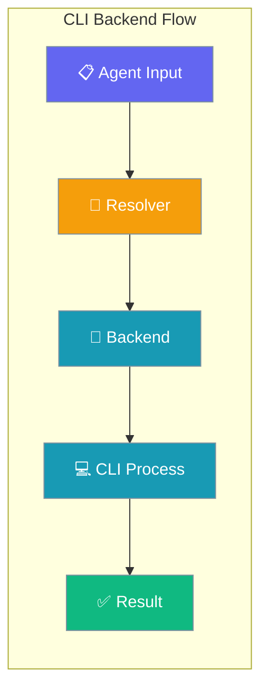
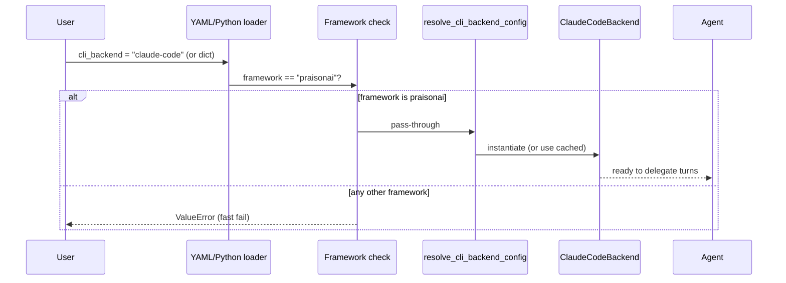
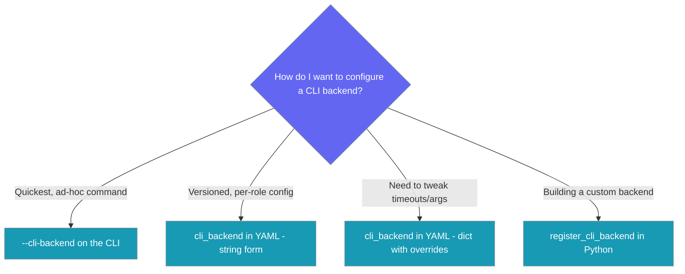
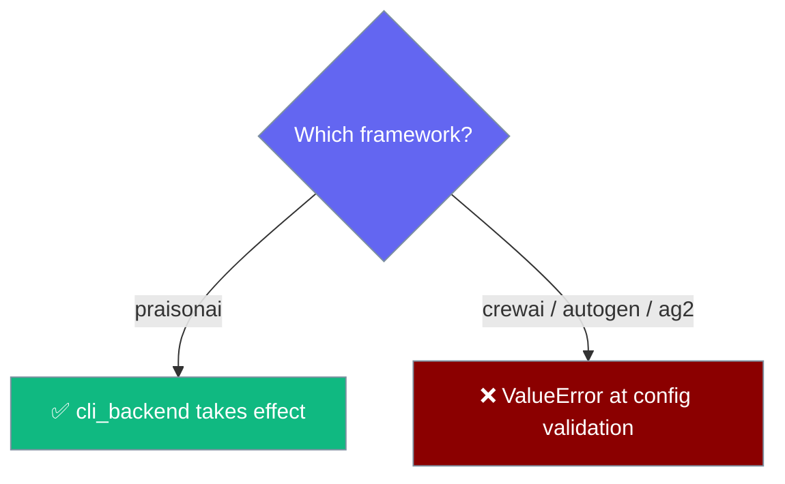

<Warning>
**Deprecated — use [Runtime Selection](/docs/features/runtime-selection) instead.** `cli_backend` still works through 2.0.0 but emits `DeprecationWarning`. For YAML migration, run `praisonai doctor fix --execute` (or the equivalent `praisonai doctor runtime --fix --execute`) — see [Runtime Config Migration](/docs/features/doctor-runtime-migration).

```python
# Before
agent = Agent(instructions="...", cli_backend="claude-code")

# After
agent = Agent(instructions="...", runtime="claude-code")
```
</Warning>


```python
from praisonaiagents import Agent

agent = Agent(name="cli-worker", instructions="Run this turn via an external CLI backend.", runtime="claude-code")
agent.start("Implement the login form.")
```

The user runs an agent turn; the CLI backend resolver spawns the external CLI and returns the result through the same Agent API.

CLI Backends let you run an agent's turn through an external CLI tool (like Claude Code) instead of a Python LLM client, while keeping the same `Agent`/`Task` API.



## Quick Start

<Steps>
<Step title="Simplest: CLI flag">
```bash
praisonai "Refactor utils.py" --cli-backend claude-code
```
</Step>

<Step title="Declarative: YAML">
```yaml
framework: praisonai
topic: coding
roles:
  coder:
    role: Code refactorer
    goal: Refactor Python modules
    backstory: Senior engineer
    cli_backend: claude-code   # string form
    tasks:
      refactor:
        description: Refactor utils.py
        expected_output: Refactored code
```
</Step>

<Step title="YAML with overrides">
```yaml
roles:
  coder:
    role: Code refactorer
    goal: Refactor Python modules
    backstory: Senior engineer
    cli_backend:
      id: claude-code
      overrides:
        timeout_ms: 60000
    tasks:
      refactor:
        description: Refactor utils.py
        expected_output: Refactored code
```
</Step>

<Step title="Discover what's registered">
```bash
praisonai backends list
# claude-code
```
</Step>
</Steps>

---

## How It Works



| Step | Component | Purpose |
|------|-----------|---------|
| 1 | User/CLI | Specifies backend via flag or YAML |
| 2 | Resolver | Factory pattern for backend creation |
| 3 | Backend | Protocol implementation (e.g., ClaudeCodeBackend) |
| 4 | Process | External CLI subprocess execution |
| 5 | Result | Parsed response returned to Agent |

### Permission modes (Claude Code backend)

| Setting | Default (PR #2122) | Notes |
|---------|-------------------|-------|
| `--permission-mode` | `default` | Was `bypassPermissions` |
| `ClaudeCodeBackend(unsafe=...)` | `False` | Set `True` + env var for bypass |

To opt into bypass:

```bash
export PRAISONAI_CLAUDE_BYPASS_PERMISSIONS=1
```

```python
from praisonai.cli_backends.claude import ClaudeCodeBackend

backend = ClaudeCodeBackend(config={...}, unsafe=True)
```

With only `unsafe=True` or only the env var set, the backend overrides to `default` mode and logs a warning.

---

## Configuration Surfaces



---

## The `cli_backend` YAML Field

| Shape | Example | Behavior |
|-------|---------|----------|
| Omitted | _(field absent)_ | No backend used; Agent uses normal LLM client. No warning logged. |
| String | `cli_backend: claude-code` | Resolves via `resolve_cli_backend("claude-code")`. |
| Dict | `cli_backend: {id: claude-code, overrides: {timeout_ms: 60000}}` | Resolves via `resolve_cli_backend("claude-code", overrides={...})`. |
| Empty string | `cli_backend: ""` | **Raises** `ValueError("cli_backend string cannot be empty")`. |
| Dict missing `id` | `cli_backend: {overrides: {...}}` | **Raises** `ValueError("cli_backend dict must contain an 'id' field")`. |
| `overrides` not a dict | `cli_backend: {id: claude-code, overrides: "bad"}` | **Raises** `ValueError("cli_backend.overrides must be a dict")`. |
| Invalid type | `cli_backend: 123` | **Raises** `ValueError("cli_backend must be string, dict, or instance, got: int")`. |
| Unknown id | `cli_backend: nope` | Returns `None` + logged warning. (Registry lookup, unchanged.) |

---

## Framework Compatibility

`cli_backend` only works with `framework: praisonai`.



| `framework` value | `cli_backend` behaviour |
|-------------------|-------------------------|
| `praisonai` (default) | Resolved and used to delegate every agent turn. |
| `crewai`, `autogen`, `autogen_v4`, `ag2` | **Raises** `ValueError: cli_backend requires framework='praisonai', but framework='<x>' was specified`. Validation runs before any agent starts, so no partial run is performed. |

<Note>
This is a behaviour change in PR #1797 — previously `cli_backend` was silently ignored under non-praisonai frameworks. Now it fails loudly at config-load time. A follow-up fix ([PR #2004](https://github.com/MervinPraison/PraisonAI/pull/2004)) restored this validation for `framework: praisonai` — previously a regression caused all `cli_backend` configs to fail at validation regardless of framework.
</Note>

---

## Using `cli_backend` in Python

```python
from praisonaiagents import Agent

# 1. String form — same as YAML
agent = Agent(
    name="Refactorer",
    instructions="Refactor Python files cleanly",
    cli_backend="claude-code",
)

agent.start("Refactor utils.py")
```

```python
# 2. Dict form with overrides — now works in Python too (PR #1797)
agent = Agent(
    name="Refactorer",
    instructions="Refactor Python files cleanly",
    cli_backend={
        "id": "claude-code",
        "overrides": {"timeout_ms": 60000},
    },
)
```

```python
# 3. Pre-resolved instance — full control
from praisonai.cli_backends import resolve_cli_backend

backend = resolve_cli_backend("claude-code", overrides={"timeout_ms": 60000})

agent = Agent(
    name="Refactorer",
    cli_backend=backend,
)
```

| Shape | Example | When to use |
|-------|---------|-------------|
| `str` | `cli_backend="claude-code"` | Quickest path. Matches YAML idiom. |
| `dict` | `cli_backend={"id": "claude-code", "overrides": {...}}` | Need timeout / args / model overrides. |
| instance | `cli_backend=resolve_cli_backend("claude-code", overrides=...)` | Pre-resolved once, reused across agents. |
| `callable` | `cli_backend=my_factory` | Factory function returning a backend. |

<Note>
YAML and Python now accept the exact same shapes (was previously YAML-only for dict).
</Note>

---

## Built-in Backend: `claude-code`

The `claude-code` backend executes commands via the Claude Code CLI with these default settings:

| Option | Type | Default | Description |
|--------|------|---------|-------------|
| `command` | `str` | `"claude"` | CLI command (must be on PATH) |
| `args` | `List[str]` | `["-p", "--output-format", "stream-json", ..., "--permission-mode", "default"]` | Default permission mode is `default` (PR #2122; was `bypassPermissions`) |
| `resume_args` | `List[str]` | `["-p", "--output-format", "stream-json", "--resume", "{session_id}"]` | Arguments for resuming sessions |
| `output` | `str` | `"jsonl"` | Output format expected from CLI |
| `input` | `str` | `"stdin"` | How to pass prompts to CLI |
| `live_session` | `str` | `"claude-stdio"` | Live session mode |
| `model_arg` | `str` | `"--model"` | CLI argument for model selection |
| `model_aliases` | `Dict[str, str]` | `{"opus": "claude-opus-4-5", "sonnet": "claude-sonnet-4-5", "haiku": "claude-haiku-3-5"}` | Model name shortcuts |
| `session_arg` | `str` | `"--session-id"` | CLI argument for session ID |
| `session_mode` | `str` | `"always"` | When to use sessions |
| `session_id_fields` | `List[str]` | `["session_id"]` | Fields containing session ID |
| `system_prompt_arg` | `str` | `"--append-system-prompt"` | CLI argument for system prompts |
| `system_prompt_when` | `str` | `"first"` | When to add system prompts |
| `image_arg` | `str` | `"--image"` | CLI argument for images |
| `clear_env` | `List[str]` | `["ANTHROPIC_API_KEY", "ANTHROPIC_BASE_URL", "ANTHROPIC_OAUTH_TOKEN", "CLAUDE_CODE_USE_BEDROCK", "CLAUDE_CODE_USE_VERTEX", "CLAUDE_CONFIG_DIR", "CLAUDE_CODE_OAUTH_TOKEN", "OTEL_EXPORTER_OTLP_ENDPOINT", "OTEL_EXPORTER_OTLP_HEADERS", "OTEL_RESOURCE_ATTRIBUTES", "GOOGLE_APPLICATION_CREDENTIALS", "AWS_PROFILE", "AWS_REGION", "AWS_ACCESS_KEY_ID", "AWS_SECRET_ACCESS_KEY", "AWS_SESSION_TOKEN"]` | Environment variables sanitized before subprocess |
| `bundle_mcp` | `bool` | `True` | Enable MCP bundling |
| `bundle_mcp_mode` | `str` | `"claude-config-file"` | MCP bundling mode |
| `serialize` | `bool` | `True` | Queue operations to avoid conflicts |
| `timeout_ms` | `int` | `300000` | Subprocess timeout (5 minutes) |

---

## The `--cli-backend` CLI Flag

| Flag | Type | Behavior |
|------|------|----------|
| `--cli-backend BACKEND_ID` | string | Choices populated dynamically from `list_cli_backends()`. Currently: `claude-code`. |
| `--cli-backend X --external-agent Y` | — | **Mutually exclusive** — argparse rejects with "not allowed with argument" |
| Unknown id (e.g. `--cli-backend bogus`) | — | Rejected by argparse with "invalid choice" |

---

## The `backends` Subcommand

| Command | Behavior |
|---------|----------|
| `praisonai backends list` | Prints each registered backend id on its own line |
| `praisonai backends` | Same as `list` (list is the default) |
| `praisonai backends bogus` | Prints `[red]Unknown backends subcommand: bogus[/red]` and the list of valid subcommands |

---

## Custom Backends (Advanced)

Register your own CLI backend for custom tools:

```python
from praisonai.cli_backends import register_cli_backend
from praisonaiagents import CliBackendConfig

def my_backend_factory():
    from my_pkg import MyBackend
    return MyBackend(config=CliBackendConfig(command="my-cli"))

register_cli_backend("my-backend", my_backend_factory)
```

After registering, `praisonai backends list` shows it, `--cli-backend my-backend` accepts it, and `cli_backend: my-backend` works in YAML.

---

## CliBackendProtocol Reference

For backend authors implementing the protocol:

```mermaid
graph LR
    subgraph "CliBackendProtocol"
        A[config: CliBackendConfig] 
        B[async execute(...)]
        C[async stream(...)]
        D[capabilities()]
    end
    
    classDef protocol fill:#8B0000,stroke:#7C90A0,color:#fff
    
    class A,B,C,D protocol
```

- `config: CliBackendConfig` — Configuration object
- `async def execute(prompt, *, session=None, images=None, system_prompt=None, **kwargs) -> CliBackendResult` — Single execution
- `async def stream(prompt, **kwargs) -> AsyncIterator[CliBackendDelta]` — Streaming execution
- `def capabilities() -> RuntimeCapabilityMatrix` — **Required (new).** Returns the capability matrix for this backend.

<Note>
**Breaking change:** `CliBackendProtocol` now requires a `capabilities() -> RuntimeCapabilityMatrix` method so the framework can validate capabilities at config time. Third-party backends must add this method. Without it, the backend will be treated as supporting only the reduced capability set (`tool_loop`, `basic_chat`, `simple_tools`).
</Note>

---

## Best Practices

<AccordionGroup>
<Accordion title="Prefer YAML for production">
Use the YAML `cli_backend:` field for versioned, declarative configuration. Use `--cli-backend` flag for quick one-off commands and testing.
</Accordion>

<Accordion title="Set timeout overrides for slow CLIs">
```yaml
cli_backend:
  id: claude-code
  overrides:
    timeout_ms: 60000  # 1 minute instead of 5
```
Rather than monkey-patching, use the overrides system for custom timeouts.
</Accordion>

<Accordion title="Use framework: praisonai">
The `cli_backend` field requires `framework: praisonai` (the default). PraisonAI now validates this up front — if you try to use it with `crewai`, `autogen`, `autogen_v4`, or `ag2`, you'll get a `ValueError` immediately, before any agent runs.
</Accordion>

<Accordion title="Don't combine with --external-agent">
The `--cli-backend` flag and `--external-agent` flag are mutually exclusive. Pick one approach:
- CLI Backends (new): Pluggable, configurable, YAML-supported
- External Agent (legacy): Class-based, limited configuration
</Accordion>

<Accordion title="Ensure claude CLI is on PATH">
The `claude-code` backend requires the `claude` CLI to be installed and accessible. Install via the Claude Code SDK or ensure it's in your system PATH.
</Accordion>
</AccordionGroup>

---

## How this differs from `--external-agent`

<Note>
The legacy `--external-agent claude` and `ClaudeCodeIntegration` class still work and are unchanged (see [External CLI Integrations](/docs/features/external-cli-integrations)). The CLI Backend Protocol is the **new pluggable** path: backends are registered by id, configured declaratively, and surfaced as a YAML field and `--cli-backend` flag.
</Note>

---

## Related

<CardGroup cols={2}>
<Card title="Runtime Selection" icon="play" href="/docs/features/runtime-selection">
  Model-scoped runtime configuration (replaces cli_backend)
</Card>
<Card title="External CLI Integrations" icon="link" href="/docs/features/external-cli-integrations">
  Legacy class-based CLI integration approach
</Card>
<Card title="Agent Configuration" icon="gear" href="/docs/features/agent-profiles">
  Core Agent configuration and usage patterns
</Card>
</CardGroup>