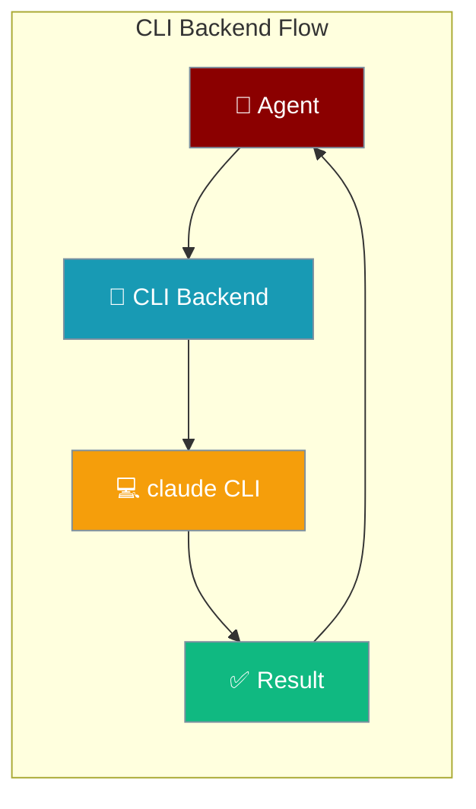
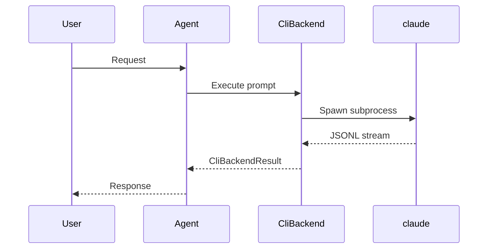
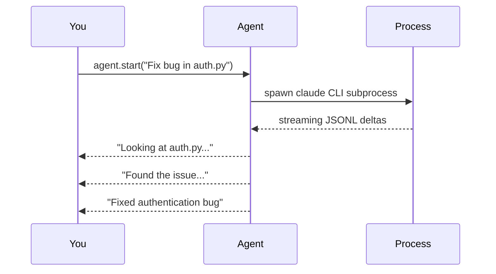

CLI Backend delegates Agent turns to external CLI tools like Claude Code instead of using the built-in LLM directly.



## Quick Start

<Steps>
<Step title="Simple Usage">
```python
from praisonai import Agent

agent = Agent(
    name="Coder",
    instructions="You are a senior Python engineer",
    cli_backend="claude-code"
)

agent.start("Refactor auth.py to use dependency injection")
```
</Step>

<Step title="With Configuration">
```python
from praisonai import Agent
from praisonai.cli_backends import resolve_cli_backend

agent = Agent(
    name="Coder", 
    instructions="You are a senior Python engineer",
    cli_backend=resolve_cli_backend("claude-code", overrides={
        "timeout_ms": 900_000,
        "model_aliases": {"opus": "claude-opus-4-5"}
    })
)
```
</Step>
</Steps>

---

## How It Works



| Step | Description |
|------|-------------|
| **Build Command** | Construct CLI args from config and session |
| **Spawn Process** | Launch subprocess with sanitized environment |
| **Parse Output** | Process JSONL/JSON response stream |
| **Return Result** | Package into CliBackendResult |

---

## Which Option When?

```mermaid
graph TB
    Start[Choose CLI Backend Option] --> Simple{Simple Use?}
    Simple -->|Yes| StringBackend["cli_backend='claude-code'"]
    Simple -->|No| Advanced{Need Config?}
    Advanced -->|Timeout/Model| Overrides["resolve_cli_backend('claude-code', overrides={...})"]
    Advanced -->|Custom CLI| Custom["MyBackend() instance"]
    
    StringBackend --> Works1[✅ Works with praisonai import]
    Overrides --> Works2[✅ Tuned configuration] 
    Custom --> Works3[✅ Full control]
    
    classDef simple fill:#10B981,stroke:#7C90A0,color:#fff
    classDef config fill:#F59E0B,stroke:#7C90A0,color:#fff
    classDef custom fill:#6366F1,stroke:#7C90A0,color:#fff
    
    class StringBackend simple
    class Overrides config  
    class Custom custom
```

---

## Configuration Options

Full `CliBackendConfig` options:

| Option | Type | Default | Purpose |
|--------|------|---------|---------|
| `command` | `str` | (required) | CLI executable, e.g. `"claude"` |
| `args` | `List[str]` | `[]` | Base args |
| `resume_args` | `Optional[List[str]]` | `None` | Args for resume; supports `"{session_id}"` placeholder |
| `session_arg` | `Optional[str]` | `None` | Flag for session id, e.g. `"--session-id"` |
| `session_mode` | `str` | `"none"` | `"always" \| "existing" \| "none"` |
| `session_id_fields` | `List[str]` | `[]` | Fields that bind a session |
| `output` | `str` | `"text"` | `"text" \| "json" \| "jsonl"` |
| `input` | `str` | `"arg"` | `"arg" \| "stdin"` |
| `max_prompt_arg_chars` | `Optional[int]` | `None` | Switch to stdin above this length |
| `model_arg` | `Optional[str]` | `None` | e.g. `"--model"` |
| `model_aliases` | `Dict[str, str]` | `{}` | Short → full id (e.g. `"opus"` → `"claude-opus-4-5"`) |
| `system_prompt_arg` | `Optional[str]` | `None` | e.g. `"--append-system-prompt"` |
| `system_prompt_when` | `str` | `"always"` | `"first" \| "always" \| "never"` |
| `system_prompt_mode` | `str` | `"append"` | `"append" \| "replace"` |
| `image_arg` | `Optional[str]` | `None` | e.g. `"--image"` |
| `image_mode` | `str` | `"repeat"` | `"repeat" \| "list"` |
| `clear_env` | `List[str]` | `[]` | Env vars to strip before launching CLI |
| `env` | `Dict[str, str]` | `{}` | Env vars to set |
| `live_session` | `Optional[str]` | `None` | e.g. `"claude-stdio"` |
| `bundle_mcp` | `bool` | `False` | Pass MCP servers through to the CLI |
| `bundle_mcp_mode` | `Optional[str]` | `None` | e.g. `"claude-config-file"` |
| `serialize` | `bool` | `False` | Queue calls to avoid concurrent conflicts |
| `no_output_timeout_ms` | `Optional[int]` | `None` | Kill if no bytes for this long |
| `timeout_ms` | `int` | `300_000` | Overall timeout (5 min default) |

### ClaudeCodeBackend Defaults

```python
# Built-in ClaudeCodeBackend configuration
command="claude"
args=["-p", "--output-format", "stream-json", "--include-partial-messages", 
      "--verbose", "--setting-sources", "user", "--permission-mode", "bypassPermissions"]
output="jsonl", input="stdin", live_session="claude-stdio"
session_arg="--session-id", session_mode="always"
model_aliases={"opus":"claude-opus-4-5","sonnet":"claude-sonnet-4-5","haiku":"claude-haiku-3-5"}
system_prompt_arg="--append-system-prompt", system_prompt_when="first"
image_arg="--image"
# Environment sanitization - ambient credentials stripped before spawning Claude
clear_env=["ANTHROPIC_API_KEY", "ANTHROPIC_BASE_URL", "ANTHROPIC_OAUTH_TOKEN", 
           "CLAUDE_CODE_USE_BEDROCK", "CLAUDE_CODE_USE_VERTEX", "CLAUDE_CONFIG_DIR",
           "CLAUDE_CODE_OAUTH_TOKEN", "OTEL_EXPORTER_OTLP_ENDPOINT", "OTEL_EXPORTER_OTLP_HEADERS",
           "OTEL_RESOURCE_ATTRIBUTES", "GOOGLE_APPLICATION_CREDENTIALS", "AWS_PROFILE", 
           "AWS_REGION", "AWS_ACCESS_KEY_ID", "AWS_SECRET_ACCESS_KEY", "AWS_SESSION_TOKEN"]
bundle_mcp=True, bundle_mcp_mode="claude-config-file", serialize=True, timeout_ms=300_000
```

---

## Common Patterns

### Pattern A — Swap Backend Per Agent in a Team

```python
from praisonaiagents import Agent, Task, PraisonAIAgents

# Regular LLM agent
analyst = Agent(
    name="Analyst", 
    instructions="Analyze requirements",
    llm="gpt-4o"
)

# CLI backend agent  
coder = Agent(
    name="Coder",
    instructions="Write production code",
    cli_backend="claude-code"
)

task = Task(description="Build a REST API for user management")
agents = PraisonAIAgents(agents=[analyst, coder], tasks=[task])
agents.start()
```

### Pattern B — Tune Timeout and Model Aliases

```python
from praisonai import Agent
from praisonai.cli_backends import resolve_cli_backend

agent = Agent(
    name="Coder",
    instructions="Complex refactoring tasks", 
    cli_backend=resolve_cli_backend("claude-code", overrides={
        "timeout_ms": 900_000,  # 15 minutes for complex tasks
        "model_aliases": {"fast": "claude-haiku-3-5", "best": "claude-opus-4-5"}
    })
)
```

### Pattern C — Register a Custom CLI Backend

```python
from praisonaiagents import CliBackendProtocol, CliBackendConfig
from praisonai.cli_backends import register_cli_backend

class MyCustomBackend:
    def __init__(self):
        self.config = CliBackendConfig(command="my-cli", timeout_ms=60_000)
    
    async def execute(self, prompt, **kwargs):
        # Custom implementation
        pass
    
    async def stream(self, prompt, **kwargs):
        # Custom streaming implementation
        pass

register_cli_backend("my-cli", lambda: MyCustomBackend())

# Usage
agent = Agent(cli_backend="my-cli")
```

---

## User Interaction Flow

When you run `agent.start("...")` with `cli_backend="claude-code"`, the agent spawns a Claude CLI subprocess in the background. You see streaming text output as Claude works, then get the final result packaged into the agent's response.



---

## Best Practices

<AccordionGroup>
<Accordion title="Use praisonai import for string backend IDs">
Prefer `from praisonai import Agent` when passing a string backend id like `"claude-code"`. The wrapper layer handles string resolution automatically.

```python
# ✅ Good - wrapper resolves string
from praisonai import Agent
agent = Agent(cli_backend="claude-code")

# ❌ Harder - manual resolution required  
from praisonaiagents import Agent
from praisonai.cli_backends import resolve_cli_backend
agent = Agent(cli_backend=resolve_cli_backend("claude-code"))
```
</Accordion>

<Accordion title="Bump timeout_ms for long coding tasks">
Default timeout is 5 minutes. Complex refactoring or large file operations may need longer.

```python
cli_backend=resolve_cli_backend("claude-code", overrides={
    "timeout_ms": 900_000  # 15 minutes
})
```
</Accordion>

<Accordion title="Ensure Claude CLI is installed and authenticated">
The CLI backend requires Claude CLI to be installed and authenticated. See [Claude CLI installation guide](./claude-cli#installation) for setup instructions.

```bash
# Install Claude CLI first
curl -fsSL https://claude.ai/install.sh | bash
claude setup-token
```
</Accordion>

<Accordion title="Environment sanitization strips ambient credentials">
`clear_env` removes `ANTHROPIC_API_KEY` and other ambient credentials before spawning Claude. Expect Claude to use its own auth profile rather than environment variables.
</Accordion>
</AccordionGroup>

---

## Related

<CardGroup cols={2}>
<Card title="Claude CLI" icon="message-bot" href="/docs/cli/claude-cli">
  CLI flag version for external agent delegation
</Card>
<Card title="Agents" icon="user" href="/docs/concepts/agents">
  Core Agent class and configuration
</Card>
</CardGroup>