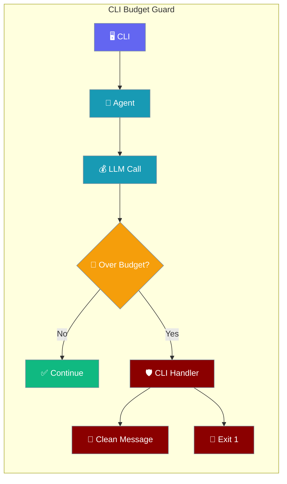
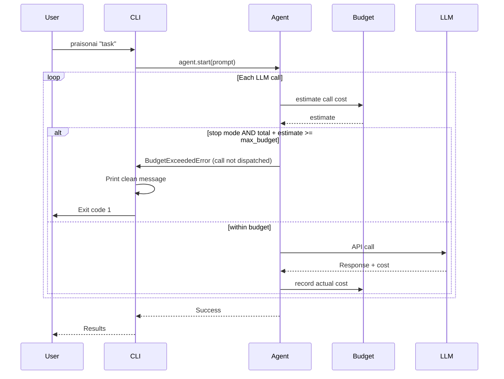

When a `praisonai` CLI run goes over its budget, you get a clean error message and exit-code `1` — no Python traceback.



## Quick Start

<Steps>
<Step title="Set a Budget in Your Agent">
```python
from praisonaiagents import Agent, ExecutionConfig

agent = Agent(
    name="Researcher",
    instructions="Research the topic the user asks about",
    execution=ExecutionConfig(max_budget=1.00)  # USD cap
)

agent.start()  # or run via the praisonai CLI
```
</Step>

<Step title="Run via CLI">
```bash
praisonai "Research the history of AI"
```

If the run goes over `$1.00`, the CLI prints (in red):

```
Budget limit exceeded: Agent 'Researcher' exceeded budget: $1.0042 >= $1.0000.
Hint: set budget via execution=ExecutionConfig(max_budget=1.00) on your Agent.
```

…and exits with code `1`.
</Step>
</Steps>

---

## How It Works



In `stop` mode, the guard fires **before** the LLM is called, so the CLI exits with `1` without spending on the over-budget turn.

The `praisonai` CLI wraps every `agent.start(...)` / `agent.chat(...)` call in a budget handler. When the agent raises `BudgetExceededError`, the CLI:

1. Prints a single-line, red, rich-formatted message including the actionable hint.
2. Exits with code `1` so shell scripts and CI can detect the failure.

This works across **every** CLI display mode: `silent` (`-qq`), `quiet` (`-q`), `verbose` (`-v`), `debug` (`-vv`), `--output jsonl`, `--output json`, `--output flow`, `--output editor`, and default.

---

## Using the Exit Code in CI / Scripts

```bash
if ! praisonai "Research AI trends"; then
    echo "Run failed (likely over budget)"
    exit 1
fi
```

Exit code reference:

| Exit code | Meaning |
|---|---|
| `0` | Success |
| `1` | `BudgetExceededError` (or other handled fatal error) |

---

## Why isn't there a `max_budget=` shortcut on Agent?

By design. Per AGENTS.md §5.3 (Parameter Consolidation), execution-related knobs live on `ExecutionConfig`, not as new top-level `Agent.__init__` parameters. This keeps the `Agent` constructor small and discoverable. The CLI's error message points users to the **one** correct place to set a budget:

```python
Agent(execution=ExecutionConfig(max_budget=1.00))
```

---

## Catching the error in your own code

If you embed `praisonaiagents` directly (not via the CLI), you can catch the same exception:

```python
from praisonaiagents import Agent, ExecutionConfig
from praisonaiagents.errors import BudgetExceededError

agent = Agent(
    name="Writer",
    instructions="Write articles",
    execution=ExecutionConfig(max_budget=0.50)
)

try:
    agent.start("Write about climate change")
except BudgetExceededError as e:
    print(f"{e.agent_name} spent ${e.total_cost:.4f} (cap: ${e.max_budget:.4f})")
```

---

## Best Practices

<AccordionGroup>
  <Accordion title="Set a budget cap early">
    Without `max_budget`, a runaway agent can rack up costs unbounded. Pick a cap based on a few un-budgeted dev runs.
  </Accordion>
  <Accordion title="Use the exit code in automation">
    The graceful exit means CI detects the failure cleanly — no need to grep tracebacks.
  </Accordion>
  <Accordion title="Don't look for a top-level max_budget= on Agent">
    There isn't one. Use `execution=ExecutionConfig(max_budget=...)` — that's the only supported pattern.
  </Accordion>
</AccordionGroup>

---

## Related

<CardGroup cols={2}>
  <Card title="Budget Management" icon="wallet" href="/docs/concepts/budget">
    Full SDK API for budgets, cost tracking, and `on_budget_exceeded` actions
  </Card>
  <Card title="Execution Configuration" icon="gear" href="/docs/configuration/agent-config">
    All execution settings including retries, timeouts, and rate limits
  </Card>
</CardGroup>