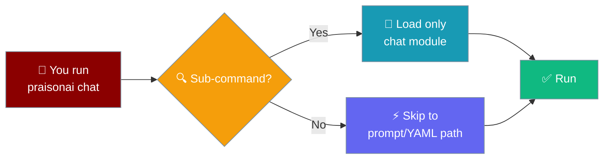
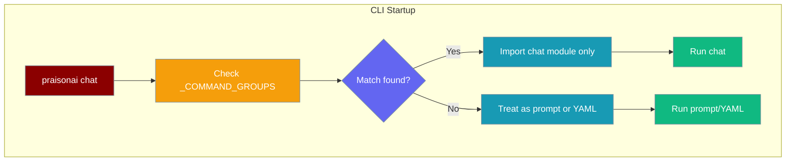

Sub-commands load on demand — only the module you actually use is imported, so every `praisonai` invocation starts in milliseconds regardless of how many commands exist.


```python
from praisonaiagents import Agent

agent = Agent(name="assistant", instructions="You are a helpful CLI assistant.")
agent.start("Hello from a fast-starting CLI session.")
```

The user runs `praisonai chat`; only the chat module loads, so startup stays fast even with many subcommands installed.



## Quick Start

<Steps>
<Step title="Run a prompt directly">
No sub-command is needed — and no sub-command modules load:

```python
from praisonaiagents import Agent

Agent(
    name="Assistant",
    instructions="You are a helpful assistant",
).start("Summarise the latest sales report")
```

The CLI equivalent is identical in startup cost:

```bash
praisonai "Summarise the latest sales report"
```
</Step>

<Step title="Run a sub-command">
Only the matching module loads — the other ~77 commands stay unloaded:

```bash
praisonai chat
```
</Step>

<Step title="List all available commands">
```bash
praisonai --help
```
</Step>
</Steps>

---

## How It Works

PraisonAI keeps a static map of command names (`_COMMAND_GROUPS` in `praisonai/cli/app.py`). When you run `praisonai chat`, the CLI checks that map and imports only the `chat` module. All other ~77 modules are never touched.



---

## Best Practices

<AccordionGroup>
<Accordion title="You don't have to opt in">
Lazy command dispatch is always on — no flag, no environment variable. Every `praisonai` invocation benefits automatically.
</Accordion>

<Accordion title="Adding a new sub-command">
Add an entry to `_COMMAND_GROUPS` in `praisonai/cli/app.py`:

```python
_COMMAND_GROUPS = {
    # existing entries ...
    "mycommand": ".commands.mycommand",
}
```

Without this entry, `praisonai --help` won't list your command and dispatch won't reach it.
</Accordion>

<Accordion title="When things go wrong">
Run the built-in diagnostic to check your CLI setup:

```bash
praisonai doctor
```
</Accordion>
</AccordionGroup>

---

## Related

<CardGroup cols={2}>
<Card title="Lazy Imports & Fast Startup" icon="bolt" href="/docs/features/lazy-imports">
  SDK-side lazy imports for litellm, chromadb, and mem0 — a different but complementary optimization
</Card>
<Card title="Performance Benchmarks" icon="chart-line" href="/docs/features/performance-benchmarks">
  Measured startup times and memory usage across PraisonAI versions
</Card>
</CardGroup>
