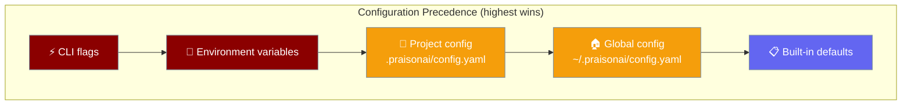
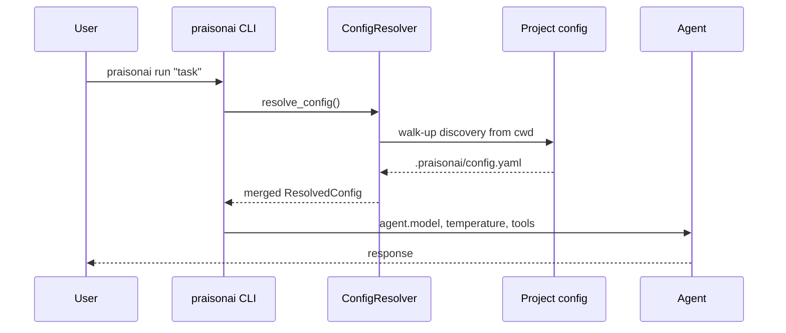
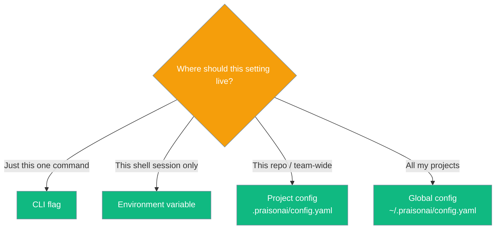

The `praisonai` CLI reads defaults from a layered hierarchy so you can set a model once and have it work everywhere — globally, per project, or per command.



## Quick Start

<Steps>
<Step title="Set a default model">

```bash
praisonai config set agent.model gpt-4o-mini
```

</Step>

<Step title="Run any agent">

```bash
praisonai run "Summarise this README"
```

The model from config is picked automatically — no `--model` flag needed.

</Step>

<Step title="Inspect what was resolved">

```bash
praisonai config show --sources
```

</Step>
</Steps>

When you `praisonai run`, CLI defaults flow into the agent automatically:

```python
from praisonaiagents import Agent

# Model, temperature, and tools come from resolved CLI config
agent = Agent(name="assistant", instructions="Be helpful.")
# praisonai run "..." uses agent.model from ~/.praisonai/config.yaml or project config
```

---

## How It Works



Layers are **deep-merged**. Lists are concatenated. Scalars are overridden by higher layers.

| Layer | Source | Precedence |
|-------|--------|------------|
| 1 | Built-in defaults | Lowest |
| 2 | Global `~/.praisonai/config.yaml` (+ legacy paths) | |
| 3 | Project config (walk-up to git root) | |
| 4 | Environment variables | |
| 5 | CLI flags | Highest |

---

## Project vs Global Config

| Location | Scope | Commit to repo? |
|----------|-------|-----------------|
| `~/.praisonai/config.yaml` | All projects on this machine | No |
| `./.praisonai/config.yaml` | This project (and subdirectories) | Yes |
| `./praison.yaml` / `./praison.yml` | Alternative project names | Yes |
| `./.praison/config.toml` | Legacy TOML (backward compat) | Optional |

Walk-up discovery searches, at each directory from `cwd` up to the git root:

1. `.praisonai/config.yaml`
2. `.praisonai/config.yml`
3. `praison.yaml`
4. `praison.yml`
5. `.praison/config.toml` (legacy)

```yaml
# .praisonai/config.yaml — commit this to your repo
agent:
  model: claude-sonnet-4-6
  temperature: 0.3
  max_tokens: 16000
  tools:
    - search_web
    - read_file
```

```bash
# Anywhere inside the repo (including subdirs):
praisonai run "Find recent benchmarks for retrieval-augmented generation"
# Uses claude-sonnet-4-6 automatically — no --model flag needed
```

---

## Choose Your Scope



---

## Configuration Schema

### `agent.*` defaults

| Key | Type | Default | Notes |
|-----|------|---------|-------|
| `agent.model` | `str` | `None` | e.g. `gpt-4o-mini`, `claude-sonnet-4-6` |
| `agent.provider` | `str` | `None` | e.g. `openai`, `anthropic` |
| `agent.base_url` | `str` | `None` | Custom LLM base URL |
| `agent.tools` | `list[str]` | `[]` | Default tool names |
| `agent.toolset` | `str` | `None` | Named toolset |
| `agent.default_agent` | `str` | `None` | Default agent slug |
| `agent.memory` | `bool` or `dict` | `None` | Enable memory or config dict |
| `agent.stream` | `bool` | `True` | Stream responses |
| `agent.temperature` | `float` | `0.7` | LLM temperature |
| `agent.max_tokens` | `int` | `16000` | LLM token budget |

<Note>
`api_key` is never serialised to YAML — use environment variables or [`praisonai auth`](/docs/cli/auth).
</Note>

### `mcp.servers.<name>`

| Key | Type | Default | Description |
|-----|------|---------|-------------|
| `command` | `list[str]` or `str` | — | Local (stdio) server launch command. List form preferred. |
| `args` | `list[str]` | `[]` | Extra args appended to `command`. |
| `env` | `dict[str, str]` | `{}` | Env vars for the server process. Values containing `,` are skipped on the command-string path. |
| `enabled` | `bool` | `true` | Set `false` to declare-but-not-wire a server. |
| `type` | `"remote"` | — | Marks a remote server; skipped by the run command-string path. |
| `url` | `str` | — | Remote endpoint; presence implies remote. |

### `permissions.*`

| Key | Type | Default | Description |
|-----|------|---------|-------------|
| `default` | `"allow"` \| `"deny"` \| `"ask"` | — | Fallback action when no rule matches. |
| `rules` | `list[{pattern, action}]` | `[]` | Structured rule list. `action` must be `allow`, `deny`, or `ask`. |
| `<pattern>` | `"allow"` \| `"deny"` \| `"ask"` | — | Flat shorthand — same shape as `--allow`/`--deny` produces. |

Example combining all three sections:

```yaml
# .praisonai/config.yaml
agent:
  model: gpt-4o
  temperature: 0.3

mcp:
  servers:
    playwright:
      command: ["npx", "-y", "@playwright/mcp"]

permissions:
  default: ask
  rules:
    - { pattern: "bash:git *", action: allow }
    - { pattern: "bash:rm *",  action: deny }
```

See [Single-Source Config](/docs/features/single-source-config) for a full guide to using all three sections together. Other top-level sections (`output`, `traces`, `session`) are also valid — see [Config CLI reference](/docs/cli/config).

---

## Environment Variables

| Variable | Maps to | Notes |
|----------|---------|-------|
| `MODEL_NAME` | `agent.model` | |
| `OPENAI_MODEL_NAME` | `agent.model` | |
| `PRAISONAI_MODEL` | `agent.model` | |
| `PRAISONAI_PROVIDER` | `agent.provider` | |
| `OPENAI_BASE_URL` | `agent.base_url` | |
| `OPENAI_API_BASE` | `agent.base_url` | |
| `PRAISONAI_BASE_URL` | `agent.base_url` | |
| `PRAISONAI_OUTPUT_FORMAT` | `output.format` | |
| `PRAISONAI_COLOR` | `output.color` | bool: `true`/`1`/`yes` |
| `PRAISONAI_VERBOSE` | `output.verbose` | bool |
| `PRAISONAI_QUIET` | `output.quiet` | bool |
| `PRAISONAI_TELEMETRY` | `telemetry` | bool |

---

## Subcommand Reference

| Command | Flags | Behaviour |
|---------|-------|-----------|
| `praisonai config show` | `--format yaml\|json\|table`, `--sources/-s` | Prints fully resolved config; with `--sources`, lists contributing layers |
| `praisonai config validate [FILE]` | optional FILE | Validates YAML syntax + schema; no arg validates resolved config |
| `praisonai config sources` | none | Prints precedence hierarchy and active layers |
| `praisonai config list` | `--scope all\|user\|project` | Lists resolved values; verbose shows sources |
| `praisonai config get KEY` | dotted path | e.g. `agent.model` |
| `praisonai config set KEY VALUE` | `--scope user\|project` | Writes YAML (`0600` user, `0644` project) |
| `praisonai config reset` | `--scope user\|project`, `-y` | Deletes corresponding `config.yaml` |
| `praisonai config path` | `--scope user\|project` | Shows config file path and existence |
| `praisonai config env` | `--scope`, `--validate` | Registered env vars and validation |
| `praisonai config doctor` | none | Configuration diagnostics |

```bash
# Verify resolution
praisonai config show --sources
# Shows sources: defaults, project:/path/to/repo/.praisonai/config.yaml, ...
```

---

## Backward Compatibility

<AccordionGroup>
<Accordion title="Legacy ~/.praison/config.toml">
Still read on startup if no YAML config exists. RAG and model keys are migrated to the new `agent.*` / `rag.*` schema automatically.
</Accordion>

<Accordion title="Legacy ~/.praisonai/.env">
Model and provider keys from `.env` are merged into the resolved config when no YAML is present.
</Accordion>

<Accordion title="Project .praison/config.toml">
Walk-up discovery still finds legacy TOML project configs and migrates them on read.
</Accordion>
</AccordionGroup>

---

## Best Practices

<AccordionGroup>
<Accordion title="Pin model per project">
Commit `.praisonai/config.yaml` to your repo so teammates get the same defaults.
</Accordion>

<Accordion title="Keep secrets out of YAML">
`api_key` is never serialised; use env vars or `praisonai auth`.
</Accordion>

<Accordion title="Use config sources to debug">
When behaviour surprises you, `praisonai config sources` prints exactly which layer won.
</Accordion>

<Accordion title="Walk-up means subdirectories inherit">
Running `praisonai` from `repo/scripts/` finds `repo/.praisonai/config.yaml`.
</Accordion>
</AccordionGroup>

---

## Related

<CardGroup cols={2}>
<Card title="Config CLI Reference" icon="terminal" href="/docs/cli/config">
  Full subcommand reference for `praisonai config`
</Card>
<Card title="Configuration Index" icon="settings" href="/configuration">
  SDK-level agents, tasks, and memory configuration
</Card>
<Card title="Runtime Selection" icon="play" href="/docs/features/runtime-selection">
  Model-scoped runtime configuration
</Card>
<Card title="LLM Endpoint Config" icon="link" href="/docs/features/llm-endpoint-config">
  Custom base URLs and provider routing
</Card>
<Card title="Single-Source Config" icon="gear" href="/docs/features/single-source-config">
  Model + MCP + permissions in one file
</Card>
</CardGroup>
