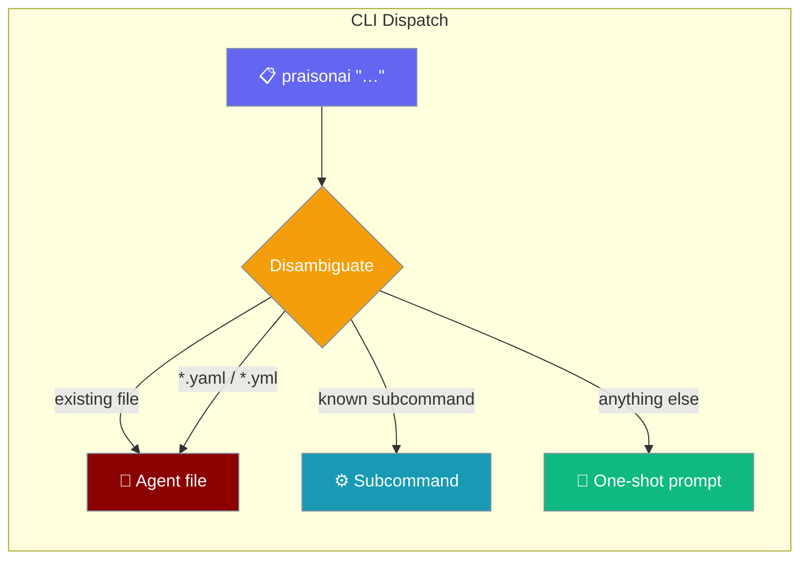

```python
from praisonaiagents import Agent

agent = Agent(name="cli-agent", instructions="Process CLI prompts directly.")
agent.start("Answer: What is the capital of France?")
```


Run an agent with a single bare command — the fastest way to get something done.

```bash
praisonai "summarise this folder"
```



## Quick Start

<Steps>
<Step title="Install PraisonAI">
```bash
pip install praisonai
```
</Step>

<Step title="Set your API key">
```bash
export OPENAI_API_KEY="${OPENAI_API_KEY:?Set OPENAI_API_KEY in your shell}"
```
</Step>

<Step title="Run your first prompt">
```bash
praisonai "Hello"
```

That's it — the agent runs and returns a response immediately.
</Step>
</Steps>

---

## How Disambiguation Works

The CLI inspects the bare positional argument and routes it using these rules (evaluated in order):

| Positional value | Routed as |
|---|---|
| An existing file path on disk | Agent file |
| Ends in `.yaml` or `.yml` (any case) | Agent file |
| A known subcommand (`run`, `chat`, `memory`, …) | Subcommand |
| Anything else (e.g. `"summarise this folder"`) | One-shot direct prompt |

<Note>
When to use `praisonai run` instead: the bare form is a shortcut for simple one-off prompts. Use `praisonai run` when you need flags such as `--output stream-json`, `--model`, `--continue`, `--session`, `--no-rules`, `--allow`, etc. See [praisonai run](/docs/cli/run) for the full flag reference.
</Note>

---

## Examples

```bash
praisonai "What is the capital of France?"
praisonai "Summarize the README.md file"
praisonai "Write a Python function to reverse a string"
praisonai "List the top 5 AI trends in 2025"
```

---

## Best Practices

<AccordionGroup>

<Accordion title="Always quote multi-word prompts">
Wrap your prompt in double quotes to prevent the shell from splitting it into multiple arguments:

```bash
praisonai "summarise this folder"   # correct
praisonai  summarise this folder    # wrong — shell sees separate args
```
</Accordion>

<Accordion title="Avoid name collisions with local files">
If a file named `summarise` exists in your current directory, the CLI treats the positional as a file path. Quote the prompt and ensure it doesn't match a real file name, or use `praisonai run "summarise"` which forces prompt mode.
</Accordion>

<Accordion title="Combining stdin with a positional prompt">
You can pipe content into the CLI and provide a prompt at the same time:

```bash
cat report.txt | praisonai "Summarise the following text"
```

The piped stdin is appended to the agent's context alongside the prompt.
</Accordion>

<Accordion title="Using with different models">
The bare positional form works with any model flag:

```bash
praisonai run "Explain quantum computing" --model gpt-4o
```

The `--model` flag requires `praisonai run` — the bare shortcut form does not accept flags.
</Accordion>

</AccordionGroup>

---

## Related

<CardGroup cols={2}>
  <Card title="praisonai run" icon="play" href="/docs/cli/run">
    Full flag reference for the run subcommand, including output modes, session continuity, and permission controls.
  </Card>
  <Card title="Quick Start" icon="bolt" href="/docs/quickstart">
    End-to-end guide for installing PraisonAI and running your first agent.
  </Card>
</CardGroup>
