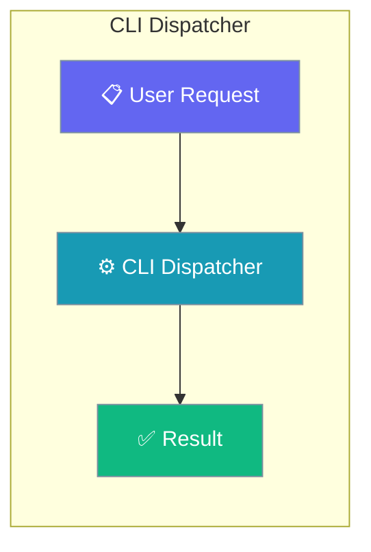
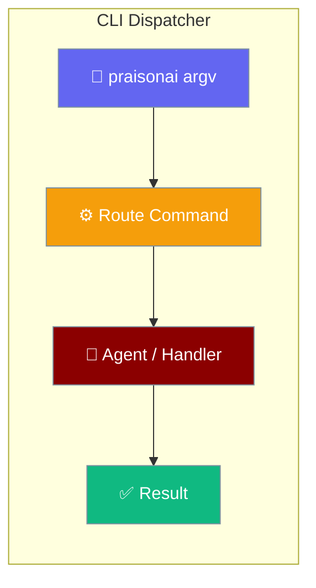
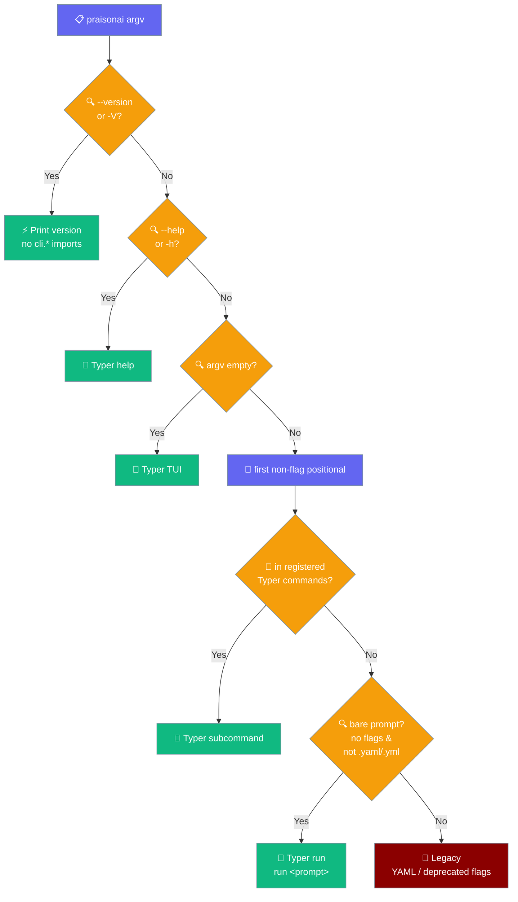
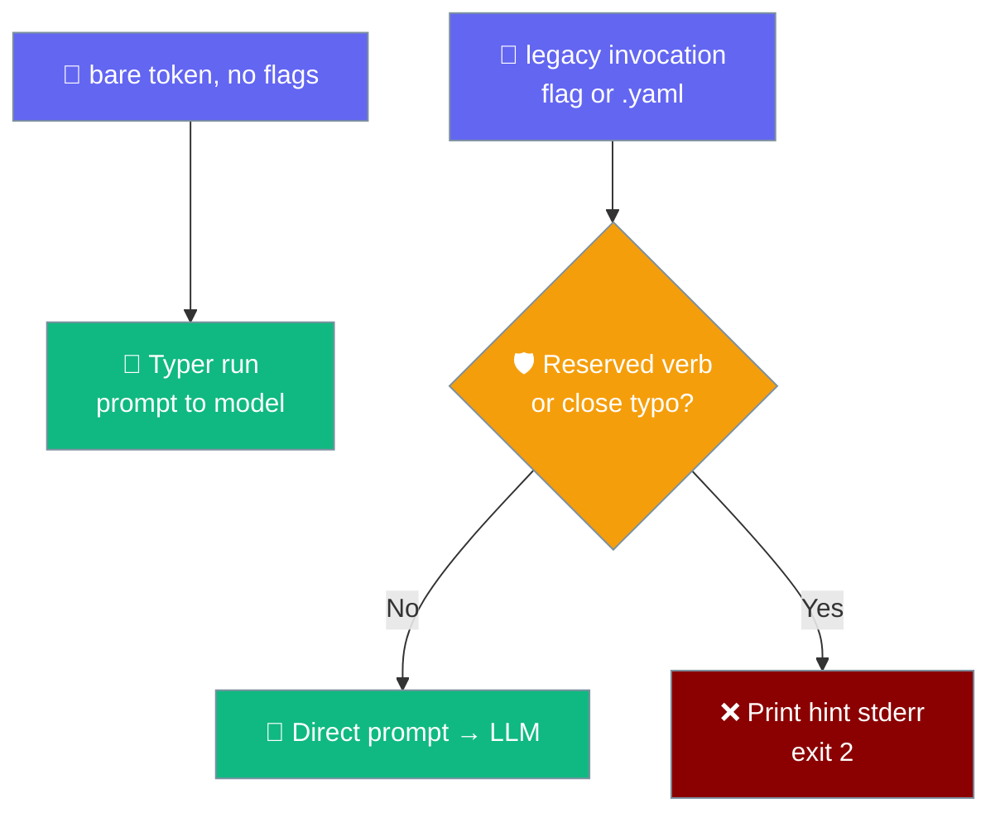

```python
from praisonaiagents import Agent

agent = Agent(name="dispatcher", instructions="Dispatch CLI commands to the right handler.")
agent.start("Run the deploy command with the staging environment.")
```

Just type your prompt — `praisonai "…"` uses the same modern engine as `praisonai run "…"`.

The user types `praisonai …`; the dispatcher routes to Typer subcommands, version flags, bare prompts, or the legacy YAML/flag path.

PraisonAI picks one of six paths based on what you type — and adding a new subcommand means it Just Works.



### Dispatch Paths



## Quick Start

<Steps>
<Step title="Check Version">
```bash
praisonai --version
# Fast path - no heavy imports
```
</Step>

<Step title="Interactive Mode">
```bash
praisonai
# Drops into Typer's interactive TUI
```
</Step>

<Step title="Get Help">
```bash
praisonai --help
# Auto-generated help with all subcommands
```
</Step>

<Step title="Use Subcommands">
```bash
praisonai chat "Build a weather agent"
# Routes to Typer automatically
```
</Step>

<Step title="Free-text Prompts">
```bash
praisonai "Build a weather agent"
# Identical to: praisonai run "Build a weather agent"
```
</Step>
</Steps>

<Note>
**Why route bare prompts to `run`?** A bare prompt inherits the full modern engine: **session continuity** (`--continue` / `--session` / `--fork`), **structured output** (`--output json`, `--output stream-json`), the **local-first credential gate**, and the **permission model + checkpoints**. `praisonai "…"` and `praisonai run "…"` are the same engine underneath.
</Note>

---

## How It Works

```mermaid
sequenceDiagram
    participant User
    participant main()
    participant Typer
    participant Legacy
    
    User->>main(): praisonai command
    main()->>main(): Check routing rules 1-6
    alt --version / -V
        main()->>User: Print version & exit
    else --help / -h
        main()->>Typer: Show help
        Typer-->>User: Auto-generated help
    else No argv
        main()->>Typer: Interactive TUI
        Typer-->>User: TUI interface
    else Known command
        main()->>Typer: Execute subcommand
        Typer-->>User: Command result
    else Bare free-text prompt
        main()->>Typer: run "<prompt>"
        Typer-->>User: Modern engine result
    else YAML / deprecated flags
        main()->>Legacy: PraisonAI().main()
        Legacy-->>User: Legacy behavior
    end
```

| Component | Purpose | Route Decision |
|-----------|---------|---------------|
| `main()` | Entry router | Applies 6 rules in order |
| `_find_first_command()` | Positional finder | Skips flags, finds command |
| `_get_typer_commands()` | Auto-discovery | Cached command introspection |
| `_looks_like_bare_prompt()` | Bare-prompt predicate | True when no flags and not `.yaml`/`.yml` |
| Typer | Subcommand & `run` handler | Registered commands + bare prompts |
| Legacy | Fallback handler | YAML files and deprecated flags |

---

## Routing Rules

`main()` applies six rules in order. The first match wins.

| # | Rule | Route |
|---|---|---|
| 1 | `--version` / `-V` | Version short-circuit — prints version, no `cli.*` imports |
| 2 | `--help` / `-h` | Typer help (auto-generated, lists every subcommand) |
| 3 | No arguments | Typer interactive TUI |
| 4 | First arg is a Typer command | Typer subcommand |
| 5 | Bare free-text prompt | **Typer `run`** (modern engine) |
| 6 | Everything else | Legacy (`.yaml`, deprecated flags) |

Rule 5 fires only when `_looks_like_bare_prompt(argv, first_cmd)` returns `True` — that is, when **all three** hold: `first_cmd` is not empty, **no** `-`/`--` token appears anywhere in argv, and `first_cmd` does not end (case-insensitively) with `.yaml` or `.yml`.

### Behaviour Matrix

| You type | Route | Result |
|---|---|---|
| `praisonai "Create a weather app"` | **Typer `run`** | `target="Create a weather app"` |
| `praisonai build a weather agent` (unquoted) | **Typer `run`** | tokens joined → `target="build a weather agent"` |
| `praisonai hello` (single word, unknown) | **Typer `run`** | `target="hello"` |
| `praisonai totally-unknown` | **Typer `run`** | `target="totally-unknown"` |
| `praisonai show` (reserved verb, bare) | **Typer `run`** | `target="show"` — legacy guard bypassed |
| `praisonai memoyr` (typo of `memory`, bare) | **Typer `run`** | `target="memoyr"` — legacy guard bypassed |
| `praisonai agents.yaml` | **Legacy** | `.yaml`/`.yml` predicate returns False |
| `praisonai "Create a weather app" --framework crewai` | **Legacy** | any flag keeps it on legacy |
| `praisonai --verbose hello` | **Legacy** | leading flag → predicate returns False |
| `praisonai chat "Hello"` | **Typer** | rule 4 fires before rule 5 |
| `praisonai serve` / `call` / `realtime` / `debug` (flagless) | **Typer** | registered commands — rule 4 wins |

<Tip>
An unquoted prompt (`praisonai build a weather agent`) arrives as four argv tokens; the dispatcher joins them with spaces into a single `run` argument so the whole prompt reaches the modern engine intact.
</Tip>

---

## Auto-Discovery

Commands registered in `praisonai/cli/app.py` become routable automatically through Click introspection.

<Note>
**Adding a new subcommand?** Register it in `praisonai/cli/app.py` (e.g. `app.add_typer(my_app, name="mycmd")`) and the dispatcher picks it up automatically — `praisonai mycmd ...` routes to Typer with no changes to `__main__.py`. The command set is discovered once via `click.Context.list_commands()` and cached behind a thread-safe lock.
</Note>

```python
# In praisonai/cli/app.py
from .commands.mycmd import app as mycmd_app

def register_commands():
    # ... other commands ...
    app.add_typer(mycmd_app, name="mycmd", help="My new command")
    # That's it - no dispatcher changes needed
```

The auto-discovery cache (`_get_typer_commands()`) works by:
1. Importing the Typer app and calling `register_commands()`
2. Using Click's introspection to list all registered commands
3. Caching the result in `_typer_commands_cache` with thread safety
4. Returning an empty set on failure (cache not poisoned for retry)

---

## Common Patterns

### Bare Prompt
```bash
praisonai "Create a Python script that scrapes weather data"
# Routes to Typer run - no flags, not a .yaml/.yml file
```

### YAML File
```bash
praisonai agents.yaml
# Routes to legacy - .yaml/.yml token keeps the multi-framework path
```

### Subcommand with Global Flags
```bash
praisonai --verbose chat "Hello world"
# --verbose is skipped when finding first positional (chat)
# Routes to Typer since 'chat' is a registered command
```

---

## Legacy-only guard

The reserved-verb / typo guard is a **legacy-path** behaviour. It fires only when an invocation already reached the legacy dispatcher for another reason — a flag or a `.yaml`/`.yml` file. A plain `praisonai show` now routes to Typer `run` (rule 5) and is sent to the model as the literal prompt `show`.



`classify_unknown_command` in `praisonai/cli/legacy/dispatch/argparse_builder.py` returns a hint string only when a lone token looks like a mistyped or reserved command; otherwise it returns `None` and the token runs as a prompt. This only runs on the legacy path.

### When it fires

| You type | Guard fires? | What happens |
|---|---|---|
| `praisonai show` (bare) | ❌ | routes to Typer `run` as the prompt `show` |
| `praisonai show --framework crewai` | ✅ | flag forces legacy; guard runs, stderr hint, exit 2 |
| `praisonai memoyr` (bare) | ❌ | routes to Typer `run` as the prompt `memoyr` |
| `praisonai memoyr --framework crewai` | ✅ | flag forces legacy; `Did you mean: memory?`, exit 2 |

<Warning>
On the legacy path the hint prints to **stderr** with **exit code 2**. Shell scripts must not swallow stderr if they need the diagnostic.
</Warning>

---

## Best Practices

<AccordionGroup>
<Accordion title="Why --version is fast">
The `--version` flag takes a fast path that prints version information without importing any `praisonai.cli.*` modules. This keeps the command responsive even if optional dependencies are broken or missing. The version check happens before any heavy imports or command discovery.
</Accordion>

<Accordion title="Adding a new subcommand">
To add a new subcommand, simply register it in `praisonai/cli/app.py` using `app.add_typer()`. The dispatcher automatically discovers it through Click introspection with no manual updates needed to routing logic. The command becomes available immediately after registration.
</Accordion>

<Accordion title="Two ways to type it, one engine underneath">
`praisonai "build a weather agent"` and `praisonai run "build a weather agent"` reach the same modern engine. Bare prompts — single word or multi word, quoted or unquoted — route to Typer `run` and inherit session continuity, `--output` modes, the credential gate, and permissions/checkpoints. A single word like `hello` or a reserved verb like `show` is sent to the model as a literal prompt, not blocked.
</Accordion>

<Accordion title="How to force the legacy path">
Add any flag, or use a `.yaml`/`.yml` file. Any `-`/`--` token anywhere in argv keeps the invocation on the legacy dispatcher (which owns `--framework`, `--auto`, `--serve`, and friends). `.yaml`/`.yml` tokens stay on the legacy multi-framework path. The reserved-verb / typo guard only runs once you are already on legacy.
</Accordion>

<Accordion title="Failure visibility">
Registration errors from `register_commands()` propagate directly to the user — the dispatcher does not swallow them. If an optional dependency is missing or a command fails to register, you see the real error instead of silent fallback behavior. This fail-loud approach aids debugging.
</Accordion>
</AccordionGroup>

---

<Warning>
**Registration errors fail loud.** If `register_commands()` raises (e.g. an `ImportError` from a missing optional dep), the exception propagates from `praisonai ...` — you see the real error, not Typer's "no command" page. This is intentional and pinned by tests.
</Warning>

---

## Related

<CardGroup cols={2}>
<Card title="CLI Reference" icon="book-open" href="/docs/cli/cli-reference">
  Complete command reference
</Card>
<Card title="CLI Commands" icon="terminal" href="/docs/cli/cli">
  Basic CLI usage guide
</Card>
<Card title="Gateway" icon="globe" href="/docs/features/gateway">
  Multi-bot WebSocket gateway
</Card>
<Card title="Version" icon="tag" href="/docs/cli/version">
  Version management
</Card>
</CardGroup>