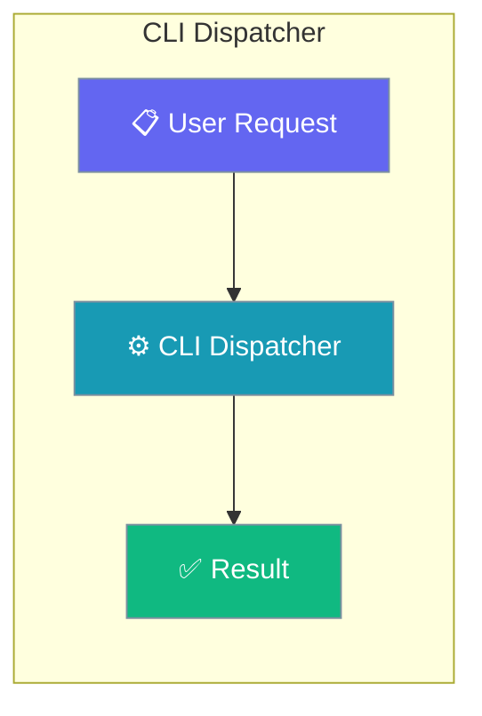
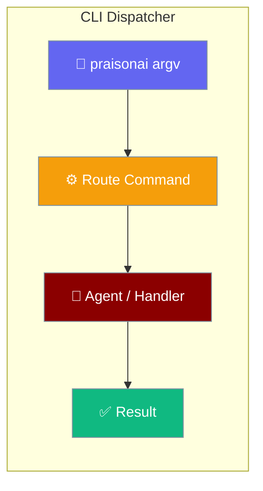
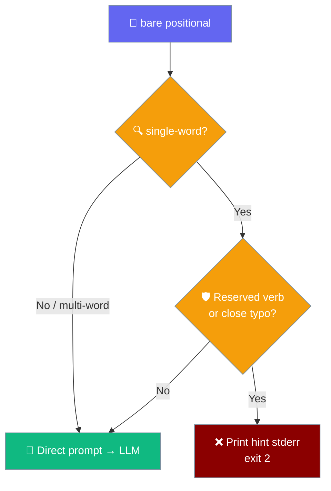

```python
from praisonaiagents import Agent

agent = Agent(name="dispatcher", instructions="Dispatch CLI commands to the right handler.")
agent.start("Run the deploy command with the staging environment.")
```

The user types `praisonai …`; the dispatcher routes to Typer subcommands, version flags, or the legacy prompt path.

PraisonAI picks one of five paths based on what you type — and adding a new subcommand means it Just Works.



### Dispatch Paths

```mermaid
graph TB
    Start[📋 praisonai argv] --> V{🔍 --version<br/>or -V?}
    V -->|Yes| Print[⚡ Print version<br/>no cli.* imports]
    V -->|No| H{🔍 --help<br/>or -h?}
    H -->|Yes| Typer1[🧰 Typer help]
    H -->|No| E{🔍 argv empty?}
    E -->|Yes| Typer2[🧰 Typer TUI]
    E -->|No| F[🔎 first non-flag positional]
    F --> K{🧠 in registered<br/>Typer commands?}
    K -->|Yes| Typer3[🧰 Typer subcommand]
    K -->|No| Legacy[🤖 Legacy<br/>PraisonAI().main]
    Legacy --> C{🔍 single-word<br/>bare positional?}
    C -->|No / multi-word| Prompt[🤖 Direct prompt → LLM]
    C -->|Yes| G{🛡 Reserved verb<br/>or close typo?}
    G -->|No| Prompt
    G -->|Yes| Guard[❌ Print hint stderr<br/>exit 2]

    classDef input fill:#6366F1,stroke:#7C90A0,color:#fff
    classDef check fill:#F59E0B,stroke:#7C90A0,color:#fff
    classDef route fill:#10B981,stroke:#7C90A0,color:#fff
    classDef agent fill:#8B0000,stroke:#7C90A0,color:#fff

    class Start input
    class V,H,E,K,C,G check
    class F input
    class Print,Typer1,Typer2,Typer3,Prompt route
    class Legacy,Guard agent
```

## Quick Start

<Steps>
<Step title="Check Version">
```bash
praisonai --version
# Fast path - no heavy imports
```
</Step>

<Step title="Interactive Mode">
```bash
praisonai
# Drops into Typer's interactive TUI
```
</Step>

<Step title="Get Help">
```bash
praisonai --help
# Auto-generated help with all subcommands
```
</Step>

<Step title="Use Subcommands">
```bash
praisonai chat "Build a weather agent"
# Routes to Typer automatically
```
</Step>

<Step title="Free-text Prompts">
```bash
praisonai "Build a weather agent"
# Routes to legacy for direct prompts
```
</Step>
</Steps>

---

## How It Works

```mermaid
sequenceDiagram
    participant User
    participant main()
    participant Typer
    participant Legacy
    
    User->>main(): praisonai command
    main()->>main(): Check routing rules 1-5
    alt --version / -V
        main()->>User: Print version & exit
    else --help / -h
        main()->>Typer: Show help
        Typer-->>User: Auto-generated help
    else No argv
        main()->>Typer: Interactive TUI
        Typer-->>User: TUI interface
    else Known command
        main()->>Typer: Execute subcommand
        Typer-->>User: Command result
    else Unknown/prompt/YAML
        main()->>Legacy: PraisonAI().main()
        Legacy-->>User: Legacy behavior
    end
```

| Component | Purpose | Route Decision |
|-----------|---------|---------------|
| `main()` | Entry router | Applies 5 rules in order |
| `_find_first_command()` | Positional finder | Skips flags, finds command |
| `_get_typer_commands()` | Auto-discovery | Cached command introspection |
| Typer | Subcommand handler | Registered commands only |
| Legacy | Fallback handler | Everything else |

---

## Routing Rules

| # | What you type | Route | Notes |
|---|---|---|---|
| 1 | `praisonai --version` / `praisonai -V` | Version short-circuit | Prints version and returns. Does **not** import `praisonai.cli.*` — stays fast even with broken optional deps. Pinned by `TestVersionShortCircuit`. |
| 2 | `praisonai --help` / `praisonai -h` | Typer | Typer's auto-generated help lists every registered subcommand (auto-discovered, no manual list). |
| 3 | `praisonai` (no argv) | Typer | Drops into Typer's interactive TUI. |
| 4 | `praisonai --verbose` / `praisonai -o json` (only flags) | Typer | `_find_first_command` returns `None` → Typer handles global-flag-only cases. |
| 5 | `praisonai chat ...` (first positional ∈ registered commands) | Typer | Auto-discovered via Click introspection of `app`. Adding a new subcommand to `cli/app.py` makes it routable here with **zero dispatcher changes**. |
| 6 | `praisonai "Build a weather agent"` (free-text — token contains a space) | Legacy → direct prompt | Multi-word prompts skip the guard and run as a one-shot prompt. |
| 7 | `praisonai agents.yaml` (filename, not a registered command) | Legacy → direct prompt | Routing decision is by **command-set membership**, NOT by `os.path.isfile()`. A typo'd YAML path also routes to legacy and surfaces there. |
| 8 | `praisonai hello` (single word, not a typo of any command) | Legacy → direct prompt | An unrecognised single word still runs as a prompt (backward-compatible). |
| 9 | `praisonai show` (reserved verb) | Guard → stderr hint, exit 2 | `classify_unknown_command` catches reserved verbs and prints a suggestions list instead of a paid LLM call. |
| 10 | `praisonai memoyr` (single-word typo of `memory`) | Guard → stderr hint, exit 2 | `difflib.get_close_matches(cutoff=0.8)` matches the typo and prints `Did you mean: memory?`. |

---

## Auto-Discovery

Commands registered in `praisonai/cli/app.py` become routable automatically through Click introspection.

<Note>
**Adding a new subcommand?** Register it in `praisonai/cli/app.py` (e.g. `app.add_typer(my_app, name="mycmd")`) and the dispatcher picks it up automatically — `praisonai mycmd ...` routes to Typer with no changes to `__main__.py`. The command set is discovered once via `click.Context.list_commands()` and cached behind a thread-safe lock.
</Note>

```python
# In praisonai/cli/app.py
from .commands.mycmd import app as mycmd_app

def register_commands():
    # ... other commands ...
    app.add_typer(mycmd_app, name="mycmd", help="My new command")
    # That's it - no dispatcher changes needed
```

The auto-discovery cache (`_get_typer_commands()`) works by:
1. Importing the Typer app and calling `register_commands()`
2. Using Click's introspection to list all registered commands
3. Caching the result in `_typer_commands_cache` with thread safety
4. Returning an empty set on failure (cache not poisoned for retry)

---

## Common Patterns

### Bare Prompt
```bash
praisonai "Create a Python script that scrapes weather data"
# Routes to legacy - spaces in token indicate free-text prompt
```

### YAML File
```bash
praisonai agents.yaml
# Routes to legacy - filename not in registered command set
```

### Subcommand with Global Flags
```bash
praisonai --verbose chat "Hello world"
# --verbose is skipped when finding first positional (chat)
# Routes to Typer since 'chat' is a registered command
```

---

## Unknown-command guard

The dispatcher intercepts single-word command-like tokens so a mistyped verb never becomes a paid LLM call.



`classify_unknown_command` in `praisonai/cli/legacy/dispatch/argparse_builder.py` returns a hint string only when a lone token looks like a mistyped or reserved command; otherwise it returns `None` and the token runs as a prompt.

| Input token | Classification | Result |
|---|---|---|
| `""` / `None` | Not guarded | Runs as prompt |
| `"write a poem"` (contains a space) | Not guarded | Runs as prompt |
| `show` (reserved verb, case-insensitive) | Guarded | `Unknown command: 'show'` + suggestions |
| `memoyr` (close typo of `memory`, cutoff `0.8`) | Guarded | `Unknown command: 'memoyr'` + `Did you mean: memory?` |
| `hello` (single word, no match) | Not guarded | Runs as prompt |

### When it fires

| You type | Guard fires? | What happens |
|---|---|---|
| `praisonai show` | ✅ reserved verb | stderr hint listing `paths` / `version show` / `memory show` / `config show`, exit 2 |
| `praisonai memoyr` | ✅ close typo (cutoff 0.8) | stderr `Did you mean: memory?` + `praisonai run "<prompt>"` hint, exit 2 |
| `praisonai hello` | ❌ single word, unmatched | routed as a direct prompt |
| `praisonai "write a poem"` | ❌ multi-word | routed as a direct prompt |
| `praisonai run "show"` | ❌ argument to `run`, not a top-level token | LLM sees `"show"` as a prompt |

<Warning>
The hint prints to **stderr** with **exit code 2**. Shell scripts must not swallow stderr if they need the diagnostic.
</Warning>

<Tip>
To send a single word to the model, wrap it in `praisonai run "<word>"` — arguments to `run` bypass the guard by construction.
</Tip>

---

## Best Practices

<AccordionGroup>
<Accordion title="Why --version is fast">
The `--version` flag takes a fast path that prints version information without importing any `praisonai.cli.*` modules. This keeps the command responsive even if optional dependencies are broken or missing. The version check happens before any heavy imports or command discovery.
</Accordion>

<Accordion title="Adding a new subcommand">
To add a new subcommand, simply register it in `praisonai/cli/app.py` using `app.add_typer()`. The dispatcher automatically discovers it through Click introspection with no manual updates needed to routing logic. The command becomes available immediately after registration.
</Accordion>

<Accordion title="Free-text prompts vs. typo'd command names">
Multi-word bare positionals (e.g. `praisonai "build a weather agent"`) still fall through to legacy and run as a direct prompt. Single-word tokens go through `classify_unknown_command` first: a reserved verb like `show` or a close typo like `memoyr` fails fast with a hint on **stderr** and exits with code **2**, while an unrecognised single word (e.g. `hello`) still runs as a prompt for backward compatibility. Use `praisonai run "hello"` to send a genuine single-word prompt.
</Accordion>

<Accordion title="Failure visibility">
Registration errors from `register_commands()` propagate directly to the user — the dispatcher does not swallow them. If an optional dependency is missing or a command fails to register, you see the real error instead of silent fallback behavior. This fail-loud approach aids debugging.
</Accordion>
</AccordionGroup>

---

<Warning>
**Registration errors fail loud.** If `register_commands()` raises (e.g. an `ImportError` from a missing optional dep), the exception propagates from `praisonai ...` — you see the real error, not Typer's "no command" page. This is intentional and pinned by tests.
</Warning>

---

## Related

<CardGroup cols={2}>
<Card title="CLI Reference" icon="book-open" href="/docs/cli/cli-reference">
  Complete command reference
</Card>
<Card title="CLI Commands" icon="terminal" href="/docs/cli/cli">
  Basic CLI usage guide
</Card>
<Card title="Gateway" icon="globe" href="/docs/features/gateway">
  Multi-bot WebSocket gateway
</Card>
<Card title="Version" icon="tag" href="/docs/cli/version">
  Version management
</Card>
</CardGroup>