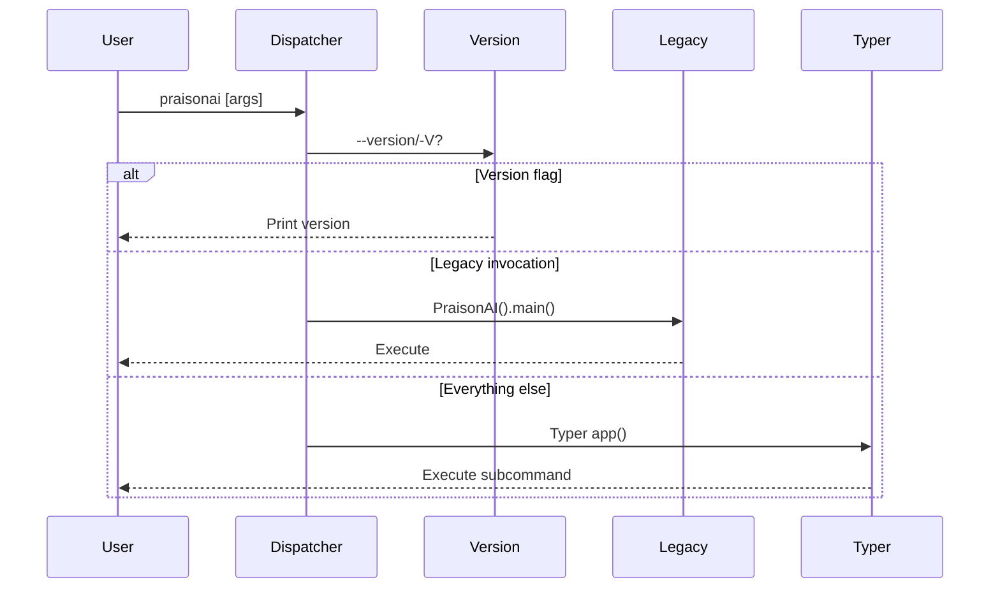

PraisonAI picks one of three paths based on what you type.

```mermaid
graph TB
    Start[📋 praisonai argv] --> V{🔍 --version/-V?}
    V -->|Yes| Print[⚡ Print version<br/>no Typer import]
    V -->|No| L{🔍 Legacy?<br/>free-text or<br/>existing YAML}
    L -->|Yes| Legacy[🤖 PraisonAI().main()]
    L -->|No| Typer[🧰 Typer app()]

    classDef input fill:#6366F1,stroke:#7C90A0,color:#fff
    classDef check fill:#F59E0B,stroke:#7C90A0,color:#fff
    classDef route fill:#10B981,stroke:#7C90A0,color:#fff

    class Start input
    class V,L check
    class Print,Legacy,Typer route
```

## Quick Start

<Steps>
<Step title="Version Check">
```bash
praisonai --version
# Fast — prints version without importing Typer
```
</Step>

<Step title="Legacy Invocation">
```bash
# Free-text prompt (has spaces)
praisonai "Build a weather agent"

# Existing YAML file
praisonai agents.yaml
```
</Step>

<Step title="Typer Subcommand">
```bash
# Registered subcommands route to Typer
praisonai chat --model gpt-4o
praisonai ui --port 8080
```
</Step>
</Steps>

---

## How It Works



---

## Routing Rules

| What you type | Route | Why |
|---|---|---|
| `praisonai --version` / `praisonai -V` | Version short-circuit | Prints version without importing `praisonai.cli.*` (stays fast even with broken optional deps) |
| `praisonai` (no args) | Typer | No legacy match → Typer shows help |
| `praisonai --help` | Typer | Leading flag is never legacy |
| `praisonai chat ...` (registered subcommand) | Typer | Bare identifier with no spaces, not a YAML file → Typer |
| `praisonai "Build a weather agent"` (free-text, has spaces) | Legacy `PraisonAI()` | First token contains a space |
| `praisonai agents.yaml` (file exists) | Legacy `PraisonAI()` | Ends in `.yaml`/`.yml` AND `os.path.isfile()` is true |
| `praisonai /typo/agents.yaml` (does NOT exist) | Typer | YAML-looking path that doesn't exist falls through so Typer can show "command not found" |

---

## Common Patterns

<Tabs>
<Tab title="Version Check">
```bash
# Fast version reporting
praisonai --version
praisonai -V

# Works even if optional dependencies are broken
```
</Tab>

<Tab title="Legacy Mode">
```bash
# Free-text prompts
praisonai "Create a research agent for market analysis"
praisonai "Build a chatbot with web search"

# YAML configuration files
praisonai ./config/agents.yaml
praisonai /path/to/workflow.yml
```
</Tab>

<Tab title="Modern CLI">
```bash
# Help and subcommands
praisonai --help
praisonai chat --model claude-3-5-sonnet-20241022
praisonai ui --port 3000 --host 0.0.0.0
praisonai gateway start --config gateway.yaml
```
</Tab>
</Tabs>

---

## Best Practices

<AccordionGroup>
<Accordion title="Use --version for health checks">
`praisonai --version` is the fastest way to check if PraisonAI is installed and working. It short-circuits before importing heavy modules, so it works even if optional dependencies are missing.

```bash
# In scripts or health checks
if praisonai --version > /dev/null 2>&1; then
    echo "PraisonAI is available"
fi
```
</Accordion>

<Accordion title="Quote free-text prompts">
Always wrap multi-word prompts in quotes to ensure they're treated as a single argument:

```bash
# Good
praisonai "Build a weather forecast agent"

# Bad (parsed as separate arguments)
praisonai Build a weather forecast agent
```
</Accordion>

<Accordion title="Check YAML files exist">
Non-existent YAML paths fall through to Typer for better error messages. If you have a typo in your path, you'll see "command not found" instead of silent failure:

```bash
# Typo in filename → clear error
praisonai agentss.yaml
# Error: No such command 'agentss.yaml'
```
</Accordion>

<Accordion title="Prefer subcommands for automation">
Use specific subcommands instead of legacy mode in scripts for better error handling and flag support:

```bash
# Good for scripts
praisonai chat --model gpt-4o --max-tokens 1000

# Works but less flexible
praisonai "Chat with GPT-4o"
```
</Accordion>
</AccordionGroup>

---

## Dispatcher Behavior

**`--version` is fast** — short-circuits before importing `praisonai.cli.*`, so version reporting works even if optional deps are broken.

**`sys.argv` is always restored** after dispatch — relevant if you're calling `praisonai.__main__.main()` programmatically.

**Errors fail loud** — if `register_commands()` raises (e.g. missing optional dep), the exception propagates instead of silently routing to legacy.

**Exit codes propagate** — legacy `main()` returning `False` → exit code 1; `SystemExit(2)` from Typer → exit code 2.

**Non-existent YAML paths route to Typer**, not legacy — so `praisonai /typo/agents.yaml` shows a clean "command not found" instead of being silently swallowed by the legacy runner.

---

## Related

<CardGroup cols={2}>
<Card title="Workflow CLI" icon="terminal" href="/features/cli">
Learn about specific CLI commands and options
</Card>
<Card title="Gateway" icon="tower-broadcast" href="/features/gateway">
Long-running server processes and graceful shutdown
</Card>
</CardGroup>