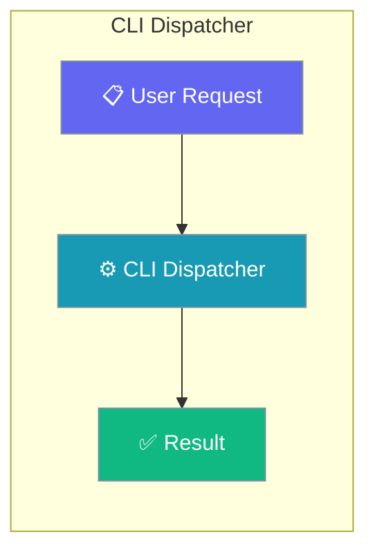
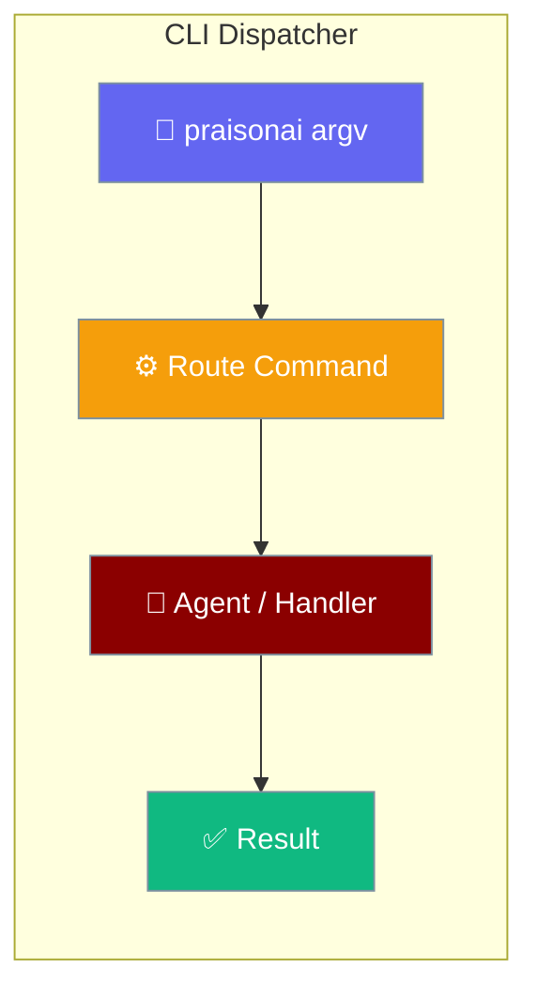
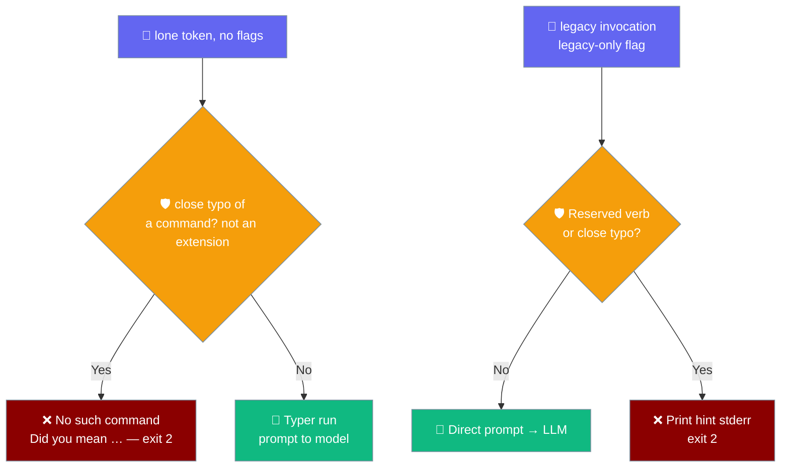

```mermaid
graph LR
    subgraph "CLI Dispatcher"
        Request[📋 User Request] --> Process[⚙️ CLI Dispatcher]
        Process --> Result[✅ Result]
    end

    classDef input fill:#6366F1,stroke:#7C90A0,color:#fff
    classDef process fill:#189AB4,stroke:#7C90A0,color:#fff
    classDef output fill:#10B981,stroke:#7C90A0,color:#fff

    class Request input
    class Process process
    class Result output
```


```python
from praisonaiagents import Agent

agent = Agent(name="dispatcher", instructions="Dispatch CLI commands to the right handler.")
agent.start("Run the deploy command with the staging environment.")
```

Just type your prompt — `praisonai "…"` uses the same modern engine as `praisonai run "…"`.

The user types `praisonai …`; the dispatcher routes to Typer subcommands, version flags, bare prompts, or the legacy YAML/flag path.

PraisonAI picks one of nine paths based on what you type — and adding a new subcommand means it Just Works.


```mermaid
graph LR
    subgraph "CLI Dispatcher"
        In[📝 praisonai argv] --> Route[⚙️ Route Command]
        Route --> Agent[🤖 Agent / Handler]
        Agent --> Out[✅ Result]
    end

    classDef input fill:#6366F1,stroke:#7C90A0,color:#fff
    classDef process fill:#F59E0B,stroke:#7C90A0,color:#fff
    classDef agent fill:#8B0000,stroke:#7C90A0,color:#fff
    classDef output fill:#10B981,stroke:#7C90A0,color:#fff

    class In input
    class Route process
    class Agent agent
    class Out output
```

### Dispatch Paths

```mermaid
graph TB
    Start[📋 praisonai argv] --> V{🔍 --version<br/>or -V?}
    V -->|Yes| Print[⚡ Print version<br/>no cli.* imports]
    V -->|No| H{🔍 --help<br/>or -h?}
    H -->|Yes| Typer1[🧰 Typer help]
    H -->|No| E{🔍 argv empty?}
    E -->|Yes| Typer2[🧰 Typer TUI]
    E -->|No| F[🔎 first non-flag positional]
    F --> K{🧠 in registered<br/>Typer commands?}
    K -->|Yes| Typer3[🧰 Typer subcommand]
    K -->|No| L{🛡 implemented<br/>legacy verb?<br/>(oracle)}
    L -->|Yes| LegHandler[🤖 Legacy handler<br/>_run_legacy]
    L -->|No| T{🛡 lone token,<br/>close typo of a command?}
    T -->|Yes| Guard[❌ No such command<br/>Did you mean … — exit 2]
    T -->|No| B{🔍 bare prompt?<br/>flags all run-supported &amp;<br/>not .yaml/.yml}
    B -->|Yes| Run[🧰 Typer run<br/>run &lt;prompt&gt;]
    B -->|No| Y{🔍 .yaml/.yml first token &amp;<br/>flags all run-supported?}
    Y -->|Yes| RunYaml[🧰 Typer run<br/>run &lt;yaml&gt;]
    Y -->|No| Legacy[🤖 Legacy<br/>YAML w/ legacy flags]

    classDef input fill:#6366F1,stroke:#7C90A0,color:#fff
    classDef check fill:#F59E0B,stroke:#7C90A0,color:#fff
    classDef route fill:#10B981,stroke:#7C90A0,color:#fff
    classDef agent fill:#8B0000,stroke:#7C90A0,color:#fff

    class Start input
    class V,H,E,K,L,T,B,Y check
    class F input
    class Print,Typer1,Typer2,Typer3,Run,RunYaml route
    class Guard,Legacy,LegHandler agent
```

## Quick Start

<Steps>
<Step title="Check Version">
```bash
praisonai --version
# Fast path - no heavy imports
```
</Step>

<Step title="Interactive Mode">
```bash
praisonai
# Drops into Typer's interactive TUI
```
</Step>

<Step title="Get Help">
```bash
praisonai --help
# Auto-generated help with all subcommands
```
</Step>

<Step title="Use Subcommands">
```bash
praisonai chat "Build a weather agent"
# Routes to Typer automatically
```
</Step>

<Step title="Free-text Prompts">
```bash
praisonai "Build a weather agent"
# Identical to: praisonai run "Build a weather agent"
```
</Step>
</Steps>

<Note>
**Why route bare prompts to `run`?** A bare prompt inherits the full modern engine: **session continuity** (`--continue` / `--session` / `--fork`), **structured output** (`--output json`, `--output stream-json`), the **local-first credential gate**, and the **permission model + checkpoints**. `praisonai "…"` and `praisonai run "…"` are the same engine underneath.
</Note>

---

## How It Works

```mermaid
sequenceDiagram
    participant User
    participant main()
    participant Typer
    participant Legacy
    
    User->>main(): praisonai command
    main()->>main(): Check routing rules 1-9
    alt --version / -V
        main()->>User: Print version & exit
    else --help / -h
        main()->>Typer: Show help
        Typer-->>User: Auto-generated help
    else No argv
        main()->>Typer: Interactive TUI
        Typer-->>User: TUI interface
    else Known command
        main()->>Typer: Execute subcommand
        Typer-->>User: Command result
    else Implemented legacy verb
        main()->>Legacy: _run_legacy(argv)
        Legacy-->>User: Legacy handler (0 LLM calls)
    else Mistyped verb
        main()->>User: exit 2 + suggestion
    else Bare free-text prompt
        main()->>Typer: run "<prompt>"
        Typer-->>User: Modern engine result
    else YAML with run-supported flags
        main()->>Typer: run "<file>"
        Typer-->>User: Modern engine result
    else Legacy-only flag
        main()->>Legacy: PraisonAI().main()
        Legacy-->>User: Legacy behavior
    end
```

| Component | Purpose | Route Decision |
|-----------|---------|---------------|
| `main()` | Entry router | Applies 9 rules in order |
| `_find_first_command()` | Positional finder | Skips flags **and their values** (value-aware), finds the first positional — so `--session abc123 agents.yaml` discovers `agents.yaml`, not `abc123` |
| `_get_legacy_verbs()` | Legacy-verb oracle | Auto-discovers the legacy dispatcher's implemented-verb set from the authoritative `LEGACY_SPECIAL_COMMANDS` oracle in `praisonai/cli/legacy/dispatch/argparse_builder.py`. Cached under `_legacy_verbs_lock`; **fails closed** — returns the static `_LEGACY_VERBS_FALLBACK` mirror if the import raises, so an implemented verb is never silently re-classified as free text and billed to the LLM. The fallback is deliberately **not cached** so a later caller can still pick up the oracle |
| `_is_implemented_legacy_verb()` | Legacy-verb guard | True when `first_cmd` names a verb the legacy dispatcher implements **and** it is not one of the ordering-hold verbs (`containers`, `vector-stores`, held back pending [#4322](https://github.com/MervinPraison/PraisonAI/issues/4322)) |
| `_LEGACY_VERB_ROUTING_EXCLUSIONS` | Ordering hold-back set | Verbs withheld from the legacy-routing guard because their handler currently fabricates a success with zero network (`capabilities.py:1091` → `container_create`); restoring routing would promote that fabrication from unreachable to user-visible. Fixed set: `{"containers", "vector-stores"}` |
| `_mistyped_command_suggestions()` | Typo guard | Returns close command matches for a lone typo that isn't an **extension** of a registered command (truncations like `deplo`→`deploy` are kept and suggested), or `[]` when any guard condition fails |
| `_split_global_flags()` | Global-flag partitioner | Splits argv into `(global_flag_tokens, rest)` so global-only flags can be hoisted ahead of the synthesised `run` |
| `_get_global_option_names()` / `_global_only_option_names()` | Root-callback introspection | Reads the **root Typer callback**'s options; the global-only set (root minus `run`) is what gets hoisted |
| `_get_typer_commands()` | Auto-discovery | Cached command introspection |
| `_looks_like_bare_prompt()` | Bare-prompt predicate | True when not `.yaml`/`.yml` **and** every flag (if any) is in `run`'s supported option set (derived via `_get_run_option_names()`) and not in the legacy-colliding quarantine set |
| `_looks_like_yaml_run_target()` | YAML→run predicate | True when first positional ends in `.yaml`/`.yml` **and** every flag (if any) is `run`-supported and not in the legacy-colliding quarantine set |
| `_LEGACY_COLLIDING_SHORT_OPTS` | Legacy-vs-modern short-option quarantine | `-s` (legacy `--save` / modern `--session`), `-f` (legacy `--file` / modern `--framework`) — presence forces legacy so a previously-valid legacy invocation is never silently reinterpreted |
| `_get_run_option_names()` | Auto-discovery of `run`'s flags | Introspects Typer `run`'s Click parameters at dispatch; cached under a lock; value-taking vs boolean discrimination |
| `_flag_names()` | Value-aware flag extractor | Skips a value-taking option's following token so a dash-prefixed value isn't mis-classified as a flag |
| `_build_run_argv()` | Argv rewriter | Joins positionals into one `target`; keeps value-taking options with their values |
| Typer | Subcommand & `run` handler | Registered commands + bare prompts |
| Legacy | Fallback handler | Prompts or YAML files carrying a legacy-only flag |

---

## Routing Rules

`main()` applies nine rules in order. The first match wins.

| # | Rule | Route |
|---|---|---|
| 1 | `--version` / `-V` | Version short-circuit — prints version, no `cli.*` imports |
| 2 | `--help` / `-h` | Typer help (auto-generated, lists every subcommand) |
| 3 | No arguments | Typer interactive TUI |
| 4 | First arg is a Typer command | Typer subcommand |
| 5 | First arg is an **implemented legacy verb** (present in `LEGACY_SPECIAL_COMMANDS` and not in `_LEGACY_VERB_ROUTING_EXCLUSIONS`) | **Legacy handler** — routed via `_run_legacy(argv)`; the verb's own dispatcher runs. No LLM call |
| 6 | Lone positional that is a close match to a registered command and is not an extension of a registered command | **Exit 2** — `No such command`, `Did you mean: …?`, plus a `praisonai run "<token>"` escape hatch |
| 7 | Bare free-text prompt (all flags `run`-supported like `--model`, `--continue`, `--session`, `--output`, `--stream`) | **Typer `run`** (modern engine) |
| 8 | Workflow YAML file, all flags `run`-supported | **Typer `run <file>`** (modern engine) |
| 9 | Everything else (legacy-only flag) | Legacy — a one-line stderr notice fires when a legacy-only flag is what forced the fallback |

Rule 5 fires when `_is_implemented_legacy_verb(first_cmd)` returns `True` — the first token names a verb the legacy dispatcher implements (it is in the shared `LEGACY_SPECIAL_COMMANDS` oracle) and is not one of the ordering-hold verbs in `_LEGACY_VERB_ROUTING_EXCLUSIONS`. The invocation is forwarded to `_run_legacy(argv)` **before** the bare-prompt/LLM rule, so `praisonai thinking status` reaches the `thinking` handler instead of being billed as a prompt. This closed the [#4327](https://github.com/MervinPraison/PraisonAI/issues/4327) regression where 29 implemented verbs cost ~2.5k tokens per invocation and exited `0`. Rule 6 fires when `_mistyped_command_suggestions(argv, first_cmd)` returns a non-empty list — a **lone** positional token, no whitespace or path separator, not ending in `.yaml`/`.yml`, no file of that name on disk, not itself a registered command, whose `difflib.get_close_matches(..., cutoff=0.8)` yields a registered command that the token does **not extend**. A token that a command starts with (an **extension** like `tests` for `test`, `server` for `serve`) is dropped so it stays a valid one-word prompt. The **opposite** direction — a token that is a **truncation** of a command (`deplo` for `deploy`, `versio` for `version`) — is now kept and surfaced as a suggestion instead of being forwarded to (and billed by) the model. Rule 7 fires when `_looks_like_bare_prompt(argv, first_cmd)` returns `True` — that is, when `first_cmd` is non-empty, doesn't end with `.yaml`/`.yml`, and **either** no dash-prefixed token appears anywhere in argv **or** every flag present is one that Typer `run` itself accepts (`--model`, `--continue`, `--session`, `--output`, `--stream`, …, derived at dispatch time by introspecting `run`'s Click parameters). Rule 8 fires when `_looks_like_yaml_run_target(argv, first_cmd)` returns `True` — the first positional ends in `.yaml`/`.yml` and every flag is `run`-supported — forwarding `praisonai agents.yaml …` as `run agents.yaml …` so the workflow runs inside the modern session/output/credential/permission envelope. A single genuinely legacy-only flag (`--auto`, `--serve`, `--n8n`, …) still forces legacy. The short-form `-s` (legacy `--save`) and `-f` (legacy `--file`) live in `_LEGACY_COLLIDING_SHORT_OPTS` and also stay on legacy, so an existing script is never silently reinterpreted. If `run`-option discovery fails, both predicates fall back to the original conservative any-flag→legacy rule.

### Never-silent legacy fallback

When an invocation reaches the legacy engine solely because it contains a flag that `run` doesn't accept, `praisonai` prints a one-line stderr notice pointing at the modern equivalent:

```
Note: 'summarise this' contains a flag not supported by the modern engine;
using the legacy engine. For session continuity, --output modes and
permissions, try: praisonai run "summarise this" ...
```

The notice fires whenever a legacy-only flag forced the fallback — on **either** a prompt or a YAML workflow. A flagless `.yaml`/`.yml` reaches the modern engine and does not produce a notice.

### Mistyped-verb guard

A lone token that is a close typo of a registered command exits 2 instead of being billed to an LLM.

```bash
$ praisonai deploi
Error: No such command 'deploi'.
Did you mean: deploy?
To run it as a prompt instead: praisonai run "deploi"
$ echo $?
2
```

The guard is deliberately narrow — it fires **only** when a single positional token has no whitespace, no `/` or path separator, does not end in `.yaml`/`.yml`, names no file on disk, is not itself a command, and `difflib.get_close_matches(..., cutoff=0.8)` returns a registered command that the token does **not extend**. Extensions (`tests` for `test`, `server` for `serve`) are dropped so legitimate one-word prompts still run; truncations (`deplo`, `versio`) are kept and suggested.

| You type | difflib ≥ 0.8 match | Extends the command? | Outcome |
|---|---|---|---|
| `praisonai deplo` | `deploy` | no | **exit 2**, suggests `deploy` |
| `praisonai versio` | `version` | no | **exit 2**, suggests `version` |
| `praisonai serv` | `serve` | no | **exit 2**, suggests `serve` |
| `praisonai tes` | `test` | no | **exit 2**, suggests `test` |
| `praisonai deploi` | `deploy` | no | **exit 2**, suggests `deploy` |
| `praisonai versoin` | `version` | no | **exit 2**, suggests `version` |
| `praisonai cofig` | `config` | no | **exit 2**, suggests `config` |
| `praisonai memry` / `praisonai memoyr` | `memory` | no | **exit 2**, suggests `memory` |
| `praisonai tests` | `test` | yes | routes to `run` as the prompt `tests` |
| `praisonai server` | `serve` | yes | routes to `run` as the prompt `server` |
| `praisonai hello` | none | — | routes to `run` as the prompt `hello` |
| `praisonai show` | none | — | routes to `run` as the prompt `show` |
| `praisonai deploi the app` | — | 3 positionals | routes to `run` as `deploi the app` |
| `praisonai deploi.yaml` | — | `.yaml` suffix | not blocked |

### Global flags

Global flags (`--output-format`, `--json`, `--quiet`, …) are declared on the **root Typer callback**, not on `run`. When a bare prompt or YAML target follows one, the dispatcher **hoists** the global flag ahead of the synthesised `run`.

Click accepts a group-level option only **before** the subcommand, so `--output-format json` must be emitted as `praisonai --output-format json run <target>`; appended after `run`, Click rejects it with "No such option".

```bash
praisonai --output-format json version   # → --output-format json version (Typer)
praisonai --output-format json hello     # → --output-format json run hello
praisonai --output-format json agents.yaml  # → --output-format json run agents.yaml
```

**Global-only flags (hoisted ahead of `run`)** — declared on the root callback and *not* on `run`:

| Flag | Short | Notes |
|---|---|---|
| `--output-format` | — | `text` \| `json` \| … ; env `PRAISONAI_OUTPUT_FORMAT` |
| `--json` | — | alias for `--output-format json` |
| `--no-color` | — | env `NO_COLOR` |
| `--quiet` | `-q` | minimal output |
| `--screen-reader` | — | no spinners/panels |
| `--observe` | `-O` | `langfuse` \| `langextract`; env `PRAISONAI_OBSERVE` |
| `--version` | `-V` | already short-circuited by rule 1 |

**Shared flags that are NOT hoisted** — declared by both the root callback and `run`, so they stay with `run` and keep their existing meaning:

| Flag | Root callback meaning | `run` meaning | Result |
|---|---|---|---|
| `-o` | short for `--output-format` | short for `--output` | stays with `run` — `praisonai "hi" -o json` still means `run --output json` |
| `-v` / `--verbose` | global verbose | `run` verbose | stays with `run` |

### Behaviour Matrix

| You type | Route | Result |
|---|---|---|
| `praisonai thinking status` | **Legacy** | routed to `thinking` handler — Thinking Budget panel, exit 0, **0 LLM calls** (was 1 LLM call at ~2.5k tokens before PR #4329) |
| `praisonai install requests` | **Legacy** | routed to `install` handler — pip-install wrapper runs |
| `praisonai persistence doctor --all` | **Legacy** | routed to `persistence` handler |
| `praisonai audio transcribe file.mp3` | **Legacy** | routed to `audio` handler |
| `praisonai files list` | **Legacy** | routed to `files` handler |
| `praisonai batches create …` | **Legacy** | routed to `batches` handler |
| `praisonai rerank …` | **Legacy** | routed to `rerank` handler |
| `praisonai assistants list` | **Legacy** | routed to `assistants` handler |
| `praisonai compaction status` | **Legacy** | routed to `compaction` handler |
| `praisonai output config` | **Legacy** | routed to `output` handler |
| `praisonai wizard` | **Legacy** | routed to `wizard` handler (unreachable-but-not-billed; see [#4327](https://github.com/MervinPraison/PraisonAI/issues/4327) — the legacy handler itself raises `ImportError`) |
| `praisonai containers list` | **Legacy free-text (still billed)** | **exclusion** — held back pending [#4322](https://github.com/MervinPraison/PraisonAI/issues/4322) so the fabricated container-ID success does not become user-visible |
| `praisonai vector-stores list` | **Legacy free-text (still billed)** | **exclusion** — same as `containers`, pending [#4322](https://github.com/MervinPraison/PraisonAI/issues/4322) |
| `praisonai "Create a weather app"` | **Typer `run`** | `target="Create a weather app"` |
| `praisonai build a weather agent` (unquoted) | **Typer `run`** | tokens joined → `target="build a weather agent"` |
| `praisonai hello` (single word, unknown) | **Typer `run`** | `target="hello"` |
| `praisonai totally-unknown` | **Typer `run`** | `target="totally-unknown"` |
| `praisonai show` (reserved verb, bare) | **Typer `run`** | `target="show"` — no ≥ 0.8 command match, runs as a prompt |
| `praisonai memoyr` (typo of `memory`, bare) | **Exit 2** | `No such command 'memoyr'. Did you mean: memory?` |
| `praisonai agents.yaml` | **Typer `run`** | forwarded as `run "agents.yaml"` — modern engine |
| `praisonai "Create a weather app" --framework crewai` | **Typer `run`** | `--framework` is a `run` option; forwarded as `run "..." --framework crewai` |
| `praisonai --verbose hello` | **Typer `run`** | `--verbose` is run-supported; forwarded as `run "hello" --verbose` |
| `praisonai "fix the auth bug" --model gpt-4o` | **Typer `run`** | forwarded as `run "fix the auth bug" --model gpt-4o` |
| `praisonai "summarise this" --continue` | **Typer `run`** | forwarded as `run "summarise this" --continue` |
| `praisonai "diagnose" --output json` | **Typer `run`** | forwarded as `run "diagnose" --output json` |
| `praisonai build a weather agent -m gpt-4o` (unquoted) | **Typer `run`** | forwarded as `run "build a weather agent" -m gpt-4o` — value stays with its flag |
| `praisonai "resume" --session -abc` (dash value) | **Typer `run`** | value's leading `-` is not mis-classified as a flag |
| `praisonai "do it" --serve` | **Legacy** | `--serve` is legacy-only; stderr notice fires |
| `praisonai "x" --model gpt-4o --serve` (mixed) | **Legacy** | one unrecognised flag → legacy; stderr notice fires |
| `praisonai agents.yaml --continue` | **Typer `run`** | forwarded as `run "agents.yaml" --continue` |
| `praisonai agents.yaml --output json` | **Typer `run`** | forwarded as `run "agents.yaml" --output json` |
| `praisonai agents.yaml --session abc123` | **Typer `run`** | forwarded as `run "agents.yaml" --session abc123` |
| `praisonai --session abc123 agents.yaml` | **Typer `run`** | value-aware first-positional discovery finds `agents.yaml`; argv forwarded intact after `run` |
| `praisonai agents.yaml -s` | **Legacy** | `-s` collides with legacy `--save`; quarantined to legacy |
| `praisonai agents.yaml -f input.txt` | **Legacy** | `-f` collides with legacy `--file`; quarantined to legacy |
| `praisonai agents.yaml --session abc` | **Typer `run`** | long form is unambiguous |
| `praisonai agents.yaml --framework crewai` | **Typer `run`** | long form is unambiguous |
| `praisonai agents.yaml --serve` | **Legacy** | `--serve` is legacy-only; stderr notice fires |
| `praisonai agents.yaml --n8n` | **Legacy** | `--n8n` is legacy-only; stderr notice fires |
| `praisonai chat "Hello"` | **Typer** | rule 4 fires before rule 6 |
| `praisonai serve` / `call` / `realtime` / `debug` (flagless) | **Typer** | registered commands — rule 4 wins |
| `praisonai --output-format json version` | **Typer** | `version` runs with JSON output — previously mis-routed to legacy, printed nothing useful, exit 0 |
| `praisonai -o json version` | **Typer** | same |
| `praisonai --output-format json hello` | **Typer `run`** | hoisted → `--output-format json run hello` |
| `praisonai --output-format json agents.yaml` | **Typer `run`** | hoisted → `--output-format json run agents.yaml` |
| `praisonai "hi" -o json` | **Typer `run`** | `-o` is shared, never hoisted → `run "hi" -o json` |
| `praisonai deploi` | **Exit 2** | `No such command 'deploi'. Did you mean: deploy?` |
| `praisonai deplo` | **Exit 2** | `No such command 'deplo'. Did you mean: deploy?` |
| `praisonai versio` | **Exit 2** | `No such command 'versio'. Did you mean: version?` |
| `praisonai serv` | **Exit 2** | `No such command 'serv'. Did you mean: serve?` |
| `praisonai tes` | **Exit 2** | `No such command 'tes'. Did you mean: test?` |
| `praisonai tests` | **Typer `run`** | extension of `test` — a valid one-word prompt |
| `praisonai server` | **Typer `run`** | extension of `serve` — a valid one-word prompt |
| `praisonai deploi the app` | **Typer `run`** | more than one positional → free text |
| `praisonai agents.yaml --serve` | **Legacy** | unchanged — the legacy escape hatch still works |

<Warning>
Two implemented verbs — `containers` and `vector-stores` — are deliberately kept on the bare-prompt path (i.e. still billed to an LLM) via `_LEGACY_VERB_ROUTING_EXCLUSIONS`. Their handlers fabricate a success with zero network (see issue [#4322](https://github.com/MervinPraison/PraisonAI/issues/4322)); routing them now would promote a fabricated success from unreachable to user-visible. The exclusion will be lifted once #4322 lands.
</Warning>

<Tip>
An unquoted prompt (`praisonai build a weather agent`) arrives as four argv tokens; the dispatcher joins them with spaces into a single `run` argument so the whole prompt reaches the modern engine intact.
</Tip>

---

## Auto-Discovery

Commands registered in `praisonai/cli/app.py` become routable automatically through Click introspection.

<Note>
**Adding a new subcommand?** Register it in `praisonai/cli/app.py` (e.g. `app.add_typer(my_app, name="mycmd")`) and the dispatcher picks it up automatically — `praisonai mycmd ...` routes to Typer with no changes to `__main__.py`. The command set is discovered once via `click.Context.list_commands()` and cached behind a thread-safe lock.
</Note>

```python
# In praisonai/cli/app.py
from .commands.mycmd import app as mycmd_app

def register_commands():
    # ... other commands ...
    app.add_typer(mycmd_app, name="mycmd", help="My new command")
    # That's it - no dispatcher changes needed
```

The auto-discovery cache (`_get_typer_commands()`) works by:
1. Importing the Typer app and calling `register_commands()`
2. Using Click's introspection to list all registered commands
3. Caching the result in `_typer_commands_cache` with thread safety
4. Returning an empty set on failure (cache not poisoned for retry)

---

## Common Patterns

### Bare Prompt
```bash
praisonai "Create a Python script that scrapes weather data"
# Routes to Typer run - no flags, not a .yaml/.yml file
```

### YAML File
```bash
praisonai agents.yaml
# Routes to Typer run - same modern engine as `praisonai run agents.yaml`.
# Add run flags too: praisonai agents.yaml --continue --output json
```

### Subcommand with Global Flags
```bash
praisonai --verbose chat "Hello world"
# --verbose is skipped when finding first positional (chat)
# Routes to Typer since 'chat' is a registered command
```

### Bare Prompt With `run` Flags
```bash
praisonai "fix the auth bug" --model gpt-4o
praisonai "summarise this" --continue
praisonai "diagnose" --output json

# All three reach the modern engine — same as praisonai run "..." <flag>.
# Session continuity, --output modes, credential gate, permissions are all in effect.
```

---

## Two typo guards

There are now **two** guards, and they fire on different paths.

| Guard | Where | Fires on | Behaviour |
|---|---|---|---|
| Mistyped-verb guard (new) | modern dispatcher, `praisonai/__main__.py` | a lone close typo of a registered command that isn't an extension of it, on **any** invocation | stderr `No such command` + `Did you mean` + `praisonai run "…"` hint, **exit 2** |
| Reserved-verb guard (existing) | legacy path, `classify_unknown_command` in `praisonai/cli/legacy/dispatch/argparse_builder.py` | only once a legacy-only flag (`--auto`, `--serve`, `--n8n`, …) already forced legacy | stderr hint, exit 2 |


```mermaid
graph TB
    Bare[🔎 lone token, no flags] --> M{🛡 close typo of<br/>a command? not an extension}
    M -->|Yes| Guard[❌ No such command<br/>Did you mean … — exit 2]
    M -->|No| Run[🧰 Typer run<br/>prompt to model]
    Flagged[🔎 legacy invocation<br/>legacy-only flag] --> G{🛡 Reserved verb<br/>or close typo?}
    G -->|No| Prompt[🤖 Direct prompt → LLM]
    G -->|Yes| Guard2[❌ Print hint stderr<br/>exit 2]

    classDef input fill:#6366F1,stroke:#7C90A0,color:#fff
    classDef check fill:#F59E0B,stroke:#7C90A0,color:#fff
    classDef route fill:#10B981,stroke:#7C90A0,color:#fff
    classDef agent fill:#8B0000,stroke:#7C90A0,color:#fff

    class Bare,Flagged input
    class M,G check
    class Run,Prompt route
    class Guard,Guard2 agent
```

### When it fires

| You type | Guard fires? | What happens |
|---|---|---|
| `praisonai show` (bare) | ❌ | routes to Typer `run` as the prompt `show` — no ≥ 0.8 command match |
| `praisonai memoyr` (bare) | ✅ | modern guard fires: `No such command 'memoyr'. Did you mean: memory?`, exit 2 |
| `praisonai deploi` (bare) | ✅ | modern guard fires: `Did you mean: deploy?`, exit 2 |
| `praisonai deplo` (bare) | ✅ | modern guard fires: `Did you mean: deploy?`, exit 2 |
| `praisonai serv` (bare) | ✅ | modern guard fires: `Did you mean: serve?`, exit 2 |
| `praisonai tests` (bare) | ❌ | extension of `test` — routes to `run` as the prompt `tests` |
| `praisonai show --auto` | ✅ | legacy-only flag forces legacy; reserved-verb guard runs, stderr hint, exit 2 |

<Warning>
Both guards print to **stderr** with **exit code 2**. Shell scripts must not swallow stderr if they need the diagnostic.
</Warning>

---

## Best Practices

<AccordionGroup>
<Accordion title="Legacy verbs route to their handler, not an LLM">
Legacy verbs (`thinking`, `install`, `persistence`, `audio`, `files`, `batches`, `assistants`, `rerank`, `compaction`, `output`, and 15 more) are handled by the **legacy** argparse dispatcher, not the Typer app. The unified router consults the legacy dispatcher's own authoritative verb list (`LEGACY_SPECIAL_COMMANDS`) as a shared oracle so an implemented verb is never re-classified as free text and billed to an LLM. This closed a regression introduced in `82f55c97b` where 29 implemented verbs cost ~2.5k tokens per invocation and exited `0` — see PR [#4329](https://github.com/MervinPraison/PraisonAI/pull/4329) / issue [#4327](https://github.com/MervinPraison/PraisonAI/issues/4327).
</Accordion>

<Accordion title="Why --version is fast">
The `--version` flag takes a fast path that prints version information without importing any `praisonai.cli.*` modules. This keeps the command responsive even if optional dependencies are broken or missing. The version check happens before any heavy imports or command discovery.
</Accordion>

<Accordion title="Adding a new subcommand">
To add a new subcommand, simply register it in `praisonai/cli/app.py` using `app.add_typer()`. The dispatcher automatically discovers it through Click introspection with no manual updates needed to routing logic. The command becomes available immediately after registration.
</Accordion>

<Accordion title="Two ways to type it, one engine underneath">
`praisonai "build a weather agent"` and `praisonai run "build a weather agent"` reach the same modern engine. Bare prompts — single word or multi word, quoted or unquoted — route to Typer `run` and inherit session continuity, `--output` modes, the credential gate, and permissions/checkpoints. A single word like `hello` or a reserved verb like `show` is sent to the model as a literal prompt, not blocked — neither is a close command match. The one exception is a close typo of a real command that isn't an extension of it (`deploi`, `memoyr`, `deplo`, `versio`): the mistyped-verb guard blocks it with exit 2 and suggests the command.
</Accordion>

<Accordion title="My one-word prompt got blocked">
Only close typos of a real command that aren't extensions of it are blocked. If you meant a literal prompt, use `praisonai run "<word>"` — the error message already prints that escape hatch — or add more words so it's no longer a lone token. `hello` and `show` are never blocked (no ≥ 0.8 command match), and `tests` / `server` stay valid prompts because they **extend** `test` / `serve` (contain the command as a prefix). Truncations of a command (`deplo`, `versio`) do the opposite and are caught with a suggestion.
</Accordion>

<Accordion title="How to force the legacy path">
Add a **legacy-only** flag (`--auto`, `--serve`, `--n8n`, …) — that works on both prompts and `.yaml`/`.yml` files. A flagless `.yaml` now reaches the modern engine. The short-form `-s` (legacy `--save`) and `-f` (legacy `--file`) also stay on legacy to protect existing scripts; use `--session` / `--framework` explicitly if you want the modern equivalents. Flags accepted by the modern `run` command (`--model`, `--continue`, `--session`, `--output`, `--stream`, `--framework`, …) stay on the modern engine instead of forcing legacy. When a legacy-only flag is what triggers the fallback, a one-line notice prints to stderr — the fallback is never silent, so you can spot un-migrated flags. The reserved-verb guard only runs once you are already on legacy; the mistyped-verb guard runs on the modern path regardless.
</Accordion>

<Accordion title="Failure visibility">
Registration errors from `register_commands()` propagate directly to the user — the dispatcher does not swallow them. If an optional dependency is missing or a command fails to register, you see the real error instead of silent fallback behavior. This fail-loud approach aids debugging.
</Accordion>
</AccordionGroup>

---

<Warning>
**Registration errors fail loud.** If `register_commands()` raises (e.g. an `ImportError` from a missing optional dep), the exception propagates from `praisonai ...` — you see the real error, not Typer's "no command" page. This is intentional and pinned by tests.
</Warning>

---

## Related

<CardGroup cols={2}>
<Card title="CLI Reference" icon="book-open" href="/cli/cli-reference">
  Complete command reference
</Card>
<Card title="CLI Commands" icon="terminal" href="/cli/cli">
  Basic CLI usage guide
</Card>
<Card title="Gateway" icon="globe" href="/features/gateway">
  Multi-bot WebSocket gateway
</Card>
<Card title="Version" icon="tag" href="/cli/version">
  Version management
</Card>
</CardGroup>