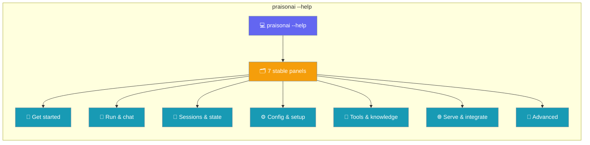
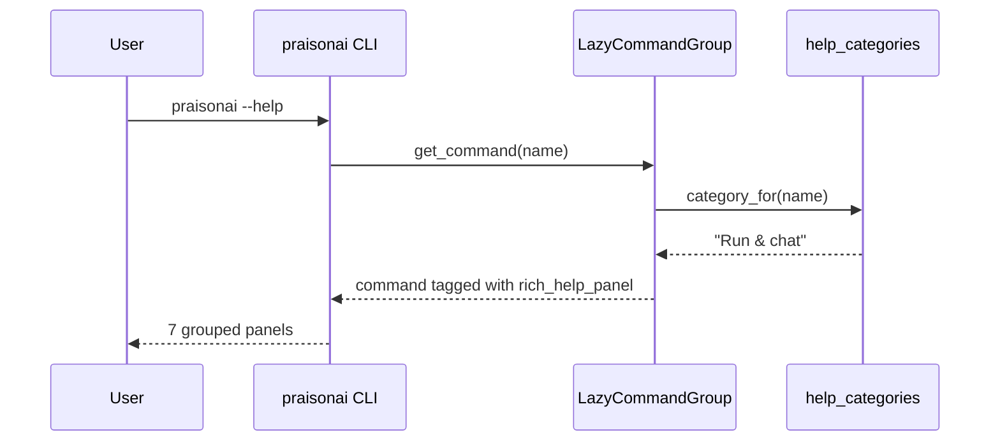

`praisonai --help` groups every command into 7 stable panels so you find `run`, `chat`, `init` in seconds instead of scanning ~90 commands.



## Quick Start

<Steps>
<Step title="See the panels">
Run `--help` to see every command sorted into 7 titled panels.

```bash
praisonai --help
```

The everyday path (`init` → `setup` → `run`) sits right at the top:

```text
╭─ Get started ─────────────────────────────────╮
│  init    setup    onboard    doctor    ...    │
╰───────────────────────────────────────────────╯
╭─ Run & chat ──────────────────────────────────╮
│  run     chat     code       ui        ...    │
╰───────────────────────────────────────────────╯
╭─ Sessions & state ────────────────────────────╮
│  session  checkpoint  memory  todo     ...    │
╰───────────────────────────────────────────────╯
… 4 more panels …
```
</Step>

<Step title="Jump straight into a panel">
Group-level help inherits the same rich rendering.

```bash
praisonai memory --help
praisonai skills --help
```
</Step>
</Steps>

---

## User Interaction Flow

A beginner used to lose the everyday commands in a ~90-item wall. Now the everyday path is signposted at the top.

**Before — one flat panel:**

```text
Commands:
  agent      agents     app        attach     audit     ...
  (≈90 items in one alphabetical block)
```

**After — 7 panels:**

```text
╭─ Get started ─────────────────────────────────╮
│  init      setup     onboard   doctor   ...   │
╰───────────────────────────────────────────────╯
╭─ Run & chat ──────────────────────────────────╮
│  run       chat      code      ui       ...   │
╰───────────────────────────────────────────────╯
… 5 more panels …
```

---

## Where Does Each Command Live?

Every command maps to exactly one panel. `Ctrl-F` a command name to land in its panel.

<Tabs>
<Tab title="Get started">
| Command | Panel |
|---------|-------|
| `init` | Get started |
| `setup` | Get started |
| `onboard` | Get started |
| `doctor` | Get started |
| `models` | Get started |
| `version` | Get started |
</Tab>

<Tab title="Run & chat">
| Command | Panel |
|---------|-------|
| `run` | Run & chat |
| `chat` | Run & chat |
| `code` | Run & chat |
| `ui` | Run & chat |
| `tui` | Run & chat |
| `call` | Run & chat |
| `realtime` | Run & chat |
| `research` | Run & chat |
| `loop` | Run & chat |
| `agents` | Run & chat |
| `agent` | Run & chat |
</Tab>

<Tab title="Sessions & state">
| Command | Panel |
|---------|-------|
| `session` | Sessions & state |
| `checkpoint` | Sessions & state |
| `context` | Sessions & state |
| `memory` | Sessions & state |
| `todo` | Sessions & state |
| `queue` | Sessions & state |
| `traces` | Sessions & state |
| `replay` | Sessions & state |
</Tab>

<Tab title="Config & setup">
| Command | Panel |
|---------|-------|
| `config` | Config & setup |
| `auth` | Config & setup |
| `env` | Config & setup |
| `permissions` | Config & setup |
| `rules` | Config & setup |
| `hooks` | Config & setup |
| `paths` | Config & setup |
| `port` | Config & setup |
| `validate` | Config & setup |
| `completion` | Config & setup |
</Tab>

<Tab title="Tools & knowledge">
| Command | Panel |
|---------|-------|
| `tools` | Tools & knowledge |
| `skills` | Tools & knowledge |
| `knowledge` | Tools & knowledge |
| `rag` | Tools & knowledge |
| `index` | Tools & knowledge |
| `query` | Tools & knowledge |
| `search` | Tools & knowledge |
| `templates` | Tools & knowledge |
| `recipe` | Tools & knowledge |
| `workflow` | Tools & knowledge |
| `mcp` | Tools & knowledge |
| `browser` | Tools & knowledge |
| `commit` | Tools & knowledge |
| `docs` | Tools & knowledge |
</Tab>

<Tab title="Serve & integrate">
| Command | Panel |
|---------|-------|
| `serve` | Serve & integrate |
| `app` | Serve & integrate |
| `acp` | Serve & integrate |
| `daemon` | Serve & integrate |
| `attach` | Serve & integrate |
| `deploy` | Serve & integrate |
| `publish` | Serve & integrate |
| `schedule` | Serve & integrate |
| `gateway` | Serve & integrate |
| `bot` | Serve & integrate |
| `pairing` | Serve & integrate |
| `identity` | Serve & integrate |
| `kanban` | Serve & integrate |
| `n8n` | Serve & integrate |
| `flow` | Serve & integrate |
| `dashboard` | Serve & integrate |
| `claw` | Serve & integrate |
| `up` | Serve & integrate |
| `endpoints` | Serve & integrate |
| `github` | Serve & integrate |
| `mint_link` | Serve & integrate |
</Tab>

<Tab title="Advanced">
| Command | Panel |
|---------|-------|
| `debug` | Advanced |
| `diag` | Advanced |
| `lsp` | Advanced |
| `obs` | Advanced |
| `langfuse` | Advanced |
| `langextract` | Advanced |
| `profile` | Advanced |
| `benchmark` | Advanced |
| `eval` | Advanced |
| `test` | Advanced |
| `examples` | Advanced |
| `batch` | Advanced |
| `train` | Advanced |
| `tracker` | Advanced |
| `audit` | Advanced |
| `managed` | Advanced |
| `plugins` | Advanced |
| `sandbox` | Advanced |
| `registry` | Advanced |
| `package` | Advanced |
| `command` | Advanced |
| `standardise` | Advanced |
| `standardize` | Advanced |
</Tab>
</Tabs>

<Note>
Any command not in the map falls back to **Advanced** — nothing is ever hidden from `--help`.
</Note>

---

## How Grouping Is Applied

Each command is resolved lazily, then tagged with its panel on first use.



`LazyCommandGroup.get_command()` resolves each command lazily. If the command's `rich_help_panel` is unset, it assigns `category_for(name)`. Because grouping is lazy, no command is imported just to categorise it — the registry stays the source of truth.

---

## Configuration

Panels are code-driven — the single source of truth is `help_categories.py`.

| Behaviour | Rule |
|-----------|------|
| Explicit override | A command that sets its own `rich_help_panel="..."` keeps that panel. |
| Unmapped command | Falls back to **Advanced** via `DEFAULT_CATEGORY` — never disappears. |
| Environment variables | None. Changing panels means editing `help_categories.py`. |

The 7 panel titles are stable constants:

| Constant | Panel title |
|----------|-------------|
| `CATEGORY_GET_STARTED` | `Get started` |
| `CATEGORY_RUN_CHAT` | `Run & chat` |
| `CATEGORY_SESSIONS` | `Sessions & state` |
| `CATEGORY_CONFIG` | `Config & setup` |
| `CATEGORY_TOOLS` | `Tools & knowledge` |
| `CATEGORY_SERVE` | `Serve & integrate` |
| `CATEGORY_ADVANCED` | `Advanced` (also `DEFAULT_CATEGORY`) |

<Note>
Every command keeps its exact name, flags, and behaviour. Only the rendered `--help` output changes.
</Note>

---

## Best Practices

<AccordionGroup>
<Accordion title="Learn the 7 panels once">
Every current and future command lives in one of the 7 panels. Memorising the panel titles turns `--help` into a map you can navigate by muscle memory.
</Accordion>

<Accordion title="Set rich_help_panel explicitly for custom subcommands">
A custom Typer subcommand that sets `rich_help_panel="Tools & knowledge"` opts into that panel. Leave it unset to inherit the default (**Advanced**).
</Accordion>

<Accordion title="Use the exact panel strings">
Reference panels with the exact SDK constants — `Get started`, not `Getting Started`. Consistent strings keep grouping predictable across tutorials and screencasts.
</Accordion>

<Accordion title="Rely on panel stability">
Panel titles are stable, so it is safe to reference them in documentation, tutorials, and recordings without them shifting between releases.
</Accordion>
</AccordionGroup>

---

## Related

<CardGroup cols={2}>
<Card title="CLI Reference" icon="terminal" href="/docs/cli/cli">
  Full command and flag reference
</Card>
<Card title="CLI Dispatcher" icon="arrows-split-up-and-left" href="/docs/features/cli-dispatcher">
  How the CLI routes commands
</Card>
<Card title="CLI Command Lazy Dispatch" icon="bolt" href="/docs/features/cli-command-lazy-dispatch">
  Lazy command resolution for fast startup
</Card>
<Card title="Unknown Command Guard" icon="shield-check" href="/docs/cli/cli#unknown-command-guard">
  How mistyped commands are caught
</Card>
</CardGroup>
