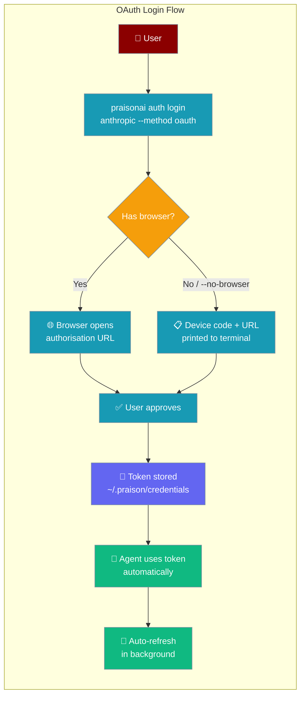
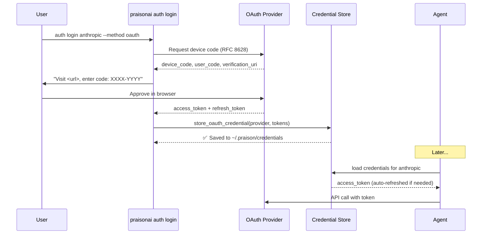

Sign in to any supported provider with a single command. OAuth tokens refresh automatically, so you never have to re-paste an API key.

```python
from praisonaiagents import Agent

agent = Agent(
    name="Assistant",
    instructions="Help me with tasks",
    model="anthropic/claude-3-5-sonnet-20241022",
)

agent.start("What is the weather like today?")
```

The user runs `praisonai auth login`; OAuth tokens are stored and refreshed so agents call the provider without pasting API keys.



## Quick Start

<Steps>
<Step title="Log in with browser (recommended)">

```bash
praisonai auth login anthropic --method oauth
```

A browser tab opens automatically. Approve the request, and credentials are stored securely. Done.
</Step>

<Step title="Log in on a headless server (device code)">

On a machine without a browser, add `--no-browser` to get a device code:

```bash
praisonai auth login anthropic --method oauth --no-browser
```

```
To sign in, visit https://anthropic.com/activate and enter code: ABCD-1234
```

Enter the code on any device, then come back — the CLI detects approval automatically.
</Step>

<Step title="Force API-key login">

If you prefer to manage keys manually, use `--method apikey`:

```bash
praisonai auth login openai --method apikey
```

You'll be prompted for the key interactively (hidden input), or pipe it:

```bash
echo "sk-..." | praisonai auth login openai --method apikey --key-stdin
```
</Step>

<Step title="Check auth status and expiry">

```bash
praisonai auth list
```

```
Provider    Method    Expiry
----------  --------  -------
anthropic   oauth     2h 14m
openai      apikey    (n/a)
```

```bash
praisonai auth status anthropic
```

Shows whether the current token is valid and when it expires.
</Step>
</Steps>

---

## How It Works



---

## Auth Methods

| Method | Flag | When to use |
|--------|------|-------------|
| `auto` | (default) | Uses OAuth if provider supports it and no `--key` is given; falls back to API-key prompt |
| `oauth` | `--method oauth` | Always use OAuth, even if a key is available |
| `apikey` | `--method apikey` | Always use API key, skip OAuth discovery |

---

## Provider Compatibility

| Provider | API-key login | OAuth login |
|----------|:---:|:---:|
| `anthropic` | ✅ | ✅ |
| `openai` | ✅ | ✅ |
| `google` / `gemini` | ✅ | ✅ |
| Custom / local | ✅ | ❌ |

Use `praisonai auth login <provider> --method auto` — the CLI auto-detects whether OAuth is supported for the given provider.

---

## Token Storage

Credentials are stored at `~/.praison/credentials/` (or the path returned by `praisonai paths`). Each provider gets its own entry containing:

- Auth method (`apikey` or `oauth`)
- Token value (API key or access token)
- Refresh token (OAuth only)
- Expiry timestamp (OAuth only)

Tokens are refreshed transparently before each agent run when they are within the refresh window.

---

## Best Practices

<AccordionGroup>
<Accordion title="Use API keys in CI — not OAuth">

OAuth device-code flows require human interaction. In automated pipelines (CI/CD, cron jobs), always use API keys via environment variables:

```bash
ANTHROPIC_API_KEY=sk-ant-... praisonai run task.yaml
```

Or store them with `--method apikey` and a `--key-stdin` pipe from your secrets manager.
</Accordion>

<Accordion title="Log out when rotating credentials">

When you rotate an API key or revoke an OAuth token:

```bash
praisonai auth logout anthropic
praisonai auth login anthropic
```

This removes the old credential and re-runs the login flow.
</Accordion>

<Accordion title="Pin the model when using OAuth">

OAuth credentials are provider-scoped. If a provider has multiple models, pin the default model at login time:

```bash
praisonai auth login anthropic --method oauth --model claude-3-5-sonnet-20241022
```
</Accordion>
</AccordionGroup>

---

## Related

<CardGroup cols={2}>
<Card title="Security Environment Variables" icon="shield" href="/docs/features/security-environment-variables">
  How to pass credentials safely via environment variables
</Card>
<Card title="Default Model Selection" icon="list-check" href="/docs/features/default-model-selection">
  How the CLI picks the right model when multiple providers are logged in
</Card>
</CardGroup>
