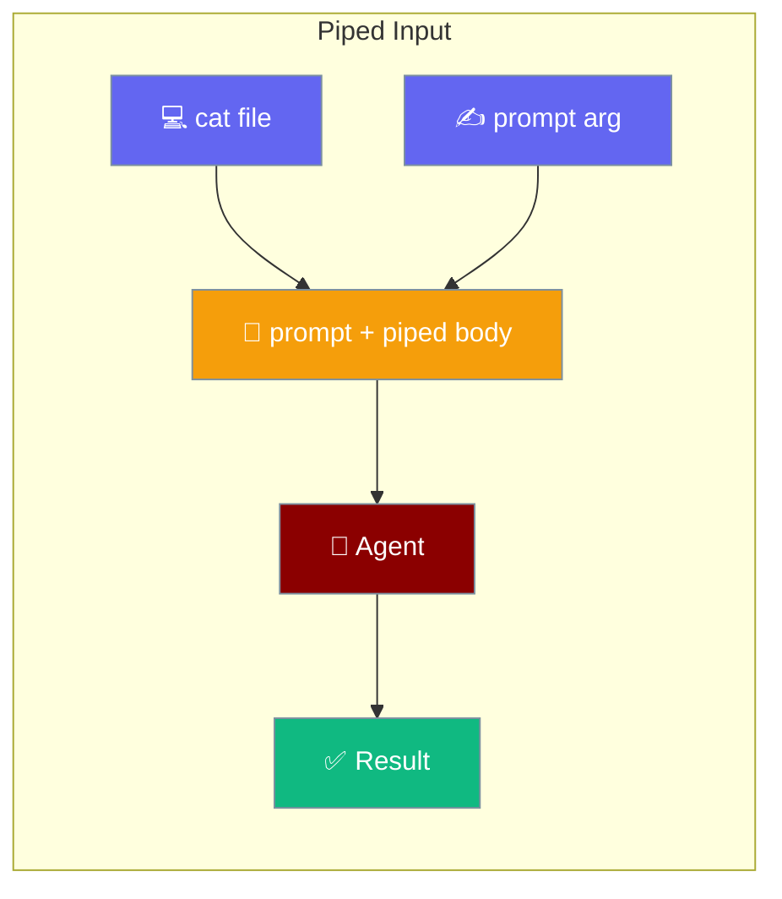
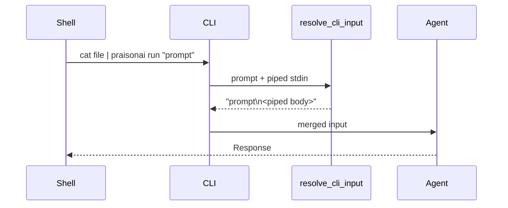
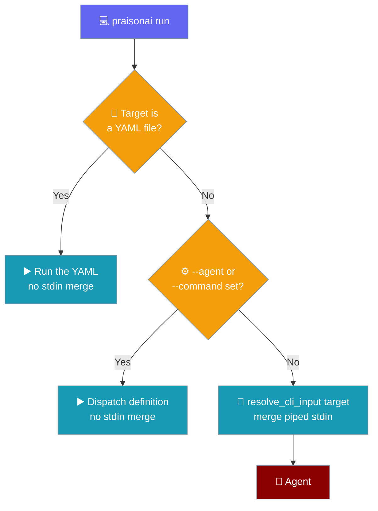

Pipe any text into `praisonai run`, `code`, or `chat` and it is merged with your prompt before the agent runs.



## Quick Start

<Steps>
<Step title="Pipe a file into run">
```bash
cat error.log | praisonai run "Diagnose the root cause"
```
</Step>

<Step title="Pipe into code">
```bash
cat data.json | praisonai code "Write a parser for this shape"
```
</Step>

<Step title="Pipe into chat">
```bash
echo "$STACKTRACE" | praisonai chat "Explain this"
```
</Step>
</Steps>

---

## How It Works

The prompt argument and piped stdin are merged before dispatch.



| Component | Role |
|-----------|------|
| `resolve_cli_input(prompt)` | Merges the prompt argument with piped stdin (prompt first). |
| `read_stdin_if_available()` | Non-blocking read with a 10 MB cap. |
| `select.select` guard | Prevents stalls when stdin is an open pipe with no EOF (common in CI). |

---

## Merge Order

The prompt argument comes first, then the piped body, joined with `\n`.

| Prompt arg | Piped stdin | Final input to agent |
|------------|-------------|----------------------|
| Set | Set | `prompt + "\n" + piped` |
| Set | Empty / no pipe | `prompt` (unchanged) |
| None | Set | `piped` (becomes the prompt) |
| None | Empty / no pipe | `None` (interactive REPL if TTY) |

---

## Decision Diagram

`praisonai run` chooses one path per invocation — only the default text path merges piped stdin.



---

## Skip Rules for `praisonai run`

`praisonai run` skips the stdin merge when merging a piped body would be meaningless.

- **YAML target** — an existing `.yaml` / `.yml` file (case-insensitive, so `AGENTS.YAML` counts). Concatenating a piped body into a YAML path would be nonsense.
- **`--agent`** — a named custom agent runs its own definition.
- **`--command`** — a named custom command uses `TARGET` as `$ARGUMENTS`.
- **`--restore`** — the command exits before ingestion, so `... | praisonai run --restore last` never drains the pipe.

`praisonai code` and `praisonai chat` call `resolve_cli_input(prompt)` unconditionally at the top of the handler, so they always merge piped stdin.

---

## Size Cap & Platform Notes

Piped input is capped at **10 MB**. Larger streams are truncated to 10 MB before merging.

**Windows piped stdin works as of PraisonAI 2026-07-07 (PR #2705).** Because Python's `select.select` is socket-only on Windows, the reader now uses a stat-based pipe classifier instead. Both `cmd` and PowerShell redirection are supported:

```bat
type error.log | praisonai run "Diagnose the root cause"
```

```powershell
Get-Content error.log | praisonai run "Diagnose the root cause"
```

Interactive terminals with no redirection continue to skip the stdin read, so a bare `praisonai run` still drops into the REPL. On Unix the existing `select.select()` guard is unchanged. To attach a file explicitly instead, `--file` still works on `praisonai code` / `praisonai chat`:

```bash
praisonai code --file error.log "Diagnose the root cause"
```

---

## CI / Scripting Examples

<CodeGroup>
```yaml GitHub Actions
- name: AI review of the diff
  run: git diff origin/main...HEAD | praisonai run "Review these changes for bugs"
  env:
    OPENAI_API_KEY: ${{ secrets.OPENAI_API_KEY }}
```

```bash Kubernetes logs
kubectl logs deploy/api --tail=200 | praisonai run "Explain these errors"
```

```bash Remote log
curl -s https://api.example.com/log | praisonai code "Add tests for the failing calls"
```
</CodeGroup>

---

## Best Practices

<AccordionGroup>
<Accordion title="Put the prompt first, pipe the context second">
The merge order is prompt then piped body, so a leading prompt produces the clearest instruction for the agent.

```bash
cat error.log | praisonai run "Diagnose the root cause"
```
</Accordion>

<Accordion title="For YAML agents, do not pipe — use --file or an inline instruction">
The YAML skip rule means a pipe into a YAML target is silently ignored. Pass context with `--file` or write the instruction inline.

```bash
praisonai code --file config.yaml "Validate this config"
```
</Accordion>

<Accordion title="In CI, do not pipe more than 10 MB — split large logs">
The 10 MB cap truncates silently. Trim or `tail` large streams before piping.

```bash
tail -n 500 huge.log | praisonai run "Summarize the recent failures"
```
</Accordion>

<Accordion title="Prefer named custom agents for repeatable pipelines">
A named agent (`--agent`) keeps repeatable pipelines cleaner than reshaping stdin every invocation.

```bash
praisonai run --agent reviewer "Audit the latest changes"
```
</Accordion>
</AccordionGroup>

---

## Related

<CardGroup cols={2}>
<Card title="Run" icon="play" href="/docs/cli/run">
Run agents from files or prompts.
</Card>
<Card title="Code" icon="code" href="/docs/cli/code">
Code assistant mode for programming tasks.
</Card>
<Card title="Chat" icon="comments" href="/docs/cli/chat">
Interactive chat mode with AI agents.
</Card>
<Card title="CLI Dispatch" icon="terminal" href="/docs/cli/cli-reference">
Command dispatch overview.
</Card>
</CardGroup>
