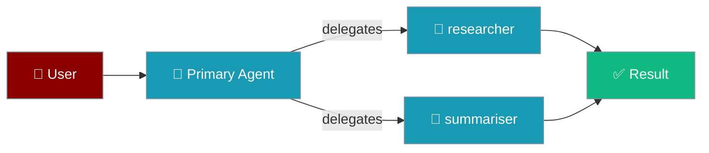
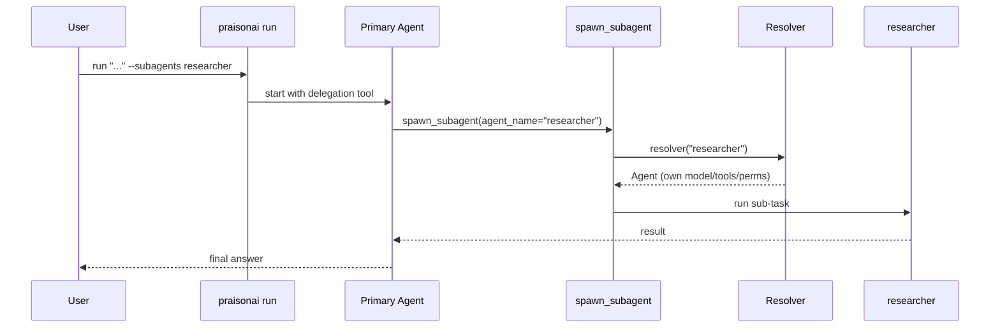
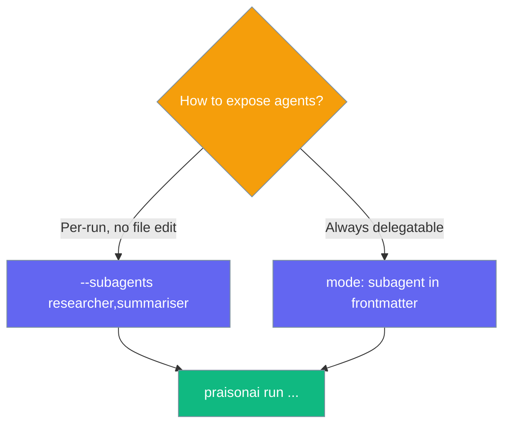

Turn `.praisonai/agents/*.md` files into composable delegation targets your running agent can hand sub-tasks to, all from the CLI.



This is CLI-first delegation of **named user agents** — distinct from the SDK-level [Subagent Tool](/docs/features/subagent-tool) and [Subagent Delegation](/docs/features/subagent-delegation). No Python required: define agents as one-file Markdown definitions and expose them with a single flag.

## Quick Start

<Steps>
<Step title="Create two named agents">
Add agent definitions under `.praisonai/agents/`. Each file's name is the agent name.

```md .praisonai/agents/researcher.md
---
role: Researcher
goal: Gather facts and sources on a topic
mode: subagent
---
You research topics thoroughly and return concise, sourced findings.
```

```md .praisonai/agents/summariser.md
---
role: Summariser
goal: Condense findings into a short brief
mode: subagent
---
You turn detailed notes into a clear one-paragraph summary.
```
</Step>

<Step title="Run with delegation enabled">
Pass the delegatable agents as a comma-separated allow-list.

```bash
praisonai run "Research vector databases and give me a short brief" \
  --subagents researcher,summariser
```
</Step>

<Step title="See what the primary agent discovers">
The `spawn_subagent` tool description auto-lists your agents so the model knows who to delegate to:

```text
You can delegate to these named agents by passing their name as agent_name
(each runs under its own model/tools/permissions):
- researcher: Gather facts and sources on a topic
- summariser: Condense findings into a short brief
```
</Step>
</Steps>

---

## How It Works

The primary agent calls `spawn_subagent(agent_name="researcher", ...)`; a resolver builds that named agent from its Markdown definition and runs the sub-task under its own model, tools, and permissions.



| Piece | Role |
|-------|------|
| `--subagents a,b,c` | Explicit allow-list of delegatable agent names |
| `mode: subagent` | Frontmatter marker that opts an agent in when no allow-list is given |
| Resolver | Builds the named agent from its definition and runs it |
| Fallback | Unresolvable names use the generic spawn path instead |

---

## Two Ways to Opt In

Expose agents either explicitly from the CLI or by marking the definition file.



- **`--subagents researcher,summariser`** — an explicit allow-list that wins over any marker. Opt any named agent in without editing it.
- **`mode: subagent`** — a frontmatter marker exposing that agent whenever no allow-list is passed.

<Note>
`mode: subagent` is a **delegatability marker**, not a permission mode. It is ignored by the permission engine, so it never restricts what the agent can do — for that, use a `permission` block or a permission `mode` like `plan` or `read-only`.
</Note>

---

## Fallback Behaviour

When the model targets a name that isn't a delegatable agent, the tool uses the generic spawn path instead of failing.

```bash
praisonai run "Explore the auth module" --subagents researcher
```

If the model calls `spawn_subagent(agent_name="explorer")` and `explorer` isn't in the allow-list, a generic subagent handles the task — see [Subagent Tool](/docs/features/subagent-tool). Delegation to named agents is fully backward-compatible: with no `--subagents` and no `mode: subagent` markers, runs behave exactly as before.

---

## Common Patterns

Compose named agents into small pipelines from the CLI.

```bash
# Research pipeline: one agent gathers, another condenses
praisonai run "Brief me on RAG evaluation" --subagents researcher,summariser

# Writer + reviewer pair
praisonai run "Draft and review the release notes" --subagents writer,reviewer

# Specialised domain agents
praisonai run "Audit the payment flow" --subagents security,coder
```

---

## Best Practices

<AccordionGroup>
<Accordion title="Give each agent a clear goal">
The `goal` (or `role`) becomes the description the primary model sees when routing. One sharp sentence per agent helps it pick the right delegate.
</Accordion>

<Accordion title="Keep the allow-list explicit in shared repos">
Prefer `--subagents a,b,c` over relying on `mode: subagent` markers when many people share a repo, so it's obvious which agents are exposed for a given run.
</Accordion>

<Accordion title="Remember mode: subagent is a marker, not a permission">
It only makes an agent delegatable. Scope what a delegate can do with a `permission` block or a permission mode (`plan`, `read-only`, `review`) in its frontmatter.
</Accordion>

<Accordion title="Let delegates keep their own model and tools">
Each named agent runs under its own definition, so a cheap model can handle research while a stronger one writes — no extra wiring needed.
</Accordion>
</AccordionGroup>

---

## Related

<CardGroup cols={2}>
<Card title="Subagent Tool" icon="wrench" href="/docs/features/subagent-tool">
The SDK-level tool that powers spawning and the generic fallback path.
</Card>
<Card title="Subagent Delegation" icon="users" href="/docs/features/subagent-delegation">
Programmatic delegation with scoped permissions and concurrency control.
</Card>
</CardGroup>
