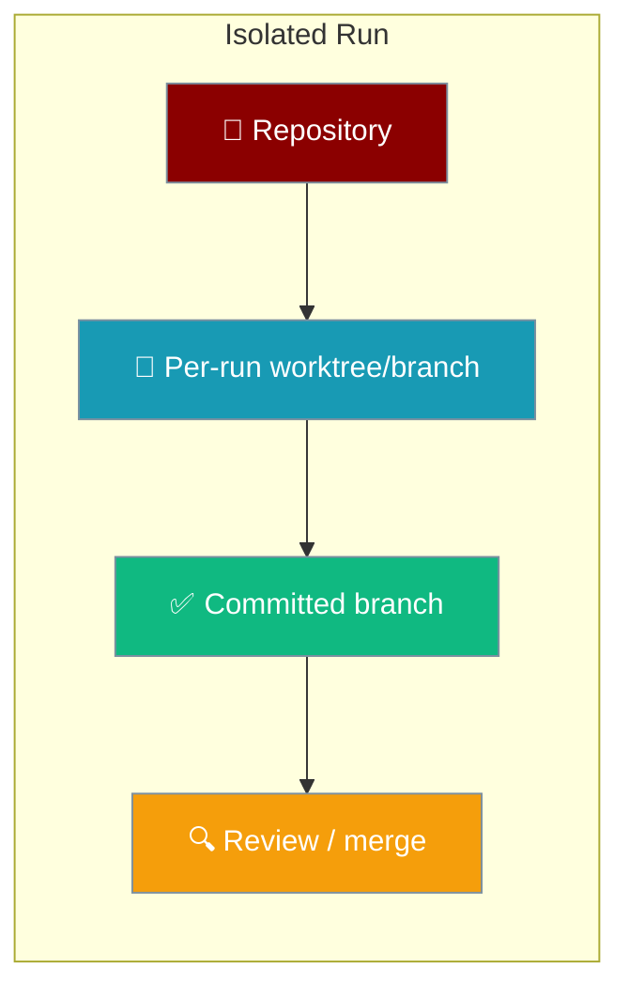
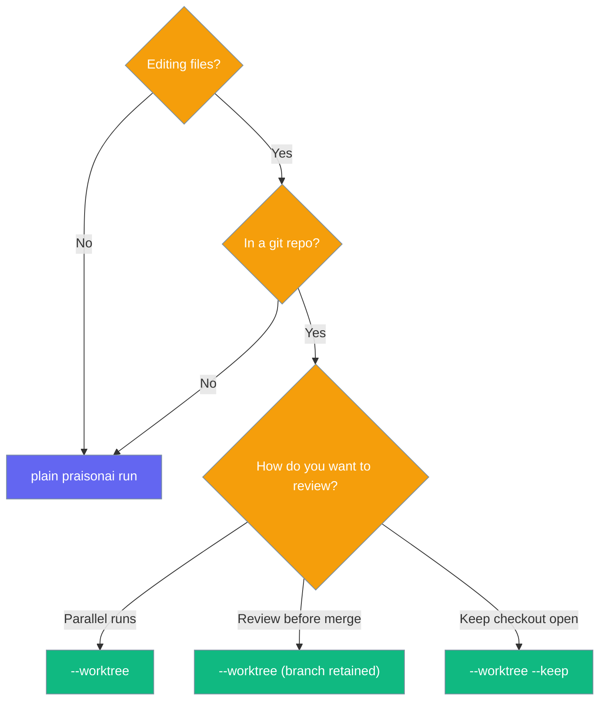

Run each `praisonai run` on its own git worktree so concurrent runs never step on each other's changes.



## Quick Start

<Steps>
<Step title="Simplest run">
Run a one-shot prompt on its own branch.

```bash
praisonai run "Refactor auth.py to use bcrypt" --worktree
```
</Step>

<Step title="Keep the worktree for review">
Keep the checkout in place after the run instead of tearing it down.

```bash
praisonai run "Refactor auth.py to use bcrypt" --worktree --keep
```
</Step>

<Step title="Run a YAML file in isolation">
A YAML workflow runs on its own branch too.

```bash
praisonai run agents.yaml --worktree
```
</Step>
</Steps>

---

## How It Works

`--worktree` provisions a fresh `git worktree` on a new branch, chdirs into it for the run, then handles teardown.

```mermaid
sequenceDiagram
    participant User
    participant CLI as praisonai run
    participant git
    participant WT as Isolated worktree

    User->>CLI: praisonai run "..." --worktree
    CLI->>git: git worktree add (branch praisonai/<slug>-<uuid>)
    git-->>WT: fresh branch + directory
    CLI->>WT: chdir + run agent
    WT-->>CLI: edits stay contained
    CLI->>git: commit changes on exit (praisonai run: <target>)
    CLI-->>User: branch retained for review/merge

    classDef user fill:#6366F1,stroke:#7C90A0,color:#fff
    classDef cli fill:#8B0000,stroke:#7C90A0,color:#fff
    classDef g fill:#189AB4,stroke:#7C90A0,color:#fff
    classDef wt fill:#10B981,stroke:#7C90A0,color:#fff

    class User user
    class CLI cli
    class git g
    class WT wt
```

Isolation provisions a fresh worktree on a new branch named `praisonai/<slug>-<8-char-uuid>` under `<repo>/.praisonai/worktrees/`. A random 8-char UUID suffix keeps two concurrent or repeated runs of the same target from sharing a branch or mixing each other's uncommitted changes.

| On exit | What happens |
|---------|--------------|
| No changes | The worktree and its branch are removed entirely. |
| Changes (tracked or untracked) | The output is committed to the branch (`praisonai run: <target>`, `--no-verify`), the checkout directory is pruned, and the **branch is retained** for review/merge. |
| Commit fails (e.g. no `user.email`/`user.name`) | The worktree checkout is kept in place with a warning so output is never lost. |
| `--keep` set | The worktree checkout itself is retained for in-place review. |
| Not a git repo | Isolation degrades to a no-op — the run continues in the current directory. |

Even when the run raises, the original working directory is restored and the worktree is torn down.

<Note>
A YAML file target is resolved to an **absolute path before** the chdir, so an untracked or gitignored `./agents.yaml` (absent from the fresh worktree) still loads.
</Note>

<Note>
`--worktree` always runs in-process — it disables the warm-runtime shortcut. An isolated run may feel slightly slower than an attached `praisonai run`.
</Note>

### CLI output lines

Grep these exact prints to follow an isolated run:

```text
Isolated run on branch '<branch>' (<path>)
Changes on '<branch>':
<git status --short output>
No changes on '<branch>'.
Committed changes to branch '<branch>'. Review/merge with: git merge <branch>
Worktree kept at <path> (branch '<branch>'). Review/merge then remove with: git worktree remove.
Could not commit isolated changes; worktree kept at <path> (branch '<branch>') for manual review.
Not a git repository; running without worktree isolation.
```

---

## Configuration Options

| Flag | Type | Default | Description |
|------|------|---------|-------------|
| `--worktree` | `bool` | `False` | Run on an isolated git worktree/branch (branch-per-task); no-op when not a git repo. |
| `--keep` | `bool` | `False` | With `--worktree`, keep the worktree/branch after the run for review instead of tearing it down. |

<Warning>
These flag combinations fail fast with exit code `1`:

- `--worktree` + `--attach` → `--worktree cannot be combined with --attach` (the warm runtime is a separate process whose cwd cannot be redirected).
- `--keep` without `--worktree` → `--keep requires --worktree`.
- `--worktree` + `--agent` / `--command` / `--profile` / `--profile-deep` → `--worktree is only supported for direct prompt and YAML file runs`.
</Warning>

---

## Choosing Between Plain and Isolated Runs



---

## Common Patterns

Run multiple isolated tasks in parallel — each gets its own branch.

```bash
praisonai run "Task A" --worktree &
praisonai run "Task B" --worktree &
wait
```

Review, then merge (default, without `--keep` — the branch is retained).

```bash
praisonai run "Refactor auth.py" --worktree
# → Committed changes to branch 'praisonai/refactor-auth-py-a1b2c3d4'
git log praisonai/refactor-auth-py-a1b2c3d4 -1
git merge praisonai/refactor-auth-py-a1b2c3d4
```

Keep the checkout open for in-place review.

```bash
praisonai run "Refactor auth.py" --worktree --keep
# → Worktree kept at .../.praisonai/worktrees/refactor-auth-py-a1b2c3d4 (branch 'praisonai/refactor-auth-py-a1b2c3d4')
# review, then:
git worktree remove .praisonai/worktrees/refactor-auth-py-a1b2c3d4
```

Fall back safely on a non-git directory — isolation degrades to a plain run.

```bash
cd /tmp/not-a-repo
praisonai run "Summarise this file" --worktree
# → Not a git repository; running without worktree isolation.
```

### Interaction flow

```mermaid
sequenceDiagram
    participant User
    participant CLI as praisonai run
    participant Agent

    User->>CLI: praisonai run "Refactor auth.py" --worktree
    CLI-->>User: Isolated run on branch 'praisonai/refactor-auth-py-a1b2c3d4'
    CLI->>Agent: edit files inside the worktree
    Agent-->>CLI: run completes
    CLI-->>User: Committed changes to branch 'praisonai/refactor-auth-py-a1b2c3d4'
    User->>CLI: git merge praisonai/refactor-auth-py-a1b2c3d4

    classDef user fill:#6366F1,stroke:#7C90A0,color:#fff
    classDef cli fill:#8B0000,stroke:#7C90A0,color:#fff
    classDef agent fill:#10B981,stroke:#7C90A0,color:#fff

    class User user
    class CLI cli
    class Agent agent
```

---

## Best Practices

<AccordionGroup>
<Accordion title="Use it for anything that edits files">
Isolation shines when a run touches the working tree. Concurrent or repeated runs of the same target each get their own branch, so uncommitted changes never mix.
</Accordion>

<Accordion title="Combine with --session for review workflows">
Pair `--worktree` with `--session` to keep a review thread while the file changes land on a dedicated branch you can inspect before merging.
</Accordion>

<Accordion title="Know when it degrades to a no-op">
Outside a git repository the flag prints `Not a git repository; running without worktree isolation.` and continues without isolation — safe to leave on in scripts.
</Accordion>

<Accordion title="Do not combine with --attach">
The warm runtime is a separate process whose cwd cannot be redirected, so `--worktree` + `--attach` fails fast with exit code `1`.
</Accordion>
</AccordionGroup>

---

## Related

<CardGroup cols={2}>
<Card title="Workspace Isolation" icon="code-branch" href="/docs/features/workspace-isolation">
The Python `GitWorktreeAdapter` API this CLI feature builds on.
</Card>
<Card title="Run Command" icon="play" href="/docs/cli/run">
The full `praisonai run` flag reference.
</Card>
</CardGroup>
