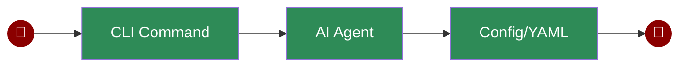

PraisonAI CLI provides a simple way to interact with AI agents directly from your terminal. You can run quick commands, specify LLM options, or use YAML configuration files for more complex scenarios.

<Frame>
  
</Frame>

## Quick Start

<Steps>
  <Step title="Install Package">
    Install the PraisonAI package:
    ```bash
    pip install praisonai
    ```
  </Step>

  <Step title="Set API Key">
    Set your OpenAI API key as an environment variable:
    ```bash
    export OPENAI_API_KEY=your_api_key_here
    ```
  </Step>
</Steps>

## Usage Examples

<AccordionGroup>
  <Accordion title="Simple Command" icon="terminal" defaultOpen>
    Run a simple command directly:
    ```bash
    praisonai "write a movie script in 3 lines"
    ```
  </Accordion>

  <Accordion title="With LLM Option" icon="wand-magic-sparkles" defaultOpen>
    Specify a different LLM model:
    ```bash
    praisonai "write a movie script in 3 lines" --llm gpt-4o-mini
    ```
  </Accordion>

  <Accordion title="Using YAML Config" icon="file-code" defaultOpen>
    Run agents defined in a YAML file:
    ```bash
    praisonai agents.yaml
    ```
  </Accordion>
</AccordionGroup>

## Configuration

<Tabs>
  <Tab title="Create Config">
    Initialize a new agents.yaml file for your project:
    ```bash
    praisonai --init "Create a movie script about AI"
    ```
    This will create an `agents.yaml` file with predefined configuration for your task.
  </Tab>

  <Tab title="Auto Mode">
    Let PraisonAI automatically create and configure agents:
    ```bash
    praisonai --auto "Create a movie script about AI"
    ```
    This mode will analyze your task and set up appropriate agents automatically.
  </Tab>
</Tabs>

## Features

<CardGroup cols={2}>
  <Card title="Simple Commands" icon="terminal">
    Run AI tasks directly from your terminal with simple commands.
  </Card>
  <Card title="LLM Options" icon="wand-magic-sparkles">
    Choose from different LLM models for your specific needs.
  </Card>
  <Card title="YAML Support" icon="file-code">
    Use YAML files for complex agent configurations and workflows.
  </Card>
  <Card title="Auto Configuration" icon="robot">
    Automatic agent setup based on task requirements.
  </Card>
</CardGroup>

## Workflow CLI

Manage and execute YAML workflows directly from the command line:

```bash
# Run a YAML workflow
praisonai workflow run research.yaml

# Run with variables
praisonai workflow run research.yaml --var topic="AI trends"

# Validate a workflow
praisonai workflow validate research.yaml

# Create from template (simple, routing, parallel, loop)
praisonai workflow template routing --output my_workflow.yaml

# Auto-generate a workflow from topic
praisonai workflow auto "Research AI trends" --pattern parallel

# List available workflows
praisonai workflow list

# Show help
praisonai workflow help
```

### Workflow CLI Options

| Flag | Description |
|------|-------------|
| `--var key=value` | Set variable for YAML workflows |
| `--pattern <pattern>` | Pattern for auto-generation (sequential, parallel, routing, loop) |
| `--output <file>` | Output file for templates/auto-generation |
| `--planning` | Enable planning mode |
| `--reasoning` | Enable reasoning mode |
| `--verbose` | Enable verbose output |
| `--save` | Save output to file |

## Next Steps

<CardGroup>
  <Card title="YAML Workflows" icon="file-code" href="/docs/features/yaml-workflows">
    Learn about YAML workflow configuration and patterns
  </Card>
  <Card title="Workflow Patterns" icon="diagram-project" href="/docs/features/workflow-patterns">
    Explore routing, parallel, loop, and repeat patterns
  </Card>
  <Card title="API Reference" icon="code" href="/api-reference">
    View the complete API documentation
  </Card>
</CardGroup>